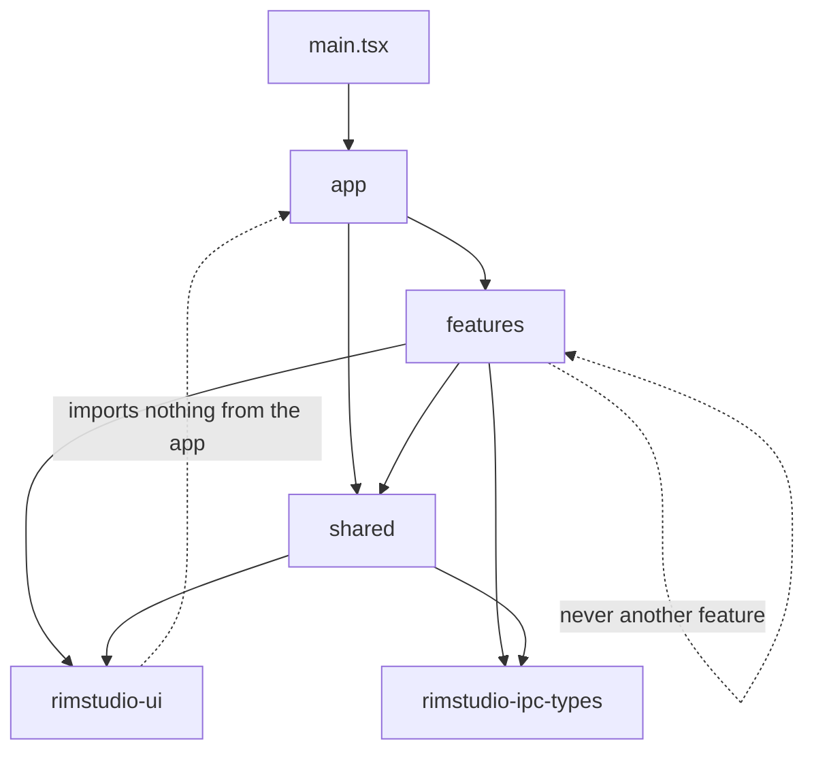

# RimStudio frontend architecture

This document defines the structure of the RimStudio webview application: the folder tree and package split, the anatomy of a feature module, the import rules and how they are enforced, the single IPC module and the single platform adapter, state management, the application shell, long lists and drag and drop, theming, internationalisation, accessibility, error and offline states, the `rimstudio-ui` component library, performance rules and the test layout. It implements R1, R2, R5, R8 and R10 and decisions D-050 to D-057. The backend side of the contract is in [IPC and state architecture](ipc-and-state.md); the stack evidence is in [frontend stack research](../research/frontend-stack-research.md) and [webview and IPC performance](../research/webview-and-ipc-performance.md).

Status: draft, section 18 as built | Last updated: 2026-10-05

## 1. Principles

1. The webview renders and sends intents. Rules, ordering, validation and conflict detection are Rust functions; the frontend never recomputes them ([RimSort UX inventory](../research/rimsort-feature-and-ux-inventory.md) pain points P1 and P2, where a 5,820 line view mixed row widgets, filters and warning logic).
2. One app, hard seams. A single Vite app with feature folders, plus three packages only where code is truly shared or has a different test profile (D-051). Boundaries are enforced by tooling, not convention.
3. Small parts. A component file stays under about 300 lines and a store file under about 400; a feature page composes components and holds no logic. RimSort's 2,699 line workspace store is the anti-pattern.
4. Everything visual is a token. No colour, spacing or radius literal outside the token files; light, dark, accent and user themes are attribute and variable switches.
5. Every pointer interaction has a keyboard equivalent and every list interaction works with 5000 rows.
6. Write Preact 11 clean code from day one (D-050): no `defaultProps`, no `Component.base`, no `replaceNode`, no implicit `px` in style objects, `ref` as an ordinary prop.
7. No XML in the frontend dependency tree and no JS file access: the webview receives JSON from commands (R10, I-14).

## 2. Folder tree and package split

Versions are exact pins from the research registry snapshot (2026-10-04): preact 10.29.8, `@preact/signals` 2.11.3, vite 8.3.2, typescript 6.0.3, tailwindcss 4.3.3, `@tauri-apps/api` and `@tauri-apps/cli` 2.12.1, `@tanstack/virtual-core` 3.17.11, `@dnd-kit/dom` 0.5.0, `@zag-js/*` and `@zag-js/preact` 1.44.0, valibot 1.5.0, `intl-messageformat` 12.1.2, tinykeys 4.0.1, oxlint 1.86.0, dependency-cruiser 18.5.0, knip 6.39.0.

```
pnpm-workspace.yaml            apps/*, packages/*
.oxlintrc.json  .dependency-cruiser.cjs  .prettierrc.json
apps/desktop/                  npm package rimstudio-desktop
  index.html  vite.config.ts  tsconfig.json  package.json
  src/
    main.tsx                   theme bootstrap, webview feature probe, mount
    app/                       shell frame, providers, route signal, command palette,
                               task centre, toasts, error boundary, tools.ts
    features/
      manager/  settings/  logs/  workspace/  project/  designer/  workshop/  onboarding/
    shared/
      ipc/  platform/  lists/  dnd/  charts/  graph/  editor/
      rich-text/  i18n/  keys/  forms/
    locales/en.json            flat semantic keys; other languages lazy
    styles/                    tokens.css  theme.css  layers.css
    gallery/                   dev-only /gallery route
  src-tauri/                   shell crate rimstudio-shell (see workspace layout)
packages/
  ui/            npm package rimstudio-ui        design system, tokens, stories
  ipc-types/     npm package rimstudio-ipc-types generated src/bindings.ts only
  testkit/       npm package rimstudio-testkit   mock IPC, fixtures, render helpers
tests/e2e/       Playwright (mockIPC) and WebdriverIO smoke suites
```

Dependency direction:



What each package is for:

| Package | Contains | Must not contain |
| --- | --- | --- |
| `rimstudio-ui` | stateless presentational components, tokens, Zag wrappers, stories | IPC, signals shared across components, i18n catalogs, anything from `apps/desktop` |
| `rimstudio-ipc-types` | `bindings.ts` generated by the backend (command functions, DTOs, event types) | hand written code |
| `rimstudio-testkit` | `mockIpc()`, fixture builders for `ModRowDto` and friends, `renderWithProviders`, fake clock | production code; it is a dev dependency only |

The three packages exist for different reasons: `ui` has its own gallery and screenshot tests, `ipc-types` is a build artefact with a drift check, and `testkit` must not ship. Everything else stays in the app, because a package per feature would add build configs and slow hot reload for no reuse in a single product ([frontend stack research](../research/frontend-stack-research.md) section 5.1).

## 3. Feature module anatomy

### 3.1 Layout

Every feature has the same shape so that a new tool is a copy of a template (scenario S1 in the [overview](overview.md), `cargo xtask new-tool`):

```
features/<name>/
  index.ts            only public entry: exports the ToolDescriptor-facing lazy page and nothing else
  <Name>Page.tsx      composition only
  api.ts              typed wrappers over shared/ipc (the only file that names commands)
  store.ts            signals, computed values and pure action functions (the model)
  components/         presentational and container components of this feature (the ui)
  model/              optional pure helpers (formatters, selectors, filters) with no signals
  <Name>.test.tsx     tests next to code; heavier ones under tests/ of the feature
```

The four concerns:

| Concern | File | Rule |
| --- | --- | --- |
| api | `api.ts` | one function per backend command the feature uses; arguments and returns are generated DTOs; no UI imports; the single place where `commands.*` or `ipc.query` is called |
| model | `store.ts`, `model/` | signals and `computed` values; actions are plain functions that call `api.ts` and update signals; no JSX; testable with the testkit alone |
| ui | `<Name>Page.tsx`, `components/` | JSX and CSS classes; reads signals, calls actions; no direct IPC; no business rules |
| tests | colocated `*.test.ts(x)` | model tests need no DOM; ui tests use `renderWithProviders` and `mockIpc` |

### 3.2 Layer rules

| From | May import | May not import |
| --- | --- | --- |
| `features/<a>/components` | same feature (`../store`, `../model`), `shared/*` public entries, `rimstudio-ui`, `rimstudio-ipc-types` types | `features/<b>`, `@tauri-apps/*`, `shared/ipc` internals, `app/*` |
| `features/<a>/store.ts`, `api.ts` | `shared/ipc`, `shared/i18n`, `rimstudio-ipc-types` | `components/`, `rimstudio-ui`, any other feature |
| `shared/*` | other `shared` modules by public entry, `rimstudio-ui`, `rimstudio-ipc-types` | any feature, `app/*` |
| `shared/platform` | `@tauri-apps/*` (it is the only module that may) | everything else in the app apart from types |
| `app/*` | features by `index.ts`, `shared/*`, `rimstudio-ui` | feature internals (`features/x/store`, `features/x/components`) |
| `rimstudio-ui` | its own files, `preact`, `@zag-js/*`, `@preact/signals` for local widget state | the app, `rimstudio-ipc-types`, `shared/*`, `@tauri-apps/*` |

Cross feature needs have exactly two legal routes: move the code into `shared` (a hook, a formatter, a DTO selector), or communicate through an event registered in `app` (for example "open this mod in the Def Explorer" is a `navigate` call on the route signal plus a typed intent object in `app/intents.ts`, which the target feature reads when it mounts).

### 3.3 Enforcement (D-057)

Three gates, cheapest first:

1. oxlint `no-restricted-imports` with per folder overrides in `.oxlintrc.json`, run in the editor and in CI. Illustrative shape (the exact keys must be verified in spike S-12 against oxlint 1.86.0, which the research could not run):

```jsonc
{
  "overrides": [
    { "files": ["apps/desktop/src/features/**"],
      "rules": { "no-restricted-imports": ["error", { "patterns": [
        { "group": ["@tauri-apps/*"], "message": "Use shared/platform." },
        { "group": ["**/features/*/*"], "message": "Import another feature never; use shared." },
        { "group": ["**/shared/ipc/*"], "message": "Use the shared/ipc public entry." }
      ] }] } },
    { "files": ["packages/ui/**"],
      "rules": { "no-restricted-imports": ["error", { "patterns": [
        { "group": ["**/apps/desktop/**", "rimstudio-ipc-types", "@tauri-apps/*"], "message": "ui stays pure." }
      ] }] } }
  ]
}
```

2. dependency-cruiser `forbidden` rules in `.dependency-cruiser.cjs`, a CI gate with a graph artefact: `no-circular`, `feature-to-feature`, `ui-to-app`, `tauri-outside-platform`, `deep-feature-import`, `xml-library` (no package whose name matches common XML parsers, mirroring the Rust ban, D-012), and `invoke-outside-ipc` (only `shared/ipc` and `shared/platform` may import `@tauri-apps/api/core`).
3. knip (unused files, exports and dependencies) as a CI warning, plus a script that fails the build when `locales/en.json` is missing keys used in code or has unused keys (section 10).

A new package or folder needs a rule in all three places; `cargo xtask check` calls `pnpm run check:arch` so one command covers both halves of the repository.

## 4. The IPC module (`shared/ipc`)

No component calls `invoke`. The module is about 150 to 300 lines in total, split by primitive, and is the only code that turns generated command functions into signals.

| File | Primitive | Behaviour |
| --- | --- | --- |
| `client.ts` | `call(command, request)` | wraps a generated command; normalises rejection into `ApiError` (`{code, message, errorId, details}`); in development validates responses with valibot when a schema exists; tags every call with a trace label for the diagnostics page |
| `query.ts` | `query(key, fetcher)` | returns `{ data, error, loading }` signals; results cached by key in a `Map`; `invalidate(key)` reruns; stale while revalidate; shared by components asking for the same key; cleared on `session.stale` |
| `stream.ts` | `stream(open, reducer)` | opens a Tauri `Channel` through the platform adapter, buffers messages and applies them in a reducer inside one `requestAnimationFrame`; exposes a signal updated at most once per frame; closes the channel on dispose |
| `snapshot.ts` | `snapshotStore(cfg)` | implements the snapshot plus delta rules of [IPC and state](ipc-and-state.md) section 6: `lastRev`, gap detection, buffering during a re-snapshot, resubscribe with `sinceRev`, `resync` and `closed` handling |
| `jobs.ts` | `startJob(command, request)` | mints the `JobId` with `crypto.randomUUID()`, opens the channel, returns `{ id, progress, result, cancel }`; registers the job in the global task store; implements the terminal event contract |
| `batch.ts` | rAF scheduler | one shared `requestAnimationFrame` queue; `scheduleFrame(fn)` coalesces by key; no `requestIdleCallback` (unavailable on WebKit) |
| `lifetime.ts` | `useIpcScope()` | hook returning an owner object; everything started inside registers a disposer that runs on unmount |

### 4.1 Cancellation tied to component lifetime

1. A query, stream or job started from a component is registered in the component's scope (`useIpcScope`), which calls its disposers in `useEffect` cleanup.
2. Disposing a stream closes the channel; the backend treats a failed send as cancellation, so a producer stops without an explicit call.
3. Disposing a job scope sends `cancel_job` only when the job is marked `cancelOnUnmount` (default true for views such as a Def Explorer search or a dataset preview; false for jobs the user started from the task centre such as a scan or a deploy, which outlive the page and are controlled from the task centre).
4. A query whose component unmounts before the response arrives drops the result; it is not written to the cache for a key nobody holds.

### 4.2 Row storage pattern

The mod list store holds rows as `Map<ModIdx, Signal<ModRowDto>>`, an `order` signal for the active list, a version signal that bumps when membership changes and `peek()` reads inside virtualised rows. A delta never replaces the whole array: it updates the signals of the upserted rows, applies moves to the order, and bumps the version once. This is what keeps a toggle at one text node of DOM change ([frontend stack research](../research/frontend-stack-research.md) section 3.1; performance rule 8).

### 4.3 Typed usage

`api.ts` of a feature looks like this in shape, and is the only place commands are named:

```ts
export const toggle = (idx: number[], active: boolean, expectedRev?: number) =>
  call(commands.listToggle, { idx, active, expectedRev });
export const subscribe = (sessionId: string, sinceRev: number) =>
  stream(commands.modsSubscribe, { sessionId, sinceRev }, reduceModsMsg);
```

## 5. The platform adapter (`shared/platform`)

It is the only module that imports `@tauri-apps/*` (rule `tauri-outside-platform`). Its job is to make Tauri replaceable and the rest of the app testable without a Tauri runtime.

| Function | Purpose |
| --- | --- |
| `invoke`, `openChannel` | thin wrappers used only by `shared/ipc` |
| `previewUrl(id, width)` | builds the `rsimg` URL in the per OS form (`rsimg://localhost/...` or `http://rsimg.localhost/...`) |
| `pickFolder()`, `pickFile(filters)` | dialog plugin; the result goes to a backend command as a `UserPathDto`, the webview never reads the folder |
| `openUrl(url)`, `revealInFolder(id)` | opener plugin, `https` only; reveal takes an id the backend resolves |
| `onFileDrop(handler)` | subscribes to Tauri's drag-drop event (`dragDropEnabled` stays true) and delivers paths |
| `windowControls` | minimise, maximise, close, start dragging for the custom title bar where used; no-ops on the OS title bar platforms |
| `onEvent(name, handler)` | typed broadcast events (`settings:changed`, `game:running-changed`, `sources:changed`, `app:second-instance`) |
| `isTauri`, `capabilities()` | detect the runtime; in a plain browser (Vitest, Playwright, gallery) the module swaps to the testkit mock transport |

A browser mode bridge to the real backend is deliberately not provided; development uses `tauri dev`, and tests use the mock transport. This avoids the unauthenticated loopback bridge of RimCrow ([RimCrow analysis](../research/rimcrow-analysis.md) section 7.2).

## 6. State

### 6.1 What is global

Global means created once in `app/` or `shared/` and read by many features. The list is short on purpose.

| State | Home | Type | Notes |
| --- | --- | --- | --- |
| route | `app/route.ts` | `signal<RouteId>` | which tool and sub view is visible; deep links are not needed |
| tools | `app/tools.ts` | constant table mirrored from `rimstudio-app::tools` | id, title key, icon, lazy page, required capabilities; unmet capabilities hide the tool |
| settings | `shared/ipc` query `settings` | signals per section | cached copy of `SettingsDto`; written only through `settings_update`; refetched on `settings:changed` |
| theme | `shared/theme` (part of `app/`) | `theme`, `accent`, `density`, `userThemeId` signals | applied to `document.documentElement` data attributes and one custom property |
| locale | `shared/i18n` | `locale` signal | drives `t()` reactivity |
| keymap | `shared/keys` | registry plus user overrides | commands with ids and chords |
| tasks | `shared/ipc/jobs` | `Map<JobId, JobState>` signals | feeds the task centre and toasts |
| toasts | `app/toasts.ts` | queue signal | simple queue, max 4 visible |
| session | `features/manager/store` exposes `sessionId` and `rev` to `app` through `shared/ipc` | signals | the one library session of the window |
| game state | `shared/platform` event | `signal<"running" or "stopped" or "unknown">` | disables Save and Launch when running |

### 6.2 What is local

1. Anything a single feature owns lives in its `store.ts`: filters, sort keys, selection sets, expanded rows, panel sizes, form drafts. Selection is a `Set<ModIdx>` signal (replaced on change, never mutated), not stored in the row data.
2. Component local state uses `useSignal` or plain hooks: hover, open menu, text field draft, drag state.
3. Derived state is `computed`, never copied: the filtered inactive list is `computed(() => rows.filter(...))` over the version signal and the filter signals, memoised per version.
4. Per viewer conveniences (last tab, collapsed panels, column widths) use `localStorage` inside try/catch and the UI renders correctly when it throws; durable preferences belong in backend settings.
5. The webview holds no persisted truth: a reload (or a crash of the webview) rebuilds from `mods_snapshot` and `settings_get`. Unsaved list edits are held by the backend session, so a webview reload does not lose them.

### 6.3 Rules

1. One store module per feature exposing signals and pure action functions; stores do not import each other.
2. Never put a record array into a signal that changes per delta; use the row map pattern.
3. Writes go through actions; components never assign to store signals directly (the signals are exported as `ReadonlySignal` and the actions close over the writable ones).
4. Actions are the unit of test: given a mock IPC and a starting state they produce a state, without a DOM.

## 7. The application shell (`app/`)

### 7.1 Frame

The shell paints with no data dependency (budget: visible shell under 1.5 s, the webview itself takes 1.6 to 2.4 s in the lab, so the frame is static HTML plus tokens). Regions:

1. Title bar (custom where the platform adapter says so, otherwise the OS bar) with window controls and the global search entry.
2. Tool rail on the left, generated from the tool table: Mod manager, Workspace, Project, Designer, Workshop, Logs, Settings. Tools whose capabilities are unavailable (no game found, publisher helper missing) are shown disabled with the reason, not hidden silently.
3. Tab strip per tool for document like things: several open projects, several Def Explorer queries or a patch tester next to the explorer. Tab state is local to the feature and exposed through the shell's `Tabs` component. Expensive pages (mod lists, editors) stay mounted but hidden when another tool is selected, so scroll position, selection and virtualisation state survive.
4. Status bar: game version and detection state, active mod count, dirty indicator with undo depth, dataset freshness, running tasks count that opens the task centre.
5. Overlay layer: command palette, toasts, dialogs, the task centre drawer.

Pages are loaded with a lazy `import()` wrapper per tool, so the initial bundle holds only the shell and the first page. Budget: initial JavaScript under 300 KB gzip; each heavy feature (editor, graph, charts, designer) is its own chunk.

### 7.2 Command palette and the command registry

1. A command is `{ id, titleKey, keywordsKey?, defaultKeys?, when?, run }` registered through `shared/keys` by `app/` (global commands) and by each feature on mount (scoped commands). `when` is a predicate over signals ("list focused", "dirty", "game stopped").
2. The palette (Ctrl+K, Cmd+K on macOS) filters the registry with a small fuzzy matcher (about 40 lines), shows the chord next to each entry, and is built on the Zag combobox machine inside `rimstudio-ui`. It also searches settings entries and open mods by name, with the result groups labelled.
3. The same registry feeds menus and context menus, so every action is reachable by keyboard and by search. This removes the discoverability problem of RimSort where actions hide in nested menus (pain point P7).
4. A command that exists in the palette must have a `titleKey` in the catalog; the catalog check covers it.

### 7.3 Global shortcuts and user rebinding

1. Chords are parsed by tinykeys; `Mod` maps to Ctrl on Windows and Linux and Cmd on macOS.
2. Defaults ship in code; user overrides live in the `keymap` section of `settings.jsonc` (a map from command id to chord list), written via `settings_update`. The Settings page has a searchable table with a chord recorder, conflict detection (same chord in overlapping scopes) and "reset to default".
3. Scopes: `global`, `list` (manager lists), `editor`, `dialog`. A chord fires in the innermost scope that handles it. Single key chords never fire while focus is in a text input, textarea, select or contenteditable.
4. Required defaults (proposal): Ctrl+K palette, Ctrl+S save list, Ctrl+Z and Ctrl+Y or Ctrl+Shift+Z undo and redo, Ctrl+F focus list search, F5 rescan, Ctrl+Shift+S sort preview, Alt+Up and Alt+Down move selection, Alt+Home and Alt+End to top and bottom, Space toggle, Ctrl+Enter launch. Pain point P7 notes that RimSort has no shortcut for Sort, Save, Refresh or Run.

### 7.4 Task centre and toasts

1. Every job registered in `shared/ipc/jobs` appears in the task centre drawer with its label, phase, a progress bar from the `progress` record, elapsed time and a cancel button (`cancel_job`). Nothing blocks the UI (pain point P4: blocking progress windows).
2. A running task count shows in the status bar; completion produces a toast with the outcome and an action ("Show diff", "Open log").
3. Failed jobs stay in the drawer until dismissed, with the error card (code, localised message, `errorId`, copy diagnostics, the fix button when `details` provides one).
4. Toasts: success and info auto dismiss after about 5 seconds, warnings 8, errors persist until dismissed; at most four visible; each has an accessible `role="status"` or `role="alert"`.
5. Confirmations are reserved for destructive actions (remove a source, restore history, overwrite `ModsConfig`) and use the native `<dialog>` element wrapped as `Dialog`.

## 8. Lists and drag and drop

### 8.1 The windowing hook (`shared/lists`)

Decision D-053: one hook over `@tanstack/virtual-core` 3.17.11, because it has no Preact adapter and the core is framework agnostic.

1. `useVirtualList({ count, rowHeight, overscan = 8, getKey, scrollRef })` returns `{ items, totalSize, offsetTop, scrollToIndex, scrollToKey }`.
2. Fixed row height by default; density is two constants (compact and comfortable, initial values proposed at 28 and 36 pixels, tuned in the gallery). Variable height is allowed only for expanded rows, measured with one `ResizeObserver` per container; no layout reads inside row render.
3. Keys are stable ids (`ModIdx` within a session, def ids for the explorer); rows are memoised on that key.
4. Scroll position is retained per list across tab switches; `scrollToKey` re-centres after a move or a filter change and after a re-snapshot.
5. Rule: every list that can exceed 100 rows uses this hook. Static long text (settings pages, logs) uses `content-visibility: auto` with `contain-intrinsic-size` instead.
6. Paged data sources (def explorer, log search) plug a `getRange(start, end)` loader into the hook; unloaded rows render skeleton rows of the same height.

### 8.2 Drag and drop (`shared/dnd`, D-054)

Reordering never uses HTML5 drag and drop, because Tauri's `dragDropEnabled` (which RimStudio keeps true so that OS folders and files can be dropped onto the window) interferes with it on Windows.

1. The facade exposes `useDragSource`, `useDropZone`, `autoScroll` and a `DragLayer`. Behind it sits `@dnd-kit/dom` 0.5.0 (pointer and keyboard sensors); if spike S-05 fails, an own pointer engine (`pointerdown`, `setPointerCapture`, a rAF auto scroll loop, about 400 lines) replaces it with no change to callers.
2. The drag payload is data, never DOM: the set of `ModIdx` being dragged and the source list id. Rows unmount while dragging (virtualisation); the drag layer renders a count badge and the first row's label, not the rows.
3. Multi select drag: dragging a selected row drags the whole selection; dragging an unselected row selects it alone.
4. Drop produces an intent only: `list_move` or `list_toggle` followed by waiting for the delta. A drop never reorders local state first, except an optimistic insertion marker.
5. Auto scroll triggers within 48 pixels of a list edge with speed proportional to depth, running in rAF.
6. Keyboard alternatives (first class, section 11): Alt+Up and Alt+Down move the selection by one, Alt+Home and Alt+End to the ends, a "Move to position" dialog, "Activate" and "Deactivate" on Space or Enter, and a context menu entry for every drag outcome; all of them are registry commands, so they are also in the palette.
7. OS drops: `shared/platform.onFileDrop` delivers paths; the manager feature sends a folder to `sources_probe_folder` and shows a confirmation card (add as custom folder, import list file, ignore).

## 9. Theme system

### 9.1 Tokens

1. `styles/tokens.css` defines every design value as a CSS variable under `:root` with the `--rs-` prefix: colour roles (`--rs-bg`, `--rs-surface`, `--rs-surface-raised`, `--rs-border`, `--rs-text`, `--rs-text-muted`, `--rs-accent`, `--rs-accent-contrast`, `--rs-danger`, `--rs-warning`, `--rs-success`, `--rs-info`), diagnostic severity colours, spacing and radius scales, type scale, line heights, z layers, durations and a grid line colour for the blueprint style background.
2. `styles/theme.css` maps tokens into Tailwind v4 through `@theme inline`, so utility classes like `bg-surface` and `text-muted` resolve to `var(--rs-...)` at run time and a theme switch needs no rebuild:

```css
@theme inline {
  --color-bg: var(--rs-bg);
  --color-surface: var(--rs-surface);
  --color-accent: var(--rs-accent);
  --font-sans: var(--rs-font-sans);
  --font-mono: var(--rs-font-mono);
}
```

3. Light and dark are `[data-theme="light"]` and `[data-theme="dark"]` blocks on the root, plus `prefers-color-scheme` for the "system" choice resolved in the boot script before first paint (no flash). Density is `data-density`.
4. The user accent is one custom property, `--rs-accent`, set from settings; hover, subtle and contrast variants derive from it with `color-mix()` in the token file, and a contrast guard in the theme code picks `--rs-accent-contrast` so text on the accent stays readable.
5. Production CSS contains no colour literals outside the token files (a CI grep over built CSS), and Tailwind class names are static; row states use `data-*` variants (`data-selected`, `data-invalid`).

The Blueprint inspired look (R8) is built from these tokens and component styles: the grid background, corner tick frames, condensed headings and monospace labels are all token and component concerns, so the later design prompt can change visuals without touching features.

### 9.2 Layers

`styles/layers.css` declares the order once: `@layer reset, tokens, base, components, utilities, user;`. `user` is last, so optional user CSS always wins without `!important`.

### 9.3 User themes

1. A user theme is a JSONC token file in the config root, for example `themes/<name>.jsonc`, with `name`, `base` (`"light"` or `"dark"`), optional `accent`, and a `tokens` map of token names to values.
2. The backend returns theme files as parsed JSON (the webview has no file access); the frontend validates them with valibot at load: only known token names, values matching colour or length patterns, no `url()`, no unknown keys applied, and a contrast check on text roles that downgrades to a warning shown in the Settings appearance panel. An invalid theme never applies; the UI explains which key failed.
3. Applying a theme sets variables on the root element for the active theme only; switching back removes them.
4. The user CSS layer: an optional `user.css` text returned by the backend and injected into a single `<style>` element wrapped in `@layer user { ... }`. It is off by default, labelled advanced, and removable from Settings.

### 9.4 Fonts and feature probe

1. Fonts are self hosted, latin subset by default: Barlow, Barlow Condensed and Azeret Mono; the app makes no external font request (offline safe, CSP `font-src 'self'`). Exact subset file names and shipped bytes are to be confirmed at install time.
2. `main.tsx` runs a feature probe (`@layer`, `@property`, `color-mix()`, container queries, `:has()`) before mounting. A failure shows a static "system webview too old" page naming the minimum engine and what to update, instead of a broken UI.
3. Motion uses `transform` and `opacity` only and honours `prefers-reduced-motion`. No `backdrop-filter` or large shadow stacks on panels or rows; small overlays only, after testing on WebKitGTK.

## 10. Internationalisation

1. A thin layer over `intl-messageformat` 12.1.2 in `shared/i18n`: `t(key, params)` reads the `locale` signal, so text updates reactively; plural and select rules come from ICU message syntax.
2. Catalogs are flat JSON with semantic keys (`modlist.empty.title`) in `src/locales/*.json`; no XML catalogs (R10). `en.json` is the source and always bundled; other locales are optional and loaded lazily by dynamic import, with English fallback per key.
3. A script generates the key union type from `en.json`, so `t("typo")` fails to compile. CI fails on keys used but missing in `en.json`, on keys unused in code, on ICU syntax errors and on a missing parameter name in a translation.
4. Diagnostic and error codes map to catalog keys by rule (`diag.<code>`, `error.<code>`), checked against the code registry exported by `rimstudio-validate`; a new code without text fails the check.
5. Game text (mod names, descriptions, def labels) is never translated by this layer; dates and numbers use `Intl` with the active locale. Untrusted descriptions (BBCode, Unity rich text, markdown) are rendered by `shared/rich-text` from an AST to vnodes, never `dangerouslySetInnerHTML`; DOMPurify is only a backstop for markdown; remote images are blocked or routed through `rsimg`.
6. The catalog can be bootstrapped from the structure of other tools but strings are written fresh (licence hygiene, R11; [RimSort UX inventory](../research/rimsort-feature-and-ux-inventory.md) section 4.3).

## 11. Accessibility for the two-list manager

The manager is the screen where accessibility is hardest and most valuable: two virtualised lists, multi select, reordering, dense status flags.

| Concern | Rule |
| --- | --- |
| Roles | each list is `role="listbox"` with `aria-multiselectable="true"` and an accessible name; rows are `role="option"` with `aria-selected`, `aria-posinset` and `aria-setsize` set from the real index and count, because virtualised rows are only a window |
| Focus model | one tab stop per list with roving focus; the active row is tracked by id; `aria-activedescendant` points at the row element when it is rendered; focus survives a row unmounting because focus is restored by key after scroll and re-render |
| Keyboard | Up, Down, Home, End, PageUp, PageDown move; Shift plus those extend the selection; Ctrl+A selects all visible filter results; Space toggles active state of the selection; Enter moves the focused row to the other list; Alt+Up, Alt+Down, Alt+Home, Alt+End reorder; Tab leaves the list; Escape clears selection or closes the context menu |
| Announcements | an `aria-live="polite"` region speaks outcomes: "Moved 3 mods to position 12 of 140", "Deactivated Foo", "Sort preview: 27 mods would move"; announcements are throttled so a held key does not flood |
| Drag and drop | pointer only; the same operations exist as commands and menu entries, so no information or function depends on dragging |
| Status icons | every flag (missing dependency, conflict, outdated, duplicate) has a text label for assistive tech and a tooltip; colour is never the only signal (shape or letter too) |
| Contrast and focus | text and focus ring colours are token roles tested for contrast in both themes in the gallery; focus ring always visible and not clipped by the list container |
| Target size and density | compact density keeps hit targets large enough for pointer use; comfortable is the default |
| Motion | reordering animation (transform only) disabled under `prefers-reduced-motion` |
| Dialogs | native `<dialog>` modal for confirms; focus trapped, Escape closes, focus returns to the opener |
| Forms | every field has a visible label, help text linked with `aria-describedby`, errors announced; validation messages from valibot or the backend `Diagnostic` are localised |

Accessibility checks run in Playwright with axe on the gallery and on the manager fixture page; the keyboard scenarios are scripted tests (move five rows with Alt+Down, toggle with Space, undo).

## 12. Error boundaries and offline states

### 12.1 Error handling layers

1. Component boundary: `ErrorBoundary` in `app/` wraps the shell, and a smaller one wraps each feature page and each heavy widget (charts, graph, editor), so a render failure shows an error card in that region with "Retry" and "Copy diagnostics" while the rest of the app keeps working.
2. IPC errors: `shared/ipc` turns a rejection into `ApiError`; queries expose `error` signals; actions show a toast or an inline card by severity. The UI maps `code` to `error.<code>` text and uses `details` for parameters and fix buttons; it never parses `message`.
3. Content problems arrive as diagnostics in rows and panels and are rendered, not thrown.
4. Unhandled promise rejections and `window.onerror` are logged through the backend command `log_event` (to the JSON lines log, redacted) and surfaced as a one time toast with the `errorId`.
5. Backend unavailable: if `app_ping` or a call fails with a transport error, a full screen banner explains the backend stopped and offers restart; the webview cannot recover state without it.

### 12.2 Offline and degraded states

The webview itself never uses the network (CSP `connect-src` is `ipc:` only), so "offline" means the backend cannot reach dataset hosts or Steam. The UI treats these as states of data, not failures of the page:

| Condition | UI |
| --- | --- |
| Datasets stale or fetch failed | dataset status panel and a status bar badge show last good time and the error code; sorting and validation keep working from the last good copy; a Retry button runs `datasets_refresh` |
| First run with no dataset copy | the manager works with local rules only; an empty state invites the first refresh |
| Game not detected | onboarding wizard shows the `DetectionReport` candidates with how and confidence, a manual path field and the custom folders list; tools needing the game are disabled with a reason |
| Steam not running or helper missing | publish tool shows a diagnosis page; everything else is unaffected (the app starts and works with no Steam library) |
| Game running | Save, deploy and launch disabled with an explanation; list editing still works in the session |
| Webview too old | static page from the feature probe |
| Folder on a removed drive | source row shows "unavailable"; its mods are kept in lists as missing, not silently removed |

Empty states are designed screens (no paths, no mods, no datasets, no results, no logs) with one primary action each, in place of RimSort's plain message boxes (pain point P14).

## 13. The `rimstudio-ui` component library

### 13.1 Rules

1. Components are stateless or hold only widget-local state (open, focus, drag); they take data and callbacks as props and never import IPC, i18n catalogs or stores. Text arrives as props (already translated).
2. Third party widgets are wrapped once: Zag machines for menu, popover, tooltip, toast, select, combobox, splitter and tabs; Chart.js, Cytoscape and CodeMirror wrappers live in `shared/charts`, `shared/graph`, `shared/editor` because they are heavy and lazy, and use `rimstudio-ui` frames. Features never import `@zag-js/*` or those libraries directly (an oxlint rule).
3. Every component documents its variants and states in a typed story list and has a screenshot test in both themes.
4. Props are typed; variants are string unions; no `defaultProps`; class composition is static.

### 13.2 Inventory (46 components)

| # | Component | Variants | States |
| --- | --- | --- | --- |
| 1 | Button | primary, secondary, ghost, danger; sm, md | default, hover, active, focus, disabled, loading |
| 2 | IconButton | ghost, subtle, danger | default, hover, pressed, focus, disabled, with tooltip |
| 3 | ToggleButton | single, in group | off, on, disabled, focus |
| 4 | SegmentedControl | 2 to 5 options, icon or text | selected, focus, disabled |
| 5 | Checkbox | normal, indeterminate | checked, unchecked, disabled, invalid, focus |
| 6 | Switch | sm, md | on, off, disabled, focus |
| 7 | RadioGroup | vertical, horizontal | selected, disabled, invalid |
| 8 | TextField | single line, multi line, with prefix and suffix | default, focus, disabled, readonly, invalid |
| 9 | NumberField | with unit, with stepper, range hints | default, focus, invalid, out of range, disabled |
| 10 | Slider | single, range, with ticks | default, dragging, focus, disabled |
| 11 | SearchField | plain, with filter chips | empty, typing, has results, no results, clearable |
| 12 | Select | single, grouped | closed, open, disabled, invalid |
| 13 | Combobox | single, multi, async options | closed, open, loading, empty, invalid |
| 14 | TagInput | free, constrained | empty, filled, invalid, at limit |
| 15 | ColorPicker | swatch grid, hex input | closed, open, invalid, disabled |
| 16 | FormField | label, help, error, required | default, invalid, disabled |
| 17 | FormSection | collapsible, plain | open, closed |
| 18 | Tabs | line, boxed | selected, focus, disabled, overflow |
| 19 | TabStrip | closable document tabs, dirty marker | active, inactive, dirty, closing |
| 20 | Splitter | horizontal, vertical | default, dragging, collapsed, keyboard resize |
| 21 | Panel | plain, framed with corner ticks, titled | default, collapsed, focused |
| 22 | Card | flat, raised, selectable | default, hover, selected |
| 23 | Badge | neutral, info, warning, danger, success | default |
| 24 | StatusDot | severity colours plus shape | default, pulsing (reduced motion safe) |
| 25 | Chip | removable, selectable | default, selected, disabled |
| 26 | ProgressBar | determinate, indeterminate | running, paused, error |
| 27 | Spinner | sm, md | running |
| 28 | Skeleton | text, row, block | loading |
| 29 | Tooltip | text, rich | hidden, visible |
| 30 | Popover | anchored, with arrow | closed, open |
| 31 | Menu | dropdown, nested, with checks | closed, open, item disabled |
| 32 | ContextMenu | on row, on empty area | closed, open |
| 33 | Dialog | confirm, form, destructive | open, closing, busy |
| 34 | Drawer | right, bottom (task centre) | open, closed |
| 35 | Toast | info, success, warning, error with action | entering, visible, leaving |
| 36 | Banner | info, warning, danger, with action | visible, dismissed |
| 37 | EmptyState | default, compact, with illustration slot | default |
| 38 | ErrorCard | boundary, inline, with fix action | default, copied |
| 39 | Kbd | single, chord | default |
| 40 | Table | simple, sortable, resizable columns | default, sorted, row hover, row selected |
| 41 | TreeView | single, multi select, lazy children | collapsed, expanded, selected, loading |
| 42 | PropertyGrid | key value editor, nested | default, dirty, invalid, readonly |
| 43 | Meter | linear, with target band (fit meter) | below, within, above, unknown |
| 44 | DiffView | inline, side by side | default, empty |
| 45 | ModPreview | image with fallback glyph, sizes 32 to 256 | loading, loaded, error |
| 46 | ShortcutRecorder | single chord | idle, recording, conflict |

The inventory is deliberately above 40 so that no feature has to invent a widget; adding one means a story entry, a screenshot and a line in this table.

### 13.3 The gallery and screenshot tests

1. `src/gallery/` is a dev-only route (`/gallery`, excluded from production by `import.meta.env.DEV` and a dynamic import) rendering every `rimstudio-ui` component from a typed story list in every variant and state, with a theme switch, accent picker and density toggle. Storybook is not used (large tree, own Vite pipeline).
2. Playwright takes a screenshot per story in both themes; a diff beyond a small threshold fails CI and the baseline is updated deliberately in the same pull request.
3. The gallery is also the accessibility harness (axe) and the place to tune density and contrast.

## 14. Performance rules

These come from the measured budget ([webview and IPC performance](../research/webview-and-ipc-performance.md) section 5) and are checked in CI as warnings first, failures once calibrated.

| Rule | Limit |
| --- | --- |
| DOM nodes in one list or table | at most 3000 (lab: 27,000 nodes cost 876 ms of layout) |
| DOM nodes on a page | under 10,000 |
| Lists over 100 rows | always `shared/lists` |
| Input to paint for select, toggle, drag step | under 50 ms at 3000 rows; frame time under 16 ms while scrolling and dragging |
| Mod list snapshot to first rows | under 100 ms |
| Initial JavaScript | under 300 KB gzip; heavy features lazy |
| Webview memory with a 3000 mod list | under 400 MB |
| IPC payloads | snapshot under 2 MB, no descriptions in lists, one channel per long operation, no per row events |
| Thumbnails | at most 256 px in lists, lazy and async decoded through `rsimg` |
| Animation | `transform` and `opacity` only |

Memoisation policy:

1. Memoise row components (`memo` keyed on `idx` or id) and widget wrappers whose props are stable; rows read their data from signals so they rarely rerender anyway.
2. Do not memoise by default elsewhere; add `memo`, `useMemo` or `useCallback` only after a profile shows a cost, with a comment naming the measurement.
3. Never pass a freshly allocated object or function to a memoised row; hoist handlers by id (event delegation: one handler on the list reads `data-idx`).
4. Prefer `computed` signals over `useMemo` for shared derived data.
5. No layout reads in render, one `ResizeObserver` per container, no `requestIdleCallback`, no WebGL, WebGPU or `SharedArrayBuffer`, no filters or large shadows on rows.
6. Charts redraw outside the main render path; graph and editor widgets mount only when their tab is visible.

## 15. Testing layout

| Level | Tool | Location | Scope |
| --- | --- | --- | --- |
| Unit and model | Vitest 5 | `*.test.ts` beside code | stores, actions, `shared/ipc` primitives (gap handling, rAF batching, cancellation on dispose), keymap conflicts, theme validation, i18n check script |
| Component | Vitest with `renderWithProviders` | `*.test.tsx` | `rimstudio-ui` components and feature components against `mockIpc` fixtures |
| Preact 11 leg | Vitest run with preact 11.0.0 | CI matrix | same suites; failures report the migration gap (D-050) |
| Screenshot | Playwright | `tests/e2e/gallery` | every story in light and dark |
| Flow | Playwright with `mockIPC` | `tests/e2e/flows` | manager: scan, toggle, drag, keyboard move, sort preview and apply, undo; settings: add custom folder; palette; theme switch |
| Accessibility | axe in Playwright | gallery and manager fixture | zero serious violations |
| Smoke | WebdriverIO behind the `e2e` feature | `tests/e2e/smoke` (nightly) | real shell starts, probe passes, one command round trip |
| Perf | Playwright traces | `tests/e2e/perf` | 5000 row scroll, toggle, drag at 5 selected rows (warn first) |

`rimstudio-testkit` provides `mockIpc(handlers)` implementing the same call, channel and stream interfaces as `shared/platform`, deterministic fixture builders (`modRow({...})`, `snapshotOf(n)`, `deltaOf(...)`) with fictional data, and a fake clock for rAF tests. No test needs the real game or Steam; tests that do are Rust side and marked ignored (R11).

## 16. Spikes before the first release candidate

| Spike | Question | Exit criterion | Decision it gates |
| --- | --- | --- | --- |
| S-05 | Does `@dnd-kit/dom` 0.5.0 support auto scroll in a custom virtualised scroller and drags across two lists with unmounting source rows? | five selected rows dragged between two 5000 row lists at 16 ms frame time, with keyboard parity; else own pointer engine | D-054, `shared/dnd` implementation |
| S-06 | Does Chart.js handle 5000 plus 5000 points and Cytoscape 1000 nodes? | 16 ms hover redraw for the scatter, smooth pan and zoom for the graph | designer charts and dependency graph (M5) |
| S-12 | Does oxlint 1.86.0 honour `overrides` with `no-restricted-imports` patterns and the import cycle rule as written in section 3.3? | a deliberate violation in each folder fails the lint; otherwise dependency-cruiser carries the rules | D-057 |
| S-13 | Does Preact 11.0.0 pass the suite and do ecosystem packages accept it? | CI leg green and peer ranges widened, evaluated on 2026-11-01 | D-050 promotion |
| S-10 | WebView2 and WKWebView numbers for list render, IPC and start time, isolation cost | numbers recorded in the repository for the three engines; budget rows calibrated | D-047, D-069, budget thresholds |
| S-01 | Does the bindings generator accept the registry wrappers with channels? (backend side, blocks all frontend typing) | see [IPC and state](ipc-and-state.md) section 9 | D-042 |

Smaller checks recorded in the research as unverified, to close during M0 and M2: the exact Zag Preact API for a context menu trigger; whether `@codemirror/lang-json` accepts comments for the JSONC editor or needs a custom parser; whether `prettier-plugin-tailwindcss` 0.8.1 supports the Tailwind 4 CSS entry; fontsource subset file names and total font bytes; whether a Vitest browser mode run on Playwright WebKit represents WebKitGTK well enough to justify its CI time; scroll behaviour on 120 and 144 Hz displays and on integrated GPUs.

## 17. Owner decisions and assumptions

1. Preact 11 promotion date (proposed review 2026-11-01, D-050).
2. Visual identity details (Blueprint inspired look, R8) are expressed only as tokens here; the design prompt written in a later stage fixes them.
3. Initial density row heights (28 and 36 px) and the default shortcut set are proposals to be tuned in the gallery and the first usability pass.
4. A user CSS layer is offered as an advanced, off by default feature; the owner may prefer to drop it.

## 18. As built: the temporary UI

Status: built 2026-10-05. A temporary, dark only browser UI exists so the designer can be tried end to end (adding weapons, generating files and Combat Extended patches) with real numbers from a local install, before the Tauri shell exists. It follows sections 1 to 16 where they apply; the deviations are listed at the end of this section.

### 18.1 Folders

```
package.json  pnpm-workspace.yaml  .npmrc  .prettierrc.json  .editorconfig
tsconfig.base.json  .oxlintrc.json  scripts/dev.mjs
apps/desktop/
  index.html                 sets data-theme and data-density before first paint
  vite.config.ts             preact preset, tailwind plugin, aliases, /rpc and /dev proxy
  src/main.tsx               feature probe, theme boot, mount, connect()
  src/app/                   AppShell, TopBar, NavRail, TaskCentre, ToastHost, ErrorBoundary,
                             ConnectionChip, route.ts (hash route), tools.ts, toasts.ts, theme.ts
  src/features/{setup,project,weapons,patches}/   index.ts exports the lazy page; placeholders
  src/shared/ipc/            client, transports, query, jobs, lifetime, connection, dev routes
  src/shared/platform/       pickFolder, pickFile, openUrl, FolderPickerHost
  src/shared/{format,i18n}/  display formatting; flat English catalog with typed keys
  src/shared/lazy.tsx        lazyPage(): dynamic import wrapper, one chunk per page
  src/styles/                tokens.css, theme.css, layers.css, base.css, motifs.css, index.css
  src/gallery/               development route: every rimstudio-ui component with realistic props
packages/ui/                 rimstudio-ui: 30 components and the icon set of 28 glyphs, each with a colocated test
packages/testkit/            rimstudio-testkit: mock transport, fixture loader, render helpers
```

### 18.2 Styles

`tokens.css` holds the Blueprint dark set with the exact values and the `--rs-` names of the design brief (B2 and B10); a light block goes below it with the same names. `theme.css` maps them to Tailwind v4 utilities through `@theme inline`: colours (`bg-surface`, `text-fg`, `text-muted`, `border-line-strong`, `bg-accent-tint`), type sizes (`text-body`, `text-small`), radii, the 4 px spacing unit and the named sizes (`h-control`, `h-row`, `w-rail`, `h-topbar`). `layers.css` declares `reset, tokens, theme, base, components, utilities, user`. `motifs.css` holds the blueprint recipes (`bp-grid`, `bp-hatch`, `bp-ticks`, `bp-cut`), the CSS only tooltip and the range input skin. Fonts name Barlow, Barlow Condensed and Azeret Mono first with system fallbacks; self hosting is a later task. A test computes the contrast of every verified pair of the brief from `tokens.css`, and two more tests fail on a colour literal or an arbitrary pixel value outside the token files.

`rimstudio-ui` carries class names only; the app style entry scans `packages/ui/src` (`@source`) so its utilities are generated.

### 18.3 Transports and the bridge

`shared/ipc/client.ts` exposes `call(name, request)` and `callCommand(name, request)` (typed against the generated command table of `rimstudio-ipc-types`: name, request and response) over a `Transport` (`call`, `dev`, `events`). Three transports exist:

| Transport | When | Notes |
| --- | --- | --- |
| http | the bridge answers `GET /dev/health` at boot | `POST /rpc/<command>` with the request JSON; the response is the envelope `{ok:true,data}` or `{ok:false,error}` of the bridge API; rejections are normalised to `ApiError` (`code`, `message`, `errorId`, `details`); network failures become `ipc.transport`, protocol failures `ipc.protocol` |
| tauri | `__TAURI_INTERNALS__` exists (the desktop shell) | `invoke('rs_call')` and the `rs-job` event; see 18.11 and [IPC and state](ipc-and-state.md) section 15 |
| mock | no bridge, or `?mock` in the URL | fixtures of `packages/testkit/fixtures`, served by command name; loaded as its own chunk |

`connect()` in `shared/ipc/connection.ts` picks one and drives the connection chip (Bridge ok, Mock data). `query(key, fetcher)` caches by key with stale while revalidate and `invalidate(match)`; a result that arrives after its last holder unmounted is dropped (`useQuery` ties the key to the component through `useIpcScope`). `jobs.ts` is fed by the SSE stream `GET /dev/events` and lists running and finished jobs in the task centre; a call of a job command (the kind comes from `GET /dev/commands`) also shows a local entry at once, which binds to the bridge job id on its first event.

The bridge (`crates/rimstudio-devserver`) is a development tool and is never packaged: loopback peers only, header `x-rimstudio-token` on every request except `GET /dev/health`, Host and Origin checks, JSON content type on POST, size and time limits. Vite is the only client: its proxy (`apps/desktop/vite.config.ts`) reads `node_modules/.cache/rimstudio-bridge.json` on every request and adds the token, so the token never reaches the page. The development routes `/dev/info`, `/dev/commands`, `/dev/fs/home` and `/dev/fs/list` back the folder browser that `pickFolder()` opens in a plain browser.

### 18.4 Scripts

| Script | What it does |
| --- | --- |
| `pnpm dev` | `scripts/dev.mjs`: removes a stale token file, starts `cargo run -p rimstudio-devserver` (arguments after `--` go to it; `CARGO_TARGET_DIR` defaults to `$HOME/.cache/rimstudio-target`), waits for the token file and `/dev/health`, then starts Vite; stops both on exit |
| `pnpm dev:ui`, `pnpm gallery` | Vite only (mock data); the gallery opens `/#/gallery` |
| `pnpm typecheck`, `pnpm test`, `pnpm build` | per package `tsc`, Vitest (happy-dom), production build |
| `pnpm lint` | oxlint with `.oxlintrc.json` |
| `pnpm tauri:dev`, `tauri:build`, `tauri:check`, `tauri:smoke` | `scripts/tauri.mjs`: the desktop shell with live reload, a debug build without bundles, cargo check and clippy of the shell, the headless self test (18.11) |

Spike S-12 result: oxlint 1.86.0 honours `overrides` with `no-restricted-imports` patterns. A group needs `**` to cross a slash (`@tauri-apps/**`, `~/**`, `**/features/**`); the pattern list of an override replaces the base list, so the XML library ban is repeated in each override. `no-restricted-globals` forbids `fetch`, `EventSource`, `XMLHttpRequest` and `WebSocket` outside `shared/ipc`. The React compiler rules of the `react` plugin (`refs`, `immutability`, `style-prop-object`) and two `jsx-a11y` rules that conflict with ARIA widget patterns are switched off for Preact code.

### 18.5 Deviations from the sections above

1. Section 5 says a browser mode bridge is deliberately not provided. The temporary UI uses one, with the controls of 18.3 (loopback, token, origin, never packaged); the desktop shell (18.11) uses no bridge, and the bridge stays for browser work and the end to end suite (ADR 0040, [development bridge](../adr/0040-development-bridge.md), [ADR 0043](../adr/0043-tauri-desktop-shell.md)).
2. The component library has 30 components and 28 icons, not the 46 of 13.2; features add the missing ones as they need them. Components are written in house (no Zag machines yet): the combobox, tabs, tree, table, split pane, dialog and tooltip use the native elements and the standard ARIA keyboard models.
3. TypeScript is pinned at 6.0.3 as in section 2, with options that stay clean under TypeScript 7.0.2 (checked with `pnpm dlx typescript@7.0.2 -p apps/desktop/tsconfig.json`). Vitest is 5.0.3.
4. No dependency-cruiser, knip, valibot, tinykeys or virtual list yet; oxlint carries the boundary rules.
5. The gallery is a hash route, not a `/gallery` path, and is excluded from production builds by `import.meta.env.DEV`. Its sample text is not part of the i18n catalog.
6. Dark theme only, with the light block left empty; `data-density` switches compact, comfortable and roomy.

### 18.6 As built: the project page and the shared project

The Project page (`features/project`) chooses or creates the mod, shows the annotated folder tree, the layout check and a file viewer. All of it is display: the roles, counts, sizes, issues and fixes come from `project_open`, `project_tree`, `project_layout_check`, `project_scaffold_missing` and `project_read_file`; the page never reads a folder itself.

1. **Shared project** (`shared/project`): `currentProject` (`projectId`, `path`, `name`, `packageId`), the computed `currentProjectPath`, `getCurrentProject`, `getCurrentProjectPath`, `useCurrentProject`, `setCurrentProject`, `openProjectAt(path)` (calls `project_open` and makes the folder current), `restoreCurrentProject`, `recentProjects` (newest first, at most 8, kept in `localStorage` as a convenience; the backend stays the truth), `forgetRecent`, `clearRecent` and `projectRevision` with `bumpProjectRevision`: a page that wrote files into the project calls it and the Project page reloads the tree.
2. **Top bar selector** (`ProjectSelector`, passed to `AppShell` as `projectSlot` by `App`): a select over the recent projects and a link to the Project page. It restores the project of the last session on start.
3. **Open and create**: the picker (folder browser with the mod hints) or a shortcut into a known mod folder; the new mod dialog collects name, author, package id (suggested as `author.name`, editable), versions, folder name and the scaffold options, and lists the files and folders that will be written before `project_create` runs. That list is a preview computed in `scaffold.ts` from the documented scaffold (mod-layout.md section 9); a test compares it with trees recorded from folders the backend scaffolded (packages/testkit/fixtures/project). A backend command that returns the plan would replace it.
4. **Tree and viewer**: role badges on folders, file counts and sizes, issue markers per node, a folder summary, and a code view with xml colouring for a file (binary files and truncated reads are explained, not shown). The Layout tab lists the issues with severity, explanation and suggestion, and offers one action: creating the missing standard folders (`project_scaffold_missing`), which is the only automatic fix the check names. The Layout guide tab explains the roles.
5. Development deep links (hash query, dev builds only): `#/project?open=PATH&file=REL&tab=layout|guide&new=1&parent=PATH`.

### 18.7 As built: the field panels of the Weapons editor

The editor of `features/designer` shows every field the generation work models, so a clone of a real weapon shows everything its source has. All of it is display and transport: the backend validates, the UI never parses XML.

1. **Chip lists** (`ChipListField`): weapon tags, trade tags, weapon classes, capacities and recipe users. Several names can be typed with commas; an empty list removes the value (capacities keep `[]`).
2. **Own projectile** (`ProjectilePanel`): a switch that calls `designer_projectile_own` and takes the draft it returns (when the draft changed meanwhile only the projectile is taken). The panel says in plain words that damage edits reach the written file only with an own projectile. A clone dialog offers the same choice for a gun (default on) and passes `ownProjectile`.
3. **Recipe** (`RecipeFields`, in Cost and crafting): skill requirements as skill and level rows (`NumberMapField`, a row is written once it has both), work skill, display priority, unfinished thing, recipe users and the other recipe fields. Equipped stat offsets use the same row editor.
4. **Tools** (`ToolExtras`): extra damages, the surprise attack switch with its damages, and the other tool fields.
5. **Carried XML fields** (`RawNodeList`, `RawNodeDialog`, `MoreFields`): each carried field (definition, comps, other verbs, verb, graphic, projectile, tool and recipe extras) is shown in a `CodeView`, with Edit and Remove. A value element is edited as tag and text; anything with attributes or children is edited as its JSON node tree. Only the JSON shape is checked in the browser; XML validity and conflicts with modelled fields come back as diagnostics (`design.extra-field-conflict`, `design.extra-field-invalid`) under the entry, and an invalid element name is refused by the backend when the draft is sent. Groups of rarely used lists are folded until they have entries.
6. **Clone notes**: the notes of the clone call are shown with that draft until dismissed. The Look and sound panel holds the texture, icon, draw size, color and interact sound.
7. Development deep links added: `shared=1` (clone without an own projectile) and `expand=1` (open every collapsed panel).

### 18.8 As built: the patches page

The Patches tool (`features/patches`) is the Combat Extended patch generator for the weapons of an existing mod. It uses only existing commands and holds no balance rule: every number, question, rating and diagnostic is the answer of a backend command.

1. **Scan**: `designer_convert_scan` (a job) fills the table: label, definition name, status chip (not converted, already CE, unsupported kind, target not found), the weapon tags and classes as chips, the vanilla numbers (damage, range, cooldown, warm-up, mass) and the open questions. All of it is read from the candidate (`tags`, `weaponClasses`, `vanilla`); an absent number shows a dash. The table sorts by weapon, status, any number or the open count (a row without a value goes last) and filters by status and by tag or class; both are display only. The open count is the number of `designer.convert-needs-answer` diagnostics of the weapon's plan once it has one, and otherwise the asks of the scan that no answer covers yet. Only the default projectile still comes from the family key. The definition file is shown read only through `project_read_file`.
2. **Questions**: each ask of the scan is one form row (choice, flag or number) with the reason and the rejected estimate of the backend; the estimate is never used unless the user presses the button that answers with it. The ranked ammo set and weapon class candidates come from `designer_ce_suggest` called with the kind and the weapon tags of the scan. A switch writes the answers for the weapon or for its whole family: family answers go out as an answer group (`groups`, matched by the family key), weapon answers as the `answers` of the request, which win over the group.
3. **Plan**: `designer_export_plan` with `convert` (the draft of the request is a placeholder that a conversion never reads) gives the files with XML and diff views, the derived numbers with their predictor and rating (read out of the diagnostic sentence, for display only), the notes, and the rules that did not run (`ce.not-checked`, collapsed). The plan is asked for again 350 ms after the last answer.
4. **Apply**: a confirmation dialog lists the files of every ready plan, the `LoadFolders.xml` edit and the backup choice (replaced files are copied to the project backups folder of the app data folder, the report lists each path), then `designer_apply_plan` runs per weapon. The weapons of a mod share one patch file and `LoadFolders.xml`, so each weapon is planned again right before it is applied. The page rescans when the project revision changes.
5. **Lint**: one `designer_lint_files` query for the project returns every patch file, hand written or generated. The view groups the findings by file (worst first), shows rule id, code, message and the operation index, and keeps the rule explanation, the element pointer and the xpath behind a details control. A file the backend could not read gets its status in words (not valid XML, a DOCTYPE, too large, missing, unreadable, not a patch file). Project level findings, scan problems and the rules that did not run with their reason (collapsed) have their own blocks, and a notice says when Combat Extended data was not loaded.
6. **States**: no project, project not found (the folder is opened again once when the backend forgot the project id), Combat Extended not available (`designer.reference-unavailable`, plain reason), a scan with no weapons, any other error with its code and a retry.
7. Development deep links (hash query, dev builds only): `#/patches?open=PATH&view=lint&focus=DEF&tab=questions|plan|definition&fill=1|all&check=all&review=1|run`.

Fixtures recorded from the real bridge on temporary copies of the owner's Gewehr 41 live in `packages/testkit/fixtures/patches`.

The Setup page reads the library facts from the `library_scan` result (`features/setup`): the scan card shows the loadable and custom only counts overall and per source, with a notice that a custom only mod needs a link or a copy in the game Mods folder before the game can load it, and the duplicate package id groups (kept copy, skipped copies with source, what the game does with each, and why; the list is capped by the backend and the total is always shown). The Combat Extended card reads `ceInLibrary` (name, version, package id, source, folder, and whether the game can load that copy) and asks for a scan when none has run; it no longer probes the Workshop folder.

### 18.9 As built: the output panel of the Weapons page

The output of the open draft (`features/designer/components/output`, state in `output-store.ts`, `output-apply.ts`, `output-api.ts`, `output-model.ts`) shows what writing the draft would do and writes it after a confirmation. It holds no rule: files, diagnostics, ratings, bands and the plan id are the answers of `designer_export_plan`, `designer_ce_suggest` and `designer_apply_plan`.

1. **Plan**: asked again 250 ms after the last edit (the draft or the choice of derived values); a plan that arrives after a newer request is dropped. The file list shows each path split into folder and name, the action (new, update, unchanged), the role (weapon definitions, Combat Extended patch, load folders, about) and the size. The selected file shows its XML in a `CodeView`, or for an update the changes in a `DiffView` with a switch to the whole file; Open wide shows the same text in a large dialog. Problems list errors and warnings, with notes (info and hints) behind a button; a problem with a field pointer links back to the field in the editor (`data-field`) or to the Combat Extended control (`data-ce-field`). The numbers the patch took from a suggestion are listed under Derived values, the CEP findings and the rules that did not run under Combat Extended lint.
2. **Vanilla by default (D-085)**: the switch "Add a Combat Extended patch (optional)" is off for every draft. Turning it on writes only the empty block (`ce` with both flags false) into the draft; turning it off removes the block (the answers are kept in memory for the open draft and come back when the switch is turned on again). With the switch off the plan has only the vanilla files and `designer_ce_suggest` is called once, only to learn whether Combat Extended is loaded (`available`, `reason`); a missing Combat Extended shows the plain reason and the switch stays off.
3. **Suggestions**: with the switch on, every number of the suggestion shows its rating, source and band; a derived value is a hint (never written into the draft) and enters the plan only when taken: None, Reliable only, All derived (a plan with all derived values sends `acceptSuggestions` with an empty list) or a custom set by pointer. Questions (ammo set and weapon class tag as selects of the ranked candidates, the two flags, the numbers the engine would not guess, tool penetration by tool name) are answered into the draft as `answered` values through the editor, so they are saved with it; the estimate of an unreliable number is only offered as a button. What the plan still waits for (`designer.ce-needs-answer` and the missing required fields) is shown as a checklist with Go to buttons, and the patch files and the `LoadFolders.xml` edit appear in the plan once everything is answered.
4. **Apply**: the button is disabled with a reason while the plan is missing, out of date, failed, has errors or has nothing to write. The confirmation lists exactly the files that will change, says that replaced files are copied to the app backups folder (never into the mod folder) and offers the dry run of a Combat Extended patch. `designer_apply_plan` runs as a job (the dialog shows its progress), the result lists each written path with action, size, verification and backup path, the dry run and the warnings, then the project revision is bumped so the Project page reloads its tree, and the plan is asked for again.
5. Development deep links of the panel (hash query next to the page ones, dev builds only): `out=ce|all|choice=/ce/ammoSet:NAME|number=/ce/shotSpread:0.2|file=1|apply|confirm`, steps run in order once the first plan has arrived.

Fixtures recorded from the real bridge on a temporary project (a clone of the bolt-action rifle, the plan with the switch off and on, the suggestion, the plan with open answers and with everything answered, a created and an updated apply) live in `packages/testkit/fixtures/designer` with the prefix `designer-output`.

### 18.10 As built: the end to end tests

`tests/e2e` (package `rimstudio-e2e`, run with `pnpm e2e`) drives the temporary UI in Firefox with Playwright against the real bridge and the owner's install. It adds two dev dependencies, `@playwright/test` and `axe-core`, and no runtime dependency.

1. **Stack**: the global setup builds `rimstudio-devserver`, copies the binary to a temporary folder (so edits to the Rust crates cannot break a running bridge), starts it on a free port with a temporary data folder and a private token file, then starts Vite on another free port with `RIMSTUDIO_BRIDGE_TOKEN_FILE` pointing at that file. The teardown stops both. `RIMSTUDIO_E2E_BRIDGE_BIN` skips the build and uses a given binary; `RIMSTUDIO_E2E_SHOTS` sets the screenshot folder. Nothing is written outside the temporary folder: the game install, the Workshop folder and the owner's mod folders are only read (a copy of one mod is made for the patches flow).
2. **Specs** (run in file order, one worker, later specs reuse the temporary mod made by earlier ones): every page loads without console errors and passes axe; the setup flow (detect, add the owner folder, scan); the project flow (new mod, open, read a file); the weapons flow (clone `Gun_BoltActionRifle` with its own projectile, edit the damage, check the readouts and the plan paths, apply, see the files in the Project tree); the Combat Extended flow (switch on, answer the asks, apply, read the patch and `LoadFolders.xml`); the patches flow (scan, answer, plan, apply, rescan, lint on a copy of the owner's Gewehr 41 without its patch); keyboard use of the main flows; axe on pages with content and open dialogs; the dark theme (no colour literal outside the token definitions); performance sanity (the numbers are written to `perf.json` in the screenshot folder); a 1024 by 700 window.
3. Every test fails on any `console.error` or uncaught exception of the page. Locators use roles and accessible names only.

### 18.11 As built: the desktop shell

The shell is the crate `rimstudio-shell` at `apps/desktop/src-tauri` ([ADR 0043](../adr/0043-tauri-desktop-shell.md)); the frontend changes are small and confined to two modules.

1. **Transport.** `createTauriTransport()` in `shared/ipc/transports/tauri.ts` (see [IPC and state](ipc-and-state.md) section 15). `connect()` picks it first when `window.__TAURI_INTERNALS__` exists, then the bridge, then the mock; it also reads `rs_commands` so the task centre knows which commands are jobs. The connection chip reads Desktop, Bridge ok or Mock data.
2. **Platform.** `shared/platform` exports `isDesktop()` (the capability probe), `pickFolder({start})`, `pickFile({start, filters})`, `revealPath(path)` and `openUrl(url)`. In the desktop shell the pickers use the native dialog (`@tauri-apps/plugin-dialog`, loaded on first use), `revealPath` and `openUrl` the opener plugin; `openUrl` allows `https` only and the webview never opens a window itself. In a browser the pickers are the folder browser of the bridge (a file picker applies its filters by extension), `revealPath` answers false and `openUrl` uses `window.open`.
3. **Import rules.** Only `shared/platform` imports the Tauri plugins and only `transports/tauri.ts` imports the Tauri core and event APIs; `.oxlintrc.json` has an override for that one file and `src/hygiene.test.ts` lists the two importers.
4. **Run it.** `pnpm tauri:dev` starts Vite on 5173 (hot module reload of the UI) and the Tauri CLI, which builds the shell and restarts it when Rust changes. The CLI watches `apps/desktop/src-tauri` and, checked in its start log, the folder of every workspace crate in the dependency graph of the shell (`rimstudio-app`, `core`, `defs`, `design`, `io`, `library`, `manager`, `platform`, `steam`, `toolkit`, `workspace`, `xml`, `xpath`, `ipc-types` and the dev dependency `testing`), so an edit under `crates/rimstudio-*` rebuilds and restarts the app without extra configuration; the bridge and the CLI crate are not watched. A dependency's `tests` folder counts too. Each restart is a kill, so the next start logs that the previous session ended abnormally. `RIMSTUDIO_DEV_PORT` moves Vite to another port (the script rewrites `devUrl`, the dev command and the development policy), `RIMSTUDIO_DATA_BASE` puts the data folders under one folder, `RIMSTUDIO_LOG=info` also logs to the terminal, `CARGO_TARGET_DIR` defaults to `~/.cache/rimstudio-target-tauri`. On Linux the script sets `WEBKIT_DISABLE_DMABUF_RENDERER=1` unless you set it (it avoids blank windows on some GPU drivers).
5. **Headless checks.** `pnpm tauri:smoke` runs `rimstudio --smoke` (boot, `app_ping`, `detect_get_report`, the command list; exit code 0 or 1) under a temporary data folder and needs no display. To look at the window without opening one on your desktop, run the built binary under Xvfb with `GDK_BACKEND=x11`, the wayland variable unset, `WEBKIT_DISABLE_DMABUF_RENDERER=1` and `LIBGL_ALWAYS_SOFTWARE=1` (a Wayland session otherwise shows the window on the real desktop), then capture with `import -window root`.
6. **Window.** Title RimStudio, 1440 by 900, minimum 1024 by 700, background `#081a31` (the `--rs-bg` token), identifier `app.rimstudio.desktop`, bundling inactive. The icons are generated from `icons/rimstudio-mark.svg` with `pnpm --filter rimstudio-desktop exec tauri icon`.

### 18.12 As built: texture and sound imports in the Weapons page

The Weapons editor has a Texture panel and a Sounds panel for the imports of [items toolkit](../features/items-toolkit.md) section 8.6 (IT-090 to IT-095). The page holds no file access: every file is chosen with `pickFile` of `shared/platform` (the native dialog in the shell, the bridge file browser in a browser, filtered to PNG or to WAV and Ogg) and every fact about it comes from `designer_asset_info`.

1. **Store.** `asset-store.ts` (`designer.assets`) keeps the facts per path (loading, ready, failed), reads each path once, and runs the search for vanilla sounds with `defs_search` (type `SoundDef`, 40 rows, a late answer of an older search is dropped). `asset-api.ts` has the two command calls; `model/assets.ts` has the pure helpers (the value a field change writes, where a texture comes from, the planned copies, the sound definition name read from the planned text for display).
2. **Texture panel.** One slot for the weapon and one for an own projectile (it asks for Own projectile first). Each slot says where the picture comes from (imported and copied to a path, a shared texture that is only a path and is never copied, or the reserved path), offers Import PNG, Choose another PNG and Remove import, and shows the thumbnail (the preview data URL of the backend), type, size, dimensions and the start of the SHA-256.
3. **Sounds panel.** The shot sound is a game sound or own clips; the shot tail and the interact sound are game sounds. A game sound is a text field plus Browse, a searchable list of the sound definitions by name. Own clips are listed with their facts, with volume, pitch and distance ranges (written once both ends are there), most at once and an optional definition name; "What will be written" shows the sound definition, its file and the clips that will be copied, all from the plan.
4. **Problems.** The editor adds the diagnostics of the plan that sit on `/assets`, `/sounds` and the replaced shot sound to the preview diagnostics, so each panel shows the codes under its field and the Go to link of the plan problems lands on the field.
5. **Output.** A copied file shows kind Texture, Sound clip or Copied file, its source with the start of the hash, and a thumbnail for a texture; the preview of a copy shows source, target, size, dimensions, the full hash and a note when a different file at the target is backed up first. The sound definitions file is named as such. The apply dialog lists the copies and counts them, and the result shows the kind and the hash start of each. The Project page lists the written textures and sounds through its own tree.
6. **Tests.** Store, model and component tests on a mock transport with fixtures recorded from the real bridge (`designer-assets-*`, real PNG and WAV files of the owner's Lone Wolf mod), and the end to end spec `12-assets.spec.ts` that imports a PNG and a clip with real clicks, applies and compares the copies byte for byte.

### 18.13 As built: the optional Combat Extended parts in the Weapons and Patches pages

The optional members of the Combat Extended block (D-085: nothing is written unless it is set) have one editor, `shared/ce` (`CeExtrasEditor`), used by the output panel of the Weapons page and by the Options tab of the Patches page. It edits a block value and reports a patch (`CeBlockPatch`: a member set, or removed when undefined); it holds no rule, the backend validates the result when the plan is built.

1. **Groups.** Suggestions, Bow ammo and reload (the bow choice with "from the shape" as the default, ammo generated per magazine, mass, run and gun, reload one round at a time, recoil pattern), Companion weapon tags, Tool list (an editable list with the Combat Extended fields, reorder, a deliberate muzzle tool, vanilla fields to keep), Weapon platform (flag, attachment links with stat lists, default graphic parts), Under barrel unit (labels, ammo, numbers, fire modes, other elements) and Other elements. Each group is closed and says in one line what it holds.
2. **Suggestions.** `CeSuggestionDto.options` lists the additions the user's own conversions share (companion tags, reload, recoil pattern, a tool list) with how many weapons show the habit and why. Taking one writes its value into the block as an ordinary member; none is taken automatically.
3. **Raw elements.** The webview reads no XML, so an element is a JSON tree (tag, attributes, children), or a simple one is added by name and text. The backend checks every element and answers in the plan (`ce.raw-extra-invalid`, `ce.tool-plan-invalid`, the CEP lint codes), which the plan problems list shows.
4. **Patches page.** The Options tab keeps the optional members per weapon or per family in the answer sets (`AnswerSet.block`) and sends them as `overrides` of the conversion request. Nested asks of the under barrel unit (`/ce/underBarrel/...`) are kept by pointer and merged into `overrides.underBarrel`; a switch on the Questions tab sets `skipUnderBarrel`. Bows and platform weapons are listed as convertible with their asks; unsupported kinds keep the backend reason.
5. **Contract.** `CePatchSpecDto` gained the bow, ammo comp, platform, under barrel, tool plan, tags and raw extras members (`ce_block.rs`), `ConvertAnswersDto.skipUnderBarrel` and `CeSuggestionDto.options`; all are optional and omitted when empty, so existing drafts and goldens are unchanged.
6. **Tests and data.** Component tests per editor, store tests, and fixtures recorded from the real bridge on temporary mods cloned from the vanilla bows and the bolt-action rifle (`designer-ce-*`, `patches-ce-*`). The install has no weapon platform and no attachment, so the platform half and the under barrel asks are exercised with values entered by hand, planned by the real backend.

### 18.14 As built: the end to end tests of round 2

The suite of section 18.10 grew by five specs. They build their own temporary mods from copies of the owner's mods (read only), start no stack of their own and fail on any console error like the rest.

1. **`12-assets.spec.ts`**: import a PNG and a WAV, see the planned `Texture`, `Sound clip` and sound definitions files, apply into a temporary project and compare the copies with the sources byte for byte; axe on the editor and on the apply review.
2. **`13-layout-fix.spec.ts`**: the layout fix flow on copies of Gewehr 41 (Fix all safe: review, confirm, run, result, History, Undo) and Lone Wolf (one Fix, Undo from the result). A snapshot helper (`support/mods.ts`, `snapshot`) hashes every file and lists every folder, so the tests prove that planning and confirming write nothing and that Undo restores the tree exactly. A third test checks the dialog at 1024 by 700.
3. **`14-bows.spec.ts`**: a vanilla bow clone with Combat Extended on (arrow set ask, bow tag, estimates taken one by one, bow style patch on disk), a platform weapon with an attachment link (the platform members in the patch), and the Patches page scanning the generated mod (bow and rifle listed, the Options tab, conversion and rescan). Axe on the ask form, the platform block and the Options tab.
4. **`15-data.spec.ts`**: Setup facts after a scan with the owner folder (loadable plus custom only equals the mods found, duplicate groups, the Combat Extended card), the Patches table (columns, sorting, filters, detail chips) and the Lint tab on a copy of Gewehr 41 with its patch.
5. **`16-viewports-round2.spec.ts`**: Setup facts, the Patches table and the Lint tab at 1024 by 700 without a sideways page scroll.

Helpers added to `support/mods.ts`: `copyOwnerMod`, `copyGewehrWithPatch`, `copyLoneWolf`, `snapshot`. Screenshots go to `RIMSTUDIO_E2E_SHOTS`. Real data makes some assertions depend on the owner's install (for example the sniper variants of Gewehr 41); they read the copies, never the originals.

### 18.15 As built: the ammunition browser and the custom ammo window

The ammo set of a Combat Extended conversion is chosen through one field, `AmmoSetField` (`shared/ammo`), used by the Weapons page (`output/ce/AmmoSetAsk`, in the Combat Extended section, so only with the switch on) and by the Questions tab of the Patches page (`PatchAmmoAsk`). The code lives in `shared/ammo` because both features need it and a feature may import only shared code.

1. **The field.** It shows the chosen set (label, caliber, the ammo classes as chips and how many converted weapons use it, read with one catalogue query by def name), the ranked suggestions of the backend as quick picks (the best five, with how many converted weapons use each), a Browse all ammo button, a Create custom ammo button and Clear the choice. When the block holds custom ammunition, the field shows it instead (name, caliber, type chips, Edit and Remove). Nothing is chosen for the user.
2. **The browser (`AmmoBrowser`).** A full size dialog over `designer_ce_ammo_catalog`: search words, caliber and ammo class selects (the facets of the answer with their counts), a Used by weapons filter (a count the backend returned) and the Create custom ammo button. The backend pages at 200 sets, so the store reads the pages one after the other (on the owner's install 307 sets in two calls; the first read can take seconds while the data loads and says so). The list is windowed (`VirtualList`: fixed row height, only the rows in view and a few more are in the page; arrow keys, Home, End and Page keys move the selection) so hundreds of sets scroll smoothly. The detail pane shows the facts, a table with damage, sharp and blunt penetration, speed and pellets per ammo type (explosion radius and secondary damage when present), the weapons that use the set and the Select button. States: Combat Extended not loaded (the backend's reason), loading, an error with Try again, and an empty search with Clear the filters. Selecting a set replaces custom ammunition.
3. **The custom ammo window (`CustomAmmoDialog`).** A full size dialog with five sections: Caliber (name, caliber, set label), Ammo types, Set grouping (similar set from the catalogue, default type, category, raw set elements), Art and sounds, and Review. A type has an ammo class (from the facets), a key, Suggest values, a Copy from existing ammo picker (every ammo type of the install, then the backend copies it) and three tabs: Projectile (damage, penetration, speed, pellets, spread, secondary damage, explosion, suppression, danger, fragments, casings, flags, raw elements), Ammo item (label, description, parent, mass, bulk, market value, stack limit, tech level, cook off, categories, trade tags, other stats, raw elements) and Crafting (ingredients with alternatives and categories, products, work, skill, workbenches, research, names, raw elements). Types can be added, duplicated, reordered and removed. Every number shows its unit, a source chip (Typed, Suggested, Given, Anchor), and, where the backend gave one, its suggestion with the source (nearest ammunition, copied, your hint), rating and range and a Use suggestion button. Typed numbers are kept when suggestions are asked again. The art and sound fields are plain paths: ammunition has no import yet, and the window says so.
4. **Checks as the user types.** The window keeps a working copy. After a pause it asks the host to plan the weapon with that copy (the Weapons page plans the open draft with `ce.customAmmo` set and its chosen set cleared, taking the same derived values as its own plan; the Patches page plans the conversion request with the custom ammunition in the `overrides`) and shows the diagnostics whose field is under `/ce/customAmmo` or whose code is `ce.ammo-*` or CEP050 to CEP057 under the field they name, as a badge on the type and tab, and in the Review section with a Go to field button that opens the section, type and tab and focuses the field. Save is off while an error is reported or the check is running; without an open project the window says nothing can be checked. The Review lists the planned files with the ammunition file marked and its XML; when the weapon itself still has open problems a plan lists no ammunition file, and the window says so and names them.
5. **Saving.** Save writes `ce.customAmmo` into the Combat Extended block and clears the chosen set and default projectile (Weapons page: `patchBlock`; Patches page: the answers of the weapon or its family, `setBlock`), so the weapon uses the new set. Remove takes the custom ammunition out again. The weapon is still written as a vanilla definition and nothing is written when the Combat Extended switch is off (D-085). The default projectile question is hidden while custom ammunition is present.
6. **Backend changes made for this.** The Weapons plan no longer raises `designer.ce-needs-answer` for the ammo set and the default projectile of a block with custom ammunition; the conversion flow carries `overrides.customAmmo`, does not ask for the set and writes the ammunition file, and reports the ammunition checks while other questions are open (section 14.17 of the Combat Extended specification).
7. **Tests.** Store, list, browser, field, window and wrapper tests on the mock transport with fixtures recorded from the real bridge (`packages/testkit/fixtures/ammo`: a slice of the catalogue, three suggestions, a draft and its plan). `tests/e2e/specs/ammo.spec.ts` browses the 307 sets of the owner's install, filters, selects one, creates custom ammunition with two types, reads the planned file under `Compat/CombatExtended/Defs/Ammo`, applies into a temporary project and reads the files on disk, and a second test checks the windows at 1024 by 700. The older specs that chose the set from a select now use `support/ammo.ts` (`chooseAmmoSet`).

### 18.16 As built: the Mod page

The Project page became the Mod page (`features/project`, route `project`, rail label Mod). `ProjectPage` shows `ModHub` (two cards and the recent list) or, with a mod open, `ModView`: `ProjectHeader` and the tabs Basics, Versions and folders, Files (`Workbench`: tree and viewer), Layout (`LayoutTab`: the facts, `LayoutPanel` with the fixes, the guide) and Test in game (`LinkCard`). Three stores live outside the tabs so that edits survive a tab switch: `basics/aboutStore` (the saved model, a draft of typed values, the preview of the draft, save), `folders/folderStore` (the file, the ordered operations, a dry run after each) and `create/createStore` (the new mod form and the preview of the scaffold). The draft of the About form is turned into the small changes of `AboutChangeDto` by `basics/aboutModel`; no value is judged in the UI, the findings come from `project_about_preview` and `project_scaffold_preview`. Chip lists, the library picker, finding lines and move buttons are shared by the Basics and Versions and folders tabs. Fixtures recorded from the real bridge are in `packages/testkit/fixtures/project` (`about-*`, `load-folders-*`, `version-add-dry`, `library-search-*`, `scaffold-preview-*`). The spec `tests/e2e/specs/mod-basics.spec.ts` drives the whole flow on a temporary mod and on copies of the owner's Gewehr 41 and Lone Wolf mods. See [mod layout](../features/mod-layout.md) section 15.9.

Related documents: [architecture overview](overview.md), [workspace layout](workspace-layout.md), [crate catalog](crate-catalog.md), [decision register](decision-register.md), [IPC and state](ipc-and-state.md), [frontend stack research](../research/frontend-stack-research.md), [RimSort feature and UX inventory](../research/rimsort-feature-and-ux-inventory.md).
