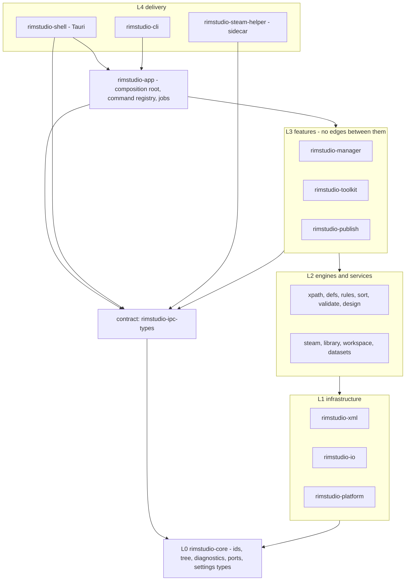
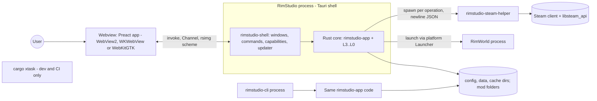
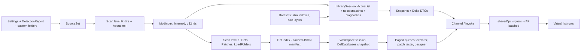

# RimStudio architecture overview

This document is the spine of RimStudio's design: what the product is made of, the invariants every change must respect, the layered architecture, the process model, the path of data from disk to screen, ten end to end scenario walkthroughs and the glossary that all other documents use. It is a design for a codebase that does not exist yet (the repository folder is still named `rimforge-studio` and holds a cargo-init stub; renaming is step 0, see [workspace layout](workspace-layout.md)). Crate-level detail is in the [crate catalog](crate-catalog.md) and every choice with its rejected alternatives is in the [decision register](decision-register.md). Requirement numbers R1 to R12 are the owner's canonical numbering.

Status: draft | Last updated: 2026-10-04

Milestone numbering follows the [roadmap, section 1.1](../roadmap.md#11-mapping-to-the-milestone-names-in-the-register) (older mentions of M3 to M6 use the decision register's numbering).
Milestone names (M0 to M7) follow the [roadmap](../roadmap.md). Contents: 1 Scope and pillars, 2 Principles, 3 Named invariants, 4 Layered architecture, 5 Process model, 6 Runtime data flow, 7 Storage map, 8 Scenario walkthroughs, 9 Glossary.

## 1. Scope and pillars

RimStudio is one cross-platform desktop application (Windows, macOS, Linux) for RimWorld modders, built with a Rust backend in a Cargo workspace, Tauri 2, Vite, Preact, TypeScript, Tailwind CSS and pnpm (R1). It has three pillars that share one set of engines rather than three code bases (R5).

| Pillar | What the user does | Owner requirement | Backend feature crate | Frontend feature folders | Milestone |
|---|---|---|---|---|---|
| Manager | Detect the game and Steam libraries, add custom mod folders, order, sort, validate and launch mod lists, keep profiles and history, fetch and merge community rules | R3, R4, R5, R6 | `rimstudio-manager` | `manager`, `settings`, `logs` | M1 to M3 |
| Toolkit | Explore defs with provenance, test patches, lint and scaffold mods, design weapons and apparel with vanilla and Combat Extended (CE) fit checks | R5, R7 | `rimstudio-toolkit` | `workspace`, `project`, `designer` | M4 and M5 |
| Publisher | Stage, preflight and publish or update a mod on the Steam Workshop through a separate helper process | R9 | `rimstudio-publish` | `workshop` | M6 |

What is deliberately out of scope for the architecture: an embedded Workshop browser, Rentry or PrivateBin sharing, a database builder, a version downloader and the deprecated alphabetical sorter (see [feature inventory](../research/rimsort-feature-and-ux-inventory.md)), a plugin system for third parties in the first releases (the tool registry is a compile time table, [decision D-066](decision-register.md)), and any XML use outside RimWorld's own files (R10).

## 2. Principles

1. Logic lives in Rust crates, the webview renders. A rule that decides a warning, an order or a conflict is a pure function that the command line can run. This is the lesson of both reference managers, whose rules sit in a 5,820-line view and a 645-line store ([reference architectures](../research/reference-architectures.md), sections 5 and 10).
2. Layers are enforced by the build, not by comments. Every workspace member carries a layer tag, an `xtask` check fails on a forbidden edge, and `cargo-deny` bans confine third party crates to one wrapper crate each.
3. Measured budgets drive structure. The mod list must appear after reading directory listings and `About.xml` only; everything slower is background work ([scan performance spike](../research/scan-performance-spike.md), budgets table).
4. Content problems are data. A malformed mod, a failing patch or a missing dependency becomes a `Diagnostic` with a stable code and provenance; only API misuse and I/O at a boundary are `Err`.
5. Foreign data is handled losslessly and conservatively: unknown keys survive a round trip, existing RimWorld files are edited by byte span so comments and layout survive, and the game folder is never written except through two fenced paths.
6. Reference material is read, never bundled: RimWorld, CE and community dataset content arrives from the user's install or the network at runtime (R11).
7. Decide once, generate the rest. A command, a DTO, a JSON schema and a TypeScript binding each have exactly one source of truth, and CI fails when a generated file drifts.
8. Be a good citizen of the machine: at most 8 scan workers, one core kept free, no unconditional telemetry, no ambient webview authority, no platform special cases outside one crate.

## 3. Named invariants

Style follows rust-analyzer's architecture document: each invariant has a name that can be cited in review, a statement, and the mechanism that enforces it. Violations are bugs, not trade-offs.

| Id | Name | Statement | Enforcement |
|---|---|---|---|
| I-01 | tauri-free-core | No crate below the shell (`rimstudio-shell`) depends on `tauri`, `gtk` or `webkit2gtk`, directly or transitively. The CLI builds on a machine without GTK headers. | `cargo xtask check-layers` plus `cargo tree -p rimstudio-cli -i tauri` must print nothing; `cargo-deny` wrappers for `tauri` |
| I-02 | xml-boundary | XML text is parsed or produced only inside `rimstudio-xml`. No other manifest lists an XML crate; no other crate contains an `.xml` string literal that it reads or writes, except RimWorld path constants held in `rimstudio-core::paths`. | `cargo-deny` bans every XML crate except `quick-xml` through `rimstudio-xml` (and the transitive `plist` via Tauri); xtask grep guard |
| I-03 | json-only-app-data | Everything the app owns (settings, caches, projects, templates, datasets, profiles, history, IPC, exports, translation catalogs, golden outputs) is JSON, or JSONC when a human edits it. No XML, YAML, TOML, SQL, SQLite or binary format for app data; many small records live in the in house JSON document store of `rimstudio-io` (D-083). | `cargo-deny` bans on `rusqlite`, `sqlx`, `serde_yaml`, binary serializers (one wrapper exception: read only `rusqlite` behind `aux-db` in `rimstudio-datasets`, D-031 and D-083); xtask check that every schema in `schemas/` has a writer in `rimstudio-io` |
| I-04 | rules-in-rust | No business rule (ordering, validation, scoring, patch choice, path policy) is implemented in TypeScript. Views format and filter what the backend returns. | oxlint ban on imports of rule-shaped modules; review checklist; sorting and validation suites run through the CLI without a webview |
| I-05 | game-folder-fence | The app writes into the RimWorld install only through (a) link farm entries it owns in `<install>/Mods`, recorded in an ownership manifest, and (b) `ModsConfig.xml` in the user config folder, always after a timestamped backup and a running-game check. Nothing else under the install or the config folder is written, and mod content in the user's folders is never modified by the manager. | all writes route through `rimstudio-io::GameWriteFence`, which refuses paths outside the two allow lists; unit tests with a recording filesystem assert the write set |
| I-06 | runtime-datasets | Community datasets (rules, SteamDB, Use This Instead, version lists) are fetched on the user's machine at run time and never bundled, mirrored or committed. | repository scan in `xtask check-licences`; no dataset file extension under `crates/` or `apps/` |
| I-07 | no-reference-data | Vanilla and CE values, presets, curves and class medians are derived at run time from the user's install through the def engine. No CE or RimWorld table exists in the source tree; test vectors use fictional numbers. | `xtask check-licences` scans for value tables; tests run with CE absent and assert the designer degrades with an explanation |
| I-08 | no-feature-edges | Feature crates (L3) never depend on each other. Composition happens in `rimstudio-app` or by pushing shared code down to L2. | layer matrix in `xtask check-layers` |
| I-09 | one-registry | Each command is declared exactly once in `rimstudio-app::registry`. The Tauri wrappers, the CLI dispatch table, the permission list and the TypeScript bindings are all generated from that table, so a missing entry fails to compile instead of failing at run time. | compile error in the shell; `bindings` drift check; test that every registry name has a CLI route or an explicit `ui-only` marker |
| I-10 | diagnostics-not-errors | Problems in user content never abort an operation. They are collected as `Diagnostic { code, severity, mod, file, message }`, counted per code, capped per code for memory, and returned beside the result. | `#![deny(clippy::unwrap_used)]` in library crates; the vanilla load test asserts zero diagnostics |
| I-11 | platform-quarantine | `cfg(target_os)` and OS specific dependencies appear only in `rimstudio-platform`, in the shell's window code, in the sidecar's library lookup and in `xtask` packaging. Everything else sees OS behaviour through traits in `rimstudio-core::ports`. | xtask `check-cfg` greps for `target_os`, `cfg(windows)` and `cfg(unix)` outside the allow list |
| I-12 | deterministic-output | Sorting, merging, patch application, cache writing and export are deterministic: same input and settings give byte-identical JSON regardless of thread count or hash seed. File order inside a folder is an ordinal sort of the relative path. | golden tests run at 1 and 8 threads; `HashMap` iteration never reaches an output (use `BTreeMap`, `IndexMap` or sorted vectors) |
| I-13 | jobs-for-long-work | Any operation expected to exceed 1 ms of Rust work in a command is a job: caller minted id, progress channel, cancellation token checked between units of work, cancel on channel drop. | registry kind `job` in the command table; benchmarks assert the inline budget for `query` commands |
| I-14 | no-ambient-webview | The webview has no `fs`, `shell` or `http` plugin permission. Every command taking a path validates it against registered roots; every URL it can load is an allow-listed scheme. | one capability file; test that capability permissions equal the registry; `RootGuard` unit tests |
| I-15 | steam-native-in-sidecar | Valve's native library is loaded only by `rimstudio-steam-helper`. The app starts and every screen except Publish works with the library absent. | helper is its own package; test that starts the app with no library present |
| I-16 | explicit-context | No global mutable state in library crates. Services receive an `AppContext` (or narrower parts of it) explicitly, so tests run in parallel without a global lock. | `unsafe_code = "forbid"` (a `static mut` cannot be used without `unsafe`); clippy `disallowed_types` for `OnceLock`, `LazyLock`, `once_cell` and `lazy_static` outside `rimstudio-app::logging`; code review |
| I-17 | user-vs-derived | User work (settings, rules, profiles, tags, notes, projects) and derived facts (scan manifests, indexes, dataset copies) live in different directories and files. Deleting the cache directory never loses user work. | `DataRoots` has separate `config`, `data` and `cache` roots; store API takes a root kind |
| I-18 | lossless-foreign | Files RimStudio does not fully own (community rules, user rules, `About.xml`, `LoadFolders.xml`, RimSort exports) round-trip with unknown fields, key order and comments preserved. | round-trip tests on real and synthetic fixtures; CST editing for JSONC |
| I-19 | generated-in-sync | Generated artefacts (TypeScript bindings, JSON schemas, the command table's CLI help, the layer graph picture) are committed and regenerated by CI, which fails on any diff. | `cargo xtask check` runs `bindings --check` and `schemas --check` |

## 4. Layered architecture

The vocabulary comes from [reference architectures](../research/reference-architectures.md) section 6. Refinements decided here: L2 is split into pure engines and IO using services, a Tauri-free composition root (`rimstudio-app`) sits between the features and both shells, and the Tauri shell and the CLI depend only on that root. Details and the full edge matrix are in [workspace layout](workspace-layout.md) section 4.

| Layer tag | Crates | Rule of thumb |
|---|---|---|
| `l0-domain` | core | Data types, ids, pure helpers, port traits. No IO, no async runtime. |
| `l1-infra` | xml, io, platform | One adapter per outside world: XML text, filesystem and JSON storage, operating system. |
| `l2-engine` | xpath, defs, rules, sort, validate, design | Pure and deterministic. Input in memory, output in memory. Benchmarkable without a disk. |
| `l2-service` | steam, library, workspace, datasets | Compose engines and L1 adapters: scanning, detection, reference set loading, dataset fetching. |
| `l3-feature` | manager, toolkit, publish | A user level use case with a typed API of request and response DTOs and job starters. No transport. |
| `l4-app` | app | Builds the `AppContext`, hosts the command registry and the job runner. Tauri free. |
| `l4-shell`, `l4-cli`, `l4-sidecar` | shell, cli, steam-helper | Transports and processes. No business rules. |
| `contract` | ipc-types | Serde types that cross a process boundary, with generated TypeScript. |
| `support` | testing, xtask | Fixtures and repository automation. |

## 5. Process model

| Process | Binary | Lifetime | Talks to | Notes |
|---|---|---|---|---|
| App | `rimstudio` (product name RimStudio) from `rimstudio-shell` | user session | webview over Tauri IPC | single instance (`tauri-plugin-single-instance`), owns all state, runs the job runner |
| Webview | system engine | with the window | app only | no file, shell or network authority; images through the `rsimg` custom scheme |
| CLI | `rimstudio-cli` | one command | disk, network | same `rimstudio-app` handlers, own progress renderer, JSON on stdout, exit codes documented per command |
| Steam helper | `rimstudio-steam-helper` | one operation | stdin and stdout of the app | newline delimited JSON, exactly one terminal event, own work directory with `steam_appid.txt` |
| Game | RimWorld | user decision | none | launched through `rimstudio-platform::Launcher`, `ModsConfig.xml` backed up before and diffed after |
| xtask | `cargo xtask` | dev and CI | repository | layer check, bindings, schemas, fixtures, packaging helpers, bench budgets |

## 6. Runtime data flow

The same path serves the manager and, with more stages, the toolkit.

1. Sources: settings plus the `DetectionReport` produce a `SourceSet`: game Data, install Mods, every Steam library workshop folder, and any number of custom folders. This is the only input the scanner needs.
2. Scan level 0 lists mod roots, resolves `About` case insensitively and parses `About.xml` with the lenient event reader. The measured cost is a few milliseconds warm. The result is a `ModIndex` with interned strings and `u32` mod handles.
3. A `LibrarySession` binds a `ModIndex`, the active list (with a command stack for undo and redo), a snapshot of merged rules and the current diagnostics. It is the single mutable thing the manager edits; everything else is immutable and shared by `Arc`.
4. Edits produce revisions. The session emits a `Snapshot { rev, rows }` once and then `Delta { rev, upserts, removes, order }` on a long lived channel; a revision gap makes the client re-snapshot ([IPC performance](../research/webview-and-ipc-performance.md) section 2.4).
5. In the webview `shared/ipc` applies deltas inside `requestAnimationFrame` to row signals, so toggling a mod touches one text node and the windowed list renders only visible rows.
6. Toolkit data: scan level 1 reads only the folders the game would load (`LoadFolders.xml` and version folders), builds a streaming def index, and caches it as compact JSON keyed per file. A `WorkspaceSession` then builds, on demand, a `DefDatabases` snapshot by the game's own order: merge, patch, inherit, instantiate. Explorer, patch tester and designer query it with paged requests; no full tree is ever sent to the webview.

## 7. Storage map

Three root kinds, resolved once by `rimstudio-io::DataRoots` (a portable marker file `rimstudio.portable` beside the executable moves all three under `./data`).

| Root | Contents | Format | Safe to delete |
|---|---|---|---|
| config | `settings.jsonc` (app, UI, theme, language), `workspace.jsonc` (path overrides, mod sources, custom folders, launch arguments, dataset choices), `launch.jsonc` (graphics environment variables and safe-graphics flag, read before the webview exists, D-077), secrets in the OS credential store | JSONC, edited through the CST so comments survive | no |
| data | `userdata/` user rules (lossless), lists and history snapshots, tags, notes, colours, groups, ignore lists, `projects/<id>.jsonc`, `publish/<id>/`, link ownership manifests, ModsConfig backups | JSON, JSONC for user edited files | no |
| cache | scan manifests, def index, type table, dataset copies (`current`, `previous`, `state.json`, slim index), CE calibration, thumbnails | JSON | yes, rebuilt on demand |
| logs | rolling JSON lines from `tracing` | JSON lines | yes |

## 8. Scenario walkthroughs

| Id | Scenario | Crates and places touched | Budget or outcome |
|---|---|---|---|
| S1 | Add a new tool module | `rimstudio-toolkit` (module), `ipc-types`, `app` registry and tool table, frontend feature folder, locales | 0 edits outside the listed files; `cargo xtask check` green |
| S2 | Swap the Steam publish backend | `rimstudio-steam-helper` backend trait, optionally `rimstudio-publish::transport` | no change to protocol, app, shell or frontend |
| S3 | Scan and sort headless in CI | `rimstudio-cli`, `app`, `library`, `rules`, `sort`, `validate`, `testing` | builds without GTK; deterministic JSON; no webview |
| S4 | Toggle one mod in a 5000-mod list | `manager::listops`, `validate`, `ipc-types`, `shared/ipc`, list component | input to paint under 50 ms, Rust part under 5 ms |
| S5 | Open the Def Explorer on 600 mods | `workspace`, `library`, `defs`, `xpath`, `toolkit::defs` | index ready under 300 ms warm, under 100 MB; pages of results |
| S6 | Linux-only feature without leaking cfg | `platform::linux`, a port in `core::ports`, a diagnostic code | no `cfg` in any other crate |
| S7 | Item designer emits a CE patch | `toolkit::designer`, `design::ce`, `workspace`, `xml::render`, `io` | JSON node tree to XML only in the boundary crate |
| S8 | Add a frontend feature screen | `features/<name>`, `app/tools.ts`, locales, optional `packages/ui` | no cross feature import, no Tauri import |
| S9 | Change the settings schema | `core::settings`, `io::migrate`, schema, fixture | old files load, comments survive, backup written |
| S10 | Cold start to a usable mod list | `shell`, `app`, `library`, `io` | shell painted under 1.5 s, list under 150 ms after boot |

**S1. Add a new tool module** (example: a texture checker).
1. Create `crates/rimstudio-toolkit/src/texture/` with `mod.rs` (the tool's API functions taking `&AppContext` parts and a request DTO) and `tests.rs`; add Cargo feature `tool-texture` (default on) to the crate. If the tool needs a heavy external dependency (an image or DDS encoder), make it its own crate `rimstudio-tool-texture` tagged `l3-feature` instead.
2. Add request and response DTOs in `crates/rimstudio-ipc-types/src/texture.rs`.
3. Append rows to the command table in `crates/rimstudio-app/src/registry.rs` (kind `query`, `action`, `stream` or `job`) and one `ToolDescriptor` (id, title key, icon, required capabilities) in `crates/rimstudio-app/src/tools.rs`.
4. Run `cargo xtask bindings`; commit the regenerated `packages/ipc-types/src/bindings.ts`.
5. Frontend: create `apps/desktop/src/features/texture/` (`index.ts` exporting the descriptor, `TexturePage.tsx`, `store.ts`, `api.ts`, tests), register it in `app/tools.ts`, add keys to `locales/en.json`.
6. Add a fixture under `tests/fixtures/` and a benchmark if the tool states a performance target. `cargo xtask check` verifies layers, registry parity with the frontend tool ids, and catalogue drift. The full checklist is in [workspace layout](workspace-layout.md) section 6.

**S2. Swap the Steam publish backend.**
1. The helper wraps Valve's API behind `trait SteamBackend` (init, identity, create, update, progress). Add `backend/gamelib.rs` implementing it with `libloading` against RimWorld's own library, behind Cargo feature `backend-gamelib`.
2. Backend choice travels in the existing request (`libraryPath`) and in the setting `publish.backend`; protocol version 1 is unchanged.
3. `rimstudio-publish` talks only to `PublishTransport` (`helper` today). A SteamCMD route would be a second transport that emits a VDF and instructions; it still lives in `rimstudio-publish::transport`.
4. Nothing changes in `app`, `shell`, `ipc-types` or the frontend, and the fake backend used in tests exercises both paths. This is the payoff of the sidecar boundary ([workshop publishing research](../research/workshop-publishing-research.md) section 6.1).

**S3. Run scan and sort headless in CI.**
1. CI job builds `cargo build -p rimstudio-cli` on a runner without GTK, then runs `cargo tree -p rimstudio-cli -i tauri` and requires empty output (I-01).
2. `xtask fixtures` (or the `rimstudio-testing` builder) generates a fixture library: an install tree, a workshop folder and a custom folder with synthetic mods.
3. `rimstudio-cli scan --install <path> --mods-dir <path> --out scan.json` runs the registry handler `library_scan` through the same `app` code the UI uses; datasets are read from a local source directory (`--dataset-dir`) so no network is needed.
4. `rimstudio-cli sort --list list.json --check` loads rules, runs `rimstudio-sort`, then `rimstudio-validate`, and prints `{order, explanations, diagnostics}` as JSON; exit code 0 when no hard violation remains, 1 when violations remain, 2 on usage or I/O errors.
5. The job diffs the output against a golden file at 1 and 8 threads (I-12).

**S4. Toggle one mod in a 5000-mod list.**
1. Space key in the list component calls `shared/ipc` action `list_toggle({ idx: [..], active })` (`invoke`, inline command, no job).
2. `rimstudio-app` dispatches to `manager::listops::toggle`, which pushes a command on the session's undo stack, updates the `ActiveList` (order vector plus id-to-position array, O(1) to O(log n)) and marks the session dirty.
3. `validate::list::recompute_affected` re-evaluates only the toggled mod, its declared dependents and the mods that reference it, using the position array (target well below 1 ms for 610 mods, to be benchmarked at 5000).
4. The session emits `Delta { rev+1, upserts: [rows whose flags changed], order: moves }` on the subscription channel. Typical payload is under 1 KiB.
5. `shared/ipc` applies it in the next animation frame; one row signal updates one text node; the windowed list repaints at most the visible rows (fewer than 100 DOM rows).
6. Budget: IPC round trip under 5 ms, Rust work under 5 ms at 5000 mods, input to paint under 50 ms ([IPC performance](../research/webview-and-ipc-performance.md) section 5, items 2 and 4). Nothing is written to disk; saving the list (`ModsConfig.xml`) is an explicit action that runs the pre-launch check.

**S5. Open the Def Explorer on a 600-mod list.**
1. The Workspace screen sends `defs_open_session({ referenceSet })` (a job). `rimstudio-workspace` resolves each active mod's load plan (`core::load_plan`), then runs scan level 1 through `rimstudio-library`, which reads the cached def manifest and re-parses only changed files.
2. The def index (type, defName, parent, abstract flag, file, byte offset; interned strings) lives in Rust: about 32 MB for 700 mods measured, budget under 100 MB; the webview holds none of it.
3. Search and list queries call `defs_search({ text, filters, offset, limit })` and return pages; the UI keeps a few hundred rows at a time. Warm index build is under 300 ms, search over the vanilla 13,212 defs under 20 ms.
4. Opening a def triggers `defs_get_resolved(defRef)`, which reads the raw nodes by offset, applies the patch operations that target it (indexed `Defs/Type[defName="X"]` shapes, full XPath 1.0 fallback otherwise) and returns provenance plus rendered XML text. A background job (a registry row after the first 40 commands, working name `defs_build_snapshot`) builds the complete `DefDatabases` snapshot for the patch tester and conflict detector; its memory and time at 600 mods are not yet measured (spike S-08).
5. Data lives in `WorkspaceSession` behind `Arc`; a rebuild swaps a new snapshot, and the UI shows "stale" when files changed after the snapshot revision.

**S6. Add a Linux-only feature without leaking cfg** (example: warn when Steam runs as a Flatpak without access to a custom folder's drive).
1. Add the OS code in `crates/rimstudio-platform/src/linux/flatpak.rs` and implement the existing port `SandboxProbe` (defined in `rimstudio-core::ports` with a default method returning `SandboxInfo::none()`). The only `cfg(target_os = "linux")` is the `mod linux;` line in `platform/src/lib.rs` and the selection in `SystemPlatform::new`.
2. `rimstudio-library::deploy` consumes `SandboxInfo` as ordinary data and emits the diagnostic `deploy.flatpak-target-not-granted`. The logic runs on every OS in tests with a fake probe.
3. The DTO carries only the diagnostic; the frontend maps the code to a message key in `locales/en.json`. No OS enum leaks into the contract.
4. `xtask check-cfg` fails the build if `target_os` appears anywhere else; CI runs the platform crate's tests on all three operating systems.

**S7. The item designer emits a CE patch.**
1. Designer screen calls `designer_preview` (query) with the design inputs. `toolkit::designer` reads the `WorkspaceSession` snapshot: vanilla defs and CE data from the user's install, loaded by the same `rimstudio-defs` pipeline. The designer writes vanilla definitions; if CE is absent, the optional CE patch toggle is disabled with an explanation (I-07, D-085).
2. `design::ce::reader` extracts structured conversion records (including the raw `MakeGunCECompatible` operation parameters) and class statistics; `toolkit::designer` caches them through `rimstudio-io` as JSON under `cache/ce/` keyed by a hash of the CE version (the engine crate never touches the disk). `design::fit` scores the proposal against class distributions and returns per-stat bands.
3. On Export, `design::ce::patchgen` builds a JSON node tree for the patch operations from RimStudio-authored templates (`crates/rimstudio-design/templates/ce/*.json`, typed parameters, no CE values) and picks Add, Replace or the ensure-container idiom from the real container state.
4. `toolkit::designer` assembles a `WritePlan` (files, target folder gated by `LoadFolders.xml` with `IfModActive="ceteam.combatextended"`), runs `validate::author` on it (defRefs, required keys, FindMod names) and shows a diff in the UI.
5. On confirm, `rimstudio-xml::render` turns each tree into XML text (the only place XML is produced), `rimstudio-io` writes atomically into the project, and `LoadFolders.xml` is edited by byte-span splice. A golden test compares template output with the XML kept as documentation ([CE patch conventions](../research/ce-patch-conventions.md), implications 1, 2 and 11).

**S8. Add a frontend feature screen.**
1. Create `apps/desktop/src/features/<name>/` with `index.ts` (the only public entry; exports the tool descriptor and lazy page), `<Name>Page.tsx`, `store.ts` (signals and pure actions), `api.ts` (typed wrappers over `shared/ipc`), and tests.
2. Register the descriptor in `apps/desktop/src/app/tools.ts` and add keys to `apps/desktop/src/locales/en.json`.
3. New reusable widgets go to `packages/ui` with a gallery entry; new IPC primitives (rare) go to `shared/ipc`.
4. oxlint forbids imports of other features and of `@tauri-apps/*`; dependency-cruiser forbids cycles and `rimstudio-ui` importing the app. `pnpm check` runs lint, types, unit tests and the locale completeness script.

**S9. Change the settings schema.**
1. Edit the struct in `crates/rimstudio-core/src/settings/`; new fields get `#[serde(default)]`; bump `SCHEMA_VERSION`.
2. Add `crates/rimstudio-io/src/migrate/settings_vN.rs` (a pure function over `serde_json::Value`, forward only) and register it in the migration table.
3. Put a file of the previous version in `tests/fixtures/settings/` and extend the migration test that loads every historical fixture and compares to an expected struct.
4. `cargo xtask schemas` regenerates `schemas/settings.schema.json` (schemars) and CI diffs it.
5. At load, the store backs up the old file (`settings.jsonc.bak-vN`), migrates in memory, and writes through the CST editor so the user's comments survive. A file with a newer version than the app is opened read only with a banner, never rewritten or discarded.

**S10. Cold start to a usable mod list.**

| Step | Work | Budget |
|---|---|---|
| 1 | Process start, single instance check, resolve `DataRoots`, window created hidden, shell painted with a skeleton and no data dependency | shell visible under 1.5 s |
| 2 | `rimstudio_app::boot` (a plain function the shell calls, not a registry command): load `settings.jsonc` and `workspace.jsonc`, build `AppContext`, load cached last list snapshot | under 50 ms |
| 3 | First `Snapshot` sent from the cached list (rows plus stale marker) | list visible under 100 ms after step 2 |
| 4 | Background scan level 0 over all sources with the stat key manifest, verify, emit deltas | warm re-scan about 25 ms; fully verified under 150 ms |
| 5 | Datasets: load slim indexes lazily after the list is shown (about 25 ms parse each); rebuild only if a download finished | does not block steps 3 and 4 |
| 6 | Def index and `DefDatabases` build only when a toolkit screen opens | not part of cold start |

On a cold spinning disk the cached list still shows immediately and progress is reported; first run without cache shows the list after the first scan (measured 3.7 ms CPU at 16 threads for 690 mods, budget 100 ms on SSD). Sources: [scan performance spike](../research/scan-performance-spike.md), [cross-platform packaging](../research/cross-platform-packaging-research.md) implication 11.

## 9. Glossary

The glossary lives in [glossary.md](../glossary.md) so that it can be read first and linked from anywhere; it holds the terms listed here in earlier drafts plus a table of words with more than one meaning.

