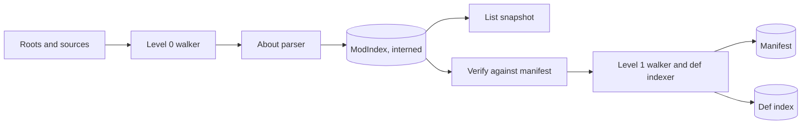

# Performance strategy

Scope: the performance budgets of RimStudio with their measured evidence, the scan pipeline stage by stage, the rules that keep the webview fast, the start-up order, the policy for watchers, background work and cancellation, the benchmark and CI regression gate, the measurements that are still missing on Windows and macOS, and the risks to the budgets. It serves requirement R5 (mod manager goals: performance and intuitive design) and the invariants I-12 (deterministic output) and I-13 (jobs for long work). The measurements come from the [scan performance spike](../research/scan-performance-spike.md) and the [webview and IPC performance note](../research/webview-and-ipc-performance.md); the file formats and caches are specified in [data and persistence](data-and-persistence.md).

Status: draft | Last updated: 2026-10-04

## 1. Philosophy

1. Do less, then do it in parallel. The biggest wins in the spike came from not visiting files (a pruned scan reads 26.7k of 306k files) and not parsing unchanged files (a 130 ms index build becomes a 25 ms verify), not from faster parsers.
2. The first paint never waits for data. The mod list is the user-visible start-up path and costs about 2 ms of CPU on the research machine; everything else is background work that fits inside a second even without a cache.
3. Cache what is expensive and cheap to store, keyed so that staleness is detectable from disk, always deletable (I-17).
4. Parallel parse, sequential merge, deterministic result. This is the lesson of the owner's Parallax project: its incremental cache keyed on cheap metadata, parallel file work and ordered merging are kept (the performance strategy document of that separate Go project, outside this repository). The reference tool that Parallax studied was slow because nothing was skipped across runs, parallelism was capped by a constant, and every definition stayed resident as text; RimStudio avoids each of the three.
5. Measure before optimising, and put every claim in a budget row that a benchmark checks.
6. JSON is enough. JSON caches met every budget; a binary cache saves about 14 ms of an already sub-100 ms start and would break R10 (D-022).

## 2. Budget table

Library of the measured size: about 700 mod folders, 306,394 files, 59,348 directories, 46,705 XML files, 134,324 defs, on a SATA SSD with 16 threads under moderate background load (Intel i9-9900K, Rust 1.96). Acceptance targets carry about 2x headroom over the measured value for the research machine class. A 4-core laptop or a spinning disk is assumed 3x to 10x worse and the UI must still be responsive; the acceptance gates in section 9 therefore use the targets on the CI runner class, not on this machine.

| Id | Scenario | Measured | Acceptance target | Source |
|---|---|---|---|---|
| B-01 | Process start to painted shell (skeleton, no data dependency) | webview process alone 1.6 to 2.4 s in the lab | under 1.5 s on the research machine class (aspirational: the lab measured 1.6 to 2.4 s for the webview process alone, so the CI gate is set from the S-10 numbers, see the open design issues in the decision register); measured per OS in M2 | [webview note](../research/webview-and-ipc-performance.md) section 5 |
| B-02 | Cold start to a usable mod list, nothing cached (list roots, read and parse every `About.xml`) | 3.7 ms cold-approx and 2.0 ms warm at 16 threads; 24.5 ms cold and 9.6 ms warm at 1 thread | list data ready under 100 ms on an SSD | spike S2 start-up path |
| B-03 | Warm start with persisted manifest, list and index | manifest load 23 to 69 ms (compact versus row layout) plus 23 ms re-scan; 100 ms end to end with the row layout | cached snapshot visible under 100 ms after boot; fully verified under 150 ms | spike S4 |
| B-04 | Refresh after one mod changes | re-scan 26 ms, re-parse of changed files under 3 ms | under 50 ms including the in-memory index update | spike S4 |
| B-05 | Full def index, no cache, warm file cache | 122 ms (structural scanner), 125 ms (quick-xml streaming), 346 ms (DOM), 16 threads | under 300 ms | spike S3, S6 |
| B-06 | Full def index, no cache, cold SSD | 253 ms at 16 threads, 2,256 ms at 1 thread | under 600 ms with a progress bar after 200 ms | spike S6 |
| B-07 | Full def index on a cold spinning disk | 1.3 ms per uncached def file regardless of threads (CE: 817 files in 1.0 s) | background only, never blocks the mod list | spike S6 |
| B-08 | Pruned scan, all mods, warm | 19 to 21 ms at 16 threads | under 50 ms | spike S6 walk-only |
| B-09 | Full directory walk (optional "all files" features) | 94 ms for 306k files with metadata | under 250 ms, lazy | spike S1 |
| B-10 | Toggle one mod in a 5000 mod list: validation recompute, Rust part | target well below 1 ms for 610 mods (not yet benchmarked at 5000) | under 5 ms; input to paint under 50 ms | [overview](overview.md) scenario S4 |
| B-11 | Sort plus validate recalculation of a whole list | not measured in the spike (open) | under 100 ms for 5000 mods, as a job with progress above 200 ms (proposed, to be calibrated at M2) | proposal |
| B-12 | Mod list snapshot, 3000 rows, invoke to first rendered rows | transport 8 ms plus parse 4 ms; 14 ms for 5000 rows | under 100 ms; 5000 row round trip under 50 ms | webview note section 2.2 and 5 |
| B-13 | Search over vanilla defs (13,212 defs) | not measured | under 20 ms per query, paged | [overview](overview.md) scenario S5 |
| B-14 | Search over the mod list (name, author, package id) | not measured | under 16 ms for 5000 rows, filter applied in Rust, delta to UI | proposal |
| B-15 | Memory of the complete def index | 32 MB interned, 58 MB with owned strings; 14.3 MB held single threaded | under 100 MB for 700 mods | spike S5 |
| B-16 | Whole app memory with a 3000 mod list | webview PSS 347 MB after a heavy bench | webview under 400 MB, total under 600 MB | webview note section 5 |
| B-17 | Manifest on disk | 7.4 MB compact, 20.8 MB row layout | under 15 MB, rewritten at most once per second | spike S4 |
| B-18 | Dataset slim index load (SteamDB) | 23 to 26 ms and 18 MB peak for 18,639 entries | under 50 ms, loaded after the list is shown | [rules fetch note](../research/rules-fetch-and-merge-design.md) section 6 |
| B-19 | Initial JavaScript | not yet built | under 300 KB gzip, heavy features lazy | webview note section 5 |
| B-20 | Frame time during scroll and drag | 16 to 17 ms medians at 60 Hz on the lab | under 16 ms; no dropped frames over 3000 rows | webview note section 4.3 |
| B-21 | Vanilla def load and patch (Core plus 5 DLC) | prototype: 2849 patch operations over 18k nodes took 16 s without a name index | vanilla under 1 s, CE under 2 s, with the name index | [def engine semantics](../research/def-engine-semantics.md) section on performance requirements |

Reading the table: B-02 to B-04 and B-12 define what the person feels in the manager; B-05 to B-07 and B-21 define when toolkit screens are ready; B-15 to B-17 are footprint guards. Rows marked "proposal" or "open" have no measurement yet and become calibrated in M2 when the benchmark harness (section 9) runs on all three operating systems.

## 3. The scan pipeline

Everything in this pipeline lives in `rimstudio-library` (scan, manifest, mod index) and `rimstudio-workspace` (def index and snapshots), over the `rimstudio-io` walker and the `rimstudio-xml` parsers. Errors are data: a locked folder, a malformed `About.xml` or a vanished file becomes a diagnostic on its mod, and the scan never aborts (I-10).

### 3.1 Stage 0: sources

1. The source list comes from the detection report and `workspace.jsonc` (game `Data`, install `Mods`, each Steam library workshop folder, each custom folder). Disabled and offline sources are skipped; offline sources keep their cached rows.
2. A custom folder with `layout: auto` is classified at scan time: a path is a mod when `About/About.xml` exists (the `About` folder matched case-insensitively), a root otherwise, descending at most `scanDepth` levels and never below a mod root.

### 3.2 Stage 1: level 0 walk and About parse (the mod list)

1. A hand-written parallel recursion over `read_dir` with `DirEntry::file_type()` on a rayon pool. This beat walkdir by 8.7x, std by 6.4x and tuned jwalk by 2.3x on 306k files (94 ms against 603 and 814 ms). jwalk with default settings is no faster than single-threaded std and silently reports zero permission errors, so it is not used.
2. Level 0 reads only the mod root listing and the `About` folder. It does not stat files it does not need: dropping the per-file stat halves a walk (94 to 50 ms).
3. One `About.xml` is read with a reused per-thread buffer (`fs::read` or `read_exact`; mmap was 2.8x slower on 23.7k small files and is not used), decoded once (BOM stripped, UTF-16 handled, invalid UTF-8 decoded lossily) and parsed by the lenient quick-xml event reader: 6.5 microseconds per file, 1.2 ms for 691 files at 16 threads, with partial results and warnings on damaged files. serde derive is never used on `About.xml`: tag case changes, duplicate elements and entity problems fail the whole file.
4. The output is one record per mod (identity, display fields, dependency and order lists, supported versions, warnings, folder facts) inserted into the `ModIndex`.

### 3.3 Stage 2: interning and the index

1. Strings that repeat (def type tags, class names, parent names, package ids, relative paths) are interned to `u32` keys. Interning cut the index payload from about 36 MB to about 13 MB (2.8x) and turns name comparison into an integer comparison.
2. The same string table is written as the cache string table, so a cache load is a table read plus integer tuples, not a million small allocations.
3. Mod handles on the hot path are `ModIdx(u32)`; sort results are `ModIdx` arrays; neither is ever persisted ([data and persistence](data-and-persistence.md) section 5.2).
4. The allocator is the system one until measured (D-069). The 16-thread scan holds about 18 MB more resident than a single-thread build of the same index (32.0 against 14.3 MB), which suggests the allocator matters, so S-10 compares system, mimalloc and jemalloc on three operating systems before any change.

### 3.4 Stage 3: verify against the manifest

1. For each mod folder in the manifest, the pruned level 1 walk lists only `About`, `LoadFolders.xml` and the target subfolders (`Defs`, `Patches`, `Languages`, `Assemblies`, plus the version and `Common` folders the game would load), and compares each file's `(relative path, size, mtime ns, file id)` with the stored key for equality.
2. Unchanged files reuse their stored records; changed files are re-parsed; new files are added; vanished files are dropped. The cost is almost entirely the stat walk (about 21 ms); re-parsing 1 percent of mods is about 3 ms.
3. FAT-family volumes round mtime to 2 s, so equal rounded mtime with equal size falls back to a lazily computed blake3 hash. Network and removable drives deliver no watcher events and may have coarse mtimes; they are verified on focus, on a manual refresh and on a timer only when the person enables it.
4. A guard per mod (file count and size sum of the target folders) catches deletions that leave other keys unchanged.

### 3.5 Stage 4: level 1 walk and the def indexer

1. Level 1 reads only what the game would load for the detected version: `LoadFolders.xml`, the version folders and `Common`. The spike used a deliberately generous superset (23,717 files) so the real version-resolved index is smaller; the measurement of the resolved scope is still open (section 10).
2. The default def indexer is quick-xml streaming (125 ms for 134k defs at 16 threads, 1.07 million defs per second). The memchr structural scanner is 2.4x faster (52 ms end to end) but is not a validating parser; it is an optional optimisation behind the same conformance test (identical output on all 23,717 real files) and is adopted only if profiling shows the index is rebuilt often.
3. Work is scheduled per file with rayon work stealing. The slowest 1 percent of files carry 34 to 42 percent of parse time (the largest def files are 2.4 to 3.4 MB), so large files are queued first and never parsed as a DOM on the UI path (a 2.5 MB file costs 22.6 ms as a DOM, 7.0 ms streamed). Files over 10 MB are skipped with a warning.
4. Threads: `min(available cores, 8)`, configurable in settings, leaving one core for the UI. Scaling on the SSD is good to 4 threads (3.2x warm) and flat beyond 8; on a cold HDD extra threads do nothing (CE 1.03 s at 1 thread, 1.06 s at 16) so the pool size is not raised for slow volumes.
5. Output order is deterministic: results are merged sequentially by an ordinal sort of the relative path, so the golden output is identical at 1 and 8 threads (I-12). The game's own filesystem order differs and that divergence is documented in the [def engine note](../research/def-engine-semantics.md).

### 3.6 Stage 5: persistence

1. The manifest is one compact JSON file per library in the cache root: a string table, integer tuples for mods, files and defs. 134k defs take 7.4 MB, decode in 21 ms and hold 10.9 MB resident after load, against 20.8 MB, 67 ms and 41.5 MB for the row layout. Layout matters more than parser: compact against row is 3x in load time and 3.8x in memory, while sonic-rs against serde_json is 1.4x, so `serde_json` is the default and sonic-rs a possible later optimisation. simd-json is avoided (197 MB peak).
2. It is written debounced to at most once per second, atomically, from a snapshot of the in-memory index, on a background thread. A 40 ms write must not delay a toggle.
3. It is split per mod only if the real write cost on a large library demands it (D-023).
4. Corrupt, truncated or version-mismatched files are treated as absent and rebuilt.
5. A binary cache is revisited only if a library ten times larger shows a manifest load above 250 ms.

### 3.7 What is not in the pipeline

`DefDatabases` resolution (merge, patch, inherit, instantiate) is a separate on-demand job per toolkit screen, not part of the scan (D-019). Its memory and time for a 600 mod list are the open spike S-08.

## 4. Frontend rules tied to the budgets

These restate the [webview note](../research/webview-and-ipc-performance.md) section 5 as rules the frontend tooling enforces where possible.

| Rule | Budget it protects | Enforcement |
|---|---|---|
| Every list over 100 rows uses `shared/lists` windowing; no list holds more than 3000 DOM nodes, no page more than 10,000 | B-20, B-12 | oxlint restriction on direct mapping of large arrays (S-12), Playwright DOM count check |
| Updates flow through signals; a delta touches one row signal, never replaces the rows array | B-10, B-20 | `shared/ipc` is the only writer of row stores; lint on `rows.value =` outside it |
| Deltas and chunks are applied inside one `requestAnimationFrame`; no `requestIdleCallback` | B-12 | `shared/ipc` rAF batching, unit tests with fake timers |
| Streams are coalesced to at most 20 messages per second, each under 8 KiB or rare and large (above 8 KiB IPC messages were 5.7x slower in the lab) | B-12 | `JobRunner` coalescing, a test asserting message size and rate |
| List rows carry list columns only; descriptions and details are fetched on demand | B-12 | DTO convention D-043, schema test that lists rows do not exceed a byte budget |
| Fixed row heights; measure only rows that change height | B-20 | gallery review |
| No `backdrop-filter`, large shadow stacks or filters on full panels or rows; animate only `transform` and `opacity`; honour `prefers-reduced-motion` | B-20 on WebKitGTK | style lint, gallery screenshots in both themes |
| No WebGL, WebGPU or `SharedArrayBuffer`; no `requestIdleCallback` | portability | oxlint |
| Initial JavaScript under 300 KB gzip; editor, graph, charts and designer are lazy chunks; fonts self-hosted, latin subset | B-19 | `xtask check-size` with a budget file |
| Images come through the `rsimg` scheme as thumbnails of at most 256 pixels, lazily decoded; never base64 | B-16 | custom scheme, lint on `data:image` in app code |
| Long plain content (settings, logs) uses `content-visibility: auto` with `contain-intrinsic-size` | B-20 | review |
| Keyboard parity for every drag operation | usability under load | spike S-05 gate |
| Tailwind class names stay static; row state uses `data-*` variants | style recalculation cost | review |
| Selecting 5 rows and dragging between two virtualised lists holds 16 ms frames | B-20 | spike S-05 in the gallery |

Two further rules: a command that needs more than 1 ms of Rust work is a job (I-13), and no component calls `invoke` directly (only `shared/ipc` and `shared/platform`), so every call can be measured, cancelled and mocked in one place.

## 5. Start-up order

| Step | Work | Budget | Notes |
|---|---|---|---|
| 1 | Process start, single-instance check, resolve `DataRoots`, create the window hidden, paint the shell skeleton | shell visible under 1.5 s (B-01) | No data dependency. The webview process alone took 1.6 to 2.4 s in the lab, so nothing may wait on Rust data before first paint |
| 2 | `rimstudio_app::boot` (a plain function, not a registry command): load `settings.jsonc` and `workspace.jsonc`, build `AppContext`, load the cached list snapshot | under 50 ms | A parse error in a JSONC file falls back to the last valid backup in memory and shows a banner |
| 3 | Send the first `Snapshot` from the cached list with a stale marker | list visible under 100 ms after step 2 (B-03, B-12) | On the very first run there is no snapshot; the list appears after step 4 |
| 4 | Background level 0 scan over all sources, verify against the manifest, emit deltas | verified under 150 ms warm (B-03) | A cold spinning disk still shows the cached list at once, with progress |
| 5 | Load slim dataset indexes lazily after the list is shown; rebuild only when a download finished | about 25 ms each (B-18) | Not on the critical path |
| 6 | Check datasets for updates in the background (conditional GET, at most once per refresh interval) | none | Skipped offline; never blocks anything |
| 7 | Def index and `DefDatabases` only when a toolkit screen opens | B-05 warm | Not part of cold start |
| 8 | Start watchers on roots and metadata files | none | After step 4, so the scan is not racing event handling |

Rules: the window is created hidden and shown when the skeleton has painted, to avoid a white flash; the shell does not block on Steam detection (the cached `last-report.json` is used and re-verified in the background); the shell avoids heavy plugins at start; crash-prone work (assembly reading for the type table) never runs at start.

## 6. Watchers versus polling

1. The policy is D-028: watch roots and metadata files only, non-recursively, debounced 300 to 500 ms with `notify` 8.2.0 and `notify-debouncer-mini` 0.7.0.
2. Watched: the mod roots (install `Mods`, the workshop content folder, each custom folder with `watch: true`), `workshop/appworkshop_294100.acf`, `ModsConfig.xml`, and RimStudio's own config files. The active project folder is watched recursively.
3. Not watched: individual mod folders. The workshop tree has 59,348 directories; inotify needs one watch per directory, so a recursive watch would use about 11 percent of the 524,288 default budget on the research machine before other programs take theirs, and far more on distributions with lower limits (the common figure of 8,192 on older kernels is unverified).
4. Targeted per-mod rescans run on window focus and on a manual refresh. Because a verified re-scan costs about 25 ms for all 697 mods, a full re-verify on focus is affordable and simpler than fine-grained events.
5. On `ENOSPC` the watcher falls back to `notify::PollWatcher` for the few roots, with an interval of several seconds, and shows a one-line notice. Network and removable drives deliver no events; they are covered by focus rescan and an optional timer.
6. A burst of events (Steam updating many items) is coalesced into one rescan request; a rescan already running absorbs further requests into one follow-up.
7. The CPU and battery trade-off of polling versus events is not measured (open question 6 of the spike); until it is, the default is events on roots plus focus rescan, and a polling interval is an advanced setting.

## 7. Background work and cancellation

| Work | Trigger | Priority | Cancellation | Result |
|---|---|---|---|---|
| Verifying scan | start, focus, manual, watcher | high | superseded by a newer scan request | deltas |
| Manifest write | after index change | low | coalesced; the last snapshot wins | file |
| Def index build and re-index | toolkit screen opens, file change | medium | cancel on screen close or newer request | progress records, then index |
| `DefDatabases` snapshot build | explorer, patch tester or designer open | medium | `cancel_job`, drop of the channel | snapshot handle |
| Dataset refresh | start (if due), manual | low | cancel stops the download and keeps the last good copy | state update |
| Slim index build | after a new download | low | cancel and retry later | index file |
| Thumbnail generation | on demand from `rsimg` | low | request dropped when the row scrolls away | cached file |
| Link farm deploy | explicit action | high | cancel stops between entries; partial work is reconciled by the ownership manifest | report |
| Publish | explicit action | high | cancel marks the operation and terminates the helper; exactly one terminal event | outcome |
| Player.log analysis | screen open | medium | cancel on close | diagnostics |

Mechanics (D-045, I-13):

1. The caller mints a `JobId`; `rimstudio-app::JobRunner` registers it and passes a `CancelToken` to the work. The token is checked between units of work (per file, per mod), never inside a tight loop, so cancellation latency is bounded by the slowest file (about 3 ms for the largest indexed file).
2. Dropping the progress channel (a closed window or a navigated screen) cancels the job. `cancel_job` cancels by id.
3. Progress is coalesced to at most 20 messages per second; the CLI renders the same records on stderr.
4. Jobs use a bounded number of rayon threads: the scan pool is capped at `min(cores, 8)` and a separate small pool serves the UI-adjacent queries, so a long def index build cannot starve a toggle.
5. Latest wins: if a newer request of the same kind arrives (a second scan, a second search), the older one is cancelled rather than queued.
6. All results keep a revision; a result computed against a superseded revision is dropped instead of applied.
7. Sleep, hibernation and drive removal: a job that hits an I/O error records it as data on the affected mod, never panics, and marks the source offline.

## 8. Memory strategy

1. The index keeps no file content and no raw XML trees; it holds interned tuples and offsets. Byte offsets allow a detail view to re-read one def on demand.
2. The def index is held as interned `u32` keys plus the shared string table (32 MB for the whole library).
3. `DefDatabases` snapshots are built on demand, reference counted and dropped when the last screen using them closes; v1 does not persist them.
4. The webview holds only visible rows (windowing), one snapshot of list columns (about 0.9 MB for 3000 records), and lazily fetched details.
5. Memory budgets are asserted by benchmarks that read resident set size in a fresh process, as the spike did, because allocator arenas distort in-process numbers.

## 9. Benchmarks and the CI regression gate

### 9.1 Design

1. Benchmarks use `criterion` and live next to the code they measure (`benches/<subject>.rs` in each crate); the end-to-end budgets bench lives in `rimstudio-app/benches/e2e_budgets.rs` and runs through the same `AppContext` and handlers as the CLI and shell, so it measures what the person gets ([workspace layout](workspace-layout.md)).
2. `xtask/budgets.jsonc` is the single budget file: one row per bench with an id from section 2, a `targetMs` or `targetMb`, a per-OS multiplier, and a status (`warn` or `fail`). `cargo xtask bench-budgets` runs the benches, reads the results and compares.
3. The gate fails when a bench is more than 2x slower than the committed baseline for its runner class, or exceeds the acceptance target on the same class (D-058). New budgets start as warnings and become failures once three consecutive runs on that runner class are within 20 percent of each other.
4. Baselines are stored per runner class (`windows-latest`, `macos-latest`, `ubuntu-22.04`) in `xtask/baselines/<class>.json`; comparing across classes is never done. GitHub-hosted runners are noisy, so the gate uses the median of at least five runs, interleaved variants and a quiet-gate wait like the spike's, and reruns once before failing.
5. Memory benches run in a fresh child process and read resident set size at the end; they have separate budgets from time.
6. Frontend: the Playwright suite with `mockIPC` measures render time of a 3000 row list and DOM node counts; `xtask check-size` asserts the gzip size of the initial bundle; the gallery records screenshots in both themes.
7. Determinism is part of the gate: the scan and sort golden output must be byte identical at 1 and 8 threads (I-12).

### 9.2 The library path

The spike ran on the owner's real library, which cannot live in the repository (it is third party content and 32 GB). The harness therefore resolves its library like this:

1. `RIMSTUDIO_BENCH_LIBRARY` (proposed variable name) points at a directory laid out like a workshop content folder; `RIMSTUDIO_BENCH_INSTALL` at a game install for the vanilla and CE rows. If unset, real-library benches are skipped with a notice and never fail.
2. CI and everyone else use a synthetic library generated by `cargo xtask fixtures --size N`: N mod folders with realistic folder shapes (About, LoadFolders, version folders, def files of mixed sizes with a heavy tail, BOM and non-BOM files, assets), seeded and deterministic, with fictional content (R11). Size classes: 100, 700 (the measured scale) and 5000 mods.
3. The synthetic generator is calibrated once against the real library's statistics (file counts, XML share of about 15 percent, median About size of about 1.1 KB, def file size distribution) so the numbers are comparable; the calibration is recorded in the budget file.
4. The original spike source under `docs/research/data/perf-spike/` stays as a reference; its stages are the template for the in-workspace benches and `SPIKE_ROOT_*` style environment overrides map to the variables above.

### 9.3 What runs when

| Gate | When | Content |
|---|---|---|
| Per pull request | every PR | unit benches on synthetic 700 mod library, `check-size`, determinism golden at 1 and 8 threads, budgets as warnings or failures per status |
| Nightly | schedule | 5000 mod synthetic library, memory benches, the slowest rows, Playwright render timing |
| Release candidate | tag | the real library run on the owner's machine (if available) and a manual checklist for B-01 per OS |

## 10. Measurements still needed

| Id | Needed measurement | Why it is open | Milestone |
|---|---|---|---|
| M-01 | The spike tables on NTFS with and without Defender, and on APFS, using the same harness | Windows and macOS were not measured; NTFS returns size and times in the directory read (so the stat may be free) but antivirus can dominate | M2 |
| M-02 | Truly cold boot numbers (reboot level or root `drop_caches`) | the `posix_fadvise` method leaves directory metadata cached | M2 |
| M-03 | Version-resolved def index (`--scope resolved`) | the spike indexed a superset; the real index is smaller | M1 |
| M-04 | Patch files and `Languages` indexing cost and cache layout | not indexed in the spike | M4 |
| M-05 | Allocator comparison: system against mimalloc and jemalloc, on three OS (S-10) | only the system allocator was measured | M2 |
| M-06 | WebView2 and WKWebView first frame time, IPC lab numbers, isolation cost (S-10) | the lab ran on WebKitGTK only | M2 |
| M-07 | Watcher CPU and battery against polling on a laptop | not measured | M2 |
| M-08 | Single manifest write cost on 5000 mods; one file against per-mod files | only the single file was measured | M2 |
| M-09 | Sort plus validate recalculation at 5000 mods (B-10, B-11) and mod list search (B-14) | no measurement exists | M2 |
| M-10 | `DefDatabases` memory and time for a 600 mod list (S-08) | prototype only, patches without a name index took 16 s | M4 |
| M-11 | Drag between two virtualised lists at 16 ms frames (S-05) and Chart.js, Cytoscape loads (S-06) | not yet built | M2 and M5 |
| M-12 | Cold HDD at library scale | only the CE tree (817 files) was measured on a spinning disk | M1 |
| M-13 | Low-end machine class: 4 cores, 8 GB, SATA HDD | the 3x to 10x assumption is a guess | M2 |

## 11. Risks to the budgets

| Risk | Budget affected | Likelihood | Impact | Mitigation |
|---|---|---|---|---|
| Windows Defender scans every file the scan opens | B-02, B-03, B-05 | high | high | read only needed files, one manifest instead of many small files, M-01 measurement, an "exclude folder" help text, show cached list first |
| Webview start dominates (1.6 to 2.4 s in the lab) | B-01 | high | medium | hidden window, painted skeleton, no data dependency, per-OS CI timing |
| Cold spinning disk with a large custom folder | B-02, B-07 | medium | medium | cached list immediately, progress, About files first, Defs deferred, no extra threads |
| Heavy tail of 2 to 3 MB def files | B-05 | medium | low | large files first, streaming, never a DOM on the UI path |
| Allocator arenas inflate resident memory with 16 threads | B-15, B-16 | medium | low | cap at 8 workers, measure allocators (M-05) |
| inotify exhaustion | B-04 | medium | low | roots only, poll fallback, focus rescan |
| A 10x larger library (7000 mods) breaks the JSON manifest budget | B-03, B-17 | low | medium | revisit per-mod split or binary cache at manifest load over 250 ms; per-mod files are the first step |
| Sort or validate on 5000 mods is slower than the target | B-10, B-11 | medium | medium | incremental recompute of affected mods only, positions array, bench at 5000 early |
| CI runner noise causes false failures | all | high | low | medians, per-class baselines, warning first, one rerun |
| WebKitGTK rendering problems (DMABUF) cost frame time | B-20 | medium | medium | no heavy effects, per-OS screenshots, renderer workarounds in the packaging notes |
| Windows long paths (up to 233 characters in the workshop, 260 in the CE tree) | scan correctness | medium | medium | verbatim path prefixes through `dunce`, tests on a synthetic deep tree |
| The structural scanner disagrees with a strict parser on malformed user XML | index correctness | low | low | quick-xml streaming is the default; scanner only behind the conformance test |
| Debounced writes lose the last change on crash | user data | low | medium | flush on blur and exit, atomic write, backup retention ([data and persistence](data-and-persistence.md) section 7) |

## 12. Decisions and owner items

| Decision | Choice | Rejected alternative | Evidence |
|---|---|---|---|
| Walker | Hand-rolled rayon recursion over `read_dir` | walkdir, jwalk, ignore | spike S1: 94 ms against 814, 670 and 124 ms |
| About parser | quick-xml lenient events | serde derive, DOM | spike S2 robustness matrix |
| Def indexer | quick-xml streaming, structural scanner optional | DOM everywhere | spike S3 |
| Bulk read | Plain read into a reused buffer | mmap | spike S3 (2.8x slower) |
| Cache | Compact JSON with string table | bincode, rkyv, SQLite | spike S4 |
| Threads | `min(cores, 8)`, one core free | all cores | spike S6 |
| Watching | Roots only plus focus rescan | recursive watch | D-028 |
| Allocator | System until measured | mimalloc now | D-069 |
| Gate | 2x regression or target miss, warn first | hard failures from day one | D-058 |

Needs the owner: none of the above blocks on an owner decision. The only owner-facing items are the measurement runs on Windows and macOS hardware (M-01, M-02, M-06, M-13) and, for the release candidate gate, access to the real library on the owner's machine.
