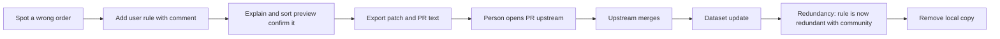

# Community datasets

This document specifies how RimStudio obtains, stores, shows, merges, edits and contributes back the community datasets that sorting and warnings depend on (requirement R6): the datasets panel, first-run defaults and the refresh schedule, how each of the five datasets feeds each feature, tolerant parsing with round-trip preservation, failure states, the user rules editor with local overrides, import of RimSort user rules, export of user rules as a pull-request-ready patch, the contribution loop, privacy, settings keys and acceptance tests. The rule graph, sorting and validation that consume the data are specified in [load order and validation](load-order-and-validation.md); the manager screens are in the [mod manager specification](mod-manager.md). Evidence is in [community datasets analysis](../research/community-datasets-analysis.md) and [rules fetch and merge design](../research/rules-fetch-and-merge-design.md). RimSort, RimCrow and the datasets are described in our own words; no dataset content is bundled, mirrored or committed (R11, invariants I-06 and I-07).

Status: draft | Last updated: 2026-10-04

## Contents

1. [Purpose and boundaries](#1-purpose-and-boundaries)
2. [Dataset catalogue and feature feed](#2-dataset-catalogue-and-feature-feed)
3. [Datasets panel](#3-datasets-panel)
4. [First run defaults and schedule](#4-first-run-defaults-and-schedule)
5. [Parsing and round trip](#5-parsing-and-round-trip)
6. [Failure states](#6-failure-states)
7. [User rules editor and local overrides](#7-user-rules-editor-and-local-overrides)
8. [Import from RimSort](#8-import-from-rimsort)
9. [Export and the contribution loop](#9-export-and-the-contribution-loop)
10. [Privacy](#10-privacy)
11. [Settings keys](#11-settings-keys)
12. [Acceptance tests and fixtures](#12-acceptance-tests-and-fixtures)
13. [Owner decisions and open points](#13-owner-decisions-and-open-points)

## 1. Purpose and boundaries

The manager must be as informed as RimSort without any manual database setup, and it must never depend on the network to work. Datasets are therefore treated as optional, replaceable, fetched-at-runtime inputs: the app starts and sorts from About.xml rules alone when they are absent, and a bad download never replaces a good copy.

Scope boundaries:

1. The fetch pipeline (`RemoteDataset`: conditional GET, caps, temp then rotate, quarantine, last good kept; D-032) lives in `rimstudio-datasets`, the only crate with an HTTP client. This document specifies its observable behaviour and settings, not its internals; those are in the research note.
2. Rules formats and the layered graph live in `rimstudio-rules`; sorting in `rimstudio-sort`; diagnostics in `rimstudio-validate`.
3. Datasets live in the cache root and are always deletable. User rules, suppressions and ignore entries are user data in the data root and are never touched by a cache clear (I-17).
4. All app-owned files are JSON, JSONC or gzip of JSON (R10). The one XML dataset (No Version Warning) is read through `rimstudio-xml` and stored as a JSON id list.

Requirement format: ids `CD-nnn`, with milestone tags (MVP, v1, later) and acceptance criteria (AC).

## 2. Dataset catalogue and feature feed

#### CD-001 Five built-in dataset descriptors (MVP)

Built-in descriptors ship in the binary as JSON (where to fetch, never the data itself). Counts and sizes were measured on 2026-10-04.

| Id | Content | Format on the wire | Entries | Version field | Licence in the repository | Handling |
|---|---|---|---|---|---|---|
| `community-rules` | Extra load order rules, tier flags and incompatibilities for mods whose authors did not declare them | JSON `{timestamp, rules}`, 395 KB, gzip 49 KB | 631 subjects, 1,568 edges | `timestamp` (epoch) | None found | Runtime fetch only; never bundled or mirrored |
| `steamdb` | Workshop id keyed names, authors, package ids, game versions and dependencies for 57,679 items | JSON `{version, database}`, 49 MB, gzip 3.5 MB | 57,679 | `version` (epoch) | None found | Runtime fetch only; stored compressed; slim index built locally |
| `use-this-instead` | Outdated mod to maintained replacement | gzip file holding JSON `{version, rules}` with a BOM, 185 KB | 2,718 | `version` (ISO 8601) | MIT (Mlie, 2020) | Runtime fetch; a dated seed with attribution is allowed later (D-035) |
| `no-version-warning` | Package ids for which the version mismatch warning is hidden | XML `ModIdsToFix.xml` per game version folder, 22.7 KB for 1.6 | 318 ids for 1.6 | none (use content hash) | MIT (Mlie, 2020) | Runtime fetch; XML read at the boundary, stored as JSON |
| `game-versions` | Game version label to depot lookup | JSON, 143 KB | 587 records | none | None found | Runtime fetch only; low priority |

Official sources are the raw file URLs of the corresponding GitHub repositories (listed in the [catalogue](../research/community-datasets-analysis.md), section 1 and the descriptors in [rules fetch](../research/rules-fetch-and-merge-design.md), section 2.1); jsDelivr is a second source for the datasets under 20 MB. The `steamdb` dataset has no mirror (the CDN refuses files over 20 MB). The `no-version-warning` source is parameterised by the running game's major.minor (a folder name such as `1.6`); if that folder does not exist the fetcher tries the next lower minor down to the oldest known (unverified for versions newer than the repository's folders). Adjacent datasets (the Multiplayer Compatibility table) are not part of R6 and are a later addition through the same descriptor mechanism.

AC: removing a descriptor from the built-in list removes it from the panel and from every feature; adding a dataset is a descriptor plus a codec, with no change to the panel code.

#### CD-002 How each dataset feeds each feature (MVP, community in v1)

| Feature | community-rules | steamdb | use-this-instead | no-version-warning | game-versions |
|---|---|---|---|---|---|
| Sorting rules | `community` layer: loadAfter and loadBefore edges, load-top and load-bottom tier flags (v1) | none | none | none | none |
| Incompatibility warnings | `incompatibleWith` edges, both directions, reported with layer `community` | none | none | none | none |
| Missing dependency links | none | For an unmet dependency: name, author and Workshop page of the providing item when About.xml gives only an id; dependency lists of items that are not installed; workshop id to package id mapping | A replacement can satisfy a dependency (LO-019); the alternative is named in the missing-dependency panel | none | none |
| Replacement hints | none | Name and author of the replacement for display | `list.replacement-available`, matched by workshop id first (a package id match is a labelled hint only) | none | none |
| Version warnings | none | `gameVersions` as a hint for items that are not installed; never overrides About.xml for an installed mod | none | Ids for which `list.version-mismatch` is hidden | Version label lookup only; the game version always comes from `Version.txt` |
| Detail panel | Rules touching the mod with sources and comments | Workshop name, authors, "unpublished" badge for items removed from the Workshop | Replacement block | "Version warning hidden by the community list" note | none |
| Explain | Sources and comments in chains (LO-023) | none | none | none | none |

Lookup keys: package id lowercased, workshop id as a string (64-bit ids cross the IPC as strings). Placeholder package ids that SteamDB uses for scenarios and broken items (`scenario.rsc`, `missing.packageid`, `invalid.item`) are excluded from the package id map. Package id lookups against SteamDB are case-insensitive because 80 percent of the matching ids in the owner's library differ in case.

Replacement matching is deliberately asymmetric. In the owner's library 53 mods match some `oldPackageId` but only 22 match by `oldWorkshopId`, because "(Continued)" reuploads keep the old package id; therefore the workshop id decides, and a package id match alone is shown only as "may be replaced" in the detail panel and creates no diagnostic.

AC: a fixture mod whose folder name is the old workshop id of a rule produces `list.replacement-available`; a fixture mod that only shares the old package id produces the hint in the detail panel and no diagnostic; with the dataset disabled neither appears.

## 3. Datasets panel

#### CD-003 The panel (MVP)

The panel is the Data sources section of Settings ([mod manager](mod-manager.md), MM-039) and a compact status popover opened from the datasets chip in the top bar. It is driven by the `datasets_status` query and the `datasets_subscribe` stream (revisioned items), so it updates while a refresh runs.

| Column or element | Content |
|---|---|
| Name and purpose | One line each, from the descriptor |
| Status chip | `never-fetched`, `ready`, `stale`, `updating`, `rejected` (badge beside the last good copy), `offline`, `failed`, `disabled`; a status never hides the last good copy |
| Entries | Entry count of the current copy |
| Source | Active source (official, mirror, archive, local, none) and its version value (epoch, ISO or content hash) |
| Last checked | When the last request completed (including a 304) |
| Last changed | When the content last differed |
| Row actions | Refresh now, View changelog, Change source, Enable switch, Open cache folder, Revert to previous |
| Licence note | "No licence file found upstream: fetched on your machine only" for `community-rules`, `steamdb` and `game-versions`; "MIT, credit: Mlie" for `use-this-instead` and `no-version-warning`; each with a link to the source repository |
| Global | Offline mode switch, automatic updates, apply or notify, skip large downloads on metered links, proxy and TLS roots |
| Request list | The list of requests made (see CD-020) |

AC: the panel renders every status with a plain sentence and the next action; a refresh in progress shows bytes and source; the panel works with every dataset disabled and with no network.

#### CD-004 Computed changelog (v1)

"View changelog" compares the current copy with `previous` at the model level and shows counts and an expandable list. It is computed on demand by a job, never stored.

| Dataset | Added, removed, changed means |
|---|---|
| `community-rules` | Subjects added or removed; edges keyed by (subject, kind, target) added, removed or changed (comment or name only changes count as changed); tier flags |
| `steamdb` | Workshop ids added or removed; changed package id, game versions or dependency set; counts first, a bounded list second (the diff uses the slim indexes of both copies; the previous index is kept until the next rotation) |
| `use-this-instead` | Rules keyed by old workshop id added, removed or pointing to a different replacement |
| `no-version-warning` | Ids added or removed |
| `game-versions` | Version records added |

The changelog adds a line "N changes affect your library" computed against the installed and active sets (for example, rules whose both ends are installed), which is the number a person cares about. Commit subjects from the repository's per-file Atom feed are shown when available and fetched only when the changelog is opened (one conditional request); they are not stored. After an update, `Revert to previous` swaps the two copies and rebuilds the index.

AC: updating from a synthetic previous copy to a synthetic current copy shows the exact added, removed and changed counts of the fixture; the affecting-your-library line equals a hand count on the fixture library; revert restores the previous behaviour in the same session.

#### CD-005 Source selection and validation (v1)

Each dataset's sources are tried in priority order. A person can reorder, disable or add a source in the source editor.

| Source type | Behaviour | Status |
|---|---|---|
| `official` | Raw file URL with gzip and conditional requests | MVP |
| `mirror` | CDN URL, subject to the size limit of the descriptor | MVP for the small datasets |
| `archive` | A repository archive URL over HTTPS (RimSort's own default form); only the named member is read into the temporary file, with member count, size, ratio, path and symlink checks; nothing is extracted | v1 |
| `local` | A file chosen by the person (JSON, gzip or the dataset's own format); re-read on refresh; for offline machines and for testing data | MVP |
| `none` | The dataset is switched off at the source level | MVP |
| `git` | A clone of the repository | Later; needs a git binary or library and is useful mainly for contribution workflows |

A Validate button runs a dry-run fetch and sanity check without replacing the current copy and reports what it would do (entry count, version, rejection reason). Only HTTPS URLs are accepted (plus `http://127.0.0.1` in tests); TLS verification cannot be disabled.

AC: validating a source that returns a collapsed file reports the rejection and leaves the current copy untouched; a local file source loads without any network permission.

#### CD-006 Manual refresh, toggles and offline mode (MVP)

1. Refresh now ignores `nextCheckAfter` but still sends a conditional request; if the last completed check is under 300 seconds old the UI says "checked N minutes ago" and offers Force, because the upstream edge cache has a 300 second freshness window and a faster poll cannot see newer data.
2. The Enable switch disables a dataset's use and its network traffic; its copy stays on disk and the dependent features degrade as in the table of CD-002.
3. Offline mode is a manual switch. It also holds when a connection attempt fails: no dialogs, status `stale` after the due time, "last checked" and "last changed" stay visible. Probing for connectivity is a real dataset request, never a ping.
4. A first run with no network and no cache starts with no community data: sorting uses About.xml rules, one non-modal hint offers "Load from file", and no error dialog appears.

AC: with offline mode on, a trace of the process shows no outgoing connection; starting with an empty cache and no network reaches the library view with no dialog.

## 4. First run defaults and schedule

#### CD-007 First-run defaults (MVP)

No manual per-dataset setup is needed. The first-run wizard ([mod manager](mod-manager.md), MM-001) shows one line, "Download community sorting data from GitHub when needed. No information about you or your mods is sent", with a visible Off choice (offline mode). If the wizard is skipped the defaults apply.

| Dataset | Enabled | Refresh every | Notes |
|---|---|---|---|
| `community-rules` | Yes | 24 h | First fetch after the first window paint |
| `use-this-instead` | Yes | 24 h | Median upstream gap about 1.2 days |
| `no-version-warning` | Yes | 72 h | Median upstream gap about 7.3 days |
| `steamdb` | Yes | 24 h (a 304 costs one small request) | Fetched last; skipped on metered links with a "refresh anyway" button |
| `game-versions` | Yes | 168 h | No v1 feature depends on it |

Apply policy default is `apply` (`datasets.applyPolicy`); `notify` only checks for a newer version (conditional request and, when available, the Atom feed subjects) and shows "update available"; Apply then runs the full download. `datasets.autoUpdate` defaults to true.

AC: a fresh profile with network reaches `ready` for all five datasets without any dialog and without delaying the first list render; none of the fetches blocks startup.

#### CD-008 Schedule and bandwidth (MVP)

1. A refresh runs when the dataset is enabled, offline mode is off and `nextCheckAfter` has passed. Triggers: start (after the first paint, if due), a timer every 6 hours that checks which datasets are due, a change of sources, and a manual request.
2. At most 2 downloads run at once; `steamdb` runs last.
3. A download uses connect timeout 10 s, idle timeout 30 s, total deadline 60 s below 5 MB and 300 s above, up to 3 attempts per source with delays 1, 4 and 16 s with jitter, honouring `Retry-After`, then the next source. After consecutive failures `nextCheckAfter` becomes min(24 h times 2 to the N, 7 days).
4. Each refresh appends one line to a JSON lines refresh log (dataset, outcome, bytes, duration, source), capped at 200 lines.
5. The refresh never rebuilds or reorders the working list; changes to the rule graph arrive as new diagnostics deltas and, if an unsaved list is open, nothing about it changes except the diagnostics.

AC: a unit test with a fake clock verifies the schedule (due, not due, backoff); a refresh that completes while the person drags a mod does not reorder the list.

## 5. Parsing and round trip

#### CD-009 Tolerant, lossless parsing (MVP)

Rules for every codec in `rimstudio-datasets` and for the rules model in `rimstudio-rules`:

1. Unknown keys at every nesting level are preserved, and key order is preserved (the serde model keeps an `extra` map and an order-preserving map). A synthetic file formatted like the upstream file round trips byte for byte after one normalised pass (4-space indent, ASCII escapes for non-ASCII, trailing newline).
2. A record that cannot be understood is kept as raw JSON, flagged `dataset.record-skipped`, and never fails the dataset. More than 1 percent unparseable records rejects the download (CD-012).
3. Accepted shape variants, each covered by a test: `name` and `comment` as string or list of strings; `oldPackageId` as string, integer or null; `gameVersions` entries as string or null; `dependencies` as a list or an object with name and url; both `packageId` and `packageid` keys in one SteamDB object (6 exist today); a UTF-8 BOM; no `comment`.
4. `incompatibleWith` is modelled and never dropped. (RimSort's typed model silently loses all 5 edges and can lose existing targets on save; RimStudio must not copy it.)
5. Package ids are lowercased only in lookup indexes. Display and write-back keep the original spelling (2 mixed-case subject keys exist; lowercasing is lossless today because there are no collisions, but the format does not guarantee that).
6. The version value is read per dataset: epoch for `community-rules` and `steamdb`, ISO string for `use-this-instead`, none for the others. A version older than the stored one rejects the download unless forced.
7. The No Version Warning XML is parsed through `rimstudio-xml` in tolerant mode (comments, BOM) and stored as a JSON list of lowercase ids; the XML is not kept.

AC: round trip of the synthetic community file with unknown keys is byte identical after normalisation; every shape variant loads with at most a warning; a file with one odd record loads with that record flagged and the rest usable.

#### CD-010 Slim SteamDB index and lazy detail (MVP)

The raw SteamDB is stored compressed (`current.json.gz`). On each content hash a background job builds a slim JSON index: lowercase package id to workshop ids, and workshop id to `{p, n, a, g, d, u}` (package id, name, authors, game versions, dependency workshop ids, unpublished flag), excluding placeholder ids. The measured prototype was 3.67 MB, parsed in about 25 ms using 18 MB, against 84 to 101 ms and 92 MB for a typed skip-parse of the full file; the rebuild budget is 100 ms and 100 MB transient, off the UI thread. Details the index omits (tags, URL, Steam name, half of the bytes) are read on demand from the compressed file by a typed skip-parse (about 0.1 s, rare). The 49 MB document is never held in memory. JSON alone meets the budget, so there is no binary cache (D-022). The community rules index holds two maps, subject to edges and target to subjects (for "who refers to this mod"). Index file names carry the index schema number and the content hash; a mismatch triggers a rebuild, never a failed load.

AC: a synthetic SteamDB of the measured shape builds its slim index within the budget on the reference machine (soft assertion in a benchmark); every lookup on the slim index equals the lookup on the full parse.

## 6. Failure states

#### CD-011 Failure handling (MVP)

The invariant is that the current copy is always complete and usable. Failure states are shown in the panel; none blocks use of the last good copy.

| State | Cause | Behaviour | Panel message and action |
|---|---|---|---|
| Offline | No connection, offline mode | Skip network silently; status `stale` after due time | "Last checked 3 days ago" plus Refresh now |
| Source failure | Timeout, 5xx, 429, connect error | Retries with backoff, then next source; `lastError` recorded; copy stays `ready` | "Could not reach official source; tried mirror" plus Retry |
| Quarantined download | Failed sanity check or parse (wrong root shape, invalid JSON, invalid UTF-8, ratio or size cap exceeded, a version older than stored) | Kept in `quarantine/` with a reason file (cap 3), never retried until the upstream bytes change, current copy unchanged, status badge `rejected` | "Update rejected: reason. Kept the last good copy." plus Inspect and Force accept |
| Collapsed entry count | Fewer than 70 percent of the previous count, or below the absolute floor (100 subjects for rules, 5,000 for SteamDB, 500 for replacements, 20 ids, 50 version records), or size below 50 percent or above 300 percent of the previous file | Treated as a rejected download | "Update rejected: entries dropped from 631 to 12. Kept the last good copy." |
| Newer format | Root shape outside RimStudio's `schemaSupport` range | Rejected; unknown extra fields inside a known shape are kept and shown in a debug view | "This data uses a newer format: update RimStudio" |
| Partial parse | A few unparseable records | Dataset accepted, records kept raw | "3 records skipped" (info) |
| Index build failure | Post-swap check or index build fails | Roll back to `previous` | "Rolled back to the previous copy" |
| Disk or write failure | Full disk, permission | Temp file removed, current untouched | "Could not save the update (disk full)" |
| TLS or proxy failure | Certificate or proxy problem | Fail with a plain message; no insecure switch exists | "Connection blocked: check proxy or certificate roots" with a link to network settings |
| Unchanged | New ETag but identical content hash | Counted as unchanged | none |

Dataset problems are `dataset.*` diagnostics shown in the panel and the footer, not on mod rows: `dataset.stale` (Info), `dataset.rejected` (Warning, with a reason code `invalid`, `collapsed`, `older`, `too-large`, `newer-format`), `dataset.fetch-failed` (Warning), `dataset.record-skipped` (Info), `dataset.index-failed` (Warning). These codes are proposed additions to the code registry.

AC: killing the process at each step of the rotate (property test over crash points) leaves `current` as the complete old or new file; each failure fixture produces exactly its state and message and leaves the previous behaviour of the app unchanged.

#### CD-012 Licence note and attribution (MVP)

Each dataset row carries its source repository and licence status (CD-003). The About dialog credits the sources. The compact mirror hosted by RimStudio stays disabled: the maintainers of `community-rules` and `steamdb` have not granted a licence, and a request to them for a licence and permission to host a compact copy is an owner action (D-034, section 13). Even when allowed, a mirror would be one more source type with its own format name; the raw source stays as fallback and integrity cross-check.

AC: no file under the repository contains dataset content (xtask `check-licences` and the layout check); the licence text in the panel matches the table of CD-001.

## 7. User rules editor and local overrides

#### CD-013 User rules store (MVP for the file, editor v1)

User rules are the user layer of the rule graph. They are stored as `userdata/rules/user-rules.json` in the community format `{timestamp, rules}` (identical to RimSort's `userRules.json`), read and written through the lossless model of CD-009, atomically with backups (last 10 plus one daily backup for 14 days; [data and persistence](../architecture/data-and-persistence.md), section 8). Formatting follows the upstream style so the file is interchangeable. `timestamp` is rewritten only when a rule changes. The community format has no comments, so the file is JSON rather than JSONC; this replaces the JSONC wording of MM-045 (section 13). Suppressions are not part of this file (CD-015).

AC: loading and saving without edits leaves the file byte identical after normalisation; unknown keys survive a save; a save with an edit changes only the affected subject.

#### CD-014 The editor (v1)

A table editor over mods: per mod, rows for Load after, Load before, Incompatible with, Load first and Load last, each with its layer and comment. A toggle shows community and About.xml rules read-only for context (greyed, with source and dataset version). Behaviour:

1. Adding an edge picks the target from installed mods (name search) or by package id; `name` (the display name of the target, required by the format) is filled from the installed mod or SteamDB, else from the id.
2. Validation before accept: package id well formed and lowercase in the key; no self edge; no duplicate of an existing edge in any layer (the editor offers "already declared by About.xml" instead); no conflict with a hard edge (rejected with the force flag shown, LO-003); no cycle against the merged graph (rejected with the cycle shown, with its edges and layers, [mod manager](mod-manager.md), MM-045).
3. A comment is optional locally and required for export (CD-017).
4. Adding or changing a rule re-sorts the preview and changes diagnostics of the affected rows only, in the same revision.
5. Edits are undoable inside the editor session; each save is one atomic write.
6. The ignore list editor (muted diagnostics) lives beside it (LO-021).

AC: adding a rule changes only the diagnostics of the two mods; a rule that would create a cycle is rejected and the cycle is displayed; unknown keys in an edited subject survive.

#### CD-015 Local overrides: add and suppress (v1)

Add is the user layer. Suppress cancels an upstream or About.xml soft edge without editing the shared data, which neither RimSort nor the community format can do. A suppression is a record in `userdata/rules/suppressions.json`: `{ subject, kind, target, layer?, reason, since }` ([load order and validation](load-order-and-validation.md), LO-007). Two scopes: one edge, or all community rules about one mod (subject with `kind` and `target` set to a wildcard), which replaces RimSort-style per-mod exclusion lists. Entry points: the explain chain (an "Ignore this rule" action on a step), the rule editor read-only rows, and the diagnostic popover. A suppression requires a reason (one line, defaulting to a prompt) so that months later the person knows why. Suppressed edges appear in the sort preview, in `explain` results and in a "Suppressed rules" list with Restore. Hard edges cannot be suppressed.

AC: suppressing a community edge removes its effect on sorting and diagnostics, shows it under suppressed rules with its reason, and restoring it brings it back; a wildcard suppression covers every community edge of that subject and nothing else.

#### CD-016 Redundancy detection after updates (v1)

After every dataset update and every scan a background job classifies each user rule and suppression:

| Class | Meaning | Offered action |
|---|---|---|
| Active | Orders mods that are installed and active, nobody else says so | Keep |
| Redundant with About.xml | The mod now declares the same edge (a mod author fixed it) | Remove local copy; the explain panel notes "the mod now declares this" |
| Redundant with community | Upstream added the same edge (for example after a contributed patch) | Remove local copy |
| Contradicted | A higher layer asks the opposite order | Edit, remove or suppress the other |
| Dormant | The target or subject is not installed | Keep, shown greyed |
| Obsolete suppression | The suppressed edge no longer exists upstream | Remove suppression |

The same classification applied to community rules against About.xml lists upstream rules that mods have since absorbed (in the owner's library 34 of 90 active-pair community constraints are already implied by About.xml); this is shown as an informational count, since removing upstream rules is not the manager's job, and feeds the contribution loop (CD-019). Nothing is ever deleted automatically; bulk "Remove redundant" is one undoable action.

AC: fixtures for each class classify as expected; an edge declared in a synthetic About.xml turns a user rule redundant; an upstream update that adds the user's edge flags it redundant with community.

## 8. Import from RimSort

#### CD-017 Import (MVP for rules and lists, v1 for notes and colours)

An Import from RimSort wizard (Settings, Migration; command `rules_import_rimsort`, a job) never writes into RimSort's directory. Procedure:

1. Locate candidate RimSort data directories: the platform data directory named `RimSort` (Linux `~/.local/share/RimSort` verified; the macOS and Windows locations `~/Library/Application Support/RimSort` and `%LOCALAPPDATA%\RimSort` are unverified), an environment override used by RimSort for development, and a Choose folder fallback.
2. Show a checklist with counts and let the person untick parts.
3. Read:

| Item | Where in the RimSort directory | RimStudio target | Notes |
|---|---|---|---|
| User rules | `dbs/userRules.json` | `userdata/rules/user-rules.json` | Lossless: unknown keys and order kept; merged by (subject, kind, target) |
| Ignore list | `dbs/ignore.json` | `userdata/ignore.json` | Package ids become per-mod ignore entries for all ignorable codes |
| Saved lists | `modlists/*.xml` | list JSON files | XML read through the boundary crate; the list's game version recorded |
| Notes, colours, tags, ignore flags | `instances/<name>/aux_metadata.db` | mod metadata | Needs the read-only SQLite feature `aux-db`; unavailable with a one-line explanation while the feature is off (accepted, D-031 and D-083) |
| Dataset source choices | `settings.json` | descriptor overrides in `workspace.jsonc` | A URL becomes an official source, a repository becomes an archive or later git source |
| Instance paths | `settings.json` | detection hints | Hints only; detection still validates them |

4. Rows keyed by folder path (notes, colours) are mapped to RimStudio identities by looking the folder up in RimStudio's own scan, or by `published_file_id` to a workshop id. Rows that cannot be mapped are listed as unmatched in the report and kept as unmatched entries, never dropped.
5. Imported rules that contradict a higher layer are imported anyway (the import is lossless) and flagged by the redundancy classes of CD-016.
6. The import writes an import report (JSON): imported, merged and skipped counts per item with reasons, and the unmatched rows.
7. The import is idempotent: running it again updates existing records by their keys and creates no duplicates. An edge that exists with a different comment keeps the RimStudio comment and is counted as merged.

RimSort's cloned dataset directories are the person's own copies; RimStudio does not read them in v1 because a normal refresh makes seeding unnecessary.

AC: a synthetic RimSort directory (settings, user rules with unknown keys, an ignore list, two list files, a small SQLite file) imports idempotently (second run changes nothing and reports zero imported); the wizard works with `aux-db` compiled out; unmatched rows appear in the report.

## 9. Export and the contribution loop

#### CD-018 Export as a pull-request-ready patch (v1)

"Export for community" takes the selected user rules and produces a patch against the exact cached upstream bytes, not a re-serialised file.

1. Selection: the person ticks user edges (and tier flags) to propose; each must pass validation: package ids lowercase and well formed, no self edge, a comment present, no cycle against the merged About.xml and community graph, no duplicate of an existing upstream edge (those are listed as redundant instead).
2. Patch the text surgically. A small span scanner in `rimstudio-rules` finds each top-level entry of `rules` by byte span; existing subjects are rewritten only where a selected edge changes them; new subjects are appended at the end of `rules` (the upstream key order is neither sorted nor case-folded, so appending is the least noisy). Entries use the upstream formatting (4-space indent, ASCII escapes, trailing newline; the file equals the standard pretty serialisation except for one stray whitespace line, which is preserved). Within an entry the keys follow the order of the format description: loadAfter, loadBefore, incompatibleWith, loadTop, loadBottom (unverified against every upstream entry). The `timestamp` is left unchanged by default, with an option to bump it because it is not known whether upstream automation rewrites it (section 13).
3. Round trip check before showing anything: parsing the patched text must give the upstream model plus exactly the proposed edits; otherwise the export fails with a diagnostic and nothing is offered.
4. Output: a unified diff with `a/communityRules.json` and `b/communityRules.json` paths (applies with `git apply`), a text version of the new entries, and PR text:

```text
Title: Add load order rules for <n> mods

Rules
- <subject> loadAfter <target>: <comment>
- <subject> loadBefore <target>: <comment>

Evidence
- <subject> About.xml: <excerpt or "declares nothing">
- Tested on RimWorld <Version.txt string>, dataset version <timestamp>
```

5. Actions: Copy patch, Save patch, Copy PR text, Open the repository page in the browser. RimStudio stores no GitHub credentials and uploads nothing (out of scope, R11 hygiene and privacy). The diff is always shown before any action.

Suppressions can be exported as issue text (subject, edge, reason, evidence), since the community format cannot express a removal.

AC: the patch applies with `git apply --check` semantics to the cached bytes; the patched file parses to upstream plus the edits; untouched entries are byte identical; selecting nothing disables export; a rule without a comment is refused with the reason.

#### CD-019 The contribution loop (v1)



The loop closes without the app contacting anyone: the person carries the patch. Related prompts: when a user rule is redundant with About.xml the explain panel suggests telling the mod author; when a cycle exists in the dataset alone (two exist today) the panel shows its edges so the maintainers can be told; cycles in the person's own About.xml set are shown the same way.

AC: a fixture walk-through (add, export, simulate upstream update with the same edge, classify) ends with the rule flagged redundant with community.

## 10. Privacy

#### CD-020 Requests contain nothing identifying (MVP)

1. The only network access of the dataset pipeline is HTTPS requests to the dataset sources (the raw file hosts, the CDN mirror, and a repository archive host when chosen) and, on demand, the per-file Atom feed.
2. A request carries: the fixed URL, `Accept-Encoding`, `If-None-Match` with the server-issued ETag, and a `User-Agent` of the form `RimStudio/<app version>`. No cookies, no referrer, no custom headers, no query strings, no identifiers, no mod list, no install path, no user name, no machine id. The only user-derived value is the game major.minor, which appears as a folder name in the No Version Warning URL (a value shared by every player of that version).
3. Redirects are followed at most 3 times and only to the allow list of the source hosts and the archive host.
4. No telemetry exists anywhere (D-060). Datasets are consumed locally: dependency, replacement and version lookups are computed on the machine; opening a Workshop page is a browser action taken only on click.
5. The host necessarily sees the IP address, as for any download; offline mode removes this.
6. The settings Privacy page lists every request the app makes (from the refresh log, with dataset, URL, time, status and bytes) and states that there are no others; the list is also available from the CLI.

AC: a test with a recording transport asserts the exact header set and URL of each request and fails on any extra header or query; with offline mode no request is made; a redirect to a host outside the allow list is refused.

## 11. Settings keys

The `datasets.*` keys live in `workspace.jsonc` (a portable install carries it) and `network.*` and `sorting.*` in `settings.jsonc`, as in the [settings specification](settings.md) (sections 4.1 and 4.2), which already defines `datasets.autoUpdate` and `datasets.items.<id>.{enabled, url, localFile, refreshHours}`; keys marked proposed are additions to be merged there. Only changed keys are written. Descriptor ids are kebab-case in code and files under the cache (`community-rules`); the settings use the camelCase item ids of the settings document (`communityRules`, `steamDb`, `useThisInstead`, `noVersionWarning`, `rimworldVersions`).

| Key | Type, default | Meaning |
|---|---|---|
| `datasets.autoUpdate` | bool, true | Check at start and on the 6 hour timer when due; false means manual refresh only (replaces the enum of the research proposal) |
| `datasets.offline` (proposed) | bool, false | Offline mode (CD-006) |
| `datasets.applyPolicy` (proposed) | `apply`, `notify`; `apply` | Apply updates or only notify |
| `datasets.skipLargeOnMetered` (proposed) | bool, true | Defer `steamDb` on metered links where the OS reports it (availability per OS unverified) |
| `datasets.items.<id>.enabled` | bool, true | Per-dataset switch |
| `datasets.items.<id>.url` | string or null, null | Source override (a mirror or fork); replaces the official source, the built-in mirror remains the failover |
| `datasets.items.<id>.localFile` | path or null, null | Local file source (CD-005) |
| `datasets.items.<id>.refreshHours` | int 1 to 720, per CD-007 | Refresh interval |
| `network.proxy` (proposed) | string or null, null | Explicit proxy; otherwise platform and environment settings |
| `network.tlsRoots` (proposed) | `platform`, `bundled`; `platform` | Certificate roots; no insecure option exists |
| `sorting.layerPriority`, `sorting.includeCommunityRules`, `sorting.includeUserRules` (proposed) | see [load order](load-order-and-validation.md), section 10 | Layers used by sort and validation |

The settings model offers one `url` override and one `localFile` per dataset; the built-in order (official, mirror) and the `archive` type of CD-005 are descriptor data, and the reorderable source list of CD-005 is limited to what these keys can express until the settings document is extended. The research proposal of a `communityRules.excludeMods` list is replaced by suppression records (CD-015).

Commands and events (names from the registry, [ipc and state](../architecture/ipc-and-state.md), section 11; the others are proposed rows):

| Command | Kind | Purpose | Status |
|---|---|---|---|
| `datasets_status` | query | Panel data | Row 32 |
| `datasets_subscribe` | stream | Revisioned status deltas | Row 33 |
| `datasets_refresh` | job | Refresh selected or all, optional force | Row 34 |
| `rules_import_rimsort` | job | CD-017 | Row 35 |
| `datasets_set_source`, `datasets_validate_source`, `datasets_set_enabled`, `datasets_revert` | action, query | CD-005, CD-006, CD-004 | Proposed |
| `datasets_changelog` | job | CD-004 | Proposed |
| `rules_user_get`, `rules_user_edit` | query, action | Editor, CD-014 | Proposed |
| `rules_suppress`, `rules_unsuppress` | action | CD-015 | Proposed |
| `rules_classify` | job | CD-016 | Proposed |
| `rules_export_patch` | job | CD-018 | Proposed |

## 12. Acceptance tests and fixtures

Fixtures are synthetic and use fictional ids. No upstream bytes of the unlicensed datasets are committed; recorded HTTP response headers (a few hundred bytes each) are test metadata, not dataset content. Generators reproduce the measured shape: the community rules file with 631 subjects, the 9 key combinations, 91 multi-name lists, 2 mixed-case keys and 2 two-cycles; the SteamDB with 57,679 entries at the measured field-presence ratios, 6 double-key entries and `[null]` game versions; a UTI sample with the string, integer and null `oldPackageId` forms and a BOM; an NVW sample with comments and uppercase ids. Real-data checks against the owner's library are `#[ignore]` tests selected by an environment variable.

| Id | Area | Test | Fixture |
|---|---|---|---|
| T-CD-01 | Round trip | Property test: any accepted JSON re-serialises to the same value; unknown keys and order survive; upstream-style file is byte identical after a no-op load and save | Synthetic rules file with unknown keys |
| T-CD-02 | Tolerance | Each odd shape of CD-009 loads with at most a warning; one odd record degrades to `dataset.record-skipped` | Shape fixtures |
| T-CD-03 | `incompatibleWith` | The 5-edge shape survives load and save and produces `list.incompatible` | Synthetic edges |
| T-CD-04 | Rejection | Wrong root, collapsed count (631 to 12), older version, ratio bomb, oversize body, invalid UTF-8: current untouched, quarantine written, message matches | Rejection fixtures |
| T-CD-05 | Conditional fetch | 200 then 304; ETag replayed with the stored encoding; weak versus strong tags; 429 with `Retry-After`; mid-stream disconnect; the first source failing over to the second | FakeTransport (in `rimstudio-testing`) and a local test server |
| T-CD-06 | Atomic replace | Crash at each rotate step: `current` is always old or new complete | Property test over crash points |
| T-CD-07 | Archive safety | Zip-slip names, symlink entries, nested bombs, too many members | Crafted archives |
| T-CD-08 | Slim index | Builds within the budget; every lookup equals the full parse; placeholder ids excluded | Synthetic SteamDB |
| T-CD-09 | Feed | Replacement by workshop id yes, by package id only a hint; dependency link for an uninstalled item; version warning hidden for an id in the NVW list | Fixture library |
| T-CD-10 | Changelog | Added, removed and changed counts and the affecting-your-library line equal the hand count | Two synthetic copies |
| T-CD-11 | Editor | Add, duplicate, hard-conflict and cycle rejection; unknown keys survive; undo in the session | Rule fixtures |
| T-CD-12 | Suppression | Edge and wildcard suppress, restore, hard edge refuses | Rule fixtures |
| T-CD-13 | Redundancy | Each class of CD-016 | About.xml, user and upstream fixtures |
| T-CD-14 | Import | Synthetic RimSort directory imports idempotently; unmatched rows reported; works without `aux-db` | Synthetic directory with a small SQLite file |
| T-CD-15 | Export | Patch applies with `git apply --check`; parses to upstream plus edits; untouched entries byte identical; rule without comment refused | Cached bytes of a synthetic file |
| T-CD-16 | Privacy | Header set and URL per request exact; no extra header or query; disallowed redirect refused; no request when offline | Recording transport |
| T-CD-17 | Offline | No network and no cache: app starts, rules layer empty, no dialog, hint offered | Empty cache |
| T-CD-18 | Startup | First list render is never delayed by a dataset task (timing with a transport that stalls) | Stalling transport |

Acceptance summary: AC1 a refresh never leaves a partial or collapsed file as current; AC2 unknown fields in user rules survive a RimStudio save; AC3 startup is never blocked by network work; AC4 `incompatibleWith` is never lost; AC5 a suppressed edge has no effect and is restorable; AC6 the exported patch changes only the intended entries and applies cleanly; AC7 requests contain nothing identifying; AC8 the repository contains no dataset content.

## 13. Owner decisions and open points

Owner decisions.

1. Licence requests: ask the maintainers of Community-Rules-Database and Steam-Workshop-Database for a licence and for permission to host a compact mirror (D-034). Until granted the mirror source stays disabled.
2. Whether a seed copy of the two MIT datasets (UTI, NVW) should ship in the installer with attribution (D-035). The proposal is no seed in v1: runtime fetch only.
3. Whether first-run downloads should wait for an explicit confirmation instead of the default-on line in the wizard (CD-007).

Conflicts and reconciliation with other documents.

1. MM-045 describes user rules as JSONC edited by CST; this document keeps `user-rules.json` as lossless JSON in the community format, as the architecture does, so comments cannot be kept in the file. Reconcile the mod manager text.
2. The research placed dataset policy under one `datasets` block and named the suppression sidecar `rule-overrides.jsonc`; the settings specification (`datasets.items.<id>` in `workspace.jsonc`) and the architecture (`userdata/rules/suppressions.json`) are used here. The settings document has one boolean `datasets.autoUpdate`; this document adds `offline`, `applyPolicy` and `skipLargeOnMetered`, and the source list is reduced as noted in section 11.

Open points.

1. Whether upstream automation validates pull requests or rewrites `timestamp`: decides the default of the timestamp bump option (research open questions 3 and 8; the workflow files were not read).
2. Whether the weak ETag of the gzip representation revalidates correctly on repeated requests (only the strong path was verified with a 304).
3. The meaning of the Multiplayer Compatibility status values, if that table is added later.
4. Metered connection APIs on the three operating systems; `skipLargeOnMetered` degrades to a manual choice where none exists.
5. RimSort data directories on macOS and Windows are unverified; the Choose folder fallback covers them.
6. Whether `rimworld_versions.json` earns a feature at all; it stays low priority.
