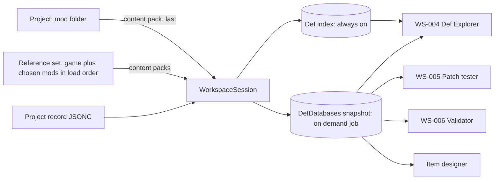

# Modding workspace: functional specification

This document specifies the foundation of the RimStudio modding toolkit (requirement R5, toolkit half, built under the modularity rule R2): the tool registry, the project model, the workspace that couples one mod project with a loaded reference set, and the fourteen foundation modules WS-001 to WS-014 that sit on top of them (scaffolder, About editor, LoadFolders manager, Def Explorer, patch tester, validator, log analyser, save inspector, dev launcher, staging, description helper, texture and translation tools, and the XML editing recommendation). The item designer (R7) and the Workshop publisher (R9) have their own specifications and appear here only where they touch the workspace. It is a product and contract specification, not a visual design: styling belongs to the later design prompt (R8). Evidence lives in the research notes and is linked inline; architecture documents under `docs/architecture/` are authoritative for crate names and invariants. RimSort, RimCrow and Combat Extended are described in our own words as concept references only (R11).

Status: draft | Last updated: 2026-10-04


Milestone numbering follows the [roadmap, section 1.1](../roadmap.md#11-mapping-to-the-milestone-names-in-the-register) (older mentions of M3 to M6 use the decision register's numbering).
## Contents

1. [Purpose and personas](#1-purpose-and-personas)
2. [Principles](#2-principles)
3. [The tool registry](#3-the-tool-registry)
4. [The project model](#4-the-project-model)
5. [The workspace](#5-the-workspace)
6. [Module conventions](#6-module-conventions)
7. [WS-001 Project scaffolder and templates](#7-ws-001-project-scaffolder-and-templates)
8. [WS-002 About.xml editor and linter](#8-ws-002-aboutxml-editor-and-linter)
9. [WS-003 Version-folder and LoadFolders manager](#9-ws-003-version-folder-and-loadfolders-manager)
10. [WS-004 Def Explorer](#10-ws-004-def-explorer)
11. [WS-005 Patch tester and simulator](#11-ws-005-patch-tester-and-simulator)
12. [WS-006 Validator](#12-ws-006-validator)
13. [WS-007 Log analyser](#13-ws-007-log-analyser)
14. [WS-008 Save inspector](#14-ws-008-save-inspector)
15. [WS-009 Dev launcher](#15-ws-009-dev-launcher)
16. [WS-010 Staging and build](#16-ws-010-staging-and-build)
17. [WS-011 Description and BBCode helper](#17-ws-011-description-and-bbcode-helper)
18. [WS-012 and WS-013 Texture and translation tools](#18-ws-012-and-ws-013-texture-and-translation-tools)
19. [WS-014 Schema-aware XML editing versus a language server](#19-ws-014-schema-aware-xml-editing-versus-a-language-server)
20. [Phasing](#20-phasing)
21. [Cross-module data contracts](#21-cross-module-data-contracts)
22. [Test plan and fixtures](#22-test-plan-and-fixtures)
23. [Owner decisions, conflicts and open points](#23-owner-decisions-conflicts-and-open-points)

## 1. Purpose and personas

The toolkit lets a modder see what the game will really do with their mod before launching the game. Its unique value is one shared def engine that serves both the manager and the tools, so that "resolved after patches, in your actual load order" is a query and not a game restart (see [ecosystem survey](../research/ecosystem-survey.md) section 6 and [modding toolkit scope](../research/modding-toolkit-scope.md) section 1). The manager stays first class and ships first; the toolkit plugs into it through the registry and reuses its scan results.

| Persona | Context | What the workspace must give them |
|---|---|---|
| The owner as modder | About 30 mods in folders on an external drive, several with hand-written Combat Extended (CE) patches, a VS Code based C# template, an earlier Go app with project create, open and settings | A project that points at any folder on any drive, correct 1.6 skeletons, a Def Explorer with patch provenance, a patch tester, safe test launches with their own mod list, a staging plan that never ships `.git`, `Raw Assets` or tool metadata (corpus: 83.5 percent of the bytes of the owner's own mod folders are build, source, VCS or layered art, see [workshop publishing research](../research/workshop-publishing-research.md) section 7.1) |
| A translator | Wants to start from a mod they did not write, find strings that lack a translation and produce language files | Open any mod folder as a read-mostly project, a missing-key view, language file output; no need for def authoring tools |
| A casual patch writer | Writes a small XML patch so that two mods work together, often by copying an example | A scaffold with a Patches folder and a LoadFolders gate, a patch tester that shows matched nodes and a diff, readable errors in plain words, no schema knowledge assumed |

Non-goals for this document: a general code editor, C# build tooling (the owner's template keeps that role, see WS-001), any hosted service, and any dynamic plugin system (D-066).

## 2. Principles

1. One def engine. No tool parses Defs XML itself. Tools ask `rimstudio-defs` through the workspace session and write through `rimstudio-xml` (I-02, [toolkit scope](../research/modding-toolkit-scope.md) implication 1).
2. Never write into shipped places by accident. Tool metadata lives outside the mod folder by default (D-063). The only tool-written files inside a mod folder are RimWorld's own files the user asked to create or change, and every such write is a reviewed write plan.
3. The user's mod folders are theirs. Existing RimWorld files are changed by byte-span edits so comments, formatting and unknown elements survive (D-013); new files are rendered from templates held as JSON node trees (R10).
4. Content problems are diagnostics, never errors (I-10). A broken mod is the normal input of a toolkit.
5. Long work is a job with progress and cancel (I-13). Anything over 1 ms of Rust work in a command is a job.
6. Reference data comes from the user's install at run time (R11, I-07). No vanilla, CE or community table is stored in the repository; test vectors use fictional numbers.
7. Deterministic output (I-12): the same inputs give byte-identical JSON at 1 and 8 threads.
8. Explain, do not guess. Every rule cites the game behaviour it mirrors, and custom patch operations that cannot be simulated are labelled "not simulated", never silently skipped.

## 3. The tool registry

### 3.1 Table and descriptors

The registry is a compile-time table (D-066, [toolkit scope](../research/modding-toolkit-scope.md) section 5.1): no dynamic plugins in the first release. It has two mirrored halves that `cargo xtask check-tools` compares by id.

| Half | Where | Content |
|---|---|---|
| Backend | `rimstudio-app::tools::TOOLS`, static `ToolDescriptor` values defined in `rimstudio-ipc-types` | id, title key, icon name, route, required capabilities, the command names the tool owns, milestone |
| Frontend | `apps/desktop/src/app/tools.ts` | the same ids with the lazy route component from `features/<name>/index.ts` and command palette entries |

Per D-005 there are no per-tool plugin crates. The three toolkit cargo features of `rimstudio-toolkit` group modules:

| Cargo feature | Modules | Tool ids shown in the shell |
|---|---|---|
| `tool-defs` | WS-004 Def Explorer, WS-005 patch tester, WS-006 validator (workspace side) | `defs`, `patch-tester`, `validator` |
| `tool-project` | WS-001, WS-002, WS-003, WS-008, WS-009, WS-011 and the project and log commands | `project`, `logs`, `saves` |
| `tool-designer` | item designer orchestration (own specification) | `designer` |

Publishing staging (WS-010) lives in `rimstudio-publish` (the layer rule forbids feature to feature edges, D-008), and its tool id is `workshop`. A tool whose module brings a heavy dependency becomes its own crate under the named trigger in [crate catalog](../architecture/crate-catalog.md) (the texture tool, WS-012).

### 3.2 Capability gating

A capability is a named precondition the shell evaluates from application state. A tool is listed in navigation only when its required capabilities hold; otherwise it is shown disabled with the reason and a link to the fix (settings, onboarding). The set below is illustrative and the final enum lives in `rimstudio-ipc-types::tools::Capability`.

| Capability | Holds when | Required by |
|---|---|---|
| `game-install` | Detection produced an accepted install with a readable Data folder and `Version.txt` | `defs`, `patch-tester`, `validator`, `designer`, `project` (dev launcher part) |
| `open-project` | A project is open in the workspace | `project`, `patch-tester` (project mode), `workshop`, `validator` (author mode) |
| `def-session` | A `WorkspaceSession` has a built def index for the current reference set | `defs`, `patch-tester`, `validator` |
| `ce-installed` | The reference set contains the CE package id `ceteam.combatextended` | CE lint and the optional CE patch part of `designer` (the designer itself always writes vanilla, D-085) |
| `steam-helper` | The sidecar binary is present and answers a hello | `workshop` only |
| `game-stopped` | No game process detected (D-041) | write parts of WS-009, ModsConfig writes |
| `log-file` | A `Player.log` path exists for the detected config folder | `logs` |

A missing capability never blocks the rest of the application: the app starts and every other tool opens with the Steam helper absent (research implication in the publishing note, test in section 22).

### 3.3 What a tool is allowed to touch

| Resource | Access for tools |
|---|---|
| Reference set and def snapshots | Read through `WorkspaceSession`; never rebuild privately |
| Project store | Read and write through `project::*`; JSONC changed only by CST edit |
| Mod folder files | Read freely; write only through an applied write plan (section 6.3) |
| Install and config folders | Only through the game-folder write fence (D-040): Prefs.xml and ModsConfig.xml with backup and running-game check |
| Network | None. Only `rimstudio-datasets` has an HTTP client |
| Process spawning | Only through the `Launcher` port |

## 4. The project model

### 4.1 Entities

| Entity | Definition | Stored where |
|---|---|---|
| Project | One mod folder the user authors or inspects. Identified by project id; has a mod root path, a target game version and RimWorld's own files inside the folder | The mod folder (RimWorld XML) plus the project record below |
| Project record | Tool-owned data: mod root path, target version, notes, compatibility settings and selected mods, reference set definition, upload ignore additions and removals, validator suppressions, publish history pointer, designer defaults and calibration answers (designer drafts live in the JSON document store, D-083), imported legacy fields | `projects/<id>.jsonc` in the data root by default (D-063) |
| Version folder | A top level directory of the mod named like a game version (`1.5`, `1.6`), plus `Common` and any folder named by `LoadFolders.xml` | The mod folder |
| Content pack | One mod's effective files under a load plan, in the form the def engine consumes | Derived |

### 4.2 Folder anatomy the toolkit understands

The toolkit models the folder as the game does ([mod format note](../research/rimworld-mod-format-and-corpus.md) sections 2 and 3).

| Path in the mod | Purpose | Tool |
|---|---|---|
| `About/About.xml`, `About/Preview.png`, `About/PublishedFileId.txt` | Metadata, preview, Workshop id | WS-002, WS-010 |
| `LoadFolders.xml` (any case on Windows, exact case matters on Linux and macOS) | Which folders load for which version and active mods | WS-003 |
| `<version>/Defs`, `<version>/Patches`, `<version>/Textures`, `<version>/Languages`, `<version>/Assemblies`, `<version>/Sounds` | Versioned content | WS-004 to WS-006, WS-013 |
| `Common/...` | Content shared by versions | WS-003 |
| `Source/`, `Raw Assets/`, `.git/`, `.vscode/` | Author material never meant for players | WS-010 ignores by default |
| `Defs/ThingDefs_Misc/Weapons`, `Defs/SoundDefs`, `Textures/Things/Item/Equipment/WeaponRanged`, `Compat/CombatExtended` | The names RimStudio uses for weapon files, sound definitions, weapon textures and the gated Combat Extended content, taken from the game's own data (mod layout v1) | [mod layout](mod-layout.md), WS-001 |

The layout commands built for 0.1.0 (`project_tree`, `project_layout_check`, `project_scaffold_missing`, `project_read_file`) and the recognition of a project's convention (RimStudio layout, the game's own category files, flat) are specified in [mod layout](mod-layout.md). They never move or delete an existing file.

### 4.3 Where the project record lives

The research compared three places ([toolkit scope](../research/modding-toolkit-scope.md) section 3.3). The architecture register fixed the result (D-063).

| Option | Verdict |
|---|---|
| A. Data root, `projects/<id>.jsonc`, mod path stored inside | Default. Never shipped. Survives only via explicit export |
| B. `.rimstudio/project.jsonc` at the mod root | Opt-in "portable project"; the default ignore rules always exclude `.rimstudio/`; the validator warns when it exists and the user is about to use the in-game uploader |
| C. Inside a shipped folder such as `Config/` | Rejected: the earlier Go app wrote `Config/rimstudio.project.json`, which ships to every subscriber |

The project id is the lowercased packageId from About.xml; if two folders share one, a short hash of the absolute path is appended. A project whose About.xml is missing gets the lowercased folder name until one exists. Moving a mod folder is handled by "relink": the record keeps its id and the user picks the new path.

### 4.4 Illustrative project record

The final schema is generated by `cargo xtask schemas` from the Rust types (D-027); this example only shows the intended content. The file is JSONC, edited only through CST edits so user comments survive.

```jsonc
{
  "schemaVersion": 1,
  "id": "example.mymod",
  "modPath": "/mnt/drive/mods/MyMod",
  "targetVersion": "1.6",
  "notes": "",
  // which mods the def engine loads besides the game
  "referenceSet": { "kind": "active-list", "extraModIds": [] },
  "compatibility": { "mode": "selected", "selectedModIds": ["ceteam.combatextended"] },
  "uploadIgnore": { "add": ["*.kra"], "remove": [] },
  "suppressions": [{ "code": "author.description-size-tag", "path": "About/About.xml" }],
  "legacy": { "importedFrom": "Config/rimstudio.project.json", "patchEntries": {} }
}
```

### 4.4a As built for 0.1.0 (project store, reference sets, sessions)

The backend of release 0.1.0 builds a part of this section; where it differs from the text above, the code is the truth for names and shapes and the owner decisions stay as written ([crate catalog](../architecture/crate-catalog.md) rimstudio-workspace, [ADR 0039](../adr/0039-project-records-type-table-and-dto-boundary-as-built.md), D-091).

1. The project record is a document of the collection `projects` in the data root (JSON envelope kind `project`, version 1), not a JSONC file: `ProjectRecord { id, path, name, package_id, created_ms, last_opened_ms, target_version, designer, extra }` with the last designer settings as an opaque value. The id is `p-<8 hex>` derived from the normalised folder path (core ids disallow dots), not the lowercased packageId; moving a folder gives a new id. Opening a project validates `About.xml` read only and registers or touches the record; an About without a usable packageId gets `rs.project.<folder>` and a warning so the folder can still be opened. The opt in `.rimstudio/project.jsonc` (option B), the compatibility, upload ignore and suppression members and the legacy import of section 4.5 are not built; the example record of section 4.4 is the plan for the later fields.
2. The reference set (`ReferenceSet::resolve`, `reference_for_designer`) always holds Core, every installed expansion (installed but not active still counts, which suits the designer) and then the non official ids of the chosen list in list order; official ids in the list are ignored because the game part covers them; which copy of a package id is used is decided by pins, then source (custom, game `Mods`, Workshop; official ids from `<install>/Data`). `with_project(root)` appends the project as the last pack. The diagnostic for the project also being in the list is `workspace.project-in-list` (the docs name it `author.project-in-list`, an authoring lint code of the later validator).
3. `WorkspaceSession::open` returns `WorkspaceResult` (the only error is cancellation; content problems are diagnostics), builds the type table from the managed assemblies and the mods' DLLs, parses every file once through a stat key cache (a second open parses zero files) and builds the def index from the same parsed trees (index type is the `Class` attribute when present, else the element name). `rebuild_changed(&mut self, paths)` re-parses only changed files; `is_stale()` compares stat keys and, for the project, the file list and About and `LoadFolders`; there is no file watcher, so the caller passes changed paths. Measured: Core plus 5 DLC cold in about 250 ms, a second session about 170 ms, a search about 0.4 ms, with Combat Extended about 780 ms; memory at 600 mods is not measured (S-08).
4. The Combat Extended conditional of the def engine is registered by the caller through `OpenInput::with_custom_ops`; the workspace crate does not know the class name.

### 4.5 One-time import of the earlier project file

The owner's earlier Go app stored `Config/rimstudio.project.json` in the mod folder ([toolkit scope](../research/modding-toolkit-scope.md) section 2). Its sample (the Gewehr 41 mod) holds `targetVersion`, `notes` and a `compatibility` object with `mode` (value `all`), `selectedModIds` and `patchEntries`.

1. When a project is opened or created and the old file exists, `project_import_legacy` reads it (JSON through `serde`, unknown keys kept) and shows the mapped fields for review.
2. Mapping: `targetVersion` to `targetVersion`; `notes` to `notes`; `compatibility.mode` to `compatibility.mode` (`all` or `selected`); `compatibility.selectedModIds` to `compatibility.selectedModIds`; `compatibility.patchEntries` is carried verbatim into `legacy.patchEntries` because the only sample is an empty object and its intended content is unknown (open question O-1).
3. After saving the record the user is offered "delete the old file" and, if it is inside a folder that ships, a validator warning (`author.shipped-tool-file`) stays until it is gone. Nothing is deleted without a click.
4. The import runs once per project; the record stores `legacy.importedFrom` so it is not offered again.

Acceptance: the Gewehr 41 sample imports to a record equal to a golden JSONC; opening the project again does not re-offer the import; the old file is untouched until the user confirms deletion.

## 5. The workspace

### 5.1 Definition

A workspace is an open project plus a loaded reference set plus one def session. It exists in memory as a `WorkspaceSession` in `rimstudio-workspace` and can be rebuilt from the project record, so closing the app loses nothing.



### 5.2 Reference sets

| Kind | Meaning | Source |
|---|---|---|
| `game-only` | Core and installed DLC in official order | Detection report (install Data folder) |
| `active-list` | The manager's current active list (default) | `LibrarySession` snapshot |
| `profile` | A named manager profile | Profiles store |
| `explicit` | A hand-picked list of mod ids (for example "game plus CE plus my dependencies") | Project record |

The project mod is always appended last as the final content pack, even if it is also in the list (its folder is the one on disk, never a link-farm copy). If the project's own packageId appears in the active list, the session uses the project folder and reports `author.project-in-list` as info. The reference set resolution uses the same pure `resolve_load_folders` and `collect_files` functions as the manager ([def engine semantics](../research/def-engine-semantics.md) Proposed API), so the manager and the tools cannot disagree about which files load.

### 5.3 Two-tier def data

Per D-019 (proposed, validated by spike S-08 on a 600-mod list):

| Tier | Built | Holds | Cost target |
|---|---|---|---|
| Def index | Always on when a session opens; streaming indexer in `rimstudio-xml` | defName, type, parent name, abstract flag, file, line, owning pack and folder, texture and def reference edges, cached per pack in the cache root | Warm start parses zero unchanged files |
| DefDatabases snapshot | Job on demand (`defs_open_session` with `resolve: true`, or first use of a resolved view) | Merged documents, patch results with provenance, inheritance-resolved defs, `DefDatabases` | Vanilla plus DLC under 1 s; CE load under 2 s ([def engine semantics](../research/def-engine-semantics.md) implication 5) |

Snapshots are immutable and swapped on rebuild; tools hold a snapshot id and the UI shows "stale" when a watched file changed after the snapshot (D-028: watch the active project recursively, reference mod folders only at their roots and metadata files). Edits to project files trigger an incremental re-index of the changed files and a debounced snapshot rebuild; a full rebuild is the fallback. The def type table that types mod-defined classes is generated at run time from the user's assemblies and cached by assembly hash (D-018, spike S-07); without it the explorer shows affected defs as "unknown type" with a visible warning rather than treating every `*Def` element as a def silently.

### 5.4 Session lifecycle commands

Commands follow the registry rules (`<area>_<verb>`, DTOs in `rimstudio-ipc-types`). Rows already planned in [IPC and state](../architecture/ipc-and-state.md) section 11 are marked R; others are proposed (P) and become rows when their milestone starts, with no edits to shell or CLI.

| Command | Kind | Status | Purpose |
|---|---|---|---|
| `project_create` | action | P | Scaffold from a template (WS-001) |
| `project_open` | action | P | Open a folder, create or load the record, return project summary |
| `project_close` | action | P | Release the session |
| `project_import_legacy` | action | P | Section 4.5 |
| `defs_open_session` | job | R | Build index and optional snapshot for reference set plus project |
| `defs_search` | query | R | Paged search with cached match list (`queryId`) |
| `defs_get_resolved` | query | R | Resolved def with provenance |
| `defs_find_references` | query | R | Edges into and out of a def or texture path |
| `session_events` | stream | P | `stale`, `snapshot-ready`, `diagnostics-changed` messages |

## 6. Module conventions

### 6.1 Specification fields

Every module section has the same fields: id, user story, inputs and outputs, UI sketch in words, backend crates and commands, acceptance criteria (numbered, testable), performance target (targets are derived from corpus sizes and are measured by `cargo xtask bench-budgets`, not yet measurements), milestone, risks.

### 6.2 Diagnostics

Producers emit `Diagnostic { code, severity, mod, file, message }` with codes `<area>.<kebab-name>` (D-046). Author rules use area `author`, def and patch rules `defs` and `xpath`, CE lint `ce`, log rules `log`. Each code has a stable one-line explanation, a "why" that cites the game behaviour, and an optional fix action. Users suppress a code per project path in the record (`suppressions`), which never deletes the finding from reports (it is marked suppressed). Codes named below are proposals for the code registry in `rimstudio-validate`; the defs engine's snake_case golden codes (for example `patch_failed`) map to `defs.*` by the documented rule.

### 6.3 Write plans

Any module that changes mod files returns a `WritePlan` first: a list of operations (create file from node tree, splice a byte span, rename, delete) with before and after text and a short reason. The UI shows a diff; `apply` writes through `rimstudio-io` with atomic temp-then-rename and keeps a one-step undo copy in the data root (`projects/<id>/undo/`, retention 20). A plan carries the content hash of every file it was computed against, and a changed file makes the plan stale (`project.plan-stale`) instead of overwriting. The game-folder fence is untouched by write plans because they only act under the mod root.

### 6.4 Shared UI parts

All modules use the same shell frame: a left list or tree, a main pane, a right detail pane, and a bottom diagnostics strip. Lists over 100 rows use `shared/lists`, editors use the lazy `shared/editor` wrapper, graphs use `shared/graph`. Every action is reachable from the command palette and has a keyboard path.

## 7. WS-001 Project scaffolder and templates

User story: "I start or open a mod and get a correct skeleton for 1.6 without copying a template by hand."

| Item | Specification |
|---|---|
| Inputs | Name, packageId (suggested from author and name, validated live), author, supported versions (default current game major.minor from `Version.txt`), options: Defs folder, Patches folder, Languages, Assemblies placeholder, optional CE patch folder `Compat/CombatExtended` gated by `IfModActive="ceteam.combatextended"` (off unless the user asks, D-085, D-105), C# starter link, target folder (any drive) |
| Outputs | A write plan creating the folder tree of the RimStudio mod layout v1 ([mod layout](mod-layout.md) section 9): `About/About.xml` (with a description placeholder when none is given), `Defs/ThingDefs_Misc/Weapons`, `Defs/SoundDefs`, `Patches`, the texture folders, `Sounds/Weapons`; `LoadFolders.xml` when more than one version or a gated folder is chosen; `Languages/English/Keyed`, `Assemblies`, `Source/Art`, `.gitignore`, `README.md` and `Credits.txt` only when asked; no placeholder files in empty folders unless the user opts in; a project record. `About/Preview.png` and `About/Manifest.xml` are never created silently |
| Templates | JSON node trees with typed parameters under the app's bundled resources (about, loadfolders, empty patch file, example def, languages stub). XML is produced only by `rimstudio-xml::render` (R10). User templates are JSONC files in the data root and shadow bundled ones by id |

UI sketch: a three step dialog (what, where, options) with a live tree preview on the right and a preview of About.xml text below it; a "Create" button that opens the project immediately. A checklist at the end offers: open About editor, open in the user's editor, create first def.

Backend: `rimstudio-workspace` scaffolder (templates, parameter binding), `rimstudio-xml` render, `rimstudio-io` write plan application. Commands: `project_templates_list` (P, query), `project_scaffold_plan` (P, query, returns write plan), `project_create` (P, action, applies it).

The owner's template at `/run/media/pawbeans/project_drive/pawbeans/Projects/RimWorld Mods/rimworld-mod-template` is still on `1.5` folders and keeps its build scaffolding in `.vscode/` ([ecosystem survey](../research/ecosystem-survey.md) section 4.7). The scaffolder keeps C# out of scope: the C# starter option copies a user-chosen template folder (default: that path if it exists, configurable in settings) into `Source/` and never regenerates it. A built-in minimal C# starter is a later option (owner decision D-5).

Acceptance criteria:

1. Every generated file passes WS-002 and WS-003 with zero findings of warning or higher.
2. The generated tree equals a golden tree (paths and rendered text) for each of five option combinations.
3. Creating into a non-empty folder never overwrites: conflicts appear in the plan and block apply until resolved.
4. packageId validation uses the game's format rule ([mod format note](../research/rimworld-mod-format-and-corpus.md) section 1.3) and rejects before creation.
5. Creating a project on an external drive path works with no write outside that folder and the data root.

Performance: plan under 50 ms, apply under 200 ms for the largest option set (target). Milestone: M3. Risks: templates drift with game versions, so they are data with a `gameVersions` field and a validator check that the default supported version is not behind the installed game; the C# toolchain differs per OS, which is why it is not generated.

## 8. WS-002 About.xml editor and linter

User story: "I fix dependency, version and id mistakes before upload."

| Item | Specification |
|---|---|
| Inputs | `About/About.xml` (parsed in Tolerant mode so a broken file still opens), the reference set (for dependency lookups), the current game version |
| Outputs | Form edits turned into byte-span edits of the existing file (`rimstudio-xml::codecs::about`, D-013), an issue list, quick fixes |

UI sketch: a form with sections (identity, versions, dependencies, ordering, incompatibilities, description) on the left, the raw XML text on the right with the edited span highlighted, and an issues strip. Dependency rows have a "pick from installed mods" control that fills packageId, display name and Workshop URL from the library. The description field shows a live length counter and a rendered preview (see WS-011).

The rule set comes from corpus evidence ([toolkit scope](../research/modding-toolkit-scope.md) section 2, [mod format note](../research/rimworld-mod-format-and-corpus.md) sections 1 and 7, parser checklist item 10):

| Code (proposed) | Finding | Severity | Basis in the corpus |
|---|---|---|---|
| `author.package-id-format` | packageId fails the game's format rule or is empty | error | The game blocks upload on a bad format |
| `author.package-id-case-conflict` | Same lowercased id as another known mod | warning | 6 duplicate groups, 1 case-only conflict |
| `author.package-id-steam-suffix` | id ends in a postfix such as `.steam` or `_steam` | warning | 1 mod |
| `author.supported-versions-missing-current` | The running major.minor is absent | warning | 8 mods claim 1.6 with no 1.6 content |
| `author.supported-versions-malformed` | Entry that does not parse (`v` prefix, extra parts) | error | Parser checklist item 4 |
| `author.version-folder-unlisted` | A version folder exists that is not in supportedVersions | warning | 16 mods |
| `author.dependency-malformed` | Dependency with empty or invalid packageId, no display name, or neither download nor Workshop URL | error | 49 mods (7.1 percent) have one; the game silently drops such entries |
| `author.dependency-unknown` | Dependency not found in any known source | info | Library lookup |
| `author.load-order-self-reference` | loadAfter or loadBefore names the mod itself or conflicts with a dependency | warning | Sort cycles |
| `author.description-size-tag` | Size tag inside description | info | 31 mods (4.5 percent) |
| `author.bom-or-leading-whitespace` | Leading whitespace before the XML declaration (the game rejects) or a byte order mark in a file where it matters | error or info | 32 percent of About files carry a BOM; leading whitespace is rejected by the game |
| `author.unknown-about-tag` | Tag the game does not read, or a string field containing child elements or comments (the game drops it) | warning | Parser checklist item 3 |
| `author.shipped-tool-file` | A tool metadata file inside a folder that will upload | warning | Section 4.3 |

Backend: `rimstudio-xml` About codec and byte-span edits, `rimstudio-validate` author lints (pure, no IO), `rimstudio-toolkit` project module. Commands: `project_about_read` (P, query, model plus diagnostics), `project_about_plan_edit` (P, query, returns write plan), diagnostics also appear through `diagnostics_for_mod` (R).

As built (0.1.0): the About editor is `project_about_get`, `project_about_preview` and `project_about_update` of `rimstudio_toolkit::project::about`, with `project_about_set_preview` and `project_about_remove_preview` for `About/Preview.png` and `library_mod_search` for the dependency picker. The form sends changes (set, clear, list and dependency operations), the backend returns the diff and the resulting model, and writes as byte span edits of the existing file through `rimstudio_xml::about_edit::AboutEditor`, with a backup in the data root, a read back and a refusal of a file that changed since the hash the form read. The rule set above is built as the stable codes `about.*` of [mod layout](mod-layout.md) section 15.3 (the proposed `author.*` names became these, and the lint lives in `rimstudio_toolkit::project::about_lint` instead of a `rimstudio-validate` crate); findings never block a save. Acceptance criteria 1, 3 and 4 hold as written (criterion 4: a file that is not well formed is shown with its text and `editable: false`); criterion 5 (quick fixes as write plans) is not built, a quick fix is an ordinary change the form sends. See [ADR 0052](../adr/0052-mod-basics-editing.md).

Acceptance criteria:

1. Round trip: an About.xml with comments and unusual indentation changed in one field differs from the original only in that field's span (byte comparison).
2. Every rule has a positive and a negative fixture, and the corpus summary counts (49, 31, 51, 16, 8) reproduce on the fixture set built to mirror them (real-corpus run is `#[ignore]`).
3. A file with a BOM, with CRLF endings or with tabs keeps them after an edit.
4. A file that is not well formed opens in read-only text mode with the parse error location and no form editing until fixed.
5. Quick fixes are write plans and are undoable.

Performance: lint on edit under 5 ms; form to plan under 10 ms (targets). Milestone: M3. Risks: rule accuracy (each rule cites decompiled behaviour in its explanation); silent drops differ per game version, so rules are data in the code registry with the game version they were verified against.

## 9. WS-003 Version-folder and LoadFolders manager

User story: "I support 1.5 and 1.6 without duplicating files, and I can see what each version really loads."

| Item | Specification |
|---|---|
| Inputs | The mod folder tree, `LoadFolders.xml` (any case), a game version, an active mod set (to evaluate `IfModActive` style conditions) |
| Outputs | A visual model of version folders and conditions, the effective file list per (version, mod set), edits to `LoadFolders.xml` as byte-span edits or a rendered new file, findings |

UI sketch: left, a tree of the mod folder with badges on version folders; centre, a list of LoadFolders blocks (one per version key) with their folder entries and condition chips; right, the "effective files" pane for the chosen version and a selectable active-mod simulation (checkboxes for "assume CE active"). Dragging a folder into a block or toggling a condition produces a diff of `LoadFolders.xml`. A banner explains the fallback when no LoadFolders file exists.

The semantics come from the game: block selection, "selected but all conditions fail loads nothing", the implicit fallback (exact major.minor directory, nearest lower, smallest newer, `Common`, root) and first-file-wins shadowing by relative path ([mod format note](../research/rimworld-mod-format-and-corpus.md) sections 2.1 to 2.3, parser checklist items 7 and 8). One pure function, `resolve_load_folders`, is shared by the manager, the Def Explorer and this module, tested against the 195 distinct structural variants of the corpus signatures.

| Code (proposed) | Finding | Severity | Corpus |
|---|---|---|---|
| `author.loadfolders-case` | Filename `loadFolders.xml` or a folder name whose case differs from the entry (breaks on Linux and macOS) | error | 51 mods (7.4 percent) |
| `author.loadfolders-missing-folder` | Entry names a folder that does not exist | error | Game blocks upload on issues |
| `author.loadfolders-unloaded-content` | A folder with Defs or Patches that no block loads | warning | CE note CEP018: 49 operations files in 12 workshop mods |
| `author.loadfolders-no-block-for-current` | No block for the running version and no fallback content | warning | 8 mods |
| `author.loadfolders-ce-gate` | CE classes in a file that loads without `ceteam.combatextended` active, or an id with a suffix such as `_copy` | error | CEP004, CEP019 |
| `author.case-collision` | Two names that differ only by case | warning | 3 mods |

Backend: `rimstudio-defs::resolve_load_folders` and `collect_files` (pure), `rimstudio-xml` LoadFolders codec, `rimstudio-toolkit` project module. Commands: `project_load_plan` (P, query, effective files for a version and mod set), `project_loadfolders_plan_edit` (P, query), `project_version_folders` (P, query).

As built (0.1.0): `project_load_folders_get` and `project_load_folders_update` read the blocks and entries by position and edit them as byte span edits (`rimstudio_xml::load_folders_edit::LoadFoldersEditor`), and `project_version_add` creates the folder of a game version, its standard sub folders and its block. The effective file list per version and mod set (`project_load_plan`) is not built. The findings are `loadfolders.*` ([mod layout](mod-layout.md) section 15.5): a missing folder, a block for a version `supportedVersions` does not list, a compatibility folder without its `IfModActive` condition, an attribute the game does not read, an empty block, a repeated block.

Acceptance criteria:

1. The effective file list for 30 fixture structures equals the golden output of the shared function and equals the manager's list for the same inputs.
2. Editing a condition changes only the target element's span.
3. Adding a new version (copy `1.5` to `1.6`, or make `1.6` a reference to `Common`) is a write plan with a file count and size preview; nothing is copied by default without confirmation.
4. Case problems are found on a case-insensitive filesystem by comparing the directory listing spelling, not by trying to open the path.

Performance: effective file list for a 22,000 file mod under 300 ms warm, I/O bound cold (target). Milestone: M3. Risks: implicit Common and version fallback must match the game; open question 2 of the def engine note (file ordering on Linux and macOS) is handled by documenting RimStudio's ordinal order and flagging when two files in one folder define the same def.

## 10. WS-004 Def Explorer

User story: "I look at any def and see its parents, its children, every file that defines or patches it, and the final resolved XML, in my real load order."

| Item | Specification |
|---|---|
| Inputs | Workspace session (index and snapshot) |
| Outputs | Views, "copy as XML", "open file at line" through the platform adapter, "copy as patch" starter (a Replace or Add operation skeleton for a chosen field) |

UI sketch: a search bar with filters (type, mod, load folder, abstract, patched or not, overridden) over a virtualised results list; selecting a row opens four tabs. Tab Tree: parents up the `ParentName` chain and children computed. Tab Provenance: the defining file and every patch operation that touched the def in order, with file and operation index; custom operations show their raw payload and the label "not simulated". Tab Resolved: the final XML after merge, patches and inheritance, with fields highlighted as changed against the previous layer; a layer slider steps through "as defined", "after patches", "after inheritance". Tab References: edges in and out (def references, textures). A "compare with" action diffs two defs or one def across two reference sets.

Backend: `rimstudio-defs` (provenance, three levels per D-017: def, patch event, element origin), `rimstudio-workspace` session, `rimstudio-toolkit` `defs` module. Commands: `defs_search` (R), `defs_get_resolved` (R), `defs_find_references` (R), `defs_get_provenance` (P, query), `defs_tree` (P, query, children and parents), `defs_compare` (P, query).

Acceptance criteria:

1. Opening the CE-patched assault rifle def of the reference load lists the five touching operations and the resolved XML, the case measured in [def engine semantics](../research/def-engine-semantics.md) section 9.3, using the real install in an `#[ignore]` test and a fictional equivalent in the normal suite.
2. The 12 CE overrides (9 type changes) of the real-data acceptance summary appear as "overridden" entries, shown as data and not as errors.
3. A def whose patch used a custom operation shows its raw parameters and the "not simulated" label.
4. Search over vanilla plus DLC (13,212 defs) answers in under 20 ms; a new text or filter creates a new `queryId`, stale pages are dropped.
5. Resolved view output is identical at 1 and 8 threads.
6. Opening the explorer on a 600-mod active list stays within the spike S-08 memory budget; if not, the snapshot is built per type on demand.

Performance: search under 20 ms (target, [toolkit scope](../research/modding-toolkit-scope.md) implication 12); resolved view for one def under 30 ms from a ready snapshot; snapshot build per section 5.3. Milestone: M3. Risks: patch edge cases (see [def engine semantics](../research/def-engine-semantics.md) implication 8: copied behaviours such as reversed Insert, no rollback on Sequence); UI scale on 600,000 nodes, handled by paging and lazy resolution.

## 11. WS-005 Patch tester and simulator

User story: "I write an XPath operation and see exactly which nodes change, before launching the game."

| Item | Specification |
|---|---|
| Inputs | One operation or a sequence (XML text typed in the editor, or built with a form for the common classes), a target scope (whole workspace, one pack, or "my project's patches at their real position"), a mode (single operation on the final tree, or replay in load order) |
| Outputs | Matched nodes (def, path, file), a before and after diff, success or failure with the game's own reason, and diagnostics |

UI sketch: left, the operation editor with XPath syntax highlighting and the authoring lints inline; right top, the match list; right bottom, a diff of the first match with a selector for others; a toolbar "Run", "Run in load order here", "Copy as file". For project patches, a gutter marks each operation with a pass, fail or "not simulated" badge, the same status the game's log would give ([mod format note](../research/rimworld-mod-format-and-corpus.md) implication 8).

### 11.1 Engine and coverage

The engine is the in-house XPath 1.0 evaluator of `rimstudio-xpath` over the arena document, with a defName index for the dominant `Defs/Type[defName="x"]` shape ([XPath coverage](../research/xpath-patch-coverage.md) implications 1 to 8). Evaluator tiers A, B and C cover 89.7, 97.2 and 99.82 percent of the corpus occurrences; the milestone gates are 97 and 99.8 percent, with full XPath 1.0 as fallback so no real patch is rejected. Whitespace and newlines inside xpath text are trimmed before parsing (6,420 expressions contain newlines).

### 11.2 Authoring lints

| Code (proposed) | Finding | Source |
|---|---|---|
| `xpath.string-as-boolean` | String literal used where a boolean is meant | XPath note implication 9 |
| `xpath.or-with-literal` | `defName = A or "B"` (compares a node to a string, then a literal) | same |
| `xpath.matches-nothing` | Expression matches nothing in the current load order | same |
| `xpath.unexpanded-variable` | `{variable}` placeholder left in the expression (frameworks substitute these at runtime) | same |
| `xpath.leading-slash-form` | `/Defs/...` and `Defs/...` both work; shown only as a style hint | context node is the document node |
| `defs.patch-order-dependent` | Operation depends on another mod's operation that is not simulated | XPath note open question 5 |

CE lint (`ce.cep001` to `ce.cep022`, stable ids matching the CE patch note's lint rules CEP001 to CEP022) runs on the same node trees when `ce-installed` holds; it is owned by `rimstudio-design::ce` and surfaced here and in the item designer. Each CE finding keeps its stable id in the UI and in JSON reports ([CE patch conventions](../research/ce-patch-conventions.md) implication 9).

### 11.3 Custom operations

Custom operation classes (frameworks, CE, mod specific) are carried as `Unknown { class, raw }` and listed as "not simulated: result unknown" (D-020). The tester shows the payload and, when the operation lies inside a `Sequence` or `Conditional`, marks every downstream result "depends on a not simulated operation". The CE settings conditional is the first registered `CustomPatchOp`. `MakeGunCECompatible` stays `Unknown` in the engine, and the designer reads its parameters through the typed reader in `design::ce`. Whether a framework's own semantics should ever be simulated is an open question (O-3).

Backend: `rimstudio-xpath`, `rimstudio-defs` (parse and apply patch operations, report with touched defs), `rimstudio-validate` (lints), `rimstudio-toolkit` `defs` module. Commands: `patch_test_run` (P, job when replay is selected, query for a single operation under 1 ms), `patch_test_explain` (P, query, why a node did or did not match).

Acceptance criteria:

1. The 38 def engine vectors and 13 hand traces run as Rust integration tests unchanged; the tester shows the same result as the engine for each.
2. A Replace with no match reports failure with the game's reason; `success` modes on Sequence and Conditional change the interpretation as in the game; `success=Never` keeps the change (copied behaviours).
3. Running one operation never mutates the shared snapshot (a clone or copy-on-write overlay is used); two consecutive runs give identical output.
4. A malformed XPath reports line, column and a plain explanation within 5 ms.
5. Indexed single operations on the vanilla plus DLC snapshot return in under 10 ms; the CE replay (2849 operations) finishes under 2 s.
6. For each custom class in the CE fixture set, the status is "not simulated" and the payload is displayed.

Performance: see acceptance 5 (targets, taken from the def engine note; the Python prototype needed 6 ms per operation without an index). Milestone: M3. Risks: XPath coverage beyond tier B; frameworks adding operations; whether a Mono versus libxml2 disagreement matters in practice (XPath note open question 1).

## 12. WS-006 Validator

User story: "My game logs red errors for missing textures and unknown defs; I find them without launching."

| Item | Specification |
|---|---|
| Inputs | Workspace snapshot and index, project file index, reference edges, the type table |
| Outputs | A diagnostics list grouped by check, with file and line, fix hints and project-level suppressions |

UI sketch: a list grouped by severity and check, with counts per code on the left, rows with a path and message in the centre, and a detail pane that shows the offending XML with the line highlighted and the explanation of the game behaviour. A "scope" switch selects project only, project plus conflicts with the reference set, or whole reference set (advanced).

| Check | Codes (proposed) | Evidence |
|---|---|---|
| Duplicate defNames | `defs.duplicate-in-mod`, `defs.override-across-mods` | 29 mods (4.2 percent), 1,304 duplicate keys; the game renames randomly, RimStudio never emulates that |
| Missing def references | `defs.reference-unresolved` | Fields typed as def classes, from the type table |
| Missing textures | `author.texture-missing`, `author.texture-case-mismatch` | Case-checked, matters on Linux and macOS |
| Missing inheritance parents and cycles | `defs.inherit-missing-parent`, `defs.inherit-cycle` | Engine diagnostics |
| Patches that never apply | `defs.patch-never-applied` | Per operation success |
| `MayRequire` mistakes | `defs.mayrequire-unknown-mod`, `author.mayrequire-on-operation` | Parser checklist item 14, CEP005 |
| Unknown class or field | `defs.unknown-type`, `defs.unknown-field` | Type table |
| Same node patched twice | `defs.patch-overlap` | Provenance |
| Texture and path hygiene | `author.non-ascii-path`, `author.long-path` | Parser checklist item 18 |

Backend: `rimstudio-validate` (pure diagnostic producers, incremental list validation reused from the manager), `rimstudio-defs` provenance, `rimstudio-workspace` file index (parallel stat, cached), `rimstudio-toolkit` `defs` module. Commands: `validate_run` (P, job, scope and checks), `diagnostics_for_mod` (R).

Acceptance criteria:

1. A load of vanilla Core plus the five DLCs yields zero diagnostics (real install, `#[ignore]`) and a fictional fixture set yields exactly the expected counts per code.
2. Intentional overrides are reported as data in a separate "overrides" list, and an override can be marked intended with a suppression.
3. A texture reference that differs from the on-disk name only by case is reported with both spellings.
4. Warm validation on an unchanged workspace performs no XML parsing (parse counter is zero).
5. Diagnostics are capped per code (first 100 samples) with an exact total, so memory stays bounded.
6. `author.texture-missing` is not raised for a reference whose type table field is marked as not a path (false positive guard in the fixtures).

Performance: validation of a project of 2,000 files against vanilla under 2 s warm; incremental revalidation after one file change under 200 ms (targets). Milestone: M3. Risks: needs the type table to know which fields are references (spike S-07); false positives for intentional overrides, handled by suppressions.

## 13. WS-007 Log analyser

User story: "I open Player.log, or tail it while testing, and see the cause of each error grouped by mod."

| Item | Specification |
|---|---|
| Inputs | `Player.log` and `Player-prev.log` from the detected config folder (paths per OS in the [mod format note](../research/rimworld-mod-format-and-corpus.md) section 6), or a pasted or dropped log file |
| Outputs | Blocks classified by type with likely mods, a timeline, links to the wiki as data |

The real log has no severity token: a message is a plain line followed by a reference id and indented stack lines. Classification therefore uses message patterns, held as data (JSONC pattern catalogue with the game version each was verified against, loaded at start, updatable without a release). Types follow the concept used by the peer manager: XML syntax error, def config error, cross-reference error, assembly conflict, tick exception, draw exception, null reference, out of memory, missing texture, missing def, XML field error, translation error, package id format error ([RimCrow analysis](../research/rimcrow-analysis.md) section 2.6). Mod attribution uses the bracketed mod name prefix, file paths that resolve into a known mod folder, and namespace matches against the type table; ambiguous results list all candidates with the evidence.

UI sketch: a summary strip (counts per type), a grouped list (type, then message with a repeat count) on the left, the raw block with stack on the right, a filter by mod, and a "follow" toggle for live tailing. Selecting a block offers "open the def" (Def Explorer), "open the patch file" and "link to wiki page".

Backend: `rimstudio-validate` log classification (pure, takes lines, returns blocks), `rimstudio-io` streaming reader and tail with rotation handling, `rimstudio-toolkit` project module. Commands: `logs_open` (P, job, parse a file with progress), `logs_follow` (P, stream, new blocks), `logs_block` (P, query, one block with stack), `logs_patterns` (P, query, catalogue info).

Acceptance criteria:

1. A 100,000 line log opens with the first page shown within 300 ms and the UI never blocks; classification finishes as a cancellable job with progress.
2. Every pattern has a fixture line from a synthetic log, and unknown blocks are shown as "unclassified" rather than hidden.
3. Tailing handles truncation (the game rewrites the file at start) and the move to `Player-prev.log`.
4. Paths from Linux, Windows and macOS logs parse; redaction removes user names from copied reports.
5. Classification is deterministic and independent of the line chunking used by the reader.

Performance: 100,000 lines classified in under 1 s (target; the first page earlier). Milestone: M3. Risks: pattern drift per game version (hence data); mods that write their own log formats.

## 14. WS-008 Save inspector

User story: "Which mods does this save need, and what differs from what I have installed?"

| Item | Specification |
|---|---|
| Inputs | A `.rws` save file chosen from the saves folder or by dialog |
| Outputs | Game version, the ordered list of package ids with names and Workshop ids, a diff against the active list, and the missing ids with where each can be found |

The save header (`<savegame><meta>` holding `gameVersion`, `modIds`, `modNames`, `modSteamIds`) is at the start of the file; the first bytes are a UTF-8 BOM ([mod format note](../research/rimworld-mod-format-and-corpus.md) section 6). The reader streams only the head (the first few kilobytes up to the end of `meta`), through the save meta codec in `rimstudio-xml`; the rest of a save, which can be tens of megabytes, is never loaded.

UI sketch: a table of saves (name, game version, mod count, size, date) sorted by date; selecting one shows the mod list with status chips (active and matching, active but different position, installed but inactive, missing). Actions: "activate exactly these mods" (a manager list edit through the manager's undoable path, not a direct ModsConfig write), "copy list", "save as profile".

Backend: `rimstudio-xml` save meta codec, `rimstudio-toolkit` project module (read only), `rimstudio-manager` for list actions through `rimstudio-app` (the toolkit does not call the manager; the UI composes the two commands). Commands: `saves_list` (P, query), `saves_inspect` (P, query).

Acceptance criteria: header read touches at most 64 KiB of a 50 MB fixture (instrumented fake filesystem); a save with missing mods lists them; a corrupt header gives `author.save-header-unreadable` instead of an error; the diff equals the manager's profile diff for the same input.

Performance: listing 200 saves under 200 ms (stat plus head read). Milestone: M4 (second wave; value is moderate). Risks: large saves (mitigated by the head read), compressed or renamed save formats in future versions.

## 15. WS-009 Dev launcher

User story: "I test my mod in a clean game with one click and get the log summary afterwards."

The launcher exposes exactly the four verified switches and nothing else ([ecosystem survey](../research/ecosystem-survey.md) section 3, implication 2):

| Switch | Meaning | Rule |
|---|---|---|
| Dev mode | `devMode` in `Config/Prefs.xml` | Toggled only while the game is not running; if the file `DevModeDisabled` exists in the config folder, the toggle shows locked with the reason and Prefs.xml is not rewritten |
| `-quicktest` | Loads straight into a test map once | Case-insensitive; offered as a checkbox |
| `savedatafolder=<path>` | Isolated save and config data | Refused when the path contains `=` (the game silently ignores such a path) |
| `-popupwindow` | Borderless window | Optional checkbox |

`-legacy-xml-deserializer` is known but not exposed in v1 (advanced diagnostic, owner decision D-6).

The backup rule: before every dev launch RimStudio copies `ModsConfig.xml` to a timestamped backup, because `resetModsConfigOnCrash` defaults to true and a crash would otherwise erase a hand-built test list; the backup is kept in the data root, not the game folder. Writes to ModsConfig.xml follow the fence of D-040: backup first, running-game check, block when the game would deactivate ids the reference mods cannot reach (link farm check from `library::deploy`).

Flow:

1. Choose a test list: the project plus its dependencies (computed from About), the project plus the current active list, or a named profile.
2. Pre-launch check: every active id resolves to a folder the game can see; custom folder mods get a deploy plan (D-039) and the user confirms creating links.
3. Snapshot ModsConfig.xml, write the test list, set options, launch through the `Launcher` port (Steam or direct, per settings).
4. Watch the process; on exit offer "restore my ModsConfig.xml", then run the log analyser on `Player.log` and show the summary.

UI sketch: a compact panel on the project page: list source dropdown, four option checkboxes (dev mode shows locked state), an "isolated save folder" path field with the `=` check inline, a big Launch button that turns into "Running" and a "Restore list and show log" button after exit.

Backend: `rimstudio-toolkit` project module (`dev_launch_prepare` returns a launch plan; no process is started there), `rimstudio-library::deploy` (link plan, pre-launch check, ModsConfig write), `rimstudio-platform` (Launcher, ProcessProbe), `rimstudio-io` (GameWriteFence). Commands: `project_dev_launch_plan` (P, query), `launch_start` (R, reused), `project_dev_restore_list` (P, action).

Acceptance criteria:

1. A launch plan with a `savedatafolder` path containing `=` is rejected with `author.dev-save-path-equals`.
2. With `DevModeDisabled` present, Prefs.xml is byte-identical after a launch plan and the UI shows locked.
3. A backup exists before the write, and restore returns ModsConfig.xml byte-identically (fixture install, fake process).
4. A running game blocks Prefs.xml and ModsConfig.xml writes; unknown state (sandbox) warns and asks.
5. A missing mod id in the test list blocks launch with the DeactivateNotInstalledMods consequence explained.
6. The app never launches the game from the CLI path without the same checks (CLI test through `rimstudio-app`).

Performance: plan under 50 ms; launch call under 200 ms to spawn (target). Milestone: M3 (basic launch with flags exists in M2 with the manager). Risks: process control per platform; the game resetting the list on crash; Flatpak and Proton behaviour (D-041 spike S-03).

## 16. WS-010 Staging and build

User story: "I ship only what players need, and I see the exact file list before anything uploads."

The game's own uploader sends the whole mod folder; on the owner's folders 83.5 percent of bytes were build output, source, VCS or layered art ([workshop publishing research](../research/workshop-publishing-research.md) section 7.1). Staging is mandatory for the publisher and available on its own as "Build package" to export a clean folder or a zip for other channels.

| Item | Specification |
|---|---|
| Inputs | The project, ignore rules, options (hard link or copy, output folder) |
| Outputs | `plan.json` (every included file with size and blake3, every excluded file with the rule), the staged folder under the cache root, optional zip |

Ignore rules: defaults of the publishing note (VCS, IDE and build, source folders at the mod root only, raw art, junk, archives as warnings, docs kept by default) applied unless overridden. Architecture decision D-063 supersedes the earlier idea of a `.rimstudioignore` file: additions and removals live in the project record under `uploadIgnore`, in gitignore syntax parsed by the `ignore` crate, so there is no extra file in the mod folder to ship. The hard requirements never ignored (About.xml, Preview.png, PublishedFileId.txt, LoadFolders.xml and every folder it references, Defs, Patches, Textures, Assemblies, Languages, Sounds, Common, versioned folders) raise a blocking error when a pattern would remove them. Symbolic links are never followed; a link leaving the project is a blocking error.

UI sketch: two lists side by side, "will ship" grouped by top folder with sizes and a total, "excluded by rule" with the rule as removable chips; a size banner with the saving versus the full folder; a "Build" button. The plan is shown before any copy.

Backend: `rimstudio-publish` (staging copy and plan, ignore rules from project JSONC), `rimstudio-library` (effective files), `rimstudio-validate` (preflight, see the checks of the publishing note section 7.2, shared with WS-006 for textures and LoadFolders), `rimstudio-io`. Commands: `publish_plan` (planned in the publish milestone), reused here, `publish_dry_run` (job).

Acceptance criteria:

1. The plan for a fixture mod containing `.git`, `Source`, `Raw Assets`, a layered art file and the tool metadata folder excludes them and reports the saved bytes; staging the owner's real project is an `#[ignore]` test.
2. The staged tree equals `plan.json` by path and size before use.
3. An ignore pattern that would remove a path required by LoadFolders blocks with an explanation.
4. Case-insensitive matching on Windows and macOS, exact on Linux, tested with fixtures.
5. Nothing under the mod folder is ever deleted or modified by staging.

Performance: plan under 1 s for typical mods (hard links where possible). Milestone: M5 together with the publisher (the research phase P2 is satisfied by building the plan in M5 before the upload step; "Build package" ships with it). Risks: symlinks and case sensitivity; hard links across filesystems fall back to copy.

## 17. WS-011 Description and BBCode helper

User story: "I write one description and publish it as Steam BBCode and as About text."

| Item | Specification |
|---|---|
| Inputs | A description source (Markdown-like text, stored in the project record or a file the user names) |
| Outputs | Steam BBCode text, plain About description text, length counts and findings |

Rules: Steam renders BBCode, so raw Markdown headings and HTML are flagged; the 8000 character limit applies after conversion; size tags are flagged for the About text (`author.description-size-tag`). `shared/rich-text` renders a preview from the same converter that the frontend uses for Workshop text elsewhere.

UI sketch: a source editor on the left, a tab switch on the right between "Steam preview" and "About text", counters under each, and "Copy" and "Write to About.xml" (a write plan through WS-002).

Backend: converter in `rimstudio-validate` (pure functions, shared with preflight) and `shared/rich-text` for the preview; no network. Commands: `project_description_convert` (P, query).

Acceptance criteria: round trip fixtures for headings, lists, links, images and code produce golden BBCode; output over 8000 characters is a blocking finding in WS-010 preflight and a warning here; the About output has no BBCode tags. Performance: conversion under 10 ms for 8000 characters. Milestone: M5 (feeds the publisher; the converter may land earlier with WS-002). Risks: Steam markup quirks; fixtures need regular checking against the live site (manual step).

## 18. WS-012 and WS-013 Texture and translation tools

Both are later modules. They are specified only as far as the owner needs to decide.

### 18.1 WS-012 Texture tools

User story: "I check and convert my textures." Scope split:

| Part | Decision | Milestone |
|---|---|---|
| Checks (dimension hints, format sanity, case of paths, preview image format and size) | Built into the validator (WS-006) and preflight; needs the image header only | M3 and M5 |
| Conversion to DDS | Optional module, its own crate `rimstudio-tool-texture` under the trigger in the crate catalog, calling an external encoder through the `Launcher` port rather than linking a codec | after M6 |

Recommendation: keep conversion out of v1 and, when built, wrap an external encoder the user installs or that is downloaded on request, instead of an in-house BC7 encoder. The leading tool, todds, is archived and its successor is unproven ([ecosystem survey](../research/ecosystem-survey.md) section 4.6 and open question 2); an in-house BC7 encoder is a large, CPU heavy effort with correctness per platform. Needs the owner (D-2).

### 18.2 WS-013 Translation tools

User story: "I extract translatable strings and track missing ones per language." Scope: Keyed and DefInjected extraction from the def snapshot, a missing-key diff per language, a language file writer (XML through the boundary crate; the catalog and progress data are JSON, R10). DefInjected extraction needs the set of translatable fields, which the type table builder must record (a flag derived from the assembly metadata, D-018 and spike S-07). Many one-person tools exist, so the module is last. The translator persona of section 1 is served earlier by reading a mod as a project and by the validator.

Acceptance (when built): extraction for a fixture mod equals a golden file; a diff with a partial language lists exactly the missing keys; no file is written without a write plan. Risks: translatable field detection, tags such as rules strings with nested structure. Needs the owner (D-3).

## 19. WS-014 Schema-aware XML editing versus a language server

Question: should RimStudio embed an XML editor with completion, or expose its schema and def database to editors the modder already uses?

| Option | For | Against |
|---|---|---|
| A. Embedded schema-aware editor (completion, inline errors) | One app, no setup | XL effort ([toolkit scope](../research/modding-toolkit-scope.md) section 4); editors already serve completion ([ecosystem survey](../research/ecosystem-survey.md) section 4.3); modders have their editor configured |
| B. Language server over the same schema and def engine for VS Code, Rider and others | Reuses the engine; fits the owner's VS Code workflow; unique value is the resolved view and provenance | A new binary and protocol surface; needs a stable schema export |
| C. No editing, read-only views plus open-in-editor | Cheapest | Misses the patch tester's input need |

Recommendation: build none of A or B in v1, and keep the door open for B.

1. v1 ships a light CodeMirror text view through the lazy `shared/editor` wrapper for three uses only: the patch tester input, the read-only resolved XML and diffs, and raw XML of About.xml and LoadFolders.xml. These use XML syntax highlighting and the validator's diagnostics as inline markers; there is no schema-aware completion.
2. The validator already provides the checks that completion and inline errors would rely on (unknown field, unresolved reference, enum value), so users get them on save through the diagnostics strip.
3. The compact schema derived by reflection (the research probe measured 7,499 types, 19,787 fields, 296 KB gzipped, 0.006 percent unresolved elements on vanilla) is produced at run time by RimStudio's own metadata reader (D-018, S-07) and is not shipped (R11).
4. After M6, if there is demand, a `rimstudio-lsp` binary (a new member, decided by ADR) can serve completion and diagnostics from the cached type table and def index. This is an owner decision (D-4) because it adds a crate and a release artefact.

Milestone: none in v1 (the light editor is part of WS-004 and WS-005). Risks: users expecting completion; mitigated by link-out to existing editor extensions in the docs link catalogue (a JSONC file of URLs updatable without a release).

## 20. Phasing

Research phases P0 to P3 map onto the architecture milestones (M0 skeleton, M1 library, M2 manager, M3 toolkit core, M4 designer, M5 publisher, M6 hardening).

| Milestone | Modules and foundation | Exit test |
|---|---|---|
| M2 (with manager) | Reference set resolution shared with the manager, basic launch with flags (manager), `resolve_load_folders` | The manager and a test harness agree on the effective files of the 30 fixture structures |
| M3 | Workspace session, project store and legacy import, WS-001, WS-002, WS-003, WS-004, WS-005, WS-006, WS-007, WS-009, tool registry with capability gating | Opens the CE assault rifle def with five patch operations and its resolved XML; vanilla plus DLC loads with zero diagnostics; a second open of the same workspace parses zero files; `xtask check-tools` passes |
| M4 | Item designer hooks (write plans, CE lint in the tester), WS-008, CE patch generation for existing mods (designer spec) | A generated vanilla style weapon passes the validator; the owner's Gewehr 41 converts to a reviewable CE patch |
| M5 | WS-010, WS-011, publisher | The Plan screen for a fixture project excludes `.git`, `Source` and `Raw Assets`; the app starts with the Steam library absent and every other tool works |
| M6 | Hardening, performance budgets, accessibility passes, documentation links | Budgets in `xtask/budgets.jsonc` hold; gallery screenshots stable |
| After M6 | WS-012 conversion, WS-013, WS-014 option B, def diff and update checker (research P3) | Per module |

Mod bisect and the dependency graph are manager features (the survey and the RimCrow analysis put the demand in the manager) and are specified in the manager document; they reuse the dev launcher and the log analyser of this document.

## 21. Cross-module data contracts

These contracts are the seams between modules. They are expressed as Rust sketches; the real types live in `rimstudio-defs` and `rimstudio-ipc-types` and are exported to TypeScript by the bindings pipeline. Field names are illustrative and the normative shape is the generated schema. Shapes follow the API proposal in [def engine semantics](../research/def-engine-semantics.md).

### 21.1 Def database queries

```rust
// Read side, implemented by rimstudio-workspace::WorkspaceSession over rimstudio-defs.
pub trait DefQueries {
    fn search(&self, q: &DefQuery) -> DefPage;                    // index tier, paged
    fn get_resolved(&self, id: DefKey, layer: Layer) -> Option<ResolvedDef>;
    fn provenance(&self, id: DefKey) -> Provenance;               // def, patch events, element origins
    fn tree(&self, id: DefKey) -> DefTree;                        // parents nearest first, children
    fn references(&self, id: RefTarget, dir: Direction) -> Vec<RefEdge>;
    fn overrides(&self) -> Vec<OverrideRecord>;                   // data, not errors
    fn diagnostics(&self, scope: Scope) -> DiagnosticPage;
    fn snapshot_id(&self) -> SnapshotId;
    fn is_stale(&self) -> bool;
}
```

| Type | Fields (essential) |
|---|---|
| `DefQuery` | text, type filter, mod and folder filter, flags (abstract, patched, overridden), sort, offset, limit (page size 200) |
| `DefKey` | `(type_name, def_name, pack: ModIdx)`; `ModIdx` is a session handle and is never persisted |
| `ResolvedDef` | node tree, layer reached, origin per element on request, unresolved reasons |
| `Provenance` | defining `Origin`, `PatchRef` list in application order with class, file, operation index and status (`applied`, `failed`, `not-simulated`), inheritance chain |
| `RefEdge` | from, to (def key or texture path), field path, resolved flag |

Rules: results are deterministic; large results are paged with a `queryId` (the first call computes and caches the match list in the session); every `ModIdx` crossing IPC is accompanied by `ModId` strings where it could be stored; 64-bit ids cross as strings.

### 21.2 Project API

```rust
// Implemented in rimstudio-toolkit::project (feature tool-project).
pub trait ProjectApi {
    fn open(&self, path: UserPath) -> Result<ProjectSummary, ProjectError>;
    fn create_plan(&self, req: ScaffoldRequest) -> WritePlan;
    fn apply(&self, plan: PlanToken) -> Result<ApplyReport, ProjectError>;
    fn about(&self, id: ProjectId) -> AboutModel;                  // with diagnostics
    fn load_plan(&self, id: ProjectId, version: GameVersion, mods: ActiveSet) -> LoadPlanView;
    fn dev_launch_plan(&self, id: ProjectId, opts: DevLaunchOptions) -> LaunchPlan;
    fn import_legacy(&self, id: ProjectId) -> LegacyImportPreview;
    fn record(&self, id: ProjectId) -> ProjectRecord;              // read; edits via CST ops
}
```

| Contract | Rule |
|---|---|
| Write plan | Operations are `Create(node tree)`, `Splice(file, span, text)`, `Rename`, `Delete`; each carries the content hash of its input; apply refuses stale plans |
| Project record | JSONC with `schemaVersion`; changed only by CST edits; newer versions open read-only |
| Reference set | Resolved by `ReferenceSetSpec` into a list of `ModIdx` in load order, project last; the same function serves manager and tools |
| Capabilities | Evaluated by `rimstudio-app` from application state; tools never evaluate them themselves |
| Events | `session_events` carries `stale`, `snapshot-ready`, `diagnostics-changed` with a revision number; the UI discards out-of-order messages |

### 21.2a As built

The `DefQueries` trait and `ProjectApi` trait above are sketches; the code has plain functions. `WorkspaceSession::{search(&Query, Page) -> PageResult, resolve_def(&DefRef) -> Option<ResolvedDefView>, index(), snapshot(), current(), is_stale(), rebuild_changed()}` with `Query { text, def_type, pack, include_abstract, sort }`, `Page { offset, limit }` (default 200), `DefHit` rows and `DefRef { def_type, def_name, pack }` (the pack is a package id, not a `ModIdx`); `provenance`, `tree`, `references`, `overrides` and `compare` are later (the resolved view carries `DefProvenance { type_name, tag, def_name, pack, file, parents, patched_by }`). `rimstudio_toolkit::defs::{search, resolve}` and `rimstudio_toolkit::project::{open_project, open, close, create_plan, create, load_folders_summary}` are the tool functions (the mod basics are `project::{about, about_preview, load_folders, versions}`, see [mod layout](mod-layout.md) section 15); a write plan is `ScaffoldPlan` (create operations rendered by `rimstudio-xml`), and a project is created through the guarded writer, which refuses outside root and protected paths. See the [command catalog](../architecture/command-catalog.md) section 4.12.

### 21.3 Hand-offs between tools

| From | To | Payload |
|---|---|---|
| Def Explorer | Patch tester | A def key and a field path become an operation skeleton ("copy as patch") |
| Patch tester | Validator | The operation's status joins project diagnostics |
| Validator | Def Explorer | A diagnostic with a def key opens that def |
| Log analyser | Def Explorer and Validator | A block's def name or file opens the def or the file at line |
| Project | Staging | Effective files and the ignore record |
| Item designer | Patch tester and validator | Generated node trees, run through the same engine before writing |
| Dev launcher | Log analyser | The log path and the start time of the run |

## 22. Test plan and fixtures

### 22.1 Fixtures

All fixtures are fictional and built by `rimstudio-testing` builders (install trees, mod folders, libraries, fake ports, `RecordingFs`, `FakeTransport`); no vanilla, CE or community value is committed (I-07). Real-install tests are `#[ignore]` and enabled by an environment variable.

| Fixture | Content | Used by |
|---|---|---|
| `mod-minimal` | About, one def, no LoadFolders | WS-001, WS-002 |
| `mod-versioned` | `1.5`, `1.6`, `Common`, LoadFolders with conditions | WS-003 |
| `mod-broken-about` | One file per author rule (positive and negative) | WS-002 |
| `mod-case-traps` | `loadFolders.xml`, case-only collisions, wrong-case textures | WS-003, WS-006 |
| `mod-patches` | The 13 patch operation classes, custom classes, `MayRequire` | WS-005 |
| `mod-ce-gated` | A CE gated folder, plus cases for CEP rules | WS-005 CE lint |
| `refset-small` | A game folder with fictional Core defs and two mods | WS-004, WS-006 |
| `log-synthetic` | One block per classifier pattern, truncation and rotation cases | WS-007 |
| `save-head` | Synthetic save with header and a 50 MB tail | WS-008 |
| `install-prefs` | Config folder with Prefs.xml, ModsConfig.xml, optionally `DevModeDisabled` | WS-009 |
| `mod-junk` | `.git`, `Source`, layered art, tool metadata, a link leaving the folder | WS-010 |
| `legacy-project` | The shape of the earlier project file, including empty and non-empty `patchEntries` | Import |

### 22.2 Matrix

| Layer | What | Tools and gates |
|---|---|---|
| Unit | Lint rules, template binding, converters, plan operations | `cargo nextest`, `rstest`; one test per rule code |
| Property | Byte-span edits never change bytes outside the span; write plans apply and undo to identity; ignore matching on random paths | `proptest` |
| Golden | Resolved defs, provenance, effective file lists, generated trees, BBCode output | `goldenfile` JSON; the 38 vectors and 13 traces of the def engine as unchanged integration tests |
| Determinism | Same output at 1 and 8 threads for explorer, validator, planner | CLI golden tests |
| Real data | Vanilla plus DLC zero diagnostics; CE load counts; owner mod plans | `#[ignore]` with environment variable |
| Performance | Search under 20 ms, vanilla load under 1 s, CE load under 2 s, 100,000 line log, plan under 1 s | criterion benches against `xtask/budgets.jsonc`; 2x regression fails |
| IPC contract | Registry parity, DTO round trips, stale plan and stale query behaviour | shell and app tests, bindings drift check |
| Frontend | Store actions, windowing of explorer results, form to plan, diagnostics strip | Vitest, Playwright with mocked IPC, gallery screenshots in both themes |
| Layering | No tool crate depends on the XML parser or on another feature; ids in the registry equal ids in `tools.ts` | `xtask check-layers`, `check-deps`, `check-tools` |
| Safety | Staging never modifies the mod; dev launcher never writes outside the fence; Prefs and ModsConfig backups exist before writes | `RecordingFs` assertions |
| Startup | The app starts with the Steam helper absent and every tool except `workshop` opens | E2E smoke |

### 22.3 Cross-cutting acceptance

1. A second open of an unchanged workspace parses zero files (parse counter).
2. Every diagnostic code in this document has a registry entry, an explanation and a fixture.
3. Every write path in the toolkit returns a write plan first (test: static check that module functions that write take a `PlanToken`).
4. No tool crate has a dependency on `quick-xml` (xtask check-deps).
5. A repository scan finds no value tables derived from CE or vanilla data.

## 23. Owner decisions, conflicts and open points

### 23.1 Owner decisions

| Id | Decision needed | Assumption used here |
|---|---|---|
| D-1 | Metadata location default (data root versus in the mod) | Data root (D-063); the portable `.rimstudio/project.jsonc` is opt-in |
| D-2 | Texture conversion strategy | Defer; external encoder when built |
| D-3 | Whether to build translation tools at all | Last, after M6 |
| D-4 | Language server for existing editors | Not in v1; revisit after M6 |
| D-5 | Whether the scaffolder includes a built-in C# starter or only links the owner's template | Link the user's template folder |
| D-6 | Whether `-legacy-xml-deserializer` should be exposed in the dev launcher | Not exposed in v1 |
| D-7 | Whether a generated schema may ever be shipped (class and field names) | Not shipped; generated at run time (R11, D-018) |

### 23.2 Conflicts to reconcile

| Item | Research or earlier text | Authoritative text used here |
|---|---|---|
| Crate names | Research proposed `rimstudio-defdb`, `rimstudio-project`, `rimstudio-tool-<name>` crates | `rimstudio-defs`, `rimstudio-workspace`, and modules of `rimstudio-toolkit` behind `tool-*` features (D-004, D-005, D-008) |
| Ignore file | Publishing note proposed a `.rimstudioignore` file | `uploadIgnore` in the project record (D-063) |
| Schema generator | Research probe used a .NET metadata program | A Rust metadata reader at run time (D-018, S-07); the probe remains evidence |
| Phases | Research P1 to P3 | Milestones M3 to M6 (section 20) |
| Staging phase | Research put build and packaging in P2 and the publisher in P3 | Both in M5 with the plan built before upload |
| Registry rows | Only `defs_*` rows exist in the command table | `project_*`, `patch_*`, `validate_*`, `logs_*`, `saves_*` rows are proposed here and must be added to the registry as their milestone starts |

### 23.3 Open points

| Id | Question | Needed for |
|---|---|---|
| O-1 | What do the keys and values of the old `patchEntries` contain? Only an empty sample exists | Legacy import and CE generator compatibility mode |
| O-2 | Behaviour of file order in a folder on Linux and macOS in the game (sorted or directory order) | Duplicate wins inside one mod and patch order |
| O-3 | Should custom framework operations (for example variable substitution) ever be simulated, and with whose semantics | WS-005 |
| O-4 | Which Player.log lines in recent game versions carry warning markers | WS-007 pattern catalogue |
| O-5 | Spike S-07 outcome: can the Rust metadata reader build the type table, including translatable field flags | WS-006, WS-013 |
| O-6 | Spike S-08 outcome: memory and time for a full resolve on a 600-mod list | Snapshot strategy |
| O-7 | How update mode of the CE generator treats files written by another author (preserve or regenerate) | Designer specification, write plans |

Research behind this document: [modding toolkit scope](../research/modding-toolkit-scope.md), [ecosystem survey](../research/ecosystem-survey.md), [def engine semantics](../research/def-engine-semantics.md), [XPath coverage](../research/xpath-patch-coverage.md), [mod format and corpus](../research/rimworld-mod-format-and-corpus.md), [CE patch conventions](../research/ce-patch-conventions.md), [RimCrow analysis](../research/rimcrow-analysis.md), [workshop publishing research](../research/workshop-publishing-research.md).
