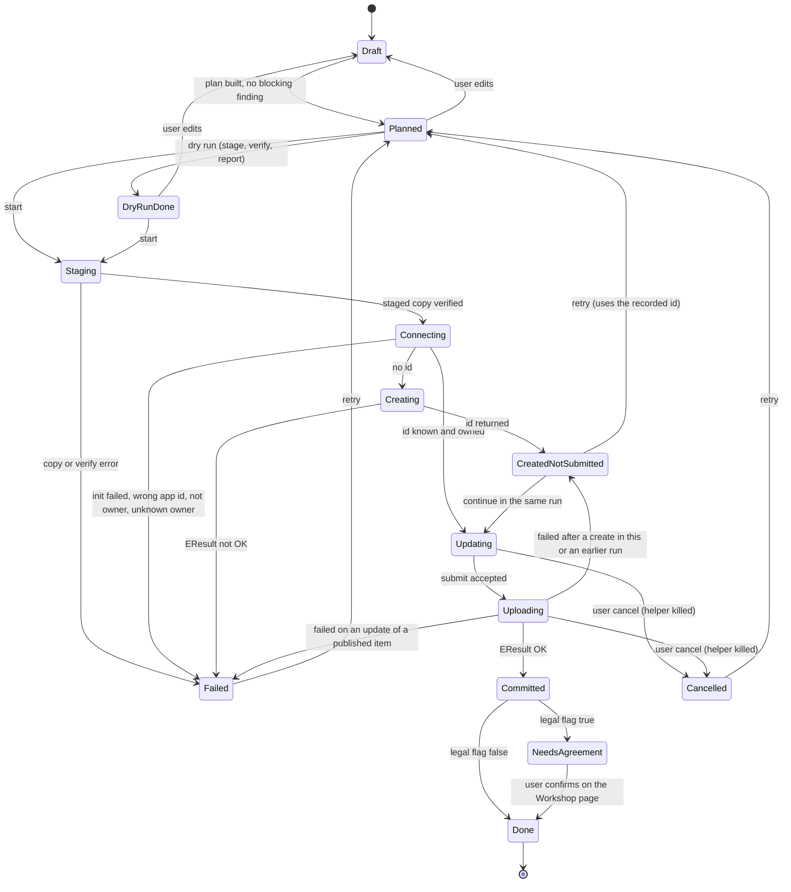
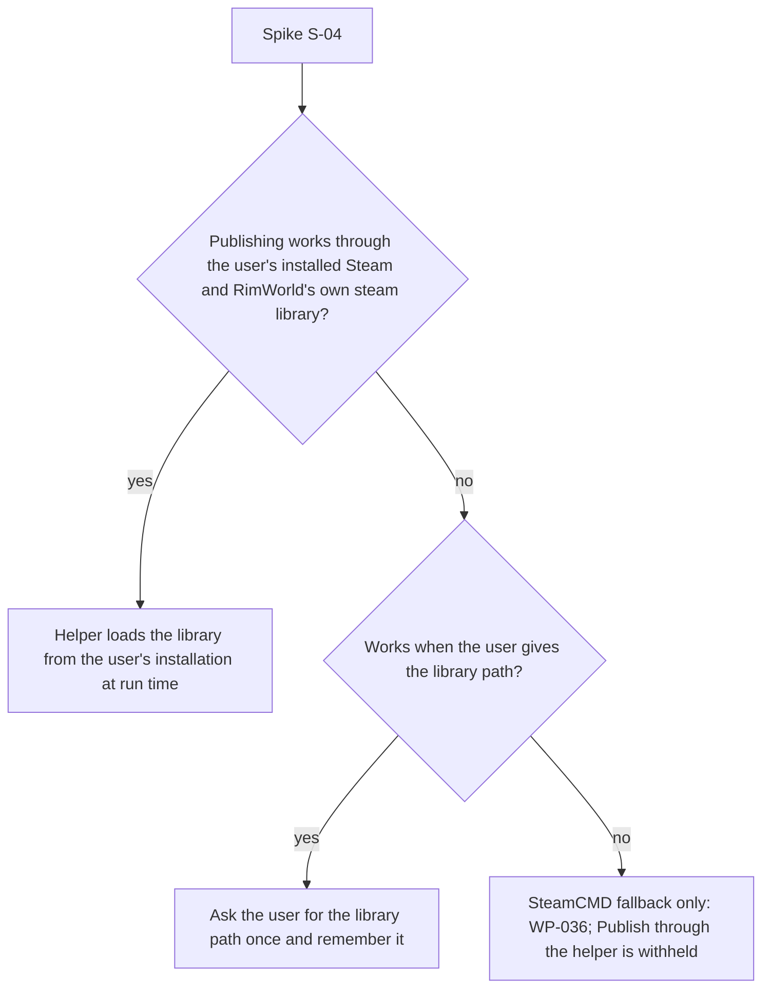

# Workshop publishing: functional specification

This document specifies the RimStudio Workshop publish and update tool (requirement R9): who it is for, the end-to-end flow and its state machine, every screen in words, the upload ignore rules, the preflight check catalogue, the protocol of the Steam helper sidecar, error handling, ownership checks, privacy, the spikes that gate shipping, the data schemas, and the tests. It is a product and behaviour specification, not a design brief: pixel styling belongs to the later design prompt (R8). The tool is a later milestone (M5, see [section 17](#17-milestones-and-scope)); the architecture already reserves its crates so the earlier milestones do not need rework. Game, Steam and RimSort behaviour is described in our own words; Ludeon code was read for evidence and is never copied (R11).

Status: draft | Last updated: 2026-10-04


Milestone numbering follows the [roadmap, section 1.1](../roadmap.md#11-mapping-to-the-milestone-names-in-the-register) (older mentions of M3 to M6 use the decision register's numbering).
## Contents

1. [Purpose and scope](#1-purpose-and-scope)
2. [Guiding principles](#2-guiding-principles)
3. [Requirements](#3-requirements)
4. [End-to-end flow and state machine](#4-end-to-end-flow-and-state-machine)
5. [Screens](#5-screens)
6. [Upload ignore rules](#6-upload-ignore-rules)
7. [Staging and the plan](#7-staging-and-the-plan)
8. [Preflight check catalogue](#8-preflight-check-catalogue)
9. [Helper sidecar protocol](#9-helper-sidecar-protocol)
10. [Errors and EResult handling](#10-errors-and-eresult-handling)
11. [Ownership checks](#11-ownership-checks)
12. [Privacy and credentials](#12-privacy-and-credentials)
13. [Mandatory spikes and the Steam library route](#13-mandatory-spikes-and-the-steam-library-route)
14. [Data schemas](#14-data-schemas)
15. [Commands, crates and jobs](#15-commands-crates-and-jobs)
16. [Tests and fixtures](#16-tests-and-fixtures)
17. [Milestones and scope](#17-milestones-and-scope)
18. [Owner decisions, assumptions and conflicts](#18-owner-decisions-assumptions-and-conflicts)
19. [References](#19-references)

## 1. Purpose and scope

### 1.1 Purpose

The game ships a small uploader that is hidden behind dev mode, refuses any mod that is not in the install Mods folder, uploads the entire mod folder with no exclusion, never sets visibility, never updates the description after the first upload, and writes the Workshop id file before it knows whether the upload worked ([workshop publishing research](../research/workshop-publishing-research.md) sections 1.1 to 1.4). The owner's own mods show the cost: 19 mod folders total 516,462,074 bytes of which 83.5 percent is build, source, version control or layered art content, and one `About/Preview.psd` alone is 251,080,698 bytes (research section 7.1). RimStudio replaces that tool with one that works for any project folder RimStudio knows (including custom mod folders on external drives, R4), shows exactly what will ship, checks the mod against the game's gates and a few more, and recovers cleanly from a failed upload.

The design follows the owner's earlier Parallax publisher (a sidecar speaking newline JSON, staging, an explicit terminal event) and corrects its recorded weak points (research section 4).

### 1.2 In scope

1. Creating a new Workshop item and updating an existing one for RimWorld (app id 294100) from a mod project folder.
2. Plan, ignore rules, staging copy, dry run, preflight, metadata and description editing with preview, tags, visibility, change note, progress, result and history.
3. The Steam helper sidecar and its protocol.
4. Owner and legal agreement handling, recovery from created-not-submitted items.

### 1.3 Out of scope

| Item | Reason |
|---|---|
| Collections, additional preview images and videos, item deletion, comments | Not needed to publish a mod; later. |
| Workshop browsing, subscribing, downloading | Mod manager territory ([mod manager](mod-manager.md)). |
| Publishing to games other than RimWorld | The app context is fixed to 294100. |
| A RimStudio Steam login or any credential handling | Never (section 12). |
| Scenario and save uploads | Only mods and translations (tags `Mod` and `Translation`). |
| Mapping `modDependencies` to Steam required items in v1 | The game never does it and the Rust crate has no wrapper (research section 5.1); listed as a later requirement WP-043. |

### 1.4 Users

| User | Need |
|---|---|
| Mod author with own folders outside the game | Publish from any folder; see what ships; never ship junk; update without losing the id. |
| Author of many mods | A consistent checklist, history per project, duplicate-id warnings. |
| Translator | The `Translation` tag without a hidden dialog checkbox. |

## 2. Guiding principles

1. **What you see is what ships.** The plan lists every uploaded file with its size; the staged copy is verified against the plan before the first Steam call.
2. **Never touch the project.** Staging copies; nothing in the project folder is deleted, renamed or rewritten except `About/PublishedFileId.txt` after a confirmed result (and `About.xml` version text only on an explicit bump action).
3. **Never lose an item.** The Workshop id is recorded in RimStudio's own record the moment Steam returns it, in a state that says the content was not submitted, so a retry updates the same item.
4. **No credentials.** The only identity is the signed-in Steam client (I-15, D-061).
5. **Honest about Steam.** Unknown outcomes (a hang, a missing terminal event, EResult 9) are reported as unknown with next steps, never as success.
6. **The main app never loads Valve's library.** It is isolated in a sidecar; absence disables only Publish.
7. **Diagnostics, not exceptions.** Preflight findings are `Diagnostic` values with stable `publish.*` codes (D-046); only infrastructure failures are errors.
8. **Same engine for UI and CLI.** Every step is a registry command; `rimstudio-cli publish plan` runs the same code (D-005, D-007).

## 3. Requirements

Ids are WP-nnn. "M" is the milestone of the first usable version; "Gate" names the check or spike that decides the requirement. Priority: must, should, later.

| Id | Requirement | Pri | M | Gate or evidence |
|---|---|---|---|---|
| WP-001 | Open Publish for any project known to RimStudio, including mods from custom mod folders and the install Mods folder; official content and Workshop subscriptions are refused with a reason | must | M5 | [research](../research/workshop-publishing-research.md) 1.1 |
| WP-002 | Decide create versus update from `About/PublishedFileId.txt` (whitespace tolerant unsigned parse, digits only on write) and show the decision | must | M5 | [corpus](../research/rimworld-mod-format-and-corpus.md) section 1 |
| WP-003 | Carry every Workshop id and SteamID64 as a string in IPC, TypeScript, JSON and the helper protocol | must | M5 | D-043, research pitfall 9 |
| WP-004 | Build a plan: ordered included file list with sizes, excluded list with the matching rule, totals, diff against the last upload | must | M5 | section 7 |
| WP-005 | Apply upload ignore rules from the project JSONC key `uploadIgnore` (gitignore syntax) on top of built-in defaults; defaults are removable chips | must | M5 | D-063 |
| WP-006 | Hard-required paths can never be ignored; an ignore pattern that removes a path needed by LoadFolders or a def reference is a blocking finding | must | M5 | section 6.4 |
| WP-007 | Never follow links out of the project root; such a link is a blocking finding | must | M5 | [security](../architecture/security-and-privacy.md) 9.5 |
| WP-008 | Stage the plan as a copy (hard link where allowed) under the cache root; verify path, size and blake3 against the plan before connecting | must | M5 | D-063 |
| WP-009 | Dry run: stage, verify, write the plan and report, make zero Steam calls, leave the staging folder for inspection | must | M5 | research 7.5 |
| WP-010 | Run the preflight catalogue as a pure library with one test per check | must | M5 | section 8 |
| WP-011 | Mirror the game's three gates (supportedVersions format, packageId format, LoadFolders issues) as blocking checks | must | M5 | research 1.1 |
| WP-012 | Detect a mislabelled preview image (extension versus real format) and offer a downscale for an oversized one | must | M5 | corpus: a JPEG named .png |
| WP-013 | Edit title, description, tags and visibility with live counters against Valve limits (128, 8000, 255 per tag, 1024 tag string) | must | M5 | research 1.6 |
| WP-014 | Description source is About.xml by default or an own BBCode text stored in the publish state; preview rendering through the shared rich-text module | must | M5 | [frontend](../architecture/frontend-architecture.md) |
| WP-015 | Set title and description on every update (the "update description" toggle defaults on) | must | M5 | research pitfall 16 |
| WP-016 | Generate tags `Mod` or `Translation` plus one `major.minor` tag per supportedVersions entry; user can add tags within limits | must | M5 | research 1.6 |
| WP-017 | Visibility default Private for a new item and `keep` for an update | must | M5 | research 8 |
| WP-018 | Change note is user-written with a diff-based template; an empty note on an update raises a warning, never an auto timestamp only | must | M5 | research 9.8 |
| WP-019 | One confirmation naming the Steam account, the target item or "new item" and the file totals, with the Workshop terms link beside the button | must | M5 | research 6.5 |
| WP-020 | Run the upload through the helper sidecar, one process per operation, protocol version 1, exactly one terminal event | must | M5 | D-061 |
| WP-021 | Record the id as `created-not-submitted` the moment `created` arrives; a retry reuses it and never creates a second item without confirmation | must | M5 | research pitfall 8 |
| WP-022 | Write `About/PublishedFileId.txt` (digits only) only after `done`, and only when the file differs | must | M5 | research 1.3 |
| WP-023 | Treat the legal agreement flag of create and submit results as the state `NeedsAgreement`; open the item page afterwards | must | M5 | research 1.3 |
| WP-024 | Owner check: block an update when the signed-in SteamID differs from the item owner, or while the owner is unknown | must | M5 | section 11 |
| WP-025 | Progress screen with stage labels, bytes and cancel; cancel kills the helper and keeps the id record | must | M5 | section 9 |
| WP-026 | Watchdog: kill the helper after 120 s without progress and report `publish.timeout` | must | M5 | D-061 |
| WP-027 | Crash recovery: a run record found at start offers resume (submit again) or discard | must | M5 | research 7.5 |
| WP-028 | History per project from append-only JSON; manifests list path, size and blake3 of every uploaded file | must | M5 | section 14 |
| WP-029 | "Nothing to publish" when content hash, title, description, tags and preview are unchanged | should | M5 | research 7.3 |
| WP-030 | Version bump action edits the About.xml version text only through the XML boundary crate, on explicit request | should | M5 | D-013 |
| WP-031 | Duplicate `PublishedFileId.txt` across known projects raises a warning naming both folders | should | M5 | corpus: two owner folders share an id |
| WP-032 | Soft limits on staged size and file count (configurable, defaults 500 MB and 5,000 files) | should | M5 | research 7.2 |
| WP-033 | Textures referenced by defs must exist (case checked) | should | M5 | def reference index |
| WP-034 | `rimstudio-cli publish plan` and `publish dry-run` with JSON output and exit codes; `publish run` requires `--yes` | should | M5 | D-007 |
| WP-035 | The app starts and every screen except Publish works with no Steam library present | must | M5 | section 13 |
| WP-036 | SteamCMD fallback: generate a VDF file and instructions; never accept credentials | later | M6 | research 5.4 |
| WP-037 | Library resolution through the user's own Steam installation and RimWorld's own steam library; nothing of Valve's is shipped (D-086); fallback: ask the user for the library path | must | M5 | section 13 |
| WP-038 | Logs redact SteamIDs and persona names; manifests hold only item ids | must | M5 | D-060 |
| WP-039 | Keyboard operation for every screen; progress and results announced to assistive technology | must | M5 | [frontend](../architecture/frontend-architecture.md) |
| WP-040 | Translation upload flag is a visible toggle in the metadata screen, not a hidden dialog | should | M5 | research 1.2 |
| WP-041 | Optional import of an existing `.rimstudioignore` file into `uploadIgnore` once | later | M5 | D-063 |
| WP-042 | Query the live item (title, owner, visibility, update time) to prefill an update and to detect a deleted item | should | M5 | section 9 |
| WP-043 | Map `modDependencies` with Workshop ids to Steam required items | later | after M5 | needs raw bindings |
| WP-044 | Import a description from the live page for editing | later | after M5 | research open question 9 |
| WP-045 | Additional preview images and a trailer | later | after M5 | not in the game tool |

## 4. End-to-end flow and state machine

### 4.1 Flow

1. **Choose a project.** The user opens Publish from a project, from a mod row in the manager, or from the command palette. The tool resolves the project folder, the packageId and the Workshop id from `About/PublishedFileId.txt`. If the project has no stored publish state, one is created in the data root (`publish/<projectId>/state.json`).
2. **Eligibility.** Official content and Workshop subscriptions are refused with a reason. Everything else is allowed, including folders on external drives (WP-001).
3. **Plan.** `publish_plan` runs as a job: read About.xml through `rimstudio-xml`, run preflight, walk the project applying the ignore rules, compute sizes, diff against the last manifest, derive title, description, tags and visibility defaults. The result is a `PublishPlan` with a `planId`.
4. **Edit.** The user adjusts the ignore rules, metadata, description, tags, visibility and change note. Any edit invalidates the plan and returns to Draft; the plan is rebuilt incrementally (only the affected parts).
5. **Dry run (optional).** Stage the files, verify them against the plan, write `plan.json` and a report, leave the folder open for inspection. No Steam call.
6. **Confirm.** One dialog names the signed-in account (known only after step 8 on the first run; before that the dialog says "the Steam account signed in to your Steam client"), the target ("new item" or id and title), the file count and size, the visibility, and shows the Workshop terms link. The Publish button is disabled while any blocking finding exists.
7. **Stage.** Copy or hard link the plan into the cache staging folder, verify path, size and blake3 against the plan. A mismatch fails with `publish.stage-mismatch` before Steam is contacted.
8. **Connect.** The app spawns `rimstudio-steam-helper` with its own work directory containing `steam_appid.txt` (294100). The helper initialises Steam, verifies the app id and reports the identity. The owner check (section 11) runs here, before any change.
9. **Create (no id).** The helper creates the item. The app records the id as `created-not-submitted` immediately.
10. **Submit.** The helper applies title, description (if `setDescription`), tags, visibility (unless `keep`), content folder and preview, and submits the change note. It reports progress about every 250 ms.
11. **Result.** On `done` the app writes `About/PublishedFileId.txt` if needed, writes the manifest, appends history, deletes the staging files it created, and shows the result. If the legal agreement flag is set, the state is `NeedsAgreement` and the result screen explains the step and opens the item page.
12. **Failure paths.** Any error keeps the id record, deletes the staging files, shows the code, the message and the remedy (section 10), and offers Retry (uses the recorded id) or Discard.

### 4.2 State machine



### 4.3 State rules

| Rule | Detail |
|---|---|
| Persistence | The current state and the id are written to `state.json` on every transition into `Creating`, `CreatedNotSubmitted`, `Updating`, `Uploading`, `Committed`, `NeedsAgreement`, `Failed`, `Cancelled`. Writes are atomic (D-026). |
| Created-not-submitted | The id is known to Steam but no content was committed. The record keeps the id as a string, the time and the last error code. The project's `About/PublishedFileId.txt` is not written yet. The Plan screen shows a banner: "An empty Workshop item (id) was created earlier. Publishing will update it." |
| Retry | The plan is rebuilt, the recorded id is used as `itemId` (update path). Creating a second item requires the explicit action "Create a new item instead", which asks for confirmation and clears the recorded id only after the new create succeeds. |
| Id file written when | After `done` only. This differs from the game, which writes the file before the submit result and leaves a mod marked as published after a failed submit (research 1.3). A crash between `done` and the file write is repaired at next start from the run record. |
| Deleted item | EResult for a deleted item on update moves to Failed with the code `publish.item-deleted`; "Create a new item" is offered and the old id is kept in history. |
| NeedsAgreement | A first-class state, not an error. The item exists and has content but stays hidden until the author accepts the Workshop legal agreement on the Workshop page. |
| Cancel | Kills the helper, deletes the staging files, keeps the id record. The UI says that Steam may have received part of the upload and that submitting again is safe. |
| Resume after crash | The run record (`state.json` with a `run` object) lists state, plan id, helper operation and start time. At next start the Publish screen offers Resume (rebuild plan, submit again) or Discard (clear the run, keep a recorded id). |

## 5. Screens

The tool is one feature folder, `apps/desktop/src/features/workshop/`, with one page and sub-views (a stepper in the header: Project, Plan, Metadata, Review, Publish, Result). Components come from `rimstudio-ui`; lists over 100 rows use the shared windowing hook; no screen calls IPC directly ([frontend architecture](../architecture/frontend-architecture.md)). Every blocking finding links to the screen that fixes it.

### 5.1 Project picker

A searchable list of known projects and mods (sources: workspace projects, custom mod folders, install Mods folder). Each row shows name, packageId, source badge, Workshop id (or "not published"), last published time from history, and a status chip: Ready, Has blocking findings, Needs recovery (created-not-submitted), Not uploadable (official or Workshop copy, with the reason as a tooltip). A "recent" group comes first. A folder can also be dropped on the screen to register it as a project through the project tool. Selecting a row opens the Plan screen. Duplicate Workshop ids across rows are marked with a warning icon (WP-031).

### 5.2 Plan and ignore editor

Left: a file tree of the project with a tri-state checkbox per node, grouped by top folder, each node showing its size and, for excluded nodes, the rule that excluded it (a chip such as "default: VCS" or "your pattern: `Docs/`"). Required paths show a lock and cannot be unchecked. Right: totals (included files, included bytes, excluded files, excluded bytes), a "changes since the last upload" panel (added, changed, removed with counts and sizes, expandable to paths), the ignore rule list and the preflight summary.

The ignore rule list shows the built-in groups as removable chips (VCS, IDE and build, Source folders, Raw art, Junk, Archives, Docs suggestion) and a text area for the project's own patterns in gitignore syntax with live matching: typing a pattern immediately updates the tree and the totals, and a pattern that matches nothing is marked. Unchecking a node in the tree adds or removes a pattern in `uploadIgnore` through a CST edit so comments survive (D-025). The exact included file list can be exported as text for review (copy to clipboard or save). The same view has the "Dry run" button.

### 5.3 Preflight results

A grouped list: Blocking, Warnings, Information. Each finding shows the code, the message, the file or field, and a fix action when one exists (open the About editor at the field, downscale the preview, add an ignore pattern, open the LoadFolders manager). Findings can be filtered by code and copied as a report. The list updates live as the user edits. A banner states whether publishing is allowed. Warnings never block, but the confirmation dialog lists the warning count.

### 5.4 Metadata and description editor

A form with a live preview column.

| Field | Behaviour |
|---|---|
| Title | Prefilled from About.xml name; counter against 128; editing here changes only the Workshop title unless the user ticks "also save to About.xml" (a byte-span edit of the file, off by default). |
| Description | Source switch: "From About.xml" (read only here, with a link to the About editor) or "Own text" (BBCode editor with toolbar for bold, italic, heading, list, url, image, quote and code, counter against 8000, stored in `state.json`). Preview renders Steam BBCode through the shared rich-text module using the sanitiser; a banner explains that Steam renders BBCode, so Markdown shows literally. A one-click "convert simple Markdown to BBCode" is offered for pasted text. The "update description" toggle defaults on. |
| Tags | Chips: `Mod` or `Translation` (a Translation toggle), generated version chips from supportedVersions, and free chips; counters for the 255 character and 1024 total limits; a chip with a comma is rejected inline. |
| Visibility | Public, Friends only, Private, Unlisted, plus "Keep current" for updates. Default Private for a new item. A note explains that a new item stays hidden until the legal agreement is accepted regardless of the chosen visibility. |
| Preview image | Thumbnail with real format, pixel size and byte size; warnings for a wrong format, over 1 MB and non-16:9; a "downscale" action writes a copy to the staging folder only (never over the project file). |
| Dependencies | Read-only list from About.xml `modDependencies` showing which have a Workshop id or URL (informational in v1, WP-043). |

### 5.5 Change note and diff template

A multiline field (limit 8000, counter). A "Fill from changes" button inserts a bullet list derived from the diff: one line per changed top-level folder with counts ("Defs: 3 changed, 1 added", "Textures: 12 added"), plus the About version text when a bump is pending. The note is stored as a draft in `state.json` and survives restarts. For a new item the field is prefilled with "Initial upload". An empty note on an update is a warning.

### 5.6 Review and confirm

A single summary: target, account (when known), title, tags, visibility, files and bytes, the diff counts, warnings, and the terms link. Buttons: Dry run, Publish. Publish opens the confirmation dialog of section 4.1 step 6. The dialog has no countdown delay; it requires one explicit click and names what will happen.

### 5.7 Progress

Stage labels mapped from the helper events: Staging, Connecting to Steam, Creating item, Preparing configuration, Preparing content, Uploading content, Uploading preview, Committing changes. A bar shows processed and total bytes when total is above zero, otherwise an indeterminate bar. A log drawer shows events as text. Cancel is always enabled and says what it does. The progress appears in the task centre too, so the user may leave the screen.

### 5.8 Result

| Outcome | Content |
|---|---|
| Done | Item id, link and an "Open Workshop page" button (`steam://url/CommunityFilePage/<id>` through the platform opener), bytes uploaded, duration, the manifest id, and "Written to About/PublishedFileId.txt" when applicable. |
| NeedsAgreement | The same plus a prominent explanation that the item stays hidden until the author accepts the Workshop agreement on the page, with a button that opens it and a "I accepted it" button that moves the state to Done. |
| Failed | The error code, the message, the remedy, the EResult number, the Steam log path hint, the id record status and Retry or "Create a new item". |
| Cancelled | What was kept, what was removed, Retry. |

### 5.9 History

A list per project (and a global view) of past runs: time, outcome code, item id, files, bytes, change note excerpt, helper protocol version, manifest id. Selecting a row shows the manifest file list and a diff against the current plan. History is read from `history.json`; no entry is ever edited.

## 6. Upload ignore rules

### 6.1 Where the rules live

Decision D-063: the rules are the `uploadIgnore` key of the project JSONC (`projects/<id>.jsonc` in the data root by default, or the opt-in `.rimstudio/project.jsonc`), not a `.rimstudioignore` file. Reason: the metadata must never live inside a folder that is uploaded, and app-owned configuration is JSONC (R10, [decision register](../architecture/decision-register.md) D-063). The research note proposed `.rimstudioignore`; this document follows the register ([section 18](#18-owner-decisions-assumptions-and-conflicts)). WP-041 offers a one time import for users who already have such a file.

### 6.2 Format

```jsonc
{
  "schemaVersion": 1,
  "uploadIgnore": {
    // Built-in groups the user switched off (they are on by default).
    "disabledDefaults": ["docs"],
    // The user's own patterns, gitignore syntax, evaluated in order, last match wins.
    "patterns": [
      "Documentation/",
      "*.psb",
      "!Textures/Raw/keep-me.png"
    ],
    // Optional: also honour the project's own .gitignore file.
    "useGitignore": false
  }
}
```

Rules of evaluation:

1. Patterns use gitignore semantics through the `ignore` crate (0.4.33 in the research): leading slash anchors to the project root, trailing slash matches directories, `**` matches any depth, a leading `!` re-includes.
2. Matching is on project-relative paths with forward slashes. It is case-insensitive on Windows and macOS and exact-case on Linux, mirroring the platform that will read the mod.
3. Order of precedence: hard-required paths (6.4), then the user's patterns, then the enabled defaults. A user `!` pattern can re-include something a default excluded; nothing can exclude a hard-required path.
4. The matcher never reads a global gitignore or the user's git configuration; only the listed sources are used.
5. Edits go through a CST edit of the JSONC so comments and order survive (D-025). A newer `schemaVersion` than the app knows opens the file read-only.
6. The plan records, for every excluded path, the group or pattern index that excluded it (shown as chips in section 5.2).

### 6.3 Defaults

Always applied unless the group is listed in `disabledDefaults`. The group id is the chip id.

| Group id | Patterns |
|---|---|
| `vcs` | `.git/`, `.svn/`, `.hg/`, `.gitignore`, `.gitattributes`, `.gitmodules` |
| `ide-build` | `.vs/`, `.idea/`, `.vscode/`, `bin/`, `obj/`, `*.sln`, `*.csproj`, `*.user`, `*.suo`, `*.pdb` |
| `source` | `/Source/`, `/Sources/`, `/src/` (project root only; the root Assemblies folder is untouched) |
| `raw-art` | `Raw Assets/`, `*.psd`, `*.xcf`, `*.ai`, `*.kra`, `*.blend`, `*.clip`, `*.sai` |
| `junk` | `*.bak`, `*.tmp`, `*.orig`, `*~`, `*.swp`, `Thumbs.db`, `.DS_Store`, `desktop.ini`, `*.log` |
| `archives` | `*.zip`, `*.rar`, `*.7z` (excluded, with a warning because some mods ship archives on purpose) |
| `rimstudio` | `.rimstudio/` (opt-in project metadata, D-063; never uploaded) |
| `docs` | Suggestion only, off by default: `README.md`, `LICENSE.md` are kept because they are harmless; the chip offers to exclude them |

The `Raw Assets/` pattern excludes any directory of that name at any depth, which is intended; the `source` group is root-anchored on purpose so a def folder named `Source` deeper in the tree is not removed. This list comes from the research junk census: among 690 installed Workshop mods, 71 contain a VCS directory (650 MB), 65 a source directory (366 MB), 82 contain PDB files, 9 layered art, 70 project files (research 7.1).

### 6.4 Hard requirements

These paths are never excluded and the tree shows them locked:

| Path | Reason |
|---|---|
| `About/About.xml` | The game and Steam item data depend on it. |
| `About/Preview.png` | Read by the game's mod list and uploaded as the preview. |
| `About/PublishedFileId.txt` | Shipped today by the game's own tool; kept for parity. |
| `LoadFolders.xml` and every folder it references | The game would not find content. |
| Root content folders `Defs`, `Patches`, `Textures`, `Assemblies`, `Languages`, `Sounds`, `Common` | Standard mod content. |
| Versioned folders named by supportedVersions (for example `1.6`) | Version selection. |

If a user pattern would remove something that LoadFolders.xml references, or a file referenced by a def reference the workspace knows about, preflight raises `publish.ignore-removes-required` as blocking and the plan keeps the file until the pattern is fixed.

### 6.5 Safety rules

1. Symbolic links and junctions are never followed outside the project root. A link whose target is outside is a blocking finding (`publish.symlink-escape`) naming the path. A link inside the project is staged as the file it points to, only when the target is inside the root ([security](../architecture/security-and-privacy.md) 9.5).
2. Files unreadable by permission fail the plan with `publish.unreadable-file`, not the upload.
3. Nothing is ever deleted from the project, only skipped. The excluded list is informational.
4. Hidden files are not special: they follow the rules above.

## 7. Staging and the plan

### 7.1 Staging

1. Location: `<cache>/publish/<packageId>/stage` (cache root, always deletable). The packageId is lowercased and sanitised for the file system.
2. Method: hard link where the file system allows it and the file is on the same volume, otherwise copy. Cross-volume projects (external drive) are copied. A copy is verified by size and blake3 as it is written.
3. Content: exactly the plan's included files, same relative paths. The downscaled preview, when the user chose it, is the only file that differs from the project and is recorded as such in the plan.
4. Cleanup: the staging step removes only files the plan created, listed in the run record, and then empty directories it created; it never performs a recursive delete of an arbitrary path (security 9.5 rule 4). A dry run keeps the staging folder until the next run or an explicit "Clean up".
5. The helper receives the staging path and, for the preview, a path inside it. The helper never receives the project path.

### 7.2 plan.json

The plan is written to `<cache>/publish/<packageId>/plan.json` on dry run and before every upload. Its schema is in section 14.4. The verification step compares the staged tree to it by path, size and blake3 and fails with `publish.stage-mismatch` listing the first differences. The plan id is a hash of the file list, metadata and options, so a changed plan has a new id and a confirmation given for an old plan cannot start a new one.

### 7.3 Diff against the last upload

The previous manifest (latest file in `publish/<projectId>/manifests/`) provides a path to blake3 map. The diff classifies each included path as added, changed (same path, different hash) or unchanged, and lists removed paths. When the content hash is identical and title, description, tags, visibility and preview hash are unchanged the plan states "Nothing to publish" and the Publish button is disabled (WP-029) unless the user ticks "Publish anyway", which is needed after a failed or manually deleted item.

## 8. Preflight check catalogue

Checks are pure functions in `rimstudio-validate` (publish preflight producers) over a `PublishInput` (parsed About, LoadFolders data, file list, image header facts, owner facts when known). Each returns zero or more `Diagnostic` values. Blocking means severity error and Publish disabled. Codes follow `<area>.<kebab-name>` in the `publish` and `author` areas (D-046). The three rows marked "Gate" mirror the game's own refusals; the others are RimStudio additions. Messages are English source strings with parameters in braces; catalogues are in `en.json` (D-056).

| Code | Level | Trigger | Message | Fix |
|---|---|---|---|---|
| `publish.not-uploadable` | blocking | Project is official content or a Workshop subscription copy | "{name} cannot be published: {reason}." | Copy the mod into a custom folder you own. |
| `publish.about-missing` | blocking | `About/About.xml` absent or unparsable | "About.xml is missing or cannot be read." | Create it with the About editor. |
| `publish.name-missing` | blocking | name empty after trimming | "The mod has no name." | Set the name. |
| `publish.author-missing` | warning | neither author nor authors set | "No author is set." | Set author. |
| `publish.description-missing` | warning | description empty and no own text | "The description is empty." | Write a description. |
| `publish.package-id-invalid` | blocking (Gate) | packageId fails the game's format rule: at most 60 characters, ASCII letters, digits and dots only, no leading dot, at least one dot, no double dot, last character alphanumeric | "The packageId '{id}' is not valid: {reason}." | Rename to Author.ModName style. |
| `publish.supported-versions-invalid` | blocking (Gate) | supportedVersions missing, empty or an entry does not parse as major.minor | "supportedVersions is empty or malformed: '{entry}'." | Fix the list. |
| `publish.supported-versions-missing-current` | warning | list lacks the installed game's major.minor | "The mod does not list game version {version}." | Add the version after testing. |
| `publish.load-folders-issues` | blocking (Gate) | LoadFolders.xml issue list not empty (unknown folder, bad version key, missing folder) | "LoadFolders.xml has {count} issue(s): {first}." | Open the LoadFolders manager. |
| `publish.preview-missing` | warning | `About/Preview.png` absent | "No preview image; the Workshop page will have none." | Add About/Preview.png. |
| `publish.preview-case` | warning | `preview.png` or other case found, exact name absent | "The file is named '{found}'; the game looks for Preview.png." | Rename (exact case matters on Linux). |
| `publish.preview-format-mismatch` | blocking | Header says JPEG, GIF or other while the extension says png | "Preview.png is really {format} data." | Convert, or let RimStudio convert in staging. |
| `publish.preview-too-large` | warning | Preview over 1,048,576 bytes (a wiki claim, not a Valve limit; research open question 4) | "The preview is {size}; Steam may reject over 1 MB." | Downscale to 640x360 or 1280x720. |
| `publish.preview-dimensions` | info | Not 16:9 or larger than 1280x720 | "Recommended size is 640x360." | None needed. |
| `publish.title-too-long` | blocking | more than 128 characters | "Title is {count} characters; the limit is 128." | Shorten. |
| `publish.description-too-long` | blocking | more than 8000 characters after conversion | "Description is {count} characters; the limit is 8000." | Shorten. |
| `publish.description-markup` | info | Raw Markdown headings or HTML that Steam would show literally | "Steam renders BBCode; this text will show markup literally." | Convert to BBCode. |
| `publish.change-note-too-long` | blocking | more than 8000 characters | "Change note is {count} characters; the limit is 8000." | Shorten. |
| `publish.change-note-empty` | warning | update with an empty note | "No change note; subscribers will see an empty entry." | Write one or use the template. |
| `publish.tag-invalid` | blocking | tag over 255 characters, empty, contains a comma or is not printable | "Tag '{tag}' is not allowed: {reason}." | Edit the chip. |
| `publish.tags-too-long` | blocking | joined tag string over 1024 characters | "Tags total {count} characters; the limit is 1024." | Remove tags. |
| `publish.version-tag-mismatch` | info | a user tag looks like a version not in supportedVersions | "Tag '{tag}' is not in supportedVersions." | Remove or add the version. |
| `publish.ignore-removes-required` | blocking | an ignore pattern removes a hard-required path or a path LoadFolders needs | "Pattern '{pattern}' would exclude '{path}', which the mod needs." | Edit the pattern. |
| `publish.symlink-escape` | blocking | link whose target is outside the project root | "'{path}' links outside the project." | Replace the link with a real file. |
| `publish.unreadable-file` | blocking | read error on an included file | "Cannot read '{path}': {error}." | Fix permissions. |
| `publish.archive-included` | warning | an archive remains included (group disabled) | "'{path}' is an archive and will ship." | Confirm it is intended. |
| `publish.texture-missing` | warning | a texture referenced by defs is absent (case-checked) | "Def {def} references missing texture '{path}'." | Add the file or fix the path. |
| `publish.duplicate-id` | warning | same Workshop id in another known project | "The Workshop id {id} is also used by '{other}'." | Remove the stale id file. |
| `publish.size-soft-limit` | warning | staged bytes or files above the configured soft limit | "{files} files, {size}; large uploads are slow." | Review the excluded list. |
| `publish.dependency-no-id` | warning | a `modDependencies` entry has neither Workshop id nor URL | "Dependency '{id}' has no Workshop link." | Add steamWorkshopUrl. |
| `publish.nothing-to-publish` | info (button disabled) | nothing changed since the last manifest | "Nothing changed since the last upload." | Edit, or tick Publish anyway. |
| `publish.steam-not-running` | blocking | helper probe cannot initialise Steam | "Steam is not running or not signed in." | Start Steam and sign in. |
| `publish.app-not-owned` | blocking | app id reported differs from 294100, or the account does not own the game | "This Steam account cannot publish for RimWorld." | Sign in with the account that owns RimWorld. |
| `publish.helper-missing` | blocking | helper binary or Steam library not resolved | "The publishing component is not installed." | Follow the library setup (section 13). |
| `publish.owner-unknown` | blocking | update with an id and the owner not yet determined | "Checking who owns this Workshop item." | Wait, or retry the query. |
| `publish.owner-mismatch` | blocking | item owner differs from the signed-in SteamID | "This item belongs to another Steam account." | Publish as a new item. |

Notes. The order of evaluation is local checks first (no Steam), then Steam-dependent checks after the helper probe. The first group runs on every edit (under 50 ms for typical projects); the second runs only on Review and at Connect. Every check has a test with one passing and one failing fixture (section 16).

## 9. Helper sidecar protocol

The helper `rimstudio-steam-helper` is a separate executable (sidecar layer, depends only on core and ipc-types) that holds Valve's native library behind a `SteamBackend` trait (D-061, I-15). The DTOs live in `rimstudio-ipc-types::helper` and are the single definition for both ends.

### 9.1 Transport

1. One operation per process. The app spawns the helper through the `Launcher` port with a cleared environment (plus what Steam needs, and `SteamAppId` set to 294100 as a second signal, to be confirmed in spike S-04), no inherited handles, and a current directory that is the helper's own work directory (`<cache>/steam/294100`) holding `steam_appid.txt` with exactly `294100`.
2. The app writes one request line to stdin and then reads events. The helper never reads stdin again; a closed pipe is harmless.
3. Events are one JSON object per line on stdout, UTF-8, flushed per line, each at most 16 KiB. Stderr is free text for the log. Images and large data are never sent as events.
4. Exit code 0 only after a `done` event; 1 after `error`. Exit with no terminal event is reported by the app as `publish.helper-protocol-error`.
5. Unknown event types and unknown fields are ignored with a log warning (forward compatible); a missing required field is a protocol error.
6. Output is untrusted: ids must be digit strings, text fields are length capped (500 characters) and displayed as text only.
7. Watchdog: no event for 120 s while `uploadingContent` is not advancing kills the helper and reports `publish.timeout`. Cancel kills the process; no cancel message exists.
8. The helper never calls `SteamAPI_RestartAppIfNecessary` (it would launch the game), never writes into the RimWorld install, and never opens a network port.

### 9.2 Versioning

`v` is an integer in the request and in `opening`. Version 1 is this document. The app accepts a helper whose `opening.v` equals its own; a mismatch is `publish.helper-version-mismatch` and the user is told to reinstall. Additive changes (new optional fields, new event types) keep version 1; any change in meaning or any removed field increments `v`. The app records the version in every history entry.

### 9.3 Operations

| `op` | Purpose | Terminal event |
|---|---|---|
| `probe` | Init Steam, verify app id, report library facts. No change to Steam. | `done` |
| `identity` | As probe, plus persona name and SteamID64. | `done` |
| `query` | Read item details (title, owner SteamID64, visibility, updated time, deleted flag) for `itemId`. | `done` with `item` |
| `publish` | Create (itemId "0") or update, then submit. | `done` |

### 9.4 Request

```json
{"v":1,"op":"publish","appId":"294100","workDir":"C:/Users/ann/AppData/Local/app.rimstudio.desktop/cache/steam/294100","libraryPath":null,"itemId":"0","content":"C:/.../cache/publish/ann.mymod/stage","preview":"C:/.../cache/publish/ann.mymod/stage/About/Preview.png","title":"My Mod","description":"[b]My Mod[/b] adds ...","setDescription":true,"tags":["Mod","1.5","1.6"],"visibility":"private","changeNote":"Initial upload","expectOwner":null}
```

Fields:

| Field | Type | Notes |
|---|---|---|
| `v` | integer | Protocol version, 1. |
| `op` | string | One of the four operations. |
| `appId` | string | `"294100"`; the helper verifies it with the Steam utils call and fails with `wrong-app-context` otherwise. |
| `workDir` | string | Absolute path created by the app. |
| `libraryPath` | string or null | Null means the library beside the helper; a path means the game route (spike S-04). |
| `itemId` | string | Decimal digits; "0" means create. |
| `content` | string | Staging folder; required for `publish`. |
| `preview` | string or null | Absolute path inside `content`; null skips the preview call. |
| `title`, `description`, `changeNote` | string | Already validated by preflight; description sent only when `setDescription` is true. |
| `setDescription` | boolean | False leaves the Workshop description untouched. |
| `tags` | array of string | Already validated. |
| `visibility` | string | `public`, `friendsOnly`, `private`, `unlisted` or `keep` (omit the visibility call). |
| `expectOwner` | string or null | When set, the helper compares the item owner to this SteamID64 only for logging; the authoritative owner check runs in the app from the `query` and `identity` results. |

### 9.5 Events

| `event` | Fields | Terminal | Notes |
|---|---|---|---|
| `opening` | `v` | no | Process started, cwd set. |
| `initialized` | `appId`, `personaName` | no | Persona name redacted in logs. |
| `identity` | `steamId` (string) | no | Used for the owner check. |
| `item` | `itemId`, `ownerSteamId`, `title`, `visibility`, `updatedAt`, `deleted` | no | Result of `query`, also emitted before an update when the item can be read. |
| `creating` | none | no | |
| `created` | `itemId`, `needsLegalAgreement` | no | The app records the id at this event. |
| `updating` | `itemId` | no | Update handle started and setters applied. |
| `progress` | `status`, `processed`, `total` | no | `status` is `preparingConfig`, `preparingContent`, `uploadingContent`, `uploadingPreview` or `committing`; bytes are numbers. |
| `done` | `itemId`, `needsLegalAgreement`, `eresult` | yes | `eresult` is 1 for OK. |
| `error` | `code`, `eresult`, `message`, `itemId`, `retryable` | yes | `code` from section 10; `eresult` and `itemId` may be null. |

Example successful create:

```
{"event":"opening","v":1}
{"event":"initialized","appId":"294100","personaName":"Ann"}
{"event":"identity","steamId":"76561198000000000"}
{"event":"creating"}
{"event":"created","itemId":"3600000001","needsLegalAgreement":true}
{"event":"updating","itemId":"3600000001"}
{"event":"progress","status":"uploadingContent","processed":1048576,"total":8388608}
{"event":"progress","status":"committing","processed":8388608,"total":8388608}
{"event":"done","itemId":"3600000001","needsLegalAgreement":true,"eresult":1}
```

Example failure after a create (the app keeps `3600000001` as created-not-submitted):

```
{"event":"created","itemId":"3600000001","needsLegalAgreement":false}
{"event":"updating","itemId":"3600000001"}
{"event":"error","code":"file-not-found","eresult":9,"message":"Steam reported file not found.","itemId":"3600000001","retryable":true}
```

The ids and SteamID64 values above are fictional.

### 9.6 Terminal event rule

Exactly one `done` or `error` is emitted per process, as the last line, before exit. The helper's main function wraps every operation so that a panic, a failed init and a lost Steam connection each produce an `error` event first. The app treats a second terminal event, an event after the terminal event, or an exit without one as a protocol error; the first terminal event still decides the outcome when it exists. A fake helper test covers each case (section 16).

### 9.7 Library resolution

The helper locates the Steam library in this order: the request's `libraryPath` (resolved by the app from the user's Steam client files and RimWorld's own steam library, or typed by the user as the fallback), none (then `error` with `library-missing`). The app resolves and validates `libraryPath` and passes only a path it has checked. No Valve library is shipped beside the helper (D-086, section 13).

## 10. Errors and EResult handling

### 10.1 Error codes

Helper `error.code` values are lowercase kebab-case and are mapped to app codes `publish.<code>`. The envelope towards the UI is `{code, message, errorId, details}` (D-046); `details` carries the EResult number, the helper code, the item id (string) and the Steam log path hint.

| Helper code | App code | Trigger | User message and remedy |
|---|---|---|---|
| `steam-not-running` | `publish.steam-not-running` | Init failed | "Steam is not running or not signed in. Start Steam, sign in, and do not run RimStudio as administrator unless Steam is also elevated." |
| `wrong-app-context` | `publish.wrong-app-context` | Reported app id is not 294100 | "The helper joined the wrong game context. This is a bug; the work folder is {path}." |
| `library-missing` | `publish.library-missing` | Library absent or fails to load | "The Steam library could not be loaded. See the library setup page." |
| `not-owner` | `publish.owner-mismatch` | Item owner differs | "Only the author can update this item. You can publish this mod as a new item instead." |
| `limited-account` | `publish.limited-account` | Steam access error typical for limited accounts | "Steam refused the upload. Limited accounts cannot submit Workshop content; see Steam support." |
| `access-denied` | `publish.access-denied` | EResult 15 | "Steam denied access to this item. Check the account and any Workshop ban." |
| `insufficient-rights` | `publish.insufficient-rights` | EResult 24 (number as listed by the research; verify in the header) | Same as access-denied. |
| `file-not-found` | `publish.file-not-found` | EResult 9 on submit | "Steam reported 'file not found'. The item may exist but be empty. Check its Workshop page and Steam's Workshop log at {path}, then retry." The message cites the Parallax finding (research 3.3). |
| `rate-limited` | `publish.rate-limited` | EResult 84 | "Steam asked us to slow down. Retry in a minute." Retryable. |
| `busy` | `publish.busy` | EResult 10 | "Steam is busy. Retry." Retryable. |
| `timeout` | `publish.timeout` | EResult 16 or watchdog | "Steam did not answer in time. The item may exist; retry will reuse it." Retryable. |
| `no-connection` | `publish.no-connection` | EResult 3 | "Steam cannot reach its servers." Retryable. |
| `limit-exceeded` | `publish.limit-exceeded` | EResult 25 | "A content or tag limit was exceeded: {sizes}." Shows the plan totals and tag lengths. |
| `item-deleted` | `publish.item-deleted` | Item removed (EResult 86 in the research; verify in the header) | "This item was removed from the Workshop. Create a new item?" Clears the stored id only after the new create succeeds. |
| `preflight-blocking` | `publish.preflight-blocking` | Blocking findings at start | Lists each finding with its fix. |
| none | `publish.helper-protocol-error` | Exit without a terminal event, bad line, oversize line | "The publishing component stopped unexpectedly. Details are in the log." |
| none | `publish.helper-version-mismatch` | `opening.v` differs | "The publishing component has a different version. Reinstall RimStudio." |
| none | `publish.stage-mismatch` | Staged tree differs from the plan | "The staged files did not match the plan. Nothing was uploaded." |
| any other | `publish.steam-error` | Unmapped EResult | "Steam returned error {eresult} ({name})." |

The EResult name table is regenerated from the header bundled with the Steam library at build time, not copied from Parallax's Go file (research 6.4). The numbers in this table come from the research note; those marked "verify in the header" are checked when the table is generated, and a mismatch fails the xtask check.

### 10.2 Retry policy

1. Retryable codes (`busy`, `timeout`, `no-connection`, `rate-limited`) allow a manual Retry button; the app never retries automatically for an upload because the user should see what happened. A `query` or `probe` operation retries once after 2 s on `busy`.
2. Retry after a create always uses the recorded id.
3. A failure on an update of an already published item leaves the item as it was; Steam keeps no partial update (research 7.5), so a retry submits again.

### 10.3 The EResult 9 risk

Parallax saw EResult 9 on submit against Stellaris twice, with and without content, and recorded the cause as unresolved (research 3.3). RimWorld's own library is of the same generation, so the risk applies when that library is loaded. The mitigation is the spike (section 13): the first M5 task is to create and submit a Private item against app 294100 with each candidate library and record the result. Until the spike passes, Publish is hidden behind an "experimental" label and the error message for code 9 carries the full guidance of the table above.

## 11. Ownership checks

1. **When.** At Connect, before any change, for every update (an id is known). For a create there is nothing to compare.
2. **How.** The helper emits `identity` (SteamID64 string) and `item` (owner SteamID64, from a details query on the id). The app compares the two strings.
3. **Outcomes.**

| Facts | Result |
|---|---|
| Owner equals signed-in id | Proceed. |
| Owner differs | Blocking `publish.owner-mismatch`; actions: "Publish as a new item" (clears the id file link only after confirmation, keeps history) or cancel. |
| Owner unknown (query pending or failed) | Blocking `publish.owner-unknown` for updates. The game treats unknown as "may have another author" and blocks; RimStudio does the same, but offers Retry and, after a failed query, an explicit "I understand, try the update anyway" that lets Steam enforce ownership at submit (it returns an access error for a foreign item). |
| Item deleted | `publish.item-deleted`. |
| Id came from a folder with an inherited `PublishedFileId.txt` (a fork or template) | Same as owner mismatch; the Plan screen explains that the id file was inherited and offers "Publish as a new item". |
| Unlisted or private item not visible to the query | The details query for another owner's private item may return file not found; this is not read as "deleted" (research pitfall 10). The update is tried only after the explicit override above. |

4. **Limited accounts.** Cannot be detected up front; they surface as an access error and map to `publish.limited-account`.
5. **App ownership.** The helper verifies the app id; whether the account owns the game is inferred from a successful init in that context (a non-owner cannot init as app 294100).

## 12. Privacy and credentials

1. RimStudio never asks for, stores, logs or transmits a Steam user name, password, Steam Guard code or token. If the client is not signed in, the tool says so and stops.
2. Process arguments carry no secrets; the request goes over stdin and contains no identity data.
3. SteamIDs and persona names are held in memory for the session; the logger redacts them as `<steamid>` and `<persona>` (D-060). The history and manifest files store item ids only.
4. The optional Steam Web API key mentioned in the research is not used in v1 and not part of this tool; no feature requires it.
5. The SteamCMD fallback (WP-036) generates a VDF and an instruction text and runs nothing. The user types credentials into their own SteamCMD.
6. No telemetry: nothing about publishing is sent anywhere except to Steam by the helper.
7. The sidecar is isolated: no network port, no write to the install, signed with the app ([security](../architecture/security-and-privacy.md) section 10).
8. Descriptions, titles and the live item text are untrusted strings rendered through the sanitiser (security section 11).

## 13. Mandatory spikes and the Steam library route

### 13.1 Spikes

| Spike | Question | Pass condition | Blocks |
|---|---|---|---|
| S-04 (architecture register) | Does create plus submit work against app 294100 through the Steam client the user already has installed, using RimWorld's own steam library (loaded at run time)? Does EResult 9 occur? If not, does the fallback of asking the user for the library path work? | A Private item is created and a submit with content returns EResult 1 through the user's installation; the result is recorded for each route. | WP-020, WP-037, D-062 |
| S-04a | Steam applies tags that are not in the game's configured list (version tags such as `1.6`), and shows them | Tags visible on the item page after submit. | Tag defaults (WP-016) |
| S-04b | Is the 1 MB primary preview limit real? | An oversized preview upload either succeeds or fails; record the behaviour. | Severity of `publish.preview-too-large` |
| S-04c | How does the helper find the library in the user's Steam installation or RimWorld folder on each OS (Steam root probe, game folder, DLL search) and does macOS quarantine block loading it? | Helper starts on a clean machine of each OS with Steam installed. | Packaging |
| S-04d | Flatpak Steam, Proton-only installs and sandboxed Steam | Document support or a clear unsupported message. | Messages |

The spikes use the owner's real account and a Private item and need the owner's explicit go-ahead before any create (they create a real Workshop item). Items created by spikes are recorded and the owner deletes them on the Workshop page.

### 13.2 The Steam library route (decided, D-086)

The owner decided on 2026-10-04 that RimStudio uses the Steam client the user already has installed and interacts with it directly ([ADR 0032](../adr/0032-publish-sidecar-and-steam-library.md)). The earlier decision tree (bundle, user supplied or game library) is withdrawn.



Rules:

1. The app and every screen except Publish work in all branches (WP-035, security section 10 rule 1).
2. If no branch works, Publish shows the fallback page (VDF plus instructions) and the helper is not shipped.
3. RimStudio ships neither Valve's redistributable library nor its own Steam. Detection uses the user's own Steam files, launching and publishing go through the user's installation. RimSort's practice of committing binaries is not followed (R11).
4. The `SteamBackend` trait keeps the route local to the helper: the `steamworks` crate backend and a `libloading` backend built on `libloading` 0.9.0 (research 5.3) behind a cargo feature, both loading the library from the user's machine.
5. The S-04 result is recorded in the decision register as a note on D-062 and D-086.

## 14. Data schemas

All files are JSON with `schemaVersion` (documents) and atomic writes ([data and persistence](../architecture/data-and-persistence.md)). Ids are strings. Timestamps are UTC RFC 3339 text. Paths inside manifests are project-relative with forward slashes.

### 14.1 state.json (`publish/<projectId>/state.json`, schema `publish-state` 1)

```json
{
  "schemaVersion": 1,
  "projectId": "p-0001",
  "packageId": "ann.mymod",
  "appId": "294100",
  "workshopId": "3600000001",
  "idStatus": "created-not-submitted",
  "idRecordedAt": "2026-10-04T10:00:00Z",
  "lastErrorCode": "publish.file-not-found",
  "metadata": {
    "titleOverride": null,
    "descriptionSource": "about",
    "descriptionOwn": null,
    "updateDescription": true,
    "tagsExtra": [],
    "translation": false,
    "visibility": "private"
  },
  "changeNoteDraft": "Initial upload",
  "run": null
}
```

`idStatus` is `none`, `created-not-submitted` or `published`. `run` is null or `{runId, state, planId, op, startedAt}` while a run is active (crash recovery, WP-027).

### 14.2 history.json (`publish/<projectId>/history.json`, schema `publish-history` 1)

Append-only list; each entry:

```json
{
  "runId": "r-20261004T100500Z",
  "at": "2026-10-04T10:05:00Z",
  "op": "publish",
  "outcome": "done",
  "errorCode": null,
  "eresult": 1,
  "workshopId": "3600000001",
  "created": true,
  "needsLegalAgreement": true,
  "files": 214,
  "bytes": 8388608,
  "durationMs": 41200,
  "helperProtocol": 1,
  "manifest": "20261004T100500Z.json",
  "changeNote": "Initial upload"
}
```

`outcome` is `done`, `needs-agreement`, `failed`, `cancelled`, `dry-run`.

### 14.3 manifest (`publish/<projectId>/manifests/<timestamp>.json`, schema `upload-manifest` 1)

```json
{
  "schemaVersion": 1,
  "workshopId": "3600000001",
  "appId": "294100",
  "uploadedAt": "2026-10-04T10:05:41Z",
  "aboutVersion": "1.2.0",
  "titleHash": "blake3:...",
  "descriptionHash": "blake3:...",
  "tags": ["Mod", "1.6"],
  "previewHash": "blake3:...",
  "contentHash": "blake3:...",
  "files": [
    {"path": "About/About.xml", "size": 1024, "blake3": "..."}
  ]
}
```

The manifest lives in the data root, never in the project, so it never ships (D-063). The research note proposed `<project>/.rimstudio/publish-manifest.json`; the architecture location is used ([section 18](#18-owner-decisions-assumptions-and-conflicts)). `contentHash` is the blake3 of the sorted `path`, `size`, `blake3` triples.

### 14.4 plan.json (cache root, schema `publish-plan` 1)

```json
{
  "schemaVersion": 1,
  "planId": "blake3:...",
  "projectId": "p-0001",
  "packageId": "ann.mymod",
  "mode": "create",
  "included": [{"path": "About/About.xml", "size": 1024, "blake3": "...", "locked": true}],
  "excluded": [{"path": ".git", "size": 4096000, "files": 120, "rule": "default:vcs"}],
  "totals": {"files": 214, "bytes": 8388608, "excludedFiles": 120, "excludedBytes": 4096000},
  "diff": {"added": 214, "changed": 0, "removed": 0, "unchanged": 0},
  "replacedByStaging": [{"path": "About/Preview.png", "reason": "downscaled"}],
  "findings": [{"code": "publish.preview-too-large", "severity": "warning", "message": "..."}]
}
```

The plan is a cache file: it can be deleted at any time and is rebuilt on demand.

## 15. Commands, crates and jobs

### 15.1 Crates

| Crate | Role in this tool |
|---|---|
| `rimstudio-publish` (L3) | Staging, plan, ignore rules from project JSONC, state machine and history, helper transport (newline JSON). |
| `rimstudio-validate` (L2 engine) | The preflight producers of section 8 and the code registry. |
| `rimstudio-xml` | Reads About.xml and LoadFolders.xml; byte-span edit for the version bump. |
| `rimstudio-io` | JSON and JSONC store with CST edits, atomic writes, blake3 stat keys, RootGuard. |
| `rimstudio-library` | Project and mod index, duplicate id source. |
| `rimstudio-ipc-types` | DTOs, events and `helper` protocol module. |
| `rimstudio-steam-helper` (sidecar) | `SteamBackend` trait with a `steamworks` backend and a fake. |
| `rimstudio-app` | Command registry, JobRunner, helper spawn through the `Launcher` port. |

Publish depends on no other feature crate (D-008). The helper depends only on core and ipc-types.

### 15.2 Commands (names proposed; follow `<area>_<verb>`)

| Command | Kind | Purpose |
|---|---|---|
| `publish_projects` | query | List candidate projects with status chips. |
| `publish_state_get` | query | State, history summary and recovery banner. |
| `publish_plan` | job | Build the plan, run local preflight. |
| `publish_ignore_edit` | action | CST edit of `uploadIgnore`. |
| `publish_metadata_save` | action | Save metadata and drafts into `state.json`. |
| `publish_dry_run` | job | Stage, verify, write the report. |
| `publish_probe` | job | Helper `probe` or `identity`, then Steam-dependent checks. |
| `publish_start` | job | Stage, connect, create or update, submit; streams progress. |
| `publish_cancel` | action | Same as `cancel_job` for a publish job; kills the helper. |
| `publish_history` | query | History entries and manifest file lists. |
| `publish_resume` | job | Resume after a crash. |
| `publish_vdf_export` | action | Write the SteamCMD VDF and instructions (WP-036). |

Every command that takes over 1 ms of Rust work is a job (I-13). Progress is limited to 20 messages per second; helper progress at 250 ms is well within it. The CLI exposes `publish plan`, `publish dry-run` and `publish run --yes` over the same handlers.

## 16. Tests and fixtures

### 16.1 Layers

| Layer | Content |
|---|---|
| Unit | One test per preflight check (pass and fail fixture), ignore matching (case rules per OS, precedence, hard-required paths), plan diff, tag generation, state machine transitions, JSON schema round trips. |
| Property | Ignore matching never excludes a hard-required path; plan totals equal the sum of entries; plan output identical at 1 and 8 threads (I-12). |
| Protocol | Fake helper (a test binary or in-process `FakeTransport`) scripting event streams: success, error after create, no terminal event, two terminal events, event after terminal, oversize line, bad JSON, unknown event, unknown field, version mismatch, hang (watchdog). |
| Filesystem | `RecordingFs` asserts the install tree is unchanged before and after a mocked run, that nothing in the project changes except the id file, and that staging cleanup removes only plan-created files. |
| Integration | Plan, dry run and mocked publish for fixture projects through the registry and the CLI, comparing JSON goldens. |
| Frontend | Vitest for the store; Playwright with mocked IPC for the stepper, the ignore editor, the blocking and warning paths, NeedsAgreement and recovery; gallery screenshots in both themes. |
| Real Steam | `#[ignore]` tests gated by an environment variable that run spike S-04 steps by hand; never in CI. |

### 16.2 Fixtures

All fixtures are fictional mod trees built by `rimstudio-testing` (fixture builders); no real mod content is copied into the repository (R11).

| Fixture | Purpose |
|---|---|
| `ok-minimal` | Valid About, preview, one def; plan and diff baseline. |
| `bad-package-id`, `bad-versions`, `bad-load-folders` | The three game gates. |
| `preview-jpeg-as-png`, `preview-case`, `preview-huge` | Preview checks. |
| `junk-heavy` | `.git`, `Source`, `Raw Assets`, PSD, PDB, archives, to test defaults and sizes. |
| `link-escape` | A link to outside the root. |
| `duplicate-id-pair` | Two projects with one id file. |
| `trailing-newline-id` | Id file with a newline (corpus: 4 such files). |
| `inherited-id` | A folder with an id whose owner differs. |

### 16.3 Acceptance case: the Lone Wolf Weapon Package

The owner's real mod project "The Lone Wolf Weapon Package" is the acceptance case, run locally by the owner (the folder is not copied into the repository):

1. The plan lists every shipped file with sizes and excludes `.git` and `Raw Assets` (and any other default group present) with the reduced total reported against the folder total.
2. The excluded list shows each rule that matched.
3. The preflight shows no blocking finding for a healthy About, and shows the preview findings it earns (format, size, case) with the corresponding fix actions.
4. A dry run produces a staging folder whose file list equals the plan; the folder is inspected and cleaned.
5. If the project has an id file, the plan is "update" and the id is shown; the duplicate id warning appears if another known folder holds the same id.
6. An actual publish is run only after the spikes pass and with the owner's go-ahead.

Sizes are measured at test time; this document records no numbers for the project because none were measured in the research.

### 16.4 Budgets

Plan build for a project of 5,000 files under 1 s on the reference machine, preflight local checks under 50 ms, staging bounded by disk speed with progress messages, and the start-up cost of the Publish feature zero when unused (the page is lazy). Benchmarks use the criterion harness against `xtask/budgets.jsonc` (D-058). These budgets are proposals to confirm in M5 (unverified).

## 17. Milestones and scope

| Step | Content | Milestone |
|---|---|---|
| 1 | Pure parts: ignore rules, plan, staging, diff, preflight catalogue, state machine, schemas, CLI `publish plan` and `dry-run` | M5 (can start after M3, needs no Steam) |
| 2 | Helper with fake backend, protocol tests, helper spawn, progress UI | M5 |
| 3 | Spike S-04 and the library decision | M5 gate |
| 4 | `steamworks` or `libloading` backend, real publish, result and history screens | M5 |
| 5 | SteamCMD fallback page, dependencies mapping, live description import | M6 or later |

The owner asked whether M5 should move earlier (decision register open question). Steps 1 and 2 need no Steam library and could run in parallel with M3 and M4 without risk; step 3 only needs a small throwaway program and could be done at any time, which is the cheapest way to reduce the largest risk early.

## 18. Owner decisions, assumptions and conflicts

### 18.1 Owner decisions

1. **Resolved (D-086, 2026-10-04):** the user's installed Steam is used directly and no Valve library ships; only the S-04 result remains open.
2. **Spike go-ahead**: the spike creates a real Private item in the owner's account; approval and the deletion of leftovers are the owner's.
3. **Moving M5 earlier**, at least steps 1 to 3 of section 17.
4. **The app identifier** (D-049) fixes the work directory path used for the helper.
5. **Default visibility** for new items is Private in this specification; the owner may prefer Public once the agreement is accepted.
6. **Soft limits** (500 MB, 5,000 files) are placeholders for the owner to tune.

### 18.2 Assumptions

1. Publishing is for RimWorld app 294100 only.
2. The description sent to Steam is BBCode; About.xml descriptions are sent as they are, as the game does.
3. Per-operation helper processes are acceptable in latency (a few seconds of Steam init) because publishing is rare.
4. EResult numbers listed in section 10 are from the research and are verified against the header when the table is generated.

### 18.3 Conflicts with other documents

| Topic | Research note says | This document follows | Reason |
|---|---|---|---|
| Ignore location | `.rimstudioignore` file at the mod root | `uploadIgnore` in project JSONC (D-063) | The architecture register resolves it; metadata must not sit in a shipped folder. The task brief names `.rimstudioignore`; WP-041 keeps a one time import so the format is not lost. |
| Manifest location | `<project>/.rimstudio/publish-manifest.json` | Data root `publish/<projectId>/manifests/` ([data and persistence](../architecture/data-and-persistence.md)) | Same reason. |
| `rimstudio-publish` layer | Proposed name only | L3 feature crate per the crate catalogue | Spine is authoritative. |
| Helper request `appId` | Number in the research sketch | String in this specification | All ids cross boundaries as strings (D-043); the number in the sketch is replaced. |

## 19. References

- [Workshop publishing research](../research/workshop-publishing-research.md): the game's uploader, Valve's flow, Parallax, Rust options, licence, error model, staging, the protocol sketch.
- [Rimworld mod format and corpus](../research/rimworld-mod-format-and-corpus.md): About fields, packageId rule, PublishedFileId.txt facts.
- [Modding toolkit scope](../research/modding-toolkit-scope.md): project metadata location and staging context.
- [Rust crate research](../research/rust-crate-research.md): `steamworks`, `ignore`, `libloading`, `keyring`.
- [Cross-platform packaging research](../research/cross-platform-packaging-research.md): sidecar shipping.
- [Security and privacy](../architecture/security-and-privacy.md) sections 9.5, 10 and 11; [data and persistence](../architecture/data-and-persistence.md); [decision register](../architecture/decision-register.md) D-046, D-061, D-062, D-063.
- [Mod manager specification](mod-manager.md) for the entry points into this tool.
- The owner's Parallax workshop upload notes (`parallax-mod-manager/docs/workshop-upload.md`), an earlier sidecar flow whose findings are summarised in the research note.
