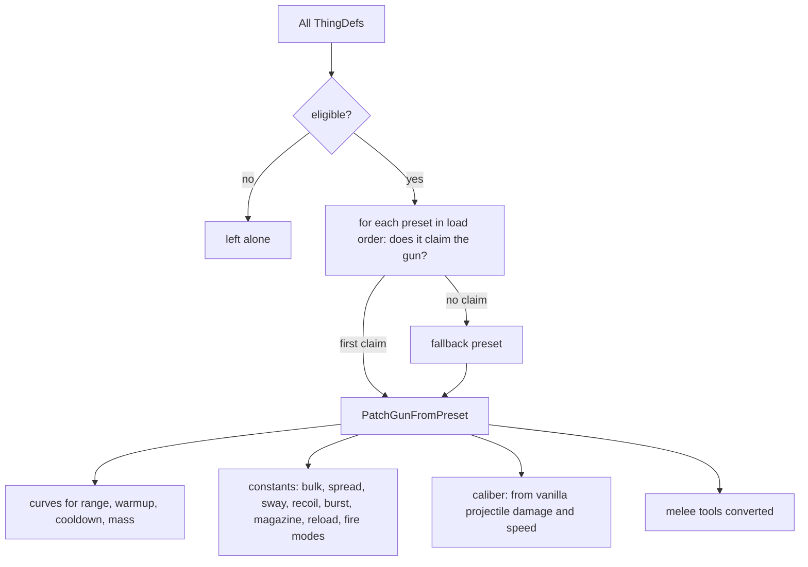

# Combat Extended auto-patcher formulas and fidelity

Scope: how Combat Extended (CE) converts vanilla and third-party weapons, apparel, tools, animals and pawn kinds to CE values programmatically, written as explicit functions with their numeric tables, and how closely the formula-based conversion reproduces CE's own hand-tuned conversion of the vanilla items. The measurements decide how RimStudio's item designer works in its "simple mode" (formula, no questions) and "calibrated mode" (reference-based, quiz-driven), requirement R7. CE is CC BY-NC-SA 4.0 and a read-only reference: this note describes algorithms in its own words, and the committed numbers are research evidence, not product data.

Status: research note | Last verified: 2026-10-04

## 1. Method and sources

Sources read (all under `CombatExtended-Development/`): `Source/CombatExtended/Compatibility/GunAutoPatcher.cs`, `.../ApparelAutoPatcher.cs`, `.../WeaponToughnessAutoPatcher.cs`, `.../PawnKindAutoPatcher.cs`, `.../LogUnpatchedTools.cs`, `.../RaceAutoPatchers/RaceAutoPatcher.cs` and `RaceUtils.cs`; `Source/CombatExtended/CombatExtended/GunPatcherUtil.cs`, `ApparelAutopatcherUtil.cs`, `PatchOperationMakeGunCECompatible.cs`, `Defs/GunPatcherPreset/GunPatcherPresetDef.cs`, `CaliberFloatRange.cs`, `Defs/ApparelPatcherPresetDef.cs`, `ModSettings/Settings.cs`; the preset defs `Defs/GunPatcherDefs/*.xml` (6 files) and `Defs/ApparelAutoPatcherPresets/*.xml` (4 files, 11 presets). Game semantics were checked in the decompiled code: `decompiled:Verse/SimpleCurve.cs` (Evaluate, points sorted on load) and `decompiled:Verse/FloatRange.cs` (Includes is inclusive on both ends).

How the numbers were produced:

1. `extract_presets.py` parses the preset defs into JSON (6 gun presets, 11 apparel presets).
2. `ce_load.py` loads RimWorld 1.6.4871 (Core + Royalty, Ideology, Biotech, Anomaly, Odyssey) twice with the def-engine prototype (`docs/research/data/def-engine/`, semantics in `docs/research/def-engine-semantics.md`): once vanilla only, once with the CE development folder added. The engine leaves CE's own patch operation `CombatExtended.PatchOperationMakeGunCECompatible` unknown (it is C# reflection code), and all hand-tuned gun values live inside it (43 operations). `ce_load.py` re-implements it in a simplified way (statBases replaced stat by stat, the Properties block becomes verbs[0], AmmoUser and FireModes become comps). This is a scratch-level extension; the engine files were not edited. Bug report for the engine owner: none found in the engine itself, but its README should say that CE gun values need this operation to be resolved.
3. `build_pairs.py` pairs every vanilla gun-like def (67), apparel (112) and melee weapon (26) with its CE version.
4. `autopatch.py` runs the auto-patcher formulas on the vanilla values; `fidelity.py` and `class_analysis.py` compare with the hand-tuned values and with data-driven baselines.

Paths such as `data/ce-autopatcher/...` below mean `docs/research/data/ce-autopatcher/...` in the repository. Facts about the data that frame everything below:

| Fact | Value | Evidence |
| --- | --- | --- |
| Weapon auto-patcher default | off (`enableWeaponAutopatcher = false`) | `Source/CombatExtended/CombatExtended/ModSettings/Settings.cs` line 160 |
| Apparel auto-patcher default | off | same file, line 159 |
| Weapon toughness, race and pawn kind patchers default | on | same file, lines 161 to 163 |
| Vanilla gun-like defs found / after dropping 13 Odyssey "_Unique" duplicates / eligible for the gun patcher | 67 / 54 / 49 | `data/ce-autopatcher/fidelity_summary.json` key `guns_counts` |
| Eligible vanilla guns that CE hand-tunes (magazine data present) | 33; of these 21 are "firearms" (bullet projectile, no turret or neolithic tag) | same |
| Vanilla apparel / apparel CE converts by hand (Bulk added) | 112 / 67 | `apparel_counts` |
| Hand-tuned toughness values for vanilla weapons in CE | none (the two placeholders in the patch files are commented out) | `Patches/Core/ThingDefs_Misc/Weapons_Guns.xml`, `Weapons_Melee.xml` |

Consequence: in a normal CE install the gun and apparel auto-patchers only ever see third-party items, because CE's hand patches already gave every vanilla item a CE verb or Bulk stat (the patcher skips those). The vanilla comparison is therefore a test of the formulas on items where the right answer is known, not a replay of what the game does.

## 2. Gun auto-patcher

### 2.1 Pipeline

### 2.2 Eligibility ("shouldPatch")

A def is patched only if all of these hold (`GunAutoPatcher.cs`, method `shouldPatch`): it has no weapon tag "Patched"; its thing class is exactly `ThingWithComps` or `Thing`; it is a ranged weapon; it has a verb list; and for every verb, the verb is not already a CE verb, the default projectile exists and its class is `Bullet` or `Projectile_Explosive`, and the verb class is one of Verb_ShootOneUse, Verb_Shoot, Verb_LaunchProjectile, Verb_LaunchProjectileStatic. Consequences measured on vanilla: grenades and rocket or smoke launchers pass (explosive projectile) and would be forced into a rifle preset; turrets pass; beam, liquid and fire-arrow weapons do not.

### 2.3 Classification

Presets are tried one by one in def load order (file order: AssaultRifle, MachineGun, Pistol, Revolver, SMG, SniperRifle). The first preset that claims a gun patches it; later presets no longer see it, because the candidate list is re-evaluated lazily and a patched gun now has a CE verb. A preset claims a gun by the first of these tests that succeeds (`GunPatcherUtil.cs`, `PatchGunsFromPreset` and helpers):

| Order | Test | Details |
| --- | --- | --- |
| 1 | label token in `names` | label lower-cased, hyphens removed, split on spaces; any token in the preset's name list |
| 2 | whole label in `names` | same normalisation |
| 3 | designation-stripped tokens | only when `DiscardDesignations` is true: each capital "A" becomes a space before lower-casing, so "MP5A2" yields "mp5" and "2" |
| 4 | verb ranges | warmup, range, projectile damage and projectile speed all inside the preset's ranges (inclusive); damage and speed ranges are first widened to cover every caliber range of the preset |
| 5 | weapon tags | any tag shared with the preset's `tags` |
| 6 | special guns | a special-gun name list contains the label or one of its tokens |

If no preset claims a gun, a second pass patches it with the preset whose sum of four averages is largest: average damage range + average range range + average projectile speed range + average warmup range (first preset on ties). With CE's six presets this fallback is the SniperRifle preset. This single rule dominates the vanilla results (section 6): 13 of the 21 vanilla firearms fall through to it, because vanilla labels such as "autopistol", "chain shotgun", "heavy SMG" or "charge lance" match no name token and no narrow range.

### 2.4 What a preset contains and what each stat becomes

SimpleCurve semantics (verified in `decompiled:Verse/SimpleCurve.cs`): points are sorted by x; `Evaluate(x)` returns the first y at or below the first x, the last y at or above the last x, and linear interpolation between neighbours. **A curve with one point is a constant.** All six warmup curves and all six cooldown curves are single-point, as are the range curves of four presets (only Pistol and SMGs have two-point range curves), so for those stats the output does not depend on the vanilla input at all.

Preset tables (values read from the CE files, 2026-10-04; full JSON in `data/ce-autopatcher/presets_gun.json`):

| Preset | rangeCurve | warmupCurve | cooldownCurve | MassCurve | Bulk | Spread | Sway | Magazine | Reload s | Burst | Recoil | Sights | Default ammo set |
| --- | --- | --- | --- | --- | --- | --- | --- | --- | --- | --- | --- | --- | --- |
| AssaultRifle | 30.9 to 55 | 1 to 1.1 | 1.7 to 0.36 | (2.1, 2.7), (3.5, 3.25) | 10 | 0.07 | 1.3 | 30 | 4 | 6 | 1.53 | not set | 5.56x45 NATO |
| MachineGun | 25.9 to 62 | 1.8 to 1.3 | 1.8 to 0.56 | 9.12 to 8.5 | 14 | 0.05 | 1.53 | 50 | 4.9 | 10 | 1.3 | not set | 5.56x45 NATO |
| Pistol | (22.5, 10), (25.9, 12) | 0.3 to 0.6 | 1.0 to 0.38 | 2.0 to 1.11 | 2.25 | 0.17 | 1.1 | 8 | 4 | 1 | not set | 0.7 | .45 ACP |
| Revolver | 25.9 to 12 | 0.3 to 0.6 | 1.6 to 0.49 | (2.0, 1.96), (2.1, 2.7) | 2.5 | 0.2 | 1.3 | 6 | 4.6 | 1 | not set | 0.7 | .44 Magnum |
| SMGs | (22.5, 25), (25, 26) | 0.5 to 0.6 | 0.9 to 0.36 | (2.0, 1.96), (2.1, 2.7) | 4.5 | 0.14 | 0.93 | 30 | 4 | 6 | 1.50 | not set | 9x19 |
| SniperRifle | 44.9 to 75 | 3.5 to 1.8 | 2.3 to 2.3 | 4.0 to 7.35 | 12 | 0.05 | 1.35 | 6 | 4 | 1 | not set | 2.3 | 7.62x51 NATO |

("a to b" is a single curve point mapping vanilla value a to CE value b, hence a constant b. Pairs are listed as read; two-point curves are written as (x, y) points. Where the recoil is "not set" the preset's verb block has no recoil amount.)

Which CE stats come from where:

| CE stat | Source in the patcher | Depends on the vanilla gun? |
| --- | --- | --- |
| Range, warmup | `rangeCurve`, `warmupCurve` evaluated at the vanilla verb values | only for two-point curves (pistol, SMG range) |
| Cooldown (RangedWeapon_Cooldown) | `cooldownCurve` at the vanilla cooldown stat; if a preset had no curve the value would be its `CooldownTime`, default 0 | no (all six curves are single-point) |
| Mass | `MassCurve` at the vanilla Mass, else the preset's flat `Mass` | yes for three presets (AssaultRifle, Revolver, SMGs have two-point curves) |
| Bulk, ShotSpread, SwayFactor | flat preset constants | no |
| SightsEfficiency and other extras | `MiscOtherStats` (set by Pistol, Revolver and SniperRifle only) | no |
| Vanilla Accuracy stats | removed (every stat whose label contains "accuracy") | n/a |
| Recoil, burst size, ticks between burst shots, sounds, muzzle flash, aim mode | copied from the preset's verb block and fire-mode block | no |
| Magazine, reload time, reload-one-at-a-time | preset constants (`AmmoCapacity`, `ReloadTime`, `reloadOneAtATime`), or the matching special gun's values | no |
| Ammo set (caliber) | preset default; if `DetermineCaliber` the first caliber range whose damage range contains the vanilla projectile damage and whose speed range contains its speed, else the default | yes, coarsely |
| Projectile damage and armor penetration | **not computed**: the gun now fires from a CE ammo set, so damage and penetration are those of the chosen caliber's projectiles (the preset's default projectile also appears in its verb block) | indirectly through the caliber |
| Bipods | when `addBipods` is set, a bipod component is added from the bipod category with the preset's tag | no |
| Tags | `addTags` appended (for example CE_OneHandedWeapon, CE_AI_BROOM, CE_AI_LMG, CE_AI_SR) | no |
| Melee tools of the gun (stock, barrel) | each non-CE tool converted by the tool formula (section 4.2) | yes |
| Special guns | a named entry (in CE: M1911 under Pistol, P90 under SMGs) overrides magazine, reload, mass and bulk, sets the caliber, and merges extra stats | by name |

Failure handling: any exception while patching restores the previous verbs, comps, tools and tags, logs, and the statistics block is still written with the preset's constants.

Caliber ranges per preset (damage range, speed range, ammo set), for the record: AssaultRifle 5 entries (5.56 NATO 9 to 12 / 64 to 76; 5.45 Soviet 7 to 10 / 61 to 70; 7.62x39 9 to 14 / 58 to 66; 7.62 NATO 13 to 18 / 60 to 68; 7.62x54R 13 to 18 / 58 to 66), MachineGun 5, Pistol 3, Revolver 3, SMG 4, SniperRifle 4; they overlap, so the first listed entry wins ties.

## 3. Apparel auto-patcher

Enabled only by the setting (default off). It considers apparel of running mods that are not on the mod blacklist (CE itself, Core, Royalty, Ideology and a handful of others), whose defName is not blacklisted, and that already have neither a Bulk nor a WornBulk stat.

Matching (`ApparelAutopatcherUtil.cs`): a preset claims an apparel when every layer of the apparel is in the preset's layer list, every body part group of the apparel is in the preset's group list, and the preset's "vanilla armor range" contains either the apparel's ArmorRating_Sharp or its StuffEffectMultiplierArmor. Both stats are read from `statBases` only and a missing stat reads as 0. Presets are tried in def load order (Helmets, then TorsoSets, then Vests; the order inside each file) and the first claim wins.

Patching: Bulk and WornBulk are written from the preset. Armor ratings are computed as follows: if the def has an explicit ArmorRating_Sharp stat, sharp = sharp curve at that value and blunt = blunt curve at the ArmorRating_Blunt value (0 when absent); if it has no ArmorRating_Sharp, both curves are evaluated at the StuffEffectMultiplierArmor value. The old sharp, blunt and StuffEffectMultiplierArmor stats are removed and the two results are written as plain ArmorRating_Sharp and ArmorRating_Blunt, so a stuffable item loses its stuff scaling. Mass is overwritten with the preset's Mass; presets without a Mass entry (5 of 11) write 0. Partial armor entries (for example helmet neck and brain, jacket arms) become a `PartialArmorExt` mod extension.

| Preset | Layers | Vanilla armor range | Sharp curve | Blunt curve | Bulk | Worn bulk | Mass |
| --- | --- | --- | --- | --- | --- | --- | --- |
| Helmet | Overhead | 0.6 to 0.9 | 0.6:9, 0.7:10, 0.8:11, 0.9:12 | same | 4 | 1 | 1 |
| LightHelmet | Overhead | 0.35 to 0.59 | 0.35:1, 0.45:2, 0.55:4, 0.59:6 | 0.35:1.1, 0.45:3.2, 0.55:6.4, 0.59:8.65 | 4 | 1 | 1 |
| Hat | Overhead | 0 to 0.35 | 0:0, 0.35:0.25 | 0:0, 0.35:0.5 | 1 | 1 | 1 |
| ArmorVestJacket | Shell | 0.4 to 1.5 | 0.4:4, 0.8:8 | 0.08:1.5, 0.16:3 | 5 | 5 | 4 |
| LeatherJacket | Shell | 0.2 to 0.45 | 0.2:0.08, 0.45:0.6 | 0.08:0.14, 0.16:0.85 | 5 | 1 | none (0) |
| ShellClothing | Shell | 0.2 to 0.45 | as LeatherJacket | as LeatherJacket | 1 | 1 | none (0) |
| MiddleClothing | Middle | 0.08 to 0.28 | 0.08:0.04, 0.28:0.15 | 0:0, 0.08:0.08, 0.28:0.25 | 1 | 1 | none (0) |
| SkinClothing | OnSkin | 0.1 to 0.35 | 0.1:0.05, 0.35:0.25 | 0.1:0.18, 0.35:0.45 | 1 | 1 | none (0) |
| PantsClothing | OnSkin (group Legs only) | 0.1 to 0.35 | as SkinClothing | as SkinClothing | 1 | 1 | none (0) |
| ArmorVest | Middle | 1 to 2 | 1:8, 2:16 | 1:12, 2:24 | 5 | 3 | 13 |
| LightArmorVest | Middle | 0.55 to 0.99 | 0.55:1.5, 0.99:8 | 0.55:2.65, 0.99:14 | 5 | 1 | 3 |

Notes: (a) LeatherJacket and ShellClothing have identical match rules, so the second is unreachable (LeatherJacket is first in the file). (b) Because "Hat" accepts a sharp rating of 0, any overhead item without armor stats matches it. (c) The torso presets list only Torso, Neck, Shoulders and Arms, so a duster (Legs) or full power armor never matches anything.

## 4. Weapon toughness, melee tools, race and pawn kind patching

### 4.1 Weapon toughness (default on)

For every weapon that is not apparel and has a Bulk stat, and lacks both StuffEffectMultiplierToughness and ToughnessRating: thickness = sqrt(Bulk); multiplied by 2 for Spacer, 4 for Ultra, 8 for Archotech tech level; doubled again for melee weapons none of whose tools deals sharp damage. A stuffable weapon gets StuffEffectMultiplierToughness = thickness. A non-stuffable weapon gets ToughnessRating = thickness times the strongest ingredient's sharp-armor stuff power (times the ingredient's optional toughness multiplier), where the ingredient is the biggest-count ingredient of the first recipe that makes the weapon (the strongest of its allowed filter items when the ingredient is not fixed; 1 when there is no recipe). No hand-tuned values exist to compare with, so this formula is the specification; its tests are in `tests/vectors.json` (for example Bulk 4 industrial cutting weapon gives 2; blunt-only Bulk 9 Ultra gives 24).

### 4.2 Tool conversion (`ConvertTool`, used by the gun, race and unpatched-tool paths)

Power, capacities, chance factor, label and body-part group are copied. Cooldown is copied unless it is 0 or negative, then 2 seconds. Armor penetration is copied to both the sharp and the blunt value, unless it is 0 or negative, in which case sharp = 0.5 and blunt = 2. `LogUnpatchedTools.cs` only logs, at startup, defs and hediffs whose tools or verb-giver tools are still vanilla tools, recommending a patch or the auto-patcher.

### 4.3 Races and pawn kinds

Animals (race flagged animal, with at least one non-CE tool; default on): body shape set to Quadruped through a race extension; tools converted; ArmorRating_Sharp passed through the curve (0.2:1, 2.0:20) and ArmorRating_Blunt through (0.2:2, 2.0:40), with the converted values also stored as the body-part armor stats; absent ratings default to sharp 0.125 (part armor 1) and blunt 1 (part armor 1). When the Humanoid Alien Races mod is active, its race defs get the Humanoid body shape, converted tools, the inventory, suppressable and pawn-gizmo components, and the same armor curves. Pawn kinds (default on): humanlike, non-animal pawn kinds that have an inventory component and no loadout extension receive a loadout extension with a primary magazine count of 2 to 5.

## 5. Formulas as functions, reference implementation, test vectors

`data/ce-autopatcher/autopatch.py` is a Python reference implementation (about 220 lines, pure functions over dicts), and `tests/vectors.json` holds 43 vectors whose expected values were derived by hand (the arithmetic is written in each vector's `how` field) with fictional or generic curves so that they need no CE data. `python3 -m unittest discover -s tests` runs 8 test methods; all pass. The functions, in short:

- `curve_eval(points, x)`: sort by x; clamp outside the range; linear inside; one point is constant.
- `classify_gun(gun, presets)`: first preset (load order) with a name-token, whole-name, designation-stripped, verb-range (inclusive, widened by caliber ranges), tag or special-gun claim; else `fallback_preset` (largest sum of four range averages).
- `patch_gun(gun, preset)`: range, warmup, cooldown and mass by curve; bulk, spread, sway, recoil, burst, magazine, reload and sights by constant; caliber by `determine_caliber`; special guns override magazine, reload, mass and bulk.
- `classify_apparel`, `patch_apparel`: section 3, including the rule that missing stats read as 0 and the "sema fed to both curves" rule.
- `convert_tool`, `stuff_toughness_multiplier`, `toughness_rating_fixed`, `race_armor`: sections 4.1 to 4.3.

Known simplifications of the reference: the ingredient lookup for ToughnessRating needs recipe data and is only a function of its inputs; special-gun stats beyond magazine, reload, mass, bulk and caliber are returned as `extra`; the CE verb-property block is not modelled beyond the stats listed.

## 6. Fidelity against hand-tuned CE values

### 6.1 Dataset

The paired dataset (`data/ce-autopatcher/pairs_*.json`) is built from the resolved defs of the two engine runs. For guns the unit of analysis is the 21-gun "firearm" subset (ballistic projectile, not a turret, not neolithic, CE magazine data present); results for the wider 33-gun set (adds launchers, grenades, turrets) are in `fidelity_summary.json` key `all_eligible_paired` and are worse for the formula. With n = 21 all statistics are indicative, not precise; the ranking of methods is stable across the stats but individual medians move by several points with one item. The pairs include near twins (for example Charge blaster variants, needle guns), which flatters nearest-neighbour methods; leave-one-out was used for every data-driven method.

### 6.2 Gun formulas as shipped

Median relative error |formula - CE| / CE, rank correlation (Spearman) between formula output and CE value, share within 20 percent (n = 21 unless noted; per-item rows in `fidelity_guns.csv`):

| CE stat | Formula as shipped: median error | Spearman | Within 20 percent | Formula with the best-fitting preset (oracle) | Identity (CE = vanilla value) |
| --- | --- | --- | --- | --- | --- |
| Mass | 0.77 | 0.44 | 24 percent | 0.25 | 0.12 |
| Bulk (n = 20) | 0.20 | 0.56 | 65 percent | 0.13 | no vanilla counterpart |
| Range | 0.15 | 0.47 | 57 percent | 0.14 | 0.43 |
| Warmup | 0.20 | 0.44 | 48 percent | 0.00 | 0.50 |
| Cooldown | 1.32 | 0.33 | 29 percent | 0.03 | 3.29 |
| ShotSpread | 0.64 | 0.53 | 33 percent | 0.33 | no counterpart |
| SwayFactor | 0.13 | -0.13 | 57 percent | 0.13 | no counterpart |
| Magazine | 0.40 | 0.47 | 43 percent | 0.20 | no counterpart |
| Reload time | 0.00 | 0.23 | 81 percent | 0.00 | no counterpart |
| Burst size | 0.00 | 0.45 | 71 percent | 0.00 | 0.10 |
| SightsEfficiency (n = 17, only 3 presets set it) | 1.30 | 0.78 | 35 percent | 0.30 | no counterpart |
| Caliber (exact ammo set) | 5 of 21 (24 percent) | | | | |
| Damage of the chosen caliber's first projectile (n = 20) | 0.36 | -0.10 | 40 percent | | |

("Oracle" = the preset, among the six, whose output is jointly closest to the hand-tuned item on nine stats; it shows what the formulas give when the classification is right. Source: `fidelity_summary.json`, `class_analysis.json`; figures `fig1_gun_formula_vs_hand_tuned.png`, `fig2_gun_error_by_method.png`.)

Reading the table:

1. The numeric curves are not the problem; the classifier is. With the right preset, cooldown, warmup, reload, burst and range are essentially reproduced and mass is within 25 percent. As shipped, the classifier agrees with the best-fitting preset for 7 of 21 guns (33 percent) and sends 14 of 21 to SniperRifle (13 by fallback). That alone produces cooldown error 1.32 (every fallback gun gets 2.3 s), mass 7.35 kg for guns that are 1.5 to 4.5 kg, and a 6-round magazine.
2. The presets are copies of the hand-tuned archetype items: the vanilla Assault Rifle comes out at range 55, cooldown 0.36, magazine 30, mass 3.25 (hand-tuned 3.26), the Revolver at range 12, cooldown 0.49, magazine 6, the LMG at mass 8.5 versus 8.7. Agreement on those items is circular and says nothing about unseen guns.
3. Within-archetype constants (Bulk, Spread, Sway, Recoil) are only moderately right even for the right preset: ShotSpread 0.33 and Bulk 0.13 median error. The hand-tuned values vary within a role (spread 0.01 for charged weapons up to 0.2 for launchers).
4. Caliber choice is weak: 24 percent exact, and the projectile damage of the chosen caliber has no rank correlation with the hand-tuned one (-0.10). Vanilla projectile damage and speed carry no information about which real-world cartridge the CE designers chose.
5. For mass the best single rule is the identity: CE kept the vanilla mass for many guns (median ratio CE / vanilla 1.00, 10th to 90th percentile 0.78 to 1.83), which beats every formula (0.12 median error).

### 6.3 Data-driven baselines on the same 21 guns (leave-one-out, median relative error)

| CE stat | Class-blind mean | 1 nearest item | 3 nearest items | Ridge regression on log vanilla features | Formula as shipped |
| --- | --- | --- | --- | --- | --- |
| Mass | 0.53 | 0.29 | 0.51 | 0.27 | 0.77 |
| Bulk | 0.38 | 0.27 | 0.21 | 0.34 | 0.20 |
| Range | 0.53 | 0.00 | 0.17 | 0.31 | 0.15 |
| Warmup | 0.31 | 0.17 | 0.21 | 0.10 | 0.20 |
| Cooldown | 0.37 | 0.29 | 0.24 | 0.31 | 1.32 |
| ShotSpread | 0.54 | 0.07 | 0.41 | 0.46 | 0.64 |
| SwayFactor | 0.14 | 0.23 | 0.29 | 0.26 | 0.13 |
| Magazine | 0.73 | 0.50 | 0.45 | 0.45 | 0.40 |
| Reload | 0.08 | 0.00 | 0.07 | 0.17 | 0.00 |

Features: log vanilla mass, range, warmup, cooldown, burst count, projectile damage, projectile speed. Answer to "does a simple regression or nearest-neighbour baseline beat the formulas": yes for the gun archetype-dependent stats when the formulas are used as shipped (mass, cooldown, spread; 1-NN and ridge win), no or a tie for range, bulk, sway, magazine and reload, and never when the right archetype is known. Nearest neighbours reproduce discrete CE conventions (range 12, 55, 62, 75 and reload 4 or 4.6) because neighbours tend to share them, but the 1-NN zeros for range and reload partly reflect near-duplicate items in the set.

Feature ablation for the 3-NN regression (mean over ten stats of the median error, 0.398 with all features): removing projectile damage improves it to 0.350, speed to 0.363, cooldown to 0.372; removing mass or burst count worsens it to 0.408 and 0.407. Vanilla damage and speed are therefore noise for CE targets at this sample size; mass and burst structure carry the signal.

### 6.4 Archetype and reference experiments

| Experiment | Result |
| --- | --- |
| Predict the best-fitting archetype from vanilla features (leave-one-out kNN) | 38 percent accurate (1-NN and 3-NN), versus 33 percent for the shipped classifier: archetype is not recoverable from vanilla numbers |
| Class known, predict CE stat by the class median of the other hand-tuned items | cooldown 0.10, reload 0.07, burst 0, sway 0.21, range 0.22, bulk 0.27, warmup 0.27, magazine 0.39, mass 0.46, spread 0.65 |
| User picks one reference gun, copy its CE values: nearest pick (automatic suggestion) | mass 0.29, warmup 0.17, cooldown 0.29, spread 0.07, magazine 0.50 |
| Same, oracle pick (best possible human choice) | mass 0.20, warmup 0.09, range 0.11, cooldown 0.05, sway 0.11, spread 0.07, magazine 0.40 |
| Reference value scaled by the ratio of vanilla masses (mass) | 0.17 for the nearest pick, 0.09 for the oracle pick |
| Calibration curve: median error when the nearest of m randomly chosen references is used, m = 1, 2, 3, 5, 8 | mass 0.68, 0.57, 0.57, 0.43, 0.39; range 0.61, 0.36, 0.27, 0.23, 0.16; warmup 0.45, 0.38, 0.34, 0.25, 0.25; bulk 0.52, 0.36, 0.36, 0.33, 0.33; spread 0.86, 0.75, 0.68, 0.56, 0.50 (figure `fig3_calibration_learning_curve.png`) |

Reading: a reference set helps slowly with random picks (about 8 references halve the error), whereas a well-chosen single reference with ratio scaling reaches 9 to 17 percent on mass and warmup. The calibrated mode therefore must put effort into suggesting the right reference (a short quiz about role: sidearm, SMG, rifle, machine gun, sniper, shotgun, launcher) rather than into collecting many references.

### 6.5 Apparel

Of the 67 vanilla apparel items that CE converts by hand, only 16 (24 percent) are claimed by an auto-patcher preset (`fidelity_apparel.csv`); 51 are unmatched, among them all power armor, recon, marine, cataphract and plate armor, duster, cape, robe, belts and packs, flak pants and the cloth mask. Of the 67, 26 are non-stuff on both sides (a direct armor rating), 20 stuffable on both sides, 21 mixed (vanilla rating converted into a stuff multiplier or the reverse, for example the flak vest, which CE turned into a stuffable item with multiplier 8).

On the 16 matched items (median relative error, Spearman):

| CE stat | Formula as shipped | Notes |
| --- | --- | --- |
| Bulk | 0.17, rho 0.86, 50 percent within 20 percent | good: presets copy the archetype bulks (1, 4, 5) |
| Worn bulk | 0.00, rho 0.53, 64 percent within 20 percent | good for 1 and 3, wrong for jackets (formula 1 or 5, CE 1 to 5) |
| Sharp armor | 0.94, rho 0.71 | structural unit mismatch for stuffable items (see below) |
| Blunt armor | 0.64, rho 0.85 | same |
| Mass | 1.00 | the formula writes 0 for five presets, while CE keeps the vanilla mass |

Why sharp and blunt fail: for a stuffable item the formula writes a plain rating (for example 0.08 mm for a parka), while CE writes a stuff multiplier (4 for the parka) that is later multiplied by the stuff's own armor power; the two live on different scales, so only rank is comparable. Only three matched items are direct on both sides (flak jacket: formula 5.5, CE 2.0; Gunlink headset 0 versus 0.01; Integrator headset 0 versus 0), too few to score. The flak vest is reproduced exactly in value (8) because the vest preset was derived from that item. Data-driven baselines over all 67 converted items (leave-one-out): bulk median error 0.64 (mean), 0.25 (1-NN), 0.14 (3-NN), 0.23 (ridge); mass 0.82 (mean) but 0.00 for the identity rule (CE mass equals vanilla mass for 66 percent of items within 20 percent) and 0.04 for 3-NN. Calibration curve for bulk, m = 1, 2, 3, 5, 8, 12 random references: 0.91, 0.75, 0.70, 0.60, 0.33, 0.25 (`fig4_apparel_coverage_and_bulk.png` shows coverage and bulk).

### 6.6 Melee tools

On 44 tools of 26 vanilla melee weapons (`fidelity_melee_tools.csv`): CE changed the power of every tool and the cooldown of every tool by hand, while `ConvertTool` only copies them. Against the hand-tuned CE tool: power median error 0.56 (rho 0.76), cooldown 0.30, sharp penetration 0.85 (n = 16), blunt penetration 0.90 (n = 44). The conversion is a compatibility placeholder (penetration defaults 0.5 and 2), not a balance model.

### 6.7 Summary of which items fit and why

| Class of item | Fits? | Why |
| --- | --- | --- |
| Rifles, LMG, revolver that resemble the preset archetypes | yes | the presets were built from them |
| Pistols with names containing "pistol", "glock" or "m1911" | partly | name matching works, caliber by damage range is a guess |
| Shotguns, SMGs with unusual labels, charged and mechanoid weapons | no | fall through to the sniper preset |
| Heavy weapons (minigun, charge blaster) | no | mass and magazine far outside any preset (minigun CE mass 20, magazine 250) |
| Neolithic bows, explosive launchers, grenades | no | no archetype in the presets; grenades are even eligible and wrongly forced into a gun preset |
| Light clothing and plain jackets, helmets, vests | partly | bulk and rank order fit; armor is on a different scale for stuffable items; mass zeroed |
| Heavy armor, belts, packs, leg armor | not covered | no preset matches |

## 7. What RimStudio needs

### 7.1 Principles

1. Do not port the CE preset tables or code. Derive every table at run time from the user's own CE install by measuring its hand-tuned conversions of vanilla items (the paired dataset above is rebuilt by the app in seconds with the def engine), so RimStudio's formulas stay independent of CE data in the repository (R11) and track CE updates and the user's CE version.
2. Expose the data-driven method as the default and keep a CE-compatible "preset" mode out of the product: the evidence shows the shipped classifier is the weak link (33 percent right archetype), and a data-driven suggestion needs no more inputs.
3. Show the user how reliable each stat is (fit meter), because reliability differs by two orders of magnitude between stats.

### 7.2 Simple mode (formula, no questions)

Inputs are only what the item already has (vanilla stats, tags, label, verb values). Output per stat, from the measured evidence:

| CE stat | Simple-mode rule (derived at run time from the user's CE) | Expected median error (n = 21) |
| --- | --- | --- |
| Mass | vanilla mass (identity), optionally ridge on log features | 0.12 |
| Warmup | ridge regression on log vanilla features | 0.10 |
| Range | 3-NN over hand-tuned guns on vanilla features, snapped to the nearest range value present in CE | 0.17 (1-NN reaches 0.00 but only on near-twin items) |
| Cooldown | class median once an archetype is chosen; otherwise 3-NN | 0.24 (no archetype), 0.10 (known) |
| Bulk | 3-NN, or archetype constant | 0.21 |
| ShotSpread, Sway, Recoil, SightsEfficiency | archetype constant if known, else leave to the user with a suggested value and a wide band | spread 0.41 (3-NN), sway 0.14 (class-blind mean) |
| Magazine, reload, burst | archetype constant, magazine always flagged as a question | magazine 0.45 at best |
| Caliber and ammo | always a question (not derivable) | formula exact 24 percent |

Simple mode must label itself: "estimate, accuracy per stat shown", and must never silently fall back to a fixed preset the way CE's patcher does.

### 7.3 Calibrated mode (reference-based, quiz-driven)

1. Quiz (at most five questions, each with a picture or one real CE example): role (sidearm, SMG, rifle, machine gun, sniper, shotgun, launcher, melee-sized), one-handed or two-handed, belt-fed or magazine, rough real-world cartridge class (mapped to the user's CE ammo sets), and "closest vanilla gun you would compare it with". The answers pick an archetype and one to three reference items.
2. Reference interpolation: take the nearest hand-tuned CE items among the user's own CE conversions (for CE's own corpus of 33 hand-tuned guns this is a starting point; the user may add the owner's own CE patches as references), copy discrete conventions (range class, reload time, aim mode, tags), and scale continuous stats by the ratio of vanilla values to the reference (measured: mass error drops from 0.29 to 0.17 with a nearest pick and to 0.09 with a good pick).
3. Offer the owner's own hand-written CE patches (the mod projects on the external drive) as extra reference items, with a user choice per project; these are the user's data, not CE data.

### 7.4 Fit meter (validation)

For each CE stat of the item being designed, show the item as a point in a band: predicted value, and the band edges derived from the leave-one-out errors of the same method on the user's CE (P50 and P80 of the relative error per stat). A stat turns amber outside the P50 band and red outside P80 of the reference group. Measured scale of the bands for the best simple method on 21 firearms: mass 0.12, warmup 0.10, cooldown 0.24, range 0.15, bulk 0.21, spread 0.41, magazine 0.45 (median), with P80 values in `fidelity_summary.json` (key `p80_ape`). Additionally show a rank check ("heavier than N of M reference guns in its class") because the rank correlations (0.4 to 0.8) are more reliable than absolute values. The meter must say plainly when fewer than about 15 references exist in the chosen class.

### 7.5 Inputs that cannot be derived and must be asked

| Input | Why it cannot be derived |
| --- | --- |
| Caliber and ammo set | vanilla projectile numbers do not predict the cartridge (rank correlation of damage -0.10, 24 percent exact) |
| Archetype/role | not recoverable from vanilla numbers (38 percent) |
| Magazine capacity and reload style | designer intent; formula error 0.40 |
| Armor in mm RHA for a new apparel and whether it is stuffable | CE restructures stuffable armor into multipliers; units differ |
| Apparel worn bulk and coverage (leg, arm, hand parts) | CE hand-tunes partial armor per item |
| Melee tool power, cooldown and penetration | CE retuned all of them by hand (44 of 44) |
| Whether the item is one-handed, belt-fed, uses a bipod | tags and components, not numbers |

## Implications for RimStudio

1. The item designer must not embed CE preset or reference values in the repository; a `rimstudio-ce-calibration` module (name to be decided in the architecture note) derives its tables at run time from the installed CE through the def engine and caches them as JSON (R10, R11). Test: with CE absent, simple and calibrated modes are disabled with an explanation; no CE number exists in the source tree.
2. Simple mode never uses a fixed fallback preset. Test: a gun that matches no archetype yields per-stat estimates with their error bands, not the sniper constants (cooldown 2.3, mass 7.35).
3. Use identity or ratio scaling for mass and for any stat CE keeps from vanilla (measured: mass median error 0.12 identity versus 0.77 shipped formula; apparel mass identity 0.00).
4. Treat caliber, role, magazine and tool stats as questions in simple mode as well; show suggested values with the measured accuracy (caliber 24 percent exact).
5. Calibrated mode: a role quiz of at most five questions that proposes one to three reference items; ratio-scale continuous stats from the reference; target median error at most 0.20 for mass, warmup, range and cooldown on the 21-gun validation set (measured oracle-pick levels 0.05 to 0.20).
6. Ship a validation harness: leave-one-out over the user's hand-tuned CE conversions, with the metrics of this note (median relative error, within-20-percent share, Spearman), run at calibration time and stored with the cache; the fit meter reads its bands from it.
7. The fit meter shows predicted value, P50 and P80 bands per stat and a rank position among references; a stat is red outside P80. Test vectors: Gun_Revolver and Gun_AssaultRifle must be reproduced by the formulas to within 2 percent when used as archetypes; they will not be informative as accuracy numbers (circular).
8. Apparel: do not offer armor prediction for stuffable items from vanilla ratings; offer bulk and worn bulk estimates (bulk median error 0.14 with 3-NN) and ask for armor; coverage of a CE-like preset approach is only 24 percent (16 of 67).
9. Generate CE patches in the form CE itself uses for hand-tuned items (the gun operation with statBases, Properties, AmmoUser, FireModes, and the apparel add and replace operations), not in the autopatcher's runtime form; the patch generator belongs to the XML boundary crate and must preserve vanilla values it does not change.
10. Keep the reference implementation and the 43 hand-derived vectors (`data/ce-autopatcher/tests/vectors.json`) as the regression tests of any Rust port of the curve and matching helpers, since the semantics (single-point constants, inclusive ranges, clamped ends, missing stat reads as 0) are easy to get wrong.

## Open questions

1. Sample size: 21 firearms and 16 matched apparel items support method rankings, not precise error bars. A larger reference pool (CE's own ModPatches for 760 third-party mods, the owner's CE patches) would allow measuring the formulas on third-party items; those need a different pairing method because there is no vanilla twin.
2. The re-implemented gun operation is simplified (weapon tags are appended, verbs replaced wholesale). Does CE's real operation merge verbs differently so that some hand-tuned values would differ? Spot checks of Gun_Revolver and Gun_AssaultRifle match the patch text, nothing more was verified against a running game.
3. Does the real game behave as read for apparel mass (presets without Mass writing 0)? It follows from the code but was not observed in a game session; the apparel auto-patcher is off by default, so few players ever see it.
4. Hand-tuned toughness: none exist for vanilla weapons, so the toughness formula cannot be validated against CE's design intent. Is it worth measuring against third-party patches that set toughness by hand?
5. Quiz design: which five questions best predict the CE archetype? Needs a labelled set larger than 21 guns; candidates are weapon tags, fire-mode, ammo class and one-handed use.
6. The preset ranges and curve points drift between CE versions (the development folder was used here; the user's installed CE may differ). Run-time derivation covers this, but the cache invalidation rule (CE version hash) is not specified.
7. Whether RimStudio should offer a "CE autopatcher compatible" export (writing the preset-matching tags so CE's own auto-patcher can handle the item at game start) as a third mode.
