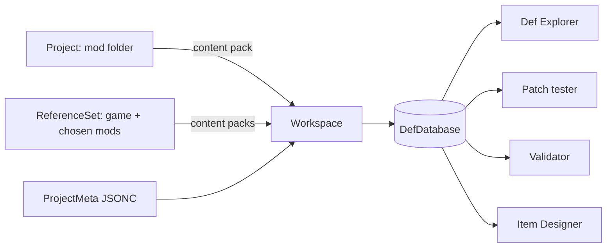
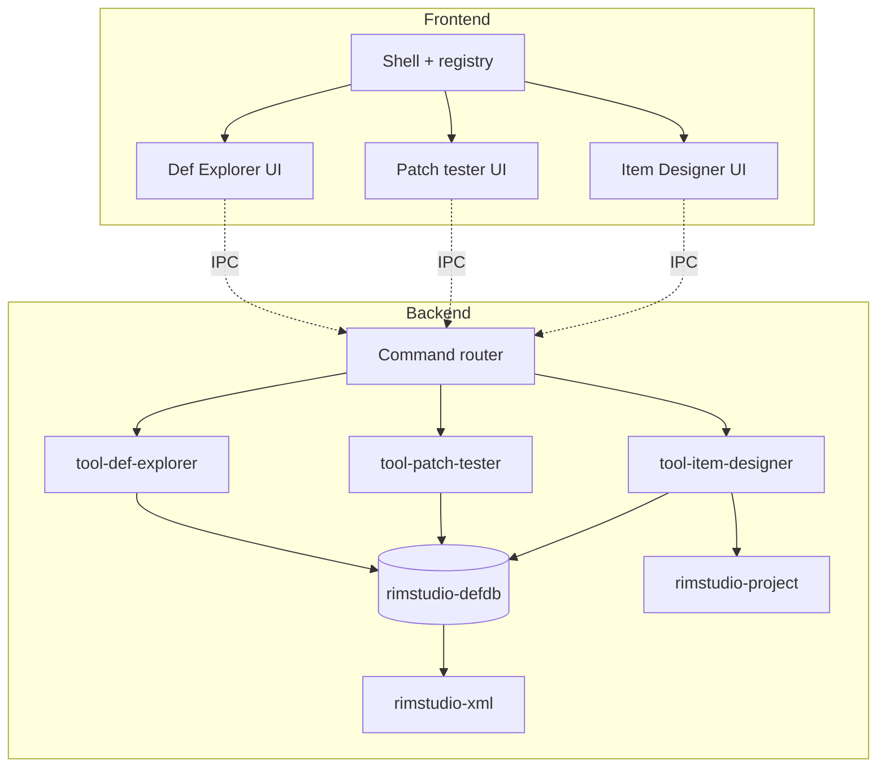

# RimStudio modding toolkit: scope, modules and priorities

Scope: what the modding toolkit half of RimStudio should contain, grounded in what modders do (corpus evidence, the owner's own mods, the documented creator plans of competitors) and in what a fast Rust def and patch engine can do that existing tools cannot. It lists candidate modules with purpose, user story, inputs and outputs, data needs, difficulty, dependencies, performance notes, phase and risks; recommends the module architecture (tool registry, shared def database, project model); gives the data model and where project metadata lives; and proposes a phased roadmap. The tool landscape behind it is in `docs/research/ecosystem-survey.md`.

Status: research note | Last verified: 2026-10-04

Evidence conventions: `corpus:` figures come from the scan of 690 Steam workshop folders (script and summary in `docs/research/data/mod-corpus/` and the scratch `corpus_summary.txt`; see `docs/research/rimworld-mod-format-and-corpus.md`). `decompiled:<path>` is game code described in my own words. Difficulty scale: S (days), M (1 to 3 weeks), L (1 to 2 months), XL (more than 2 months), for one developer who already has the shared def engine. Numbers for effort are judgement, not measurements.

## 1. Summary

| Decision | Reason |
| --- | --- |
| The manager stays first class and ships first; the toolkit is a set of independent tool modules that plug into it through a registry. | Owner priority; the manager's scan produces most of what the toolkit needs. |
| One shared Def database (def index, inheritance, patch provenance, reference index, file index) serves every module. It is built once per workspace and updated incrementally. | Rebuilding per tool wastes the engine's main advantage; the Python prototype took 19.8 s for vanilla plus CE mostly in patches (`docs/research/def-engine-semantics.md` section 9.4). |
| MVP toolkit: project workspace, About and version-folder linter, Def Explorer with resolved view and patch provenance, patch tester, reference and texture validator, Item Designer for weapons and apparel with CE patch output, log analyser. | Highest value per effort and the only combination no competitor has. |
| Later: schema-aware XML editor, texture toolkit, translation helper, CE patch generator for existing mods, Workshop publisher with staging. | Larger effort or dependent on MVP pieces. |
| Project metadata lives outside the mod folder by default (app data, JSONC), with an optional portable `.rimstudio/` folder that default ignore rules always exclude. | The earlier prototype stored its project file inside the mod folder, so it would be uploaded. |
| A compact JSON schema derived by reflection from the game assembly is feasible: 296 KB gzipped; validated vanilla at 0.006 percent unresolved elements. | Section 6. |

## 2. What modders need (evidence)

| Need | Evidence | Module |
| --- | --- | --- |
| Correct About.xml, version folders and LoadFolders | Of 690 workshop mods: 70.0 percent use version folders, 37.8 percent ship LoadFolders.xml, 51 (7.4 percent) have a loadFolders.xml with the wrong case, which breaks on Linux and macOS; 49 mods (7.1 percent) have a malformed dependency entry; 16 have a version folder not listed in supportedVersions; 8 claim 1.6 but have no 1.6, Common or LoadFolders content. | About linter, version-folder manager |
| Clean upload | The game uploads the whole folder; on the owner's 19 mod folders, 83.5 percent of bytes were build, source, VCS or layered art; 71 of 690 installed mods contain a VCS folder. | Build and packaging (`docs/research/workshop-publishing-research.md` section 7.1) |
| Duplicate and broken defs | 29 mods (4.2 percent) contain duplicate defNames within the same folder and type; 1,304 duplicate keys in total. | Conflict detector, validator |
| Patch debugging | 10,255 patch files in the corpus; 183,620 xpath occurrences (`docs/research/xpath-patch-coverage.md`); 2849 operations in vanilla plus CE alone. | Patch tester, "who patched this" |
| Text noise | 31 descriptions (4.5 percent) contain a size tag; 32 percent of About.xml files carry a byte order mark; 6,725 XML files have one. | Linter, description generator |
| CE compatibility | CE integrates 759 third-party patch folders by hand (`docs/research/ce-patch-conventions.md`); 75 workshop mods ship their own CE support. | CE patch generator, Item Designer |
| Creator tooling plans of a peer manager | RimCrow lists nine unbuilt creator items: dependency graph, def dependency graph, def editor, translation generator, Workshop publishing, bisect, def conflict analysis (`docs/research/rimcrow-analysis.md` section 5). | Validates the module list |
| The owner's workflow | About 30 mods on an external drive, several with hand-written CE patches; a VS Code based template on 1.5 folders; an earlier Go app with project create, open and settings (2,057 lines in `app.go`). | Project workspace |

The old app is at `/run/media/pawbeans/project_drive/pawbeans/Projects/Go/rim-studio` (Wails, Preact; project CRUD, game scan, settings; constant `projectConfigRelPath` in `app.go` is `Config/rimstudio.project.json`). Its file in the Gewehr 41 mod, `/run/media/pawbeans/project_drive/pawbeans/Projects/RimWorld Mods/[OH] Gewehr 41/Config/rimstudio.project.json`, contains `targetVersion`, `notes` and a `compatibility` object with `mode` ("all"), `selectedModIds` and `patchEntries`. That is the model for "compatibility mode: all or selected mods" in the CE generator.

## 3. Data model

### 3.1 Entities

| Entity | Definition | Stored where |
| --- | --- | --- |
| Project | One mod folder the user authors. Has packageId, name, mod root path, supported versions, optional LoadFolders model, list of version folders (`1.6`, `Common`, ...), defs, patches, textures, languages, assemblies (read-only for RimStudio), publish record (Workshop id). | Mod folder (RimWorld's own files, XML) plus project metadata JSONC outside it |
| ProjectMeta | Tool-owned settings: target game version, notes, compatibility mode and selected mods, ignore overrides, item designer drafts, calibration answers, last workspace reference set, publish history. | JSONC, section 3.3 |
| ReferenceSet | The game install (Core and DLC) plus chosen mods, with their load order. Resolved to a list of content packs in load order. | Derived from the manager's active list or a named profile |
| Workspace | An open Project plus a loaded ReferenceSet and one DefDatabase built from both (project content last). | In memory; recoverable from metadata |
| DefDatabase | Index of def nodes: type, defName, parent, abstract flag, source file and line, owning mod and load folder, resolved fields, patch provenance list, reference edges (def to def, def to texture path). | In memory with an on-disk cache (JSON, versioned, see section 3.4) |
| Tool | A registered module (section 5). | Static registration |

### 3.2 Project and workspace relations

The workspace builds the database by the game's own order: all packs in load order, project last, inheritance resolved, patches applied (`docs/research/def-engine-semantics.md`). Every def node records the pack and file it came from so provenance is free.

### 3.3 Where project metadata lives

Verified problem: the game uploads the full mod root with no ignore list (`docs/research/workshop-publishing-research.md` section 1.4), and the earlier app wrote its file to `Config/rimstudio.project.json` inside the mod root, so that file would ship to every subscriber.

| Option | Pros | Cons | Verdict |
| --- | --- | --- | --- |
| A. App data directory, one JSONC per project keyed by project id, with the mod path stored inside | Never shipped; survives moving to another machine only by export | Not visible to git; lost if the app data is wiped | Default |
| B. `.rimstudio/project.jsonc` at the mod root, always excluded by default rules | Travels with git and cloud sync; self-describing | Ships if the user bypasses the staging copy (the in-game uploader) | Opt-in "portable project" |
| C. Inside a shipped folder such as `Config/` | Simple | Ships; confuses mod loaders and other tools | Rejected |

Recommendation: A by default; B on request. Both have the same schema. The default ignore rules (`.rimstudio/`, build, VCS, source and raw art; list in the publishing note section 7.1) are applied by the staging copy, and the validator warns when `.rimstudio/` exists and the user is about to use the in-game uploader. The project id is the packageId lower-cased; if two folders share a packageId, a short hash of the absolute path disambiguates. On import, the old `rimstudio.project.json` from the owner's earlier app is read once and migrated.

### 3.4 Cache and formats

Per requirement R10, caches, project metadata, drafts, templates and exports are JSON or JSONC. XML is parsed and written only at the boundary crate when reading or writing RimWorld files (About.xml, Defs, Patches, LoadFolders.xml, Languages). The def database cache is keyed by content hash of each pack (path, size, mtime for the quick check; hash on mismatch) so a warm start re-parses only changed packs.

## 4. Module catalogue

Legend for phase: P0 = with the manager release, P1 = toolkit MVP, P2 = second wave, P3 = later. Deps column names modules and shared crates by role. "DefDB" is the shared def database. Each performance note is a target derived from corpus sizes (46,700 XML files and 22,401 def files across 690 mods; vanilla plus DLC is 1,558 def files and 13,808 defs), not a measurement.

| Module | Purpose and user story | Inputs and outputs | Data | Diff | Deps | Performance | Phase | Risks |
| --- | --- | --- | --- | --- | --- | --- | --- | --- |
| Project workspace and scaffolder | "I start or open a mod and get a correct skeleton for 1.6." Creates About, Preview placeholder, version folders, empty Defs and Patches, optional C# template link. | In: name, packageId, author, versions, options. Out: folder tree, ProjectMeta. | Templates (JSON), About model | M | Boundary XML crate, project store | Instant | P1 | Templates drift with game versions; keep templates data, not code |
| About.xml editor and linter | "I fix dependency, version and id mistakes before upload." Form editor with rules from the corpus (bad dependency entries, packageId format and case, missing 1.6, size tags in description). | In: About.xml. Out: edited About.xml, issue list. | Rules from `docs/research/rimworld-mod-format-and-corpus.md` | S | XML crate | Instant | P1 | Rule accuracy; rules must cite decompiled behaviour |
| Version-folder and LoadFolders manager | "I support 1.5 and 1.6 without duplicating files." Visual model of version folders, Common, LoadFolders conditions (version, active mods), detects missing and wrongly cased folders, shows which files each version loads. | In: folder tree, LoadFolders.xml. Out: edited LoadFolders.xml, effective file list per version and mod set. | Game load-folder semantics (decompiled:Verse/ModLoadFolders.cs, ModContentPack.cs) | M | XML crate, DefDB (file index) | Walk is I/O bound | P1 | Semantics around implicit Common and version fallback must match the game |
| Def Explorer | "I see any def, its parents, its children, every file that defines or patches it, and the final resolved XML." Search, inheritance tree, provenance panel, resolved view after patches, diff against vanilla. | In: DefDB. Out: views, copy as XML, open file at line. | DefDB | L | DefDB, patch engine | Search over 14k defs under 20 ms; tree virtualised; resolved view computed lazily per def | P1 | Patch edge cases (see `docs/research/def-engine-semantics.md`); UI scale on 600k nodes for large mod sets |
| XML editor with schema-aware completion | "I get field and defName completion and inline errors while typing." Embedded editor (a web code editor component) fed by the compact schema and DefDB. | In: XML text, schema. Out: edits, diagnostics. | Schema (section 6), DefDB for defName completion | XL | Schema generator, DefDB, editor component | Diagnostics incremental; completion under 50 ms | P3 | Largest scope; existing editor extensions already serve this need (ecosystem survey section 4.3); lower unique value |
| Patch tester | "I write an XPath operation and see exactly which nodes change, before launching the game." Pick an operation, run against the workspace DefDB, show matched nodes and a before and after diff; unsupported custom operations flagged. | In: PatchOperation XML or builder form. Out: match list, diff, error. | DefDB, XPath evaluator (tier plan in `docs/research/xpath-patch-coverage.md`) | L | DefDB, patch engine | Indexed defName and Name lookups avoid the 6 ms per operation linear scan seen in the prototype | P1 | XPath coverage; frameworks adding custom operations |
| Conflict detector | "I see which of my defs or patches collide with other mods." Duplicate defNames across packs, patches that fail to match, two patches editing the same node, order sensitivity. | In: DefDB with provenance. Out: issue list with files. | Provenance, patch events | M | DefDB | Reuses build pass | P1 | False positives for intentional overrides; allow rule suppressions in ProjectMeta |
| Missing-reference and texture validator | "My game logs red errors for missing textures and unknown defs; I find them without launching." Checks def references, texture paths (case-checked, Linux sensitive), sounds, graphic classes, MayRequire correctness. | In: DefDB and file index. Out: issues. | Reference edges, schema types (def reference fields) | M | DefDB, schema for which fields are references | Parallel file stat; cached file index | P1 | Needs knowledge of which fields reference defs (comes from field types in the schema) |
| Texture toolkit | "I convert and check my textures." Preview size and format check, power-of-two hints, DDS conversion via external encoder or in-house, mipmap options. | In: PNG files. Out: DDS files, report. | Texture rules (wiki page Textures) | L | Image crate, optional todds | Multi-threaded; BC7 is CPU heavy | P3 | todds is archived (ecosystem survey section 4.6); format correctness per platform |
| Translation helper | "I extract translatable strings and track missing ones per language." DefInjected and Keyed extraction, missing-key diff, export. | In: DefDB, Languages folder. Out: language files (XML), catalog JSON. | Fields marked translatable in the assembly (reflection) | L | DefDB, schema, XML crate | Linear | P3 | Many one-person tools exist; do only if time |
| Item Designer (weapons, apparel) | "I design a weapon and learn whether it fits vanilla (or CE) balance." Reference vanilla items from the user's install, math-based fit score, optional calibration quiz, formula mode, outputs ThingDef XML and CE patch. | In: design inputs, DefDB vanilla and CE values. Out: ThingDef XML, CE patch XML, report. | Vanilla stats (`docs/research/vanilla-ranged-weapons-analysis.md`, `vanilla-melee-weapons-analysis.md`, `vanilla-apparel-analysis.md`), CE conventions and formulas | XL | DefDB, XML crate, math crate | Computation trivial; reference set queries instant | P1 (weapons first, apparel next) | Fit judgement validity; CE data read at runtime only (R11); formulas pending (`docs/research/ce-autopatcher-formulas.md` is a stub) |
| CE patch generator for existing mods | "Make my existing weapon mod CE compatible." Scans a project, finds guns, melee, apparel, ammo, produces patch files in CE's idioms; modes all or selected mods. | In: project defs, CE data. Out: patch files under the project's `Patches/` with a CE load-folder gate. | CE conventions | XL | DefDB, Item Designer math, XML crate | One pass over project defs | P2 | Wrong stats if formulas are poor; reviewer must see an editable diff before writing |
| Log analyser | "I paste or tail Player.log and see the cause of errors, by mod." Groups errors, maps stack lines and texture or def messages to mods, links to wiki. | In: Player.log. Out: grouped issue list. | Log patterns, DefDB for mapping | M | Log parser | Streaming parse | P1 | Pattern drift per game version; keep patterns as data |
| Save-game inspector | "Which mods does this save need?" Reads the save header (mod list and versions) and compares it to the installed set. | In: .rws file header. Out: mod list diff. | Save header format (decompiled:Verse/ScribeMetaHeaderUtility.cs) | S | XML crate (RimWorld's own file), manager | Reads header only (stream the first kilobytes) | P2 | Large saves; read header without loading the document |
| Modlist profiles, diff and share | "I keep named lists, compare them and send one to a friend." | In: active list. Out: JSON profile, share text. | Manager's list model | M | Manager core | Instant | P0 (manager) | Belongs to the manager; listed here because toolkit workspaces reuse profiles |
| Workshop publisher | "I upload and update my mod from the same app." Staging copy, preflight, Steam call, change notes. | See `docs/research/workshop-publishing-research.md` | Preflight checks, ignore rules | XL | Staging, Steam sidecar | I/O bound; hard links where possible | P3 (owner priority: later) | Steam client dependency; Steamworks redistribution licence |
| Changelog and versioning | "I keep changelog and version consistent across About, Workshop and git." | In: project history. Out: changelog text, bumped `modVersion`. | ProjectMeta | S | Publisher, About editor | Instant | P2 | None |
| Description and BBCode generator | "I write one description and publish it as Steam BBCode and About text." Conversion with length checks (8000 limit in the publishing note section 7.2). | In: Markdown-like source. Out: BBCode, About description. | Steam markup rules | M | Publisher | Instant | P2 | Steam markup quirks |
| Build and packaging | "Ship only what players need." Staging copy with ignore rules and exact file preview. | In: project, ignore rules. Out: staged folder, plan JSON. | Ignore defaults (publishing note) | M | Project, `ignore` crate | Hard links; plan under 1 s for typical mods | P2 (needed by the publisher) | Symlinks, case sensitivity (publishing note section 7.1) |
| Dependency graph | "I see what my mod needs and what needs it." Mod-level graph, def-level reference graph. | In: About dependencies, DefDB edges. Out: interactive graph. | Dependency data from the manager, def edges | M | Manager, DefDB | Layout in worker for large graphs | P2 | Graph readability at 600 nodes |
| Dev launcher | "Test my mod in a clean game with one click." Isolated save folder, quick test, dev mode toggle, snapshot of ModsConfig.xml, tail log after exit. | In: project, options. Out: running game, log summary. | Verified flags (ecosystem survey section 3) | M | Manager launch code, log analyser | Process spawn | P1 | Process control per platform; reset-on-crash behaviour |
| Mod bisect | "Find the mod that breaks my game." Halving over the active list with dependency safety. | In: active list, log analyser. Out: suspect mod. | Dependency graph | L | Dev launcher, log analyser | Each step launches the game | P2 | Needs game launches (minutes per step); rimbisect proves demand |
| Def-diff and compare mods | "What changed between two versions of a mod, or between mods?" | In: two DefDB snapshots. Out: structured diff. | DefDB | M | DefDB | Linear | P3 | Low demand evidence; justified by update workflow |
| Update checker for authors | "Which of my mods will break on the next game version?" Compares referenced def and class names with a new install. | In: project, new game install. Out: report. | Schema from new assembly | M | Schema, validator | Linear | P3 | Needs assembly access at runtime or a bundled delta |

Added candidates not in the brief: dev launcher, mod bisect, def diff, update checker, save inspector (justified by evidence above or in the survey).

## 5. Architecture

### 5.1 Tool registry

Each tool is three parts, none of which knows about the others except through the registry:

1. A frontend feature module (Preact components, its own routes and state) exporting a tool descriptor: id, title, icon, route, required capabilities, command palette entries.
2. A backend service crate `rimstudio-tool-<name>` exposing a small trait for registration: tool id, the commands it handles (names and payload schemas), and the DefDB queries it needs.
3. The shared crates: `rimstudio-defdb` (index, inheritance, patches, provenance), `rimstudio-xml` (the single XML boundary), `rimstudio-project` (project model and metadata store), and the manager's mod list crate.

The registry is a static table assembled at compile time (no dynamic plugins in the first release; RimCrow's plan lists plugins but RimStudio's crate layout already gives modularity). The shell shows only tools whose capabilities are met (for example the Item Designer requires a loaded game install; the Publisher requires a Steam connection).

### 5.2 Sharing the DefDB

* One DefDB per workspace, held behind a read-optimised handle (immutable snapshots; a rebuild produces a new snapshot and swaps it). Tools hold a snapshot id; the UI shows "stale" when the snapshot is older than the files on disk.
* File watching on the project folder triggers incremental re-parse of changed files and a patch re-run limited to affected operations; the full rebuild is the fallback.
* Tools must not parse XML themselves. They read DefDB queries and ask the XML crate to write.
* Large results travel over IPC as paged or virtualised queries (see `docs/research/webview-and-ipc-performance.md`), never as a full dump.

### 5.3 Why this split

The manager already scans packs and ordering; the toolkit consumes that. A tool module can be removed without touching others, new tools need no changes to the DefDB crate, and each can be tested alone with a fixture DefDB.

## 6. Schema feasibility (XML editor and validator)

Question: can a schema be derived from the game assembly's class fields rather than written by hand?

Method (script in `docs/research/data/schema-probe/`): a small .NET program reads `Assembly-CSharp.dll` through `MetadataLoadContext` (inspects metadata without running game code), walks every Def subclass and the closure of field types, and records per class: base class, abstract flag, kind (class, struct, enum), field names and types, the load-alias and unsaved attributes, enum members, whether the type has a custom XML loader. A Python script validates every vanilla def (Core plus five DLC) against that schema using the same rules the game applies when it deserialises (field lookup by name, list items as `li`, scalar parsing, def-reference fields; decompiled:Verse/XmlToObjectUtils.cs, decompiled:Verse/DirectXmlToObject.cs).

Results (this machine, build 1.6.4871):

| Metric | Value |
| --- | --- |
| Types in the closure written to the schema | 7,499 |
| Def classes among them | 255 |
| Fields recorded | 19,787 |
| Types with a custom XML loader (cannot be described by fields) | 64 |
| Enum types | 243 |
| Fields with load aliases | 27 |
| Schema size | about 3.0 MB raw, 296 KB gzipped (not pruned; pruning to Def classes and reachable types was not tried) |
| Vanilla defs validated | 13,808 in 1,558 files (Core, Royalty, Ideology, Biotech, Anomaly, Odyssey) |
| Elements checked | 168,009 |
| Unresolved element occurrences | 10 (0.006 percent), in 4 distinct root tags: `jobDef`, `CreepjoinerRejectionDef`, `BackStoryDef`, `StructureStructureLayoutDef` (case-variant or legacy tags the game tolerates) |
| Case-insensitive-only matches | 0 |
| Custom-loader occurrences skipped | 81 (two types) |
| `[Unsaved]` fields set in vanilla XML | 0 |
| Fields declared directly on `Verse.ThingDef` (its base class is `Verse.BuildableDef`; inherited fields come from the base chain) | 204 |

Conclusions:

1. Derivation by reflection works. A dev-time generator (run when a game version changes, output committed as a versioned JSON artefact or generated at install time from the user's own assembly) can ship a compact schema. Licence note (R11): the schema is names and types only, derived by tooling from the user's install at generation time; whether a shipped copy of those names is acceptable should be decided by the owner (open question 2). The safest route is generating it at first run from the user's install.
2. What reflection cannot give: custom-loader types (64 of 7,499), `Class="..."` polymorphism in lists (comps, workers, modExtensions) beyond the type's declared base, def-reference semantics where the field type is a Def subclass (this is available: a field typed as a Def class is a reference), and mod-added classes (read the same way from each mod's assemblies; the language server does this dynamically, ecosystem survey section 4.3).
3. Mod assemblies add types. A second pass over the project's own and referenced mod DLLs, loaded by metadata only, yields the extra def classes for frameworks such as CE (`CombatExtended.AmmoSetDef` appears 1,148 times in the corpus).
4. The generated schema supports: completion, unknown-field warnings, enum value checks, list shape checks, def-reference validation, translatable-field extraction. These checks are what the validator, the texture validator and the translation helper need, so the schema is a P1 dependency even though the editor is P3.

## 7. Phased roadmap (value per effort)

Ordering respects the owner's priorities: manager first, items tool next, publisher later.

| Phase | Contents | Rationale | Exit test |
| --- | --- | --- | --- |
| P0 manager | Manager core, profiles, rules, custom folders, dev launcher basics (launch with flags) | Owner priority; shared scan and DefDB skeleton | Loads and sorts a 600 mod list; opens game |
| P1a engine | `rimstudio-xml`, `rimstudio-defdb` (inheritance, patches with provenance), schema generator, project model, About linter, version-folder manager | Every later module depends on them; linters are cheap wins | Vanilla plus DLC defs resolved equal the reference output in the golden test; 0.006 percent or fewer unresolved elements |
| P1b exploration | Def Explorer, patch tester, conflict detector, missing-reference and texture validator, log analyser | Highest unique value; modders see their mod's problems without launching | Opens "Gun_AssaultRifle" with five patch operations listed and the resolved XML (the case measured in `docs/research/def-engine-semantics.md` section 9.3) |
| P1c items | Item Designer for ranged weapons, then melee, then apparel; vanilla reference; formula mode; calibration quiz; ThingDef XML and CE patch output | Owner priority R7 | Generated vanilla-style weapon passes the validator; CE patch matches CE idioms checked against `docs/research/ce-patch-conventions.md` |
| P2 | CE generator for existing mods, build and packaging, changelog, description and BBCode generator, dependency graph, mod bisect, save inspector | Needs P1 pieces | CE generator converts the owner's Gewehr 41 into a patch the user can review |
| P3 | Workshop publisher, texture toolkit, translation helper, XML editor, def diff, update checker | Larger effort or external dependencies | Per module |

Value per effort ranking (judgement): About linter (S, high), log analyser (M, high), Def Explorer (L, very high), patch tester (L, very high), validator (M, high), Item Designer (XL, very high for the owner), CE generator (XL, high), publisher (XL, medium now), XML editor (XL, medium because editors exist), textures (L, medium), translation (L, low).

## 8. Per-module notes worth more than a table row

### 8.1 Def Explorer

Views: (1) search and filter by type, mod, load folder, abstract; (2) inheritance tree (parents via `ParentName`, children computed); (3) provenance list: defining file, each patch operation that touched the def, with the operation's source file and order; (4) resolved view: the final merged XML after inheritance and patches, with unchanged versus changed fields highlighted against vanilla. The prototype on vanilla plus CE shows why provenance matters: for `Gun_AssaultRifle` five operations touch it, and the CE gun values live in the parameters of a custom operation rather than in plain edits (`docs/research/def-engine-semantics.md` section 9.3), so the explorer must display custom-operation payloads, not only node diffs.

### 8.2 Patch tester

Runs one or a sequence of operations against the current snapshot without writing files. Output: nodes matched (def and path), result diff, failure reason with the game's own semantics (a Replace with no match is a failure; a `success` mode on Sequence and Conditional changes interpretation; see `docs/research/xpath-patch-coverage.md`). XPath engine tiers A, B, C cover 89.7, 97.2 and 99.82 percent of the corpus occurrences, so the first release implements tier B and flags the rest.

### 8.3 Item Designer and CE generator boundary

Shared maths in one crate used by both. The designer builds new items; the generator maps existing items. Both read vanilla and CE values from the user's install at runtime (R11): never ship CE data. The designer's two modes (R7): formula mode (simple, stateless) and calibrated mode (reference-based, quiz). The mathematics of "fits" is specified in `docs/research/ce-autopatcher-formulas.md` (currently a stub in the repository; its content must exist before this module starts).

### 8.4 Dev launcher

Uses only verified flags (survey section 3): `-quicktest`, `savedatafolder=<path without '=' >`, `-popupwindow`, and Prefs.xml `devMode`. Before launching: snapshot ModsConfig.xml, set the test mod list, optionally point to a clean save folder. After exit: restore ModsConfig.xml if the user asked, run the log analyser on `Player.log`.

## Implications for RimStudio

1. Create a shared crate `rimstudio-defdb` and make it the only source of def, inheritance, patch and reference data; no tool crate may parse Defs XML directly (test: a lint script greps tool crates for the XML parser dependency).
2. Store project metadata in the app data directory by default as JSONC keyed by project id; support an opt-in `.rimstudio/project.jsonc` that default ignore rules always exclude; never write metadata into `Config/`, `About/` or any other shipped folder (test: staging a project with metadata present produces a plan that excludes it).
3. Import the owner's earlier `Config/rimstudio.project.json` fields (`targetVersion`, `notes`, `compatibility.mode`, `compatibility.selectedModIds`, `compatibility.patchEntries`) once on first open and offer to delete the old file.
4. Implement the tool registry as a compile-time table: each tool supplies a frontend module, a backend crate and capability requirements; the shell hides tools whose capabilities are unmet.
5. Build the schema generator as a dev-time tool (reflection through metadata loading, no game code executed); the vanilla validation test must keep unresolved elements at or below 0.01 percent, and the generator must be re-run on every game version bump. Decide generate-at-first-run versus shipped artefact (open question 2).
6. P1 deliverables in order: xml and defdb crates with golden tests, About and version-folder linters, Def Explorer with provenance, patch tester, validator, log analyser, Item Designer (weapons first, then apparel).
7. The Def Explorer must show, for any def, the defining file, every touching patch operation in order, and the resolved XML; custom patch operations are shown with raw payload and marked "not simulated".
8. Cache the def database per pack by content hash; a warm start with unchanged packs must not re-parse XML (test: second open of the same workspace parses zero files).
9. The dev launcher snapshots ModsConfig.xml before every launch and rejects `savedatafolder` paths containing `=`.
10. The staging copy is mandatory for Workshop publishing and is built before the publisher (build and packaging in P2, publisher in P3) so the publisher cannot ship `.git`, `Source/`, `Raw Assets/` or `.rimstudio/`.
11. CE and vanilla values for the Item Designer come only from the user's install at runtime; nothing derived from CE data files is committed (test: repository scan for CE value tables).
12. Every tool declares its performance target and a fixture-based benchmark; Def Explorer search over vanilla plus DLC (13,808 defs) must answer in under 20 ms (target, to be measured).

## Open questions

1. How should the owner's earlier compatibility `patchEntries` object be used: what do its keys and values contain? The only sample has an empty object, and the old app was not analysed beyond its constants.
2. May a pre-generated schema (class and field names only, derived from Assembly-CSharp) be shipped in the repository, or must it always be generated from the user's install at first run? Treated here as the safer second option.
3. Which texture strategy: wrap an external DDS encoder (todds is archived; the successor is unproven) or write an in-house BC7 encoder?
4. Where does the Item Designer's "fits" model get its data when CE is not installed (vanilla-only mode) and how is the calibration quiz stored (JSON in ProjectMeta or global settings)?
5. Should the XML editor be built at all, given that VS Code and Rider extensions already provide completion, or should RimStudio expose its schema and DefDB as a language server for existing editors instead?
6. Does the owner want the mod bisect flow in the manager (P0 or P2) rather than the toolkit?
7. The probe records only fields declared on each class, so per-def field counts need the base chain applied; the generator should record effective field counts when it is productised.
