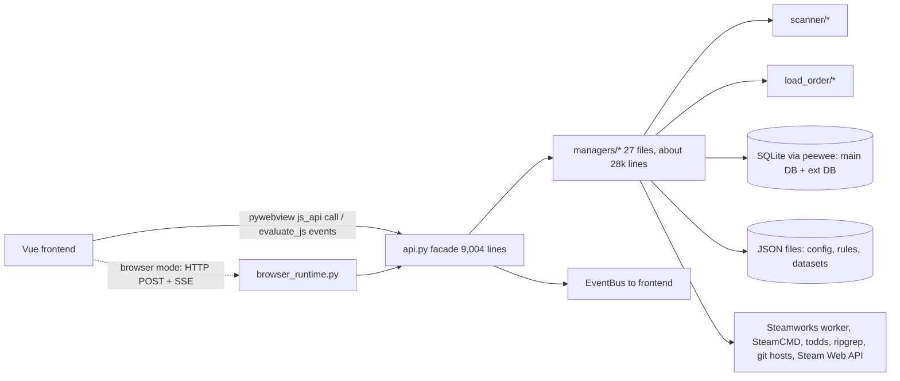

# RimCrow analysis

Scope: an analysis of RimCrow (MIT licence, Python backend, pywebview desktop shell, Vue 3 and Tailwind 4 frontend), the second reference mod manager next to RimSort. It covers what RimCrow does, how it is built, how its frontend behaves, what its published mod-creator plan contains, and which of its ideas RimStudio should adopt or avoid. RimCrow is a read-only concept reference: everything below is described in my own words and nothing is copied from it.

Status: research note | Last verified: 2026-10-04

Evidence pointers are relative to the repository root. The local checkout is `RimCrow-main/` (version 0.24.7 according to `RimCrow-main/backend/_version.py`). Upstream facts come from the GitHub repository https://github.com/Inky-Feather/RimCrow (release list, issue list, commit feeds and language statistics fetched on 2026-10-04 and stored as JSON in the scratch folder `rimcrow-analysis/`).

## 1. Overview

### 1.1 What it is

RimCrow (formerly called RimModManager, renamed in 2026) is a desktop mod manager for RimWorld that folds a lot into one program: mod scanning, drag-and-drop load order, a rules-based auto sort, backups and diffs of load orders, Workshop search and download, Git-hosted mods, leftover cleanup, texture optimisation, log reading, a file-content search, and "assistant" features (chat-style log diagnosis and batch alias generation). The README states the platform status honestly: Windows is the primary platform, macOS has basic path support only, Linux is "in progress" and neither desktop runtime, Steamworks nor packaging is promised there (`RimCrow-main/README.md` section "兼容状态"; English summary in `scratchpad/rimcrow-analysis/README_EN_dev.md`).

### 1.2 Facts table

| Fact | Value | Evidence |
| --- | --- | --- |
| Licence | MIT | `RimCrow-main/LICENSE`; GitHub repo metadata (`repo.json`) |
| Version | 0.24.7, database schema version 5, build tag "dev" | `RimCrow-main/backend/_version.py` |
| Repo created | 2026-06-21 | GitHub metadata, accessed 2026-10-04 |
| Releases | 4 in about five weeks: v0.22.6 (2026-06-24, still under the old name), v0.23.7 (06-29), v0.23.9 (06-30), v0.24.7 (07-27). Each release has one Windows zip of about 67 to 70 MB. No Linux or macOS artefact. | GitHub releases feed (`releases.json`) |
| Activity | One contributor (about 40 contributions), 160 stars and 7 forks at fetch time, 10 open issues; issues were still being filed as late as 2026-10-03, but no release since 2026-07-27 | `contributors.json`, `repo.json`, `issues.json` |
| Branch model | `main` follows release snapshots, `dev` is where work happens | README "分支说明" |
| Backend size | 111 Python files, 68,101 lines; the single bridge class `RimCrow-main/backend/api.py` is 9,004 lines with about 391 methods | line counts with `wc -l` |
| Frontend size | about 65,100 lines of Vue and JavaScript in `RimCrow-main/frontend/src` (JavaScript, not TypeScript) | `wc -l` |
| Locales | 6 JSON catalogs (zh-CN, zh-TW, en, de, ko, ru) of 7,537 lines each, 45,222 lines in total | `RimCrow-main/frontend/src/locales/` |
| Tests | 67 Python test files, about 853 test functions, 21,757 lines; 3 small JavaScript test scripts and a loader | `RimCrow-main/tests/` |
| Stack | Python 3.11+, uv, peewee on SQLite, pywebview, Vue 3.5, Vite 7, Pinia 3, Tailwind 4, vue-i18n 11, TanStack Virtual and vue-virtual-scroller, CodeMirror 6, driver.js; packaging with PyInstaller or Nuitka (optional UPX) | `RimCrow-main/pyproject.toml`, `RimCrow-main/frontend/package.json`, `RimCrow-main/pack_nuitka.py` |
| Maintenance signals | No CI workflow in the checkout (`.github` absent), but a `prebuild` hook runs the i18n consistency check; the release flow is manual (zip on GitHub and a file-sharing site) | `RimCrow-main/frontend/package.json`, README "下载" |

### 1.3 Maturity assessment

RimCrow moved from nothing to a feature-rich 0.24 in five weeks, which shows in the code: large single files (`mgr_steam.py` 3,664 lines, `mgr_texture_opt.py` 3,472, `mgr_github.py` 2,510, `workspaceStore.js` 2,699 lines), Chinese source strings embedded as default texts everywhere, and a Windows-first design (batch-file link creation, `todds.exe` only, WebView2). The data-safety work is nonetheless unusually careful for its age (atomic JSON writes, backup rotation with a read-back check, database repair path, idempotent upgrade migrations, credential store migration). Open issues show where the design hurts in practice: a hang while reading game logs (#17), a failure after setting a SOCKS5 proxy (#16), an exFAT disk where the link-deployment feature still blocks launching even when switched off (#15), an auto-path conflict when a local RimWorld copy exists (#22), and a Workshop clean-up that cannot remove missing items (#19). These issues are a useful checklist of things to design out.

## 2. Feature inventory

Legend: Adopt means build the same capability roughly as described; Adapt means build it with a different mechanism or scope; Skip means leave it out of RimStudio v1. RimSort-specific comparison is in section 6.

### 2.1 Mod library and list management

| Feature | User-visible behaviour | Source module | Notes | Decision |
| --- | --- | --- | --- | --- |
| Scanning | Scans game Mods, Workshop folder and a "manager library" folder; incremental on rescan; progress bar with stages; can be cancelled | `backend/scanner/mod_scanner.py` (800 lines), `parser_xml.py`, `analyzer.py`, `parser_dlc.py` | Skips unchanged mods by comparing a stored snapshot (modification time, optional folder size); 4-thread pool; physical path hash is the primary key. Details in 3.2 | Adopt, but parallel in Rust and with fewer stages blocking the UI |
| Mod type classification | Each mod is labelled Assembly, XML, Texture, Audio, Mixed or LanguagePack | `scanner/analyzer.py`, `file_stats` column | On the owner's 690 Workshop mods this labelled 425 Assembly, 148 XML, 71 Texture, 44 Mixed, 1 Audio, 1 LanguagePack (scratch benchmark, section 3.2) | Adopt (cheap and useful as a filter) |
| Disable by renaming `About.xml` | "Strict disabled mode": a disabled mod gets its About file renamed so the game cannot see it; a scan reverts or re-applies the state | `scanner/analyzer.py` (`resolve_mod_about_state`), `mod_scanner.py` | Touches user files in mod folders and handles the case where both files exist (deletes the `.disabled` leftover) | Skip: RimStudio should never rewrite another mod's files for a state flag |
| Groups, tags, colours, notes, alias | User metadata per mod: free tags, a colour sign, a note, an alias name; named colour groups with ordered members, folding and a dividers concept | `database/models.py` (`UserModData`, `GroupData`, `GroupMod`), frontend `features/mod/GroupList.vue` | Stored in SQLite keyed by package id (NOCASE). Issue #13 shows users want custom group colours | Adopt |
| Batch edit, multi-select, keyboard selection, undo and redo | Drag several rows, edit tags for a selection, undo list edits | `frontend/src/features/mod/stores/mod-store/listHistory.js`, `selection.js` | History is a frontend store (187 lines), not persisted | Adopt (undo/redo of list edits is a strong UX feature) |
| Sorting and filtering | Sort by name, creation, modification, activation time, source, type, save-breaking flag, unknown; text filter and locate-in-list box per column | `features/mod/list/useModListQuery.js` | Two search boxes per column: "locate" and "filter" | Adopt, merge into one box with operators |
| Coexisting versions | The same package id may exist as a Workshop copy and a local copy; the list token can carry a `_steam` or `_local` suffix to choose which instance is meant; localise a Workshop mod into a local copy | `load_order/package_tokens.py`, `managers/mgr_files.py` (`localize_workshop_mods`) | Solves a real problem (duplicates), but the token suffix leaks into several layers | Adapt: model "instance" explicitly (package id plus source) rather than string suffixes |
| Duplicate, leftover and missing items | An "inventory hub" shows mods that are missing, deleted (soft state), duplicated, or whose uninstalled folders still hold leftover settings files | `database/models.py` (`ModAsset.state`: present, missing, deleted), `managers/mgr_mod_residue.py`, frontend `features/mod-residue/` | A whitelist file marks leftovers to keep; missing Workshop items offer re-subscribe or re-download | Adopt (soft deletion state plus residue finder), simplified |
| ModSettings manager | Lists the official per-mod settings files (`Mod_*.xml` in the user config folder) and lets users clean them; has its own link-prefix convention | `managers/mgr_mod_settings.py` | Matches a real need (stale settings after uninstall) | Adopt later |
| Mod package export and import | Exports mod folders plus a manifest as a bundle with range selection, conflict pre-check, disk-space check and cancellation | `managers/mgr_mod_package.py` | Useful for sharing a whole setup including the mods | Adapt (post v1) |
| Multiplayer compatibility hints | Per-mod status from the RimWorld Multiplayer compatibility table (incompatible, barely compatible, unknown) | `managers/mgr_multiplayer_compat.py`; URLs in `settings.py` | Niche but cheap: one JSON table fetched at runtime | Adapt (optional dataset) |

### 2.2 Load order

| Feature | User-visible behaviour | Source module | Notes | Decision |
| --- | --- | --- | --- | --- |
| Save to ModsConfig | Writes the active list to the profile's `ModsConfig.xml`; Ctrl+S; repairs a broken file by first backing it up | `managers/mgr_load_order.py` (1,139 lines) | The backup of a broken file is kept separately (`_backup_broken_modsconfig`) | Adopt |
| Backup rotation | Every save writes a backup. Today's backups all stay in a `today` folder; older days keep only the last backup of each day in `earlier`; backups older than a retention window are deleted, always keeping at least one; a read-back check validates each backup | `mgr_load_order.py` (`_rotate_backups`, `_verify_backup_readable`), tests `test_load_order_backup_rotation.py` | A lock serialises rotation; failures are reported without pretending the main save failed | Adopt, keep the policy, store as JSON |
| Backup management | List, rename, delete, load, save as, open folder, view backups of other profiles | `managers/mgr_load_order.py`, frontend `features/load-order/BackupList.vue` (912 lines) | | Adopt |
| Diff view | Compares the current list with a backup or sorted result (added, removed, moved) | frontend `features/load-order/ListDiffView.vue` (868 lines) | Also used to preview what auto sort would change | Adopt (high value, show before applying a sort) |
| Import formats | Detects and reads: `ModsConfig.xml`, `ModList.xml`, RML files, save games (the mod list inside a `.rws`), RimSort JSON, RimPy XML, plain text, Workshop id lists, RimCrow JSON, and a share code | `load_order/models.py` (format constants), `load_order/detector.py`, `load_order/parsers.py` (645 lines) | The detector tries several text encodings (UTF-8 with BOM, UTF-16 variants, UTF-8, cp1252) | Adopt (import from RimSort and RimPy is directly relevant to R6) |
| Share code | A short text token with a `RC-` prefix: CRC32 checksum plus URL-safe base64 of a zlib-compressed JSON list of package id, Workshop id and name; a legacy `RMM1-` prefix is still accepted | `load_order/share_code.py` | Great for chat-sized sharing of a list; the checksum catches truncated pastes | Adopt with an RimStudio prefix and a versioned JSON payload |
| Import check | After parsing an imported list, reports which entries are missing locally, version differences, and offers subscribe or download for missing ones | `load_order/import_check.py` (673 lines) | | Adopt |
| Game launch | Launch through Steam or directly, with per-profile arguments; before launch, links are synchronised (see 3.7) | `api.py` (`_launch_profile_with_runtime_links`), `managers/mgr_game.py`, `mgr_game_monitor.py` | Also tracks "last played" and watches the running game | Adopt, but see the pitfall on link deployment |

### 2.3 Sorting, rules and issue hints

| Feature | User-visible behaviour | Source module | Notes | Decision |
| --- | --- | --- | --- | --- |
| Auto sort | One button reorders the active list; two selectable strategies ("classic" and an "edge-enhanced" variant that pulls top and bottom tagged mods harder to the ends) | `managers/mgr_sorter.py` (1,200 lines) | Pipeline: build atomic groups (interlocks, language packs), build a weighted constraint graph, break cycles by removing the weakest rule edge, propagate weights, topological sort with name-stable tie-break. Keys of the strategy setting are written to config, so names are kept semantic | Adapt: implement as a pure Rust crate with the same stages; offer one default strategy first |
| Rule sources and priority | Five rule sources in a user-orderable priority: user, native (About.xml), community, dynamic, workshop; each rule edge gets a weight derived from the source's rank so cycle breaking removes the weakest | `managers/mgr_rules.py` (1,335 lines) | Edge weights deliberately live in a different number domain than position weights (so they cannot be confused); the source also lists `loadTop` and `loadBottom` | Adopt the layering idea, which fits R6 |
| Position weights | Numeric 0 (top) to 1000 (bottom), default 500; special fixed weights for Harmony, the base game and each DLC, and for HugsLib | `mgr_rules.py` (`SPECIAL_WEIGHTS`) | Hard-coded package ids of the base game, DLCs, Harmony, HugsLib | Adapt: put the anchors in a dataset, not code |
| Dynamic rules | User-written conditional rules on mod fields (for example by author or mod type) that set a weight, shift a weight, or add load before or after constraints; values are clamped and sanitised on load | `mgr_rules.py` (`_sanitize_dynamic_rule`, `_match_mod_condition`) | A small rule DSL with six action types (weight set, weight shift, load after, load before, top, bottom) | Adapt (good power-user feature, later) |
| Community rules and datasets | Same upstream datasets as RimSort: community sorting rules JSON, the Steam Workshop database JSON, the Use This Instead replacement list (gzip), plus a Multiplayer table | `settings.py` (URLs, paths), `managers/mgr_workshop_db.py`, `database/models_ext.py` | Datasets are imported into a separate SQLite file and only rebuilt when the source file's size or time changed; the loader accepts both a `rules` wrapper and a bare dictionary | Adopt (confirms R6 data sources and the "rebuild only when changed" idea) |
| Dependency relations | Dependencies, load-after, load-before and incompatibilities come from About.xml plus rules, and drive the issue hints and auto sort; a dependency graph window exists | `ModAsset` columns, frontend `features/mod/DependencyGraph.vue` (841 lines) | The active column draws coloured relation lines between mods (see the screenshot `doc/assets/主界面.png`) | Adopt (relation lines are distinctive and readable) |
| Interlocked mods ("chains") | The user can lock several mods into a fixed sequence that sorting treats as one atomic group; broken chains are flagged and can be repaired | `database/models.py` (`ModInterlock.chain`), sorter atomic groups, issue `link_wrong_order` | Issue #6 (order inconsistent with selection order) shows rough edges | Adapt: name it "pinned sequence" |
| Issue hints | Red errors and yellow warnings per mod: missing file, missing dependency, inactive dependency, incompatible, wrong order, version mismatch, interlock missing or wrong order, missing language, inactive language pack, unknown or inactive target, multiplayer states, and an info type "alternative used"; issues can be ignored per mod | frontend `shared/lib/constants.js` (`ISSUE_TYPE`), `features/mod/stores/mod-store/issues.js` (645 lines) | Computed in the frontend store, not in the backend, so the logic cannot be tested or reused outside the UI | Adopt the taxonomy, compute in the Rust core |
| Language-pack handling | Language packs are tied to an owner mod and sorted right after it ("tightening"); the owner can be overridden | `load_order/language_pack_ownership.py` (436 lines), sorter | | Adopt (real quality of life for non-English players) |
| Reset and conflict dialogs | Dedicated resolver dialogs for sort rule conflicts and for conflicts at import | frontend `features/dialogs/SortRuleConflictResolver.vue` (1,076 lines), `ConflictResolver.vue` | Shows the cycle path the sorter broke | Adopt (explain cycles in words) |

### 2.4 Workshop, Steam and other sources

| Feature | User-visible behaviour | Source module | Notes | Decision |
| --- | --- | --- | --- | --- |
| Workshop search | In-app search with sort modes, Workshop id search, details, dependants, same-author items, replacements, cover and screenshot cache | `managers/mgr_steam_api.py` (1,724 lines) | Uses the Steam Web API `IPublishedFileService/QueryFiles` with a user-provided key (stored in the credential store); paging uses a cursor | Adapt (optional, key required) |
| Collections | Resolve a Workshop collection, save it as a subscribed collection, subscribe to missing children | `database/models.py` (`SubscribedCollection`), frontend `features/workspace/views/CollectionCommand.vue` | | Adopt later |
| Steam client subscriptions | Subscribe and unsubscribe through the Steam client via the Steamworks library | `managers/mgr_steam.py` (3,664 lines) with the `submodules/SteamworksPy` submodule | Steamworks calls run in a separate worker invocation (`run_steam_worker`) so a native crash cannot take the app down; needs a runtime library per platform which the user must build outside Windows | Adapt: isolate the same way, ship per-platform libraries only once Linux and macOS are verified |
| SteamCMD downloads | Downloads items into the manager library without the Steam client; task list with progress and stop; tool environment check; proxy support | `managers/mgr_steamcmd_core.py`, `mgr_steam.py`, `mgr_download.py` | Needs the library folder on a filesystem that supports junctions; the docs ask for a path without non-ASCII characters | Adapt (anonymous SteamCMD is useful where Steam is absent) |
| Built-in browser | A second pywebview window for Workshop pages; for Steam community pages a renderer produces a cleaned page with an "open original" button | `managers/mgr_sub_browser.py`, `browser_runtime.py` | | Skip: open the system browser and the `steam://` URL |
| Git-sourced mods | Subscribe to a repository on GitHub, GitLab or GitGud (or a direct zip); installs from a release asset or a source archive; remembers installed version, branch and local folder; a timeline of actions; "provider catalogs" list known mod repositories; issue #12 asks for branch selection | `managers/mgr_github.py` (2,510 lines), `database/models.py` (`GithubModRecord`, `GithubTimeline`) | Uses both the REST APIs and scraping of release pages as a fallback; records are the "deployment records" | Adapt: a small "external source" feature later; use release assets, avoid scraping |
| Package-id tracing | For active entries that only have a package id, searches local datasets for the Workshop origin to offer download or subscribe | README section 2, `workshop_db` tables | Uses the Steam database dataset | Adopt (very handy after importing a list) |

### 2.5 Texture optimisation

| Feature | User-visible behaviour | Source module | Notes | Decision |
| --- | --- | --- | --- | --- |
| DDS generation | Converts PNG textures to DDS next to the originals (originals untouched); BC1 for opaque images and BC7 for images with alpha; mipmaps optional | `managers/mgr_texture_opt.py` (3,472 lines, `ToddsEncoder`) | Calls the external `todds` tool; auto-integration is Windows only (the download asset name is `todds_Windows_<version>`, fallback 0.4.1) | Adapt: use a Rust DDS encoder crate or call todds on Linux; see 2.6 below |
| Scaling | Choose a scale from 100% down to 20%, with a minimum short-side limit (default 128) that stops tiny icons being crushed; images that would fall below the limit "fall back" to a safer ratio or keep the original size; masks and out-of-range images are left alone | `doc/贴图优化说明.md` (a player-facing write-up) | The write-up recommends DDS plus 50 or 60% plus min 128 plus mipmaps for big mod lists, and explains that the game's own texture-compression option is separate | Adopt as a later tool, same ratio and floor semantics |
| ZSTD output | Optionally compresses each DDS to a `.dds.zstd` file (disk saving) for a companion mod named "Image Opt" to read | `mgr_texture_opt.py` | Depends on a third-party mod; runs a bounded thread pool | Skip for v1 |
| Planning, history, exclusions, cleanup | A scan produces a plan per mod (thread pool), results history keeps the last 3 runs, per-mod exclusion rules, a clean-up of leftover DDS files, failure skip and retry | `mgr_texture_opt.py` (`TEXTURE_RESULT_HISTORY_LIMIT = 3`) | Estimates video-memory use before and after | Adopt the plan-then-apply flow and the leftover cleanup |

### 2.6 Logs, search, assistant features, i18n, onboarding, export

| Feature | User-visible behaviour | Source module | Notes | Decision |
| --- | --- | --- | --- | --- |
| Log viewer | Reads `Player.log` and the app's own log in pages (default 1,000 lines per page), live tail, a quiet-mode entry, log paths follow the profile | `managers/mgr_game_logs.py` (796 lines), frontend `features/app-log/UnifiedLogPanel.vue` | Issue #17 reports a freeze reading logs, so paging must not parse whole large files on the UI path | Adopt with streaming parse |
| Error clustering | Log blocks are classified into inferred types (XML syntax error, def config error, cross-reference error, assembly conflict, tick exception, draw exception, null reference, out of memory, missing texture, missing def, XML field error, missing reference, translation error, package id format error) and related mod namespaces are extracted to point at the culprit mod | `mgr_game_logs.py` (`INFERRED_TYPE_LABELS`, analyzer class) | Pattern-based, no model needed | Adopt (strong, deterministic, testable; fits the XML tooling goal) |
| File-content search | Searches mod files with regex, streaming results; restricts to "effective files" of the active mods by resolving `LoadFolders.xml`, version folders and conditions, cached by modification time; ripgrep is the preferred engine with a Python fallback | `text_search/effective_files.py` (1,065 lines), `backends.py`, `manager.py` | Resolving which files the game would really load is the clever part | Adopt (the same capability serves the def explorer; implement natively with the `ignore` and `regex` crates) |
| Assistant-style log diagnosis | Multi-turn chat with streaming replies, tool calls (get log context, search mods, get active list, get mod info, get rules, get user data, get group mods), token counts, interruption; the user supplies an endpoint, key and model | `ai/assistant_runtime.py` (2,247 lines), `ai_tools.py`, `ai_gateway.py` (via litellm and openai client libraries), tests `test_ai_*` | Prompts, assistants and task bindings are user-editable definitions. Tool results come from the local database | Skip for v1; if added, keep it an optional plugin with read-only tools |
| Alias generation | Batch-generates short alias names for mods through the same endpoint, with review, retry and write-back | `ai/` task definitions | Mostly a convenience for non-English players | Skip |
| Translation of Workshop text | Generic translation service for Workshop titles and descriptions with cached results and a term list | `translation/service.py`, `contracts.py`, frontend `shared/components/translation/` | | Skip |
| i18n and translation mode | 6 shipped languages; message keys with Chinese default text in code; a translation mode, language-pack auto-alignment, quality validation, duplicate-text analysis and import or export of external work files | `scripts/extract_i18n_messages.py`, `validate_locale_quality.py`, `analyze_i18n_duplicates.py`, `locale_workfile.py`; `backend/i18n/` | CI-style check blocks the frontend build when the catalogs drift (`prebuild`) | Adopt the check; use English source text and JSON catalogs |
| Onboarding | A guided tour with spotlight popovers (about 90 selector or element entries), a version number that re-triggers the tour for returning users, a "skip all" option, and steps that click UI targets to move between panels | `frontend/src/features/guide/guideConfig.js` (855 lines), `guideStore.js` | Version constant `GUIDE_VERSION` forces a replay after UI changes; issue #21 reports a guide UI problem | Adapt: shorter first-run flow focused on path detection |
| Recommendation list export | Exports a shareable "recommended mods" list as text, Markdown, DOCX, PDF or an image (also game version, language-pack appendix and an animated image) or to the clipboard | `managers/mgr_recommendation_export.py` (814 lines) | Heavy dependencies (document and PDF libraries) for a niche feature | Adapt: Markdown and plain text first |
| Data bundle | Export and import of settings, prompts, rules and profile data as modular bundles | `managers/mgr_data_bundle.py` | | Adopt (backup and migration of app data as JSON) |
| Window state, shortcuts, themes | Persisted window position and monitors, configurable keybindings, 5 built-in colour themes plus user themes as JSON | `window_state.py`, `utils/shortcuts.py`, `theme_store.py`, `builtinThemes.json` | | Adopt |

## 3. Architecture

### 3.1 Backend module map

| Package | Lines (approx.) | Role |
| --- | --- | --- |
| `backend/api.py` | 9,004 | Single bridge class: every method the frontend can call; error wrapping; startup orchestration |
| `backend/managers/` | 27,900 | One manager per domain (Steam, SteamCMD, Git, files and links, load order, rules, sorter, texture, logs, residue, package, bundle, update, maintenance, profile, game) |
| `backend/database/` | 4,600 | Models, two DAO files, migrator, repair, runtime init, ext (dataset) models |
| `backend/ai/` | 8,900 | Assistant runtime, gateway, tool schemas, prompt and attachment definitions |
| `backend/text_search/` | 2,200 | Effective-file resolver, ripgrep and Python backends |
| `backend/scanner/`, `load_order/` | 1,950 and 2,200 | Scanning and parsing; load-order formats, share code, import check, language packs |
| `backend/paths/`, `platform/`, `profile/` | 570, 70, 80 | Path detection and normalisation, platform switches, user-data root value object |
| `backend/migrations/` | 960 | App-version upgrades, relocation of the portable folder, path normalisation |
| `backend/utils/` | 3,600 | Event bus, logger, error contract, secret store, redaction, shortcuts |

### 3.2 Scanning and caching

Flow of one scan (`mod_scanner.py`, `_scan_paths_task`): connect the database for the worker thread; validate the search paths; inside one transaction mark missing or deleted inventory rows and clear stale "shadow paths"; reconcile SteamCMD manifest files that point to folders that no longer exist; load the game's DLC definitions; load snapshots of known mods from the database; enumerate mod folders to know the total; process each folder in a pool of 4 workers; write results; emit progress events with a stage name and counts. Each mod is identified by a hash of its normalised physical path. A mod is skipped when its About file's modification time (and, when enabled, folder size) match the stored snapshot, so a rescan of an unchanged library is mostly database reads. The parser reads About.xml; the analyzer walks the folder counting file types to classify the mod.

I measured the cost of the parse and analyze steps on the owner's 690 Workshop mod folders with the modules extracted into the scratch folder (single serial run, no database, page cache state unknown, Python on this machine): 14.28 s in total, which is 20.7 ms per mod, of which 1.65 s was XML parsing of About files and 12.6 s was folder walking and classification; 685 of 690 mods had a package id; 224,231 files counted (`scratchpad/rimcrow-analysis/sandbox/bench_run1.json`, script `bench_scan.py`). Treat this as an indicator only: the folder walk dominates, which is the part a Rust implementation with parallel directory traversal and a cached snapshot can shrink the most. A 4-thread Python pool is limited by the interpreter lock for the parsing part.

Caches: thumbnails and gallery images in `cache/`, Workshop details in a separate SQLite file (`WorkshopOnlineCache`, `WorkshopAuthorCache`), dataset tables rebuilt only when the source file's size or time changes (`ExtDatasetState`), a DLC translation tar cache, effective-file indexes for search keyed by `LoadFolders.xml` time.

### 3.3 Database schema and migrations

Two SQLite files through peewee. Pragmas: write-ahead logging, 64 MiB page cache (`cache_size` of -65536 KiB), synchronous NORMAL, foreign keys on, 30 s timeout (`database/runtime.py`).

| Table | Key columns (selected) | Purpose |
| --- | --- | --- |
| `GameProfile` | id, name, game path, user-data path, run commands (JSON), prefer-Steam-launch, use-workshop-mods, use-self-mods, inactive and temp order (JSON lists), last played | One row per profile (runtime setup) |
| `ModAsset` | path_hash (PK), package_id (NOCASE, indexed), workshop_id, name, author list, version, description and per-version descriptions, path, source, store, state, icon and gallery paths, supported versions and languages, file_stats, mod_type, four relation lists (dependencies, load after, load before, incompatible), save_breaking flag, several timestamps, size, shadow_paths, disabled | Intrinsic facts read from disk; JSON-in-TEXT for lists |
| `UserModData` | mod_id (PK, NOCASE), alias, notes, tags (JSON), colour, user mod type, interlock FK, ignored issues (JSON) | User metadata, separate from disk facts |
| `GroupData`, `GroupMod` | group id, name, colour, sort index, expanded; composite key group and mod with order | Groups (many-to-many) |
| `ModInterlock` | id, chain (JSON list) | Pinned sequences |
| `GithubModRecord`, `GithubTimeline` | repo URL, provider, host, owner, repo, install type, branch, installed version, local folder, cached online info; timeline of actions | Git-sourced mods |
| `SubscribedCollection` | id, title, total, times, children (JSON) | Saved collections |
| `SystemInfo` | key, value | `db_version` and `app_version` |
| Ext DB: `WorkshopManifest`, `WorkshopOnlineCache`, `WorkshopAuthorCache`, `ModReplacement`, `ExtDatasetState` | Workshop id, package id, game versions, dependencies | Imported community datasets and online cache, rebuildable at any time |

Design points worth copying: the split between disk facts (`ModAsset`) and user data (`UserModData`) so a rescan never touches user work; the separate rebuildable "external data" database; a JSON text column that keeps non-ASCII text readable. Design points to avoid under R10: SQLite with JSON text columns as the home of user metadata (RimStudio wants app-owned data in plain JSON files), and a hand-rolled version ladder (`_2to3`, `_3to4`, `_4to5` in `database/migrator.py`) paired with a separate app-upgrade module (`migrations/app_upgrade.py`, idempotent patches by app version, returning pending actions and messages for the UI).

Safety design: `database/repair.py` (474 lines) handles corruption by recognising error text such as "malformed" or "not a database", rebuilding, and always re-seeding a minimal start state (version rows and a default profile). A "manual force repair" exists. The upgrade module keeps a config backup (`config.json.update.bak`) before applying patches.

### 3.4 Threading and job model

Python threads everywhere: a 4-worker pool for scanning, daemon threads for startup warm-up (workshop cache load and rule mirror rebuild, run once and guarded by a lock), a tailing thread for live logs, and workers for downloads and texture jobs. Long jobs get a task id and report through `EventBus.emit_progress(task_id, kind, status, progress, message, metrics)`; they are cancellable through a stop method that sets a cancel event. The startup coordinator's docstring states the rule: only warm-ups that do not block the first paint may run in the background; database repair and migration run synchronously before the UI is usable (`backend/startup/coordinator.py`).

### 3.5 The pywebview bridge

| Aspect | What RimCrow does | Evidence |
| --- | --- | --- |
| Calls | The `API` instance is passed as `js_api`; the frontend calls its methods through `window.pywebview.api`. In a browser (development or fallback) a proxy object turns any property access into `POST /api/call/<method>` with an `args` array | `main.py` (`create_window`), `frontend/src/app/bridge/pywebviewBridge.js` |
| Responses | One envelope for all calls: status (`success`, `error`, `warning`), message, optional message key and params, data; errors carry a stable code, an error id, a user message and a detail block with traceback | `api.py` (`ApiResponse`), `utils/error_contract.py` (`AppError`, `classify_exception`) |
| Events | Backend to frontend by running a small script in the page that dispatches a DOM custom event with a JSON payload; in browser mode by server-sent events | `utils/event_bus.py`, `browser_runtime.py` |
| Back-pressure | Events emitted before the frontend declares itself ready are queued (limit 100, with a dropped counter); the bus can be paused and resumed around calls | `event_bus.py` |
| Startup split | `get_mod_list_core` (essential rows) followed by `get_mod_list_enrichment` (badges, issues, alternatives, interlocks) plus a separate warm-up call; the older `get_initial_data` still returns everything at once | `api.py` |
| Payload size | Whole lists travel as one JSON message: the screenshot shows 999 mods (472 active) in one view; logs are paged at 1,000 lines; Workshop results by cursor. No binary or chunked transport; images are served from cache folders by path | `read_log_page`, Workshop search methods in `api.py`; screenshot `doc/assets/主界面.png` |
| Slow-call logging | A decorator logs every call with redacted, truncated arguments; calls over 500 ms are logged at warning level; unhandled exceptions become the standard error envelope | `api.py` (`log_api_call`) |
| Browser-mode server | `ThreadingHTTPServer` on 127.0.0.1 with an OS-assigned port, session open, heartbeat every 5 s and close endpoints, and a primary-session election. I found no request-token or origin check in the handler (not exhaustively verified) | `browser_runtime.py`, `pywebviewBridge.js` |

The costs of this design are visible: JSON round trips through string-encoded scripts for every event, no schema shared between Python and JavaScript (method names are strings, payload shapes are conventions), and a 9,000-line class that every feature must touch.

### 3.6 Startup flow, errors, logging

Startup (`main.py`, `backend/startup/`, `upstream_docs/startup_flow.md` in scratch): initialise logging, prepare directories next to the executable, open the database (repair or migrate synchronously), apply app-upgrade patches, create the window with the saved geometry, show a splash until the window is visible, wait for the page to load with a timeout hint, then the frontend signals ready (the bus flushes queued events) and background warm-up starts. Startup performance is instrumented with `[StartupPerf]` debug lines.

Errors use one contract (type, code, message key, params, user message, error id, detail) and are classified from exceptions and HTTP statuses into domains (network, Steam, assistant endpoints and others); the frontend turns payloads into toasts with a user-readable message while the full detail goes to the log under the same error id. Logs are structured with context fields and run through a redaction function before writing; the redaction also applies to logged API arguments (`utils/redaction.py`).

### 3.7 Settings, credentials, portable data and link deployment

* Settings: a JSON file `data/config.json` next to the executable (the app is portable by default; `HOME_DIR` is the executable directory when frozen), with sibling folders `cache/`, `backups/`, `tools/`, `mods/`, `toolmods/`, `updates/`, `data/rules/`. A relocation migration rewrites stored absolute paths when the whole folder is moved (`migrations/app_relocation.py`).
* Credentials: assistant endpoint keys, the Steam Web API key and proxy credentials go to the operating-system credential store through the `keyring` library, with a migration from the old service name and a fallback record of failures; the config file only holds non-secret fields (`utils/secret_store.py`).
* Profiles: each profile has its own game folder, user-data folder (so separate saves, `ModsConfig.xml`, logs), launch arguments and runtime switches; shared across profiles are the Steam path, SteamCMD folder, Workshop folder and manager library. A default profile always exists. The game is told where user data lives through the `-savedatafolder` argument, which the manager adds itself.
* Link deployment: RimWorld reads only the install's `Data` and `Mods` folders and Workshop items (confirmed in the decompiled `ModLister`), so RimCrow makes other folders visible by creating junctions (Windows) or symbolic links in the game's `Mods` folder before launch (`managers/mgr_files.py`: `sync_links`, `sync_links_full`, `sync_managed_links`; Windows creation goes through a generated batch file of `mklink /j` lines and deletion through `rd /s /q`). A pre-check refuses unsupported filesystems (`_get_link_deployment_failure`), and an option exists to run in a "full" mode. Issue #15 shows the pre-check blocking launch on an exFAT disk even after the feature was turned off.
* Update: `managers/mgr_update.py` (837 lines, not read in detail) handles application updates; the README mentions a signature check for remote data files and tells users to fall back to downloading the full package and overwriting the old installation (README "更新失败处理"). The signature mechanism itself was not verified.

### 3.8 Testing

Tests are plain `unittest` style classes run by pytest, with heavy use of mocks (`unittest.mock`) and a temporary database. The 67 files cover the load-order parsers, share codes, backup rotation, sorter strategies, rule weights, database runtime and repair, scanner and profile, the texture manager (including batch recovery), Steam actions, downloads, error contract and sanitisation, and the assistant runtime. There are no end-to-end UI tests and no dataset-driven golden tests; the JavaScript side has only three small test scripts plus a module loader. No continuous-integration workflow is present in the checkout.

## 4. Frontend

### 4.1 Structure

`frontend/src/` is organised by feature rather than by file type: `app/` (shell, stores, bridge, commands, styles), `features/` (ai, app-log, dialogs, file-search, guide, load-order, mod, mod-residue, package-transfer, profiles, rules, settings, supplement, texture-opt, workspace), `shared/` (components such as context menu, inputs, modal, popover, tabs, tag search, translation; directives; lib helpers) and `locales/`. The structure is sensible; the files are not: `workspaceStore.js` 2,699 lines, `appStore.js` 1,959, `modStore.js` 1,775, `TextureOptModal.vue` 1,206, `WorkshopBrowser.vue` 1,151, `ModDetails.vue` 1,150. A command registry (`app/commands/builtinCommands.js`, `shared/commands`) backs the menus and shortcuts.

### 4.2 Stores and state

Pinia stores hold the merged mod map, the three id lists (active, inactive, temporary), the issue computation (`mod-store/issues.js`), selection, undo history and export planning. The issue logic and list editing live in the frontend, which makes the UI responsible for correctness that should be backend-testable. Backend data is merged into the store from the core payload and then the enrichment payload.

### 4.3 Big lists

Two virtualisation libraries are used side by side: TanStack Virtual (through a shared `VirtualDragList.vue`, 545 lines, used for the main mod lists, with a `keeps` of 50 rendered rows and a default row height of 34 px) and vue-virtual-scroller (`RecycleScroller` and `DynamicScroller` in the log panel, file search, Workshop browser, collection view and rules panel). The drag-and-drop list is the most interesting piece: it implements HTML5 drag and drop on top of a virtual list, with a long-press timer to arm dragging, a drop indicator line, and metadata supplied lazily at drag start so that selection changes do not invalidate the row data. This shows that drag reordering of thousands of rows is feasible in a webview, and also that it needs a bespoke component (native HTML5 drag has no built-in delay or auto-scroll).

### 4.4 Viewers, theming, i18n, images

* XML and JSON viewers: CodeMirror 6 with XML, JSON and C# language packs, loaded in a dedicated chunk (the Vite config forces every CodeMirror package into one `codemirror` chunk to avoid a circular reference between chunks); a JSON tree viewer component for structured payloads.
* Theming: Tailwind 4 with a CSS-first config; semantic colour tokens (background levels, accent roles such as primary, danger, special, cool, success, text levels, border, overlay) defined per theme in JSON (`app/styles/builtinThemes.json`, 5 built-in themes, each a token tree) and user themes saved by the backend (`theme_store.py`); a long `@source inline` safelist in `style.css` forces dynamic class names to exist.
* i18n: vue-i18n 11 with keys plus default text in code (`t('key', 'default text')`); a Python script extracts keys by regular expression from both backend and frontend sources, `--check` fails the build when a catalog is out of sync, and other scripts create a new locale, validate quality, find duplicate texts and round-trip work files for external translators. The catalog files are 7,537 lines each.
* Images: icons and previews are served from disk cache paths; `v-viewer` and `viewerjs` give a gallery viewer; a large mod icon "cloud" animation sits in the empty details pane.
* Layout (from the screenshot): a left details pane, an inactive column with a count badge of issues, an active column with relation lines and issue badges, a right tab area (temporary, disabled, groups, backups) and a bottom row with Scan, Auto sort, Save, Launch plus a status bar showing counts, history state and last run times.

### 4.5 Visible performance and UX problems

* Two list components and two virtualisation libraries double the bundle and the behaviour to maintain.
* Everything is one JSON message per call: a 999-mod list is serialised in full on each refresh; the split into core and enrichment payloads exists precisely because this was slow enough to notice.
* A large dependency set in the frontend (animation library, two viewers, a JSON viewer, a colour picker, a markdown renderer plus sanitiser) and no TypeScript, so payload shapes are undocumented.
* Dense toolbar of unlabeled icons at the top, two search boxes per column, and many modal dialogs; the README's own to-do list includes accessibility labels, settings search and checking text scaling, which confirms the gaps.
* The guide tour depends on selectors and sometimes clicks the UI, which breaks when layout changes (issue #21).
* Chinese-first default strings in code make English the "translated" language in a codebase where English is the common modding language.

## 5. The mod-creator tools plan

The README section 9 ("creator tools and advanced views, long-term") lists nine items. None is checked off; the README says the project has a "fairly complete skeleton" and is moving fast. My translation and summary:

| Planned item (summarised) | Closest existing code | RimStudio counterpart |
| --- | --- | --- |
| Mod dependency "starfield" graph: dependencies, prerequisites, conflicts and replacements as one visual view | `DependencyGraph.vue` and the relation lines in the active column | Relation graph in the manager (adopt; the data already exists in `ModAsset`) |
| Definition dependency "starfield" graph: trace each vanilla definition through additions, overrides and patch edits | Nothing yet | Def explorer (core RimStudio feature; needs the XML boundary crate and patch simulation) |
| Definition editor: read and edit common defs and properties, generate a patch mod directly | Nothing yet | Def explorer plus patch tooling plus item designer |
| Enhanced definition editor: generate simple definition mods, patch mods, and extensions based on dependency mods | Nothing yet | Mod project workspace and templates |
| Extension editor driven by an agent and an external tool protocol (MCP) for texture generation, code generation and definition text generation | Assistant runtime with read-only tools | Out of scope; keep a plugin boundary |
| Mod translation language-pack generator: parse XML, generate translation files, machine first draft, comparison and human proofreading | `translation/` service for Workshop text only | Possible later feature of the toolkit (DefInjected extraction); not in the first release |
| Publish mods to the Workshop, with creation-to-publish lifecycle management | Nothing (Steamworks wrapper is subscription only) | Workshop upload and update tool (R5) |
| Make the language-pack generator and editor independent plugins linked to the manager | The README's own backend to-do mentions a plugin architecture | RimStudio's crate layout already gives modularity; plugins are not required |
| Automated bisection to find the mod combination that causes a broken save or error | Nothing | Worth building: a guided bisect flow over the active list (see section 7) |

Two further items in the rules section of the same plan are also unchecked: analysing definition conflicts (same def overridden by several mods, missing references, ordering risks) and using that analysis to suggest sort rules.

Comparison with RimStudio's ambitions: RimCrow treats creator tools as a distant extension and leans on assistant and agent features to do the work. RimStudio's toolkit is a first-class part of the product and is deterministic: a mod project workspace, a def explorer with inheritance resolution, XML and patch tooling (including XPath testing against the real merged defs), an item designer with a mathematical "what fits" judgement and CE patch generation, and a Workshop upload tool. The overlap is the idea that the manager's knowledge of the active mod set should feed the creator tools (conflict view, "effective files", dependency graph). The def-conflict analysis RimCrow lists but has not built is a natural by-product of RimStudio's def engine. See `docs/research/def-engine-semantics.md` for the game semantics such an engine must follow.

## 6. Comparison with RimSort

Full RimSort coverage lives in `docs/research/rimsort-feature-and-ux-inventory.md`, `rimsort-module-inventory.md` and `rimsort-settings-catalog.md`; this section only lists the contrasts that matter for design decisions. RimSort facts here were checked with a text search of `RimSort-main/app` (todds appears in 9 files, SteamCMD in 42, Steamworks in 17, duplicate handling in 21, SQLite in 6, no assistant or chat-model libraries, a topological sorting algorithm as the default).

| Area | RimSort | RimCrow | Takeaway for RimStudio |
| --- | --- | --- | --- |
| UI technology | Desktop-native Qt widgets (PySide6) | Web UI in a native webview (pywebview) | RimStudio's Tauri 2 plus Preact is the same family as RimCrow's web approach, so RimCrow's UI patterns transfer; RimSort's are widget patterns |
| Platforms | Windows, macOS, Linux builds | Windows first; Linux and macOS partial | RimStudio must treat Linux as first class from day one |
| Datasets | steamDB, community rules, no-version-warning, Use This Instead, version lists | The same family (steamDB, community rules, replacements) plus Multiplayer tables; no separate no-version-warning list seen | Same data sources; RimCrow's "rebuild only if file changed" import is a good pattern |
| Rules model | Community plus user rules | Five layered sources (user, native, community, dynamic, workshop) with source priority controlling cycle breaking, plus a small dynamic-rule DSL | Adopt the layered priority and explainable cycle breaking |
| Data store | Metadata and auxiliary database, settings file | SQLite for everything including user metadata and groups | RimStudio: JSON for user data (R10), a rebuildable cache DB only for derived data |
| Texture optimisation | todds integration | todds integration, ZSTD option, history, scaling with floor and fallback | Similar; RimCrow's write-up of scale and floor semantics is a good user-facing model |
| Steam | Steamworks and SteamCMD | Steamworks (isolated worker), SteamCMD, Web API search with user key, Git hosts | Isolate native Steam calls out of process |
| Extra tools | None for logs or assistants | Log clustering, file search with effective-file resolution, assistant diagnosis, alias generation, recommendation export | Adopt log clustering and effective-file search; skip assistant features |
| Load order import | Lists in its own formats plus ModsConfig | Ten detected formats including RimSort JSON and RimPy XML, plus share codes | RimStudio should read RimSort and RimPy exports (R6 import) |
| Safety | Backups of lists | Rotating backups with verification, database repair, relocation and upgrade migrations | Adopt the safeguards as requirements |

## 7. Ideas to adopt and pitfalls to avoid

### 7.1 Ideas to adopt

1. Three-pane list layout with relation lines in the active column, plus per-column issue badges (screenshot `RimCrow-main/doc/assets/主界面.png`).
2. A diff preview before applying auto sort or restoring a backup (`ListDiffView.vue`).
3. Rotating backups with a daily policy and a read-back verification, always keeping one (`mgr_load_order.py`).
4. A broad import detector: ModsConfig, ModList, RML, save game, RimSort JSON, RimPy XML, plain text, Workshop id list, with encoding fallback (`load_order/detector.py`).
5. A compact share code with a checksum and version prefix (`load_order/share_code.py`).
6. Layered rule sources with a user-ordered priority, where the priority becomes the edge weight used to break cycles and the conflict dialog names the broken edge (`mgr_rules.py`, `mgr_sorter.py`).
7. Atomic groups in sorting (pinned sequences and language packs travel with their owner) and a name-stable tie-break so results do not jump between runs.
8. Disk facts versus user data as separate stores, so rescans never destroy user metadata, plus a rebuildable dataset cache imported only when the source file changed.
9. Soft inventory states (present, missing, deleted) instead of deleting rows when a folder disappears, which supports "missing items" and undelete.
10. Pattern-based log classification into named error types with related-mod extraction (`mgr_game_logs.py`).
11. Effective-file resolution (LoadFolders, version folders, active mods) before searching, with a fast external search engine and a cache keyed by file times (`text_search/effective_files.py`).
12. Startup split into a core list payload and a later enrichment payload, so the first paint never waits for derived data.
13. A single error envelope with a stable code, a user message, an error id and a detail block shared by log and UI, with redaction of secrets before logging (`utils/error_contract.py`, `redaction.py`).
14. Credentials in the operating-system store, never in the config file, with a visible fallback state (`utils/secret_store.py`).
15. Catalog drift check as part of the frontend build, and a translation-work-file round trip for contributors.

### 7.2 Pitfalls to avoid

1. A monolithic facade: 391 methods in one 9,004-line class, and 2,000 to 3,600 line managers and stores. RimStudio should keep one command module per domain crate and one typed contract.
2. Untyped bridge: string method names, free-form payloads, JSON-by-script event delivery. Use Tauri commands with generated TypeScript types and typed events (R10 says IPC is JSON; typed does not mean binary).
3. Business logic in the frontend (issue computation, list history). Put it in Rust so it is shared, fast and testable.
4. Writing into other mods' files to represent state (renaming About.xml). Keep disabled state in app data only.
5. Link deployment as a hard launch dependency (junctions or symlinks into the game's Mods folder, batch files for creation, filesystem pre-checks that can block launching, issue #15). If RimStudio needs links for custom folders (R4), make them optional, reversible, listed in one manifest, never launch-blocking, and offer a copy-free alternative where the game allows it.
6. Platform-specific tooling baked in (Windows-only todds integration, WebView2 requirement, batch scripts). Choose cross-platform implementations from the start.
7. Two virtualised-list libraries and several viewer libraries. Pick one list primitive with drag support and reuse it everywhere.
8. Unauthenticated local HTTP bridge in browser mode: if a dev or fallback server is ever added, bind to loopback with a random port and require a per-session token and origin check.
9. Whole-file parsing of logs on the interaction path (issue #17) and scraping of web pages as a fallback for APIs, which breaks without notice.
10. Source-language strings embedded in code in a non-English language, and a translation workflow that depends on an exact regular-expression extractor; prefer English keys with extracted catalogs.

## Implications for RimStudio

1. The manager must scan the game Data, game Mods, every Steam library Workshop folder and any number of user-added mod folders; the scan of an unchanged 690-mod library must be a cache hit that touches only About files' times and finishes well under the 14 s that RimCrow's parse and walk steps took in my serial measurement. Test: a benchmark on the owner's library with a stored snapshot reports total time and rescan time.
2. Mods in custom folders must be handled without rewriting other mods' files; if links into the game's Mods folder are used, they are created only on explicit user choice, recorded in a manifest, removable in one action, and a failure never blocks launching (acceptance test: simulate an unsupported filesystem and confirm launch still works).
3. Keep user data (tags, notes, colours, groups, rules, profiles, backups) in versioned JSON or JSONC files, separate from derived facts read from disk, so a rescan cannot lose user work and a cache can be deleted safely.
4. Implement auto sort as a pure Rust function over a graph: atomic groups, layered rule sources with user-orderable priority, cycle breaking that removes the lowest-priority edge and reports it by mod names, and a stable tie-break. Test: the same input gives byte-identical output across 100 runs, and every removed edge appears in the result's explanation list.
5. Provide a diff preview (added, removed, moved) before applying a sort, a backup restore or an import.
6. Backup policy: every save keeps a backup; keep all of today's, the last of each earlier day, prune after a retention window, always keep one, and verify each backup is readable after writing it. Test with injected clock values.
7. Import must auto-detect at least ModsConfig.xml, ModList.xml, RimSort JSON and rules, RimPy XML, plain text and Workshop id lists with several text encodings; export includes a short checksummed share code with a version prefix.
8. Compute issue hints (missing and inactive dependencies, incompatibilities, wrong order, version mismatch, missing language pack, pinned-sequence breaks, alternative in use) in the Rust core with an ignore list per mod, and test them against fixture lists.
9. Fetch the community datasets at runtime and rebuild derived indexes only when the downloaded file's size or time changed, recording dataset state (source, version, time) so the UI can show it.
10. Log tools: stream-parse Player.log, classify blocks into named error types and extract the likely culprit mods using patterns, with a 100,000-line log opening without blocking the UI.
11. File and def search must resolve effective files (LoadFolders, version folders, active mods) before searching, and share that resolver with the def explorer.
12. Use a typed command and event contract between Rust and Preact (generated types) and one error envelope with code, user message, error id and redacted detail.
13. Store secrets (Steam Web API key, any tokens) in the operating-system credential store, with plain config holding only references; redact before logging.
14. Make Linux a tested platform in the first release (path detection, link behaviour, packaging), not a later phase; keep Steam native calls out of process.
15. Add an automated catalog-drift check to CI and ship English source text with JSON catalogs.

## Open questions

1. Does RimStudio need link deployment at all, or can custom mod folders be handled by pointing the game at them through a supported mechanism? The decompiled `ModLister` only reads three sources, so the answer likely requires links or copies; the owner should decide between a symlink option and a copy option for custom folders (R4).
2. How does RimCrow behave on very large lists in practice (frame rate while dragging 1,000 rows)? I did not run the application; only the code and a screenshot were reviewed.
3. Is the signature check on remote data files (README mentions remote signature checks) based on a published public key, and would RimStudio want the same for the community datasets? Not verified in code.
4. Upstream may have changed since the 2026-10-04 fetch: the issue feed shows activity on 2026-10-03 but no release after 2026-07-27, and the `pushed_at` field from the repository metadata may lag. A fresh check before design freeze would clarify whether the project is still being developed.
5. Which of the assistant features (if any) are wanted by RimStudio users? The owner's requirements list none; keeping a plugin boundary is the cheapest hedge.
6. The coexisting-version token (`_steam` and `_local` suffixes) was only read in the parsing helpers; how it interacts with what the game does when two enabled entries share a package id was not tested against the decompiled `ModsConfig` code.
