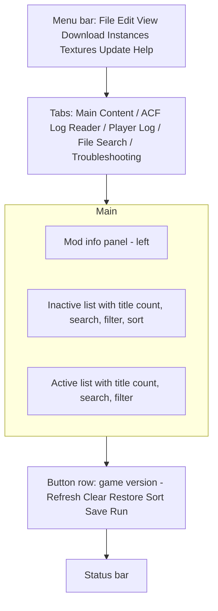

# RimSort feature and UX inventory

Scope: an exhaustive inventory of RimSort's features (menus, toolbar buttons, context menus, dialogs, background processes, CLI), an analysis of its window, list items, flows and shortcuts, its pain points, and its themes and translations, so RimStudio's mod manager can match its capabilities and fix its weaknesses. RimSort is GPL-3.0 and is used as a concept reference only: nothing here is copied, and behaviour is described in our own words. Companion document: `docs/research/rimsort-settings-catalog.md` (every setting).

Status: research note | Last verified: 2026-10-04

Evidence base: `RimSort-main/app/views/*`, `app/windows/*`, `app/controllers/*`, `app/models/settings.py`, `docs/user-guide/*.md`, `docs/faq.md`, `locales/en_US.ts` (script counts), `themes/*/style.qss` (script counts), screenshot `RimSort-main/docs/assets/images/rimsort_preview.png`, and for comparison `RimCrow-main/doc/assets/主界面.png` and `RimCrow-main/README.md` (Chinese, read and summarised). Code size: the three biggest view files are `app/views/mods_panel.py` (5820 lines), `app/views/main_content_panel.py` (3275 lines) and `app/views/settings_dialog.py` (1812 lines); the 19 files in `app/views/` total about 19.5k lines.

Priority legend: MVP (needed for the first usable release), v1 (needed for parity), later, skip. Complexity: S (days), M (about a week), L (multiple weeks).

## 1. Feature inventory

### 1.1 Window and global actions

RimSort has one main window with a menu bar (File, Edit, View, Download, Instances, Textures, Update, Help), five tabs (Main Content, ACF Log Reader, Player Log, File Search, Troubleshooting) and a status bar. Menu build code: `app/views/menu_bar.py`; tabs: `app/views/main_window.py`.

| ID | Area | Feature | User-visible behaviour | Source modules | Cx | Priority |
|---|---|---|---|---|---|---|
| F-001 | Main buttons | Refresh | Rescans all mod sources and rebuilds both lists from ModsConfig.xml | `main_content_panel.py` (`_do_refresh`) | M | MVP: the base loop of the product |
| F-002 | Main buttons | Clear | Empties the active list (official content stays unless "Clear also moves DLC" is on) | `main_content_panel.py` (`_do_clear`) | S | MVP: trivial and expected |
| F-003 | Main buttons | Restore | Reloads lists to the last saved state (state kept in memory only) | `main_content_panel.py` (`_do_restore`) | S | MVP, but replace with undo/redo plus history |
| F-004 | Main buttons | Sort | Sorts the active list by the chosen algorithm, optionally opening the missing dependencies dialog first | `main_content_panel.py` (`_do_sort`), `sort/` | L | MVP: the product's core value |
| F-005 | Main buttons | Save | Writes active list to ModsConfig.xml, stores divider data, writes a history snapshot | `main_content_panel.py` (`_do_save`) | M | MVP |
| F-006 | Main buttons | Run | Launches the game: path check, background backup, unsaved-changes prompt (Save and Run, Run Anyway, Cancel), optional todds, Steam appid handling, direct or steam:// launch | `main_content_panel.py` (`_do_run_game`) | M | MVP |
| F-007 | Window | Game version label | Shows game version and revision at the lower left | `main_window.py` | S | MVP |
| F-008 | Window | Status bar | One-line animated status text for long actions | `status_panel.py` | S | MVP, as non-blocking progress area |
| F-009 | Window | Single-instance guard and updater switches | Second launch is refused; `--dev` and `--disable-updater` flags | `utils/single_instance.py`, `__main__.py` | S | v1 |
| F-010 | Window | Window launch state | Maximized, normal or custom size per window class | `utils/window_launch_state.py` | S | v1 (auto-remember geometry instead) |
| F-011 | Window | Dialog placement | Option to open dialogs on the main window monitor | `settings_dialog.py` (Appearance) | S | skip: framework handles it |

### 1.2 File menu

| ID | Area | Feature | User-visible behaviour | Source modules | Cx | Priority |
|---|---|---|---|---|---|---|
| F-020 | File | Open Mod List (Ctrl+O) | Loads a mod list file (RimWorld modlist XML, also RimPy-style) into the lists | `main_content_panel.py` (`_do_import_list_file_xml`) | M | MVP |
| F-021 | File | Append Mod List (Ctrl+Alt+O) | Merges mods from a file into the active list, skipping ones already active | `_do_append_list_file_xml` | S | v1 |
| F-022 | File | Save Mod List As (Ctrl+Shift+S) | Exports the active list to a file | `_do_export_list_file_xml` | S | MVP |
| F-023 | File | Import from Rentry.co | Downloads a pasted list by URL, then offers to fetch missing mods | `_do_import_list_rentry` | M | later: fragile third-party paste site |
| F-024 | File | Import from Workshop collection | Reads a Steam collection page and builds a list | `_do_import_list_workshop_collection` | M | v1 |
| F-025 | File | Import from save file | Reads the mod list stored inside a `.rws` save | `_do_import_list_from_save_file` | M | v1: useful to repair "missing mods" saves |
| F-026 | File | Export to clipboard | Copies a report of the active list (names, ids, links) with a details view | `_do_export_list_clipboard` | S | MVP |
| F-027 | File | Export to Rentry.co | Uploads a report; warns above 200,000 characters and offers truncation | `_do_upload_list_rentry` | M | later |
| F-028 | File | Mod List History | Snapshots written on every save (default keep 100); diff any two (added, removed, reordered, newly installed or disabled, no longer installed); restore, export, edit note, open folder | `windows/modlist_history_panel.py`, `services/` | L | v1: feature to keep and improve (see section 3) |
| F-029 | File | Upload logs | Submenu to upload RimSort or RimWorld log files to a paste service | `main_content_panel.py` (`_UploadLogDialog`) | S | later |
| F-030 | File | Open shortcuts | Open app dir, settings dir, RimSort logs; RimWorld root, config, logs; local mods dir; Steam mods dir | `menu_bar.py`, `main_content_panel.py` (`_do_open_*`) | S | MVP: one "Open" submenu fed from the discovered sources |
| F-031 | File | Settings (Ctrl+,) | Opens the nine-tab settings dialog | `settings_dialog.py` | M | MVP |
| F-032 | File | Exit (Ctrl+Q) | Quit | `menu_bar.py` | S | MVP |

### 1.3 Edit, View, Download, Instances, Textures, Update, Help menus

| ID | Area | Feature | User-visible behaviour | Source modules | Cx | Priority |
|---|---|---|---|---|---|---|
| F-040 | Edit | Cut, Copy, Paste | Standard text editing actions (mod list items are not cut/pasteable) | `menu_bar.py` | S | skip: only relevant to text fields |
| F-041 | Edit | Rule Editor | Table editor for communityRules-style and user rules: loadAfter, loadBefore, incompatibleWith, loadTop, loadBottom; per-mod panel, mod search, rule visibility toggles, saves to user rules file or community file | `windows/rule_editor_panel.py`, `docs/user-guide/rule-editor.md` | L | v1: needed for R6 and user rule import |
| F-042 | Edit | Ignore list editor | Edit the list of mods whose warnings are suppressed (JSON) | `windows/ignore_json_editor.py` | S | v1 |
| F-043 | Edit | Reset all warnings | Clears every muted warning | `menu_bar.py` | S | v1 |
| F-044 | Edit | Reset all mod colors | Clears custom row colours | `menu_bar.py` | S | v1 |
| F-045 | Edit | Auto-add translations | Looks up translation mods for the active mods (from steamDB) and adds them | `mods_panel.py` (`_on_auto_add_translations`) | M | later |
| F-046 | View | Show translation status | Adds a per-row icon showing whether a translation exists | `mods_panel.py` (`_on_toggle_translation_status`) | M | later |
| F-050 | Download | Download RimWorld version | Fetches an older game version through SteamCMD using the versions list | `views/download_rimworld_dialog.py` | M | skip: out of scope for the first releases |
| F-051 | Download | Add Git mod | Clone a repo into the local mods folder; GitHub installer picks releases and tags | `main_content_controller.py` (`_do_git_install_mod`), `utils/github/` | L | later |
| F-052 | Download | Add Zip mod | Choose a zip or enter a URL, extract with progress, handle existing folder | `main_content_panel.py` (`_do_add_zip_mod`) | M | v1 |
| F-053 | Download | Browse Workshop | Embedded Steam browser with a download queue (Add to list, Add by id, status badges Default, Added, Installed) | `utils/steam/steambrowser/browser.py` | L | v1: needed for the Workshop use case |
| F-054 | Download | Update Workshop mods | Compares local mod time with Workshop, opens the updater panel with select and Update | `main_content_panel.py` (`_do_check_for_workshop_updates`), `windows/workshop_mod_updater_panel.py` | M | v1 |
| F-055 | Download | Update Git mods / GitHub Mods | Pull all git mods; GitHub panel lists installed, checks updates, switches versions, can push | `main_content_controller.py`, `windows/github_mods_panel.py` | L | later |
| F-056 | Download | Verify game files | Asks Steam to verify RimWorld files | `menu_bar.py` | S | later |
| F-060 | Instances | Switch instance | Submenu of named instances; switching clears lists and reloads | `controllers/instance_controller.py`, `app_controller.py` | M | v1: map to "workspaces/profiles" |
| F-061 | Instances | Backup, Restore, Clone, Create, Delete instance | Copies the instance folder (aux DB, SteamCMD data) to and from archives | `controllers/instance_controller.py` | M | later |
| F-062 | Textures | Optimize textures (todds) | Runs the external todds encoder over active or all mods with a live output panel; presets, dry run, overwrite | `utils/todds/`, `controllers/todds_controller.py`, `windows/runner_panel.py` | M | later: wrap as an optional tool |
| F-063 | Textures | Delete .dds textures | Removes optimized textures after confirmation | `main_content_panel.py` (`_do_delete_dds_textures`) | S | later |
| F-064 | Update | Check for updates, check on startup | Self-update of RimSort with backup before update | `utils/update_utils.py` | M | v1: Tauri updater |
| F-065 | Help | Wiki, GitHub links | Opens web pages | `menu_bar.py` | S | MVP |

### 1.4 Mod lists, list items and context menus

| ID | Area | Feature | User-visible behaviour | Source modules | Cx | Priority |
|---|---|---|---|---|---|---|
| F-100 | Lists | Two-pane Inactive and Active lists | Titles carry counts, e.g. "Active [5]"; drag between and within lists; official content first | `mods_panel.py` (`ModsPanel`, `ModListWidget`) | L | MVP |
| F-101 | Lists | Per-list search with field selector | Search box plus a "Search by" selector: Name, PackageId, Author(s), PublishedFileId, Version, Notes (notes only if the Advanced option is on) | `mods_panel.py` (`initialize_*_search_widgets`, `signal_search_and_filters`) | M | MVP |
| F-102 | Lists | Filter button and panel | Filters by Mod Source, Mod Type and Tags with Select All, None, Clear All | `views/filter_panel.py` | M | v1 |
| F-103 | Lists | Hide-filtered toggle | Switch between hiding non-matching rows and highlighting them | `mods_panel.py` (mode filter toggle) | S | v1 |
| F-104 | Lists | Warning, error, new, updated counters | Clickable counters that filter to mods with warnings, errors, "not in latest save" and recently updated | `mods_panel.py` | M | MVP (warnings and errors), v1 (rest) |
| F-105 | Lists | Inactive sort selector | Sort inactive list by Name, Modified Time, Author, Folder Size, PackageId, Version, Color, Tags, Updated; ascending or descending; optional persistence | `sort/mod_sorting.py` (`ModsPanelSortKey`), `mods_panel.py` | M | v1 |
| F-106 | Lists | Folder size calculation | Background computation of folder sizes with progress; cached for tooltips | `mods_panel.py` (`_on_folder_size_*`) | M | v1 |
| F-107 | Lists | Dividers in active list | Named, collapsible separators with mod counts; rename, delete, add via context menu; stored in settings | `mods_panel.py` (`add_divider`, `restore_dividers`) | M | v1: groups are a clear user want (RimCrow ships groups too) |
| F-108 | Lists | Keyboard moves | Return or Space moves selection to the other list; Left and Right shift focus; Ctrl+Return; Delete opens the deletion menu | `mods_panel.py` (`keyPressEvent`), `main_content_panel.py` (`__handle_*_key_press`) | S | MVP |
| F-109 | Lists | Double-click | Moves a mod to the other list | `mods_panel.py` (`mod_double_clicked`) | S | MVP |
| F-110 | Lists | Multi-select drag | Selected rows move together; drop within list reorders, cross-list drop enables or disables | `ModListWidget.dropEvent` | M | MVP |
| F-111 | Lists | Lazy row widgets | Row widgets are created only for visible rows to keep large lists usable | `mods_panel.py` (`create_widget_for_item`, `check_widgets_visible`) | M | MVP: replace with true virtualisation |
| F-120 | Row | Source icon | Ludeon (official), Local, Steam, Git, SteamCMD icon per row | `mods_panel.py` (`ModListIcons`) | S | MVP |
| F-121 | Row | Content-type icon | C# (has assemblies) or XML (content only) | `ModListIcons` | S | MVP |
| F-122 | Row | Warning and error icons | Clickable; click mutes that warning for the mod; tooltips list missing dependencies, incompatibilities, load order issues, version mismatch, alternative suggestions | `ModListItemInner`, `recalculate_internal_errors_warnings` | L | MVP |
| F-123 | Row | Updated and new badges | Recently updated (click opens the Workshop changelog), not in latest save | `ModListItemInner` | S | v1 |
| F-124 | Row | Custom colour | Per-mod row colour (text or background) via colour dialog with saved custom colours | `mods_panel.py` | S | v1 |
| F-125 | Row | Tags | Per-mod tags shown under the name; add, replace, remove through a tag dialog with typed new tags | `TagEditDialog` | M | v1 |
| F-126 | Row | Startup impact | Optional per-mod load time from the Loading Progress mod | `utils/startup_impact.py` | M | later |
| F-127 | Row | Tooltip | Name, tags, authors, packageId, mod version, folder size (cached only), supported versions, path, filesystem time | `ModListItemInner.get_tool_tip_text` | S | MVP |
| F-130 | Context | Open folder, open in text editor | Single and multi variants | `mods_panel.py` | S | MVP |
| F-131 | Context | Tags and colour actions | Add, replace, remove tags; change or reset colour | `mods_panel.py` | S | v1 |
| F-132 | Context | URL actions | Open URL in browser, copy URL, open mod in Steam | `mods_panel.py` | S | MVP |
| F-133 | Context | Source conversion | Local to SteamCMD, SteamCMD to local, Steam to local | `mods_panel.py` | M | later |
| F-134 | Context | Re-download and re-subscribe | Re-download with SteamCMD, update with git, re-subscribe or unsubscribe via Steam | `mods_panel.py` | M | v1 |
| F-135 | Context | SteamDB blacklist | Add (comment required) or remove a mod from the steamDB blacklist | `main_content_panel.py` (`_do_blacklist_action_steamdb`) | S | skip |
| F-136 | Context | Copy packageId, edit rules, toggle warning, find translations | Misc and clipboard submenus | `mods_panel.py` | S | MVP (copy id), v1 (rest) |
| F-137 | Context | Deletion menu | Delete mod completely; delete mod but keep .dds; delete .dds only; delete and unsubscribe; delete and re-subscribe; each with a confirmation dialog and result dialog | `views/deletion_menu.py` | M | MVP (delete with trash option) |
| F-138 | Panels | Duplicate mods panel | Groups mods by packageId; user picks which copies to delete | `windows/duplicate_mods_panel.py` | M | MVP: needed for R3 and R4 where sources overlap |
| F-139 | Panels | Missing mods prompt | On list import, lists missing mods and offers Workshop open, SteamCMD or Steam download, subscribe | `windows/missing_mods_panel.py` | M | v1 |
| F-140 | Panels | Missing dependencies dialog | Summarises required mods by satisfied or missing, availability (local or Workshop), add selected and sort, or sort without adding; Enter and Escape shortcuts | `windows/missing_dependencies_dialog.py` | M | MVP |
| F-141 | Panels | Missing mod properties panel | Mods with no packageId or similar defects | `windows/missing_mod_properties_panel.py` | S | v1 |
| F-142 | Panels | Use This Instead panel | Workshop mods with suggested replacements from the dataset; install status per group | `windows/use_this_instead_panel.py` | M | v1: required by R6 |

### 1.5 Tabs, tools and background processes

| ID | Area | Feature | User-visible behaviour | Source modules | Cx | Priority |
|---|---|---|---|---|---|---|
| F-200 | Player Log | Player.log viewer | Loads game log, file info, counters (infos, keybinds, mod issues, warnings, errors, exceptions), search, filter by type and by mod name, previous and next navigation, highlight colour, real-time monitor, export, load from file or URL | `views/player_log_tab.py` (1587 lines) | L | v1: key to the "troubleshoot a crash" flow |
| F-201 | File Search | Search in mod files | Search active, inactive, all mods or config folder; case, regex, XML-only; exclusions (translations, .git, Source, Textures); results table with preview; open file, open folder, copy path, open with editor; recent searches | `views/file_search_dialog.py`, `controllers/file_search_controller.py`, `utils/file_search.py` | L | v1: RimStudio's def explorer should supersede it |
| F-202 | ACF Log Reader | SteamCMD ACF viewer | Table of workshop ACF entries with search per column, delete selected mods, import, export, CSV export | `views/acf_log_reader.py` | M | skip: SteamCMD internals |
| F-203 | Troubleshooting | Game files recovery | Reset game files, reset Steam mods, reset mod configs, reset game configs (with warning) | `views/troubleshooting_dialog.py`, `controllers/troubleshooting_controller.py` | M | later, with undo-able backups |
| F-204 | Troubleshooting | Mod configuration helpers | Export, import, clean orphaned workshop entries, reset to vanilla (clear all mods) | `troubleshooting_dialog.py` | M | v1 (orphan cleanup), later (rest) |
| F-205 | Troubleshooting | Steam utilities | Clear download cache, verify game files, repair library | `troubleshooting_dialog.py` | S | later |
| F-210 | Datasets | Database sources | Five datasets (steamDB, community rules, NoVersionWarning, Use This Instead, RimWorld versions), each None, git repo, URL or local file; download, upload to git (PR creation), expiry, update on startup | `controllers/settings_tabs/databases_tab_controller.py`, `main_content_controller.py` | L | MVP (fetch and cache); upload skip |
| F-211 | Datasets | DB Builder | Builds steamDB via the Steam Web API (needs a key), modes all mods or no local data, DLC data via Steamworks, merge and compare databases | `utils/db_builder*.py`, `docs/user-guide/db-builder.md` | L | skip: consume datasets only |
| F-212 | CLI | `build-db` | Headless database build with `--api-key`, `--output`, `--quiet` options and exit codes | `app/cli/build_db.py`, `docs/user-guide/cli-reference.md` | M | skip |
| F-213 | Metadata | Aux metadata DB | SQLite per instance holding notes, tags, colours, ignored-warning flags, with retention limit | `utils/aux_db_utils.py`, `models/` | M | MVP: one local store for user annotations |
| F-214 | Background | Watchdog | Monitors mod folders and refreshes the lists on change | `utils/watchdog.py` | M | v1 |
| F-215 | Background | Startup dataset refresh | Refreshes datasets silently if the option is on | `main_content_controller.py` | S | MVP |
| F-216 | Background | Workshop update check on refresh | Optional check of Workshop mods against Steam | `main_content_panel.py` | M | v1 |
| F-217 | Background | Backups | Daily save backup with compression, instance backup, app backup before update | `services/`, `utils/` | M | later |
| F-218 | Background | Metadata scan | Parses About.xml for every mod into an in-memory model on startup and refresh | `controllers/metadata_controller.py` | L | MVP (core crate) |
| F-219 | Steam | Steamworks integration | Subscribe, unsubscribe, open in Steam, DLC data via the SteamworksPy wrapper; needs Steam running | `utils/steam/steamworks/` | L | v1 (optional) |
| F-220 | Steam | SteamCMD integration | Install SteamCMD, download mods anonymously, validate, clear depot cache, setup runner panel | `utils/steam/steamcmd/` | L | later |
| F-221 | Steam | Steam folder detection | Per-OS path autodetect for game, config, local mods; Snap warning | `services/` (`PathAutodetectService`), `settings_controller.py` | M | MVP, but superseded by RimStudio R3 design |
| F-222 | Panels | Runner panel | Read-only streaming output window with clear, restart, kill, save-output buttons | `windows/runner_panel.py` | S | v1 as a task console |
| F-223 | Panels | Task progress window | Modal progress with cancel | `views/task_progress_window.py` | S | skip: use non-blocking toasts |

### 1.6 Rules, sorting and checks (engine-facing features the UI exposes)

| ID | Area | Feature | User-visible behaviour | Source modules | Cx | Priority |
|---|---|---|---|---|---|---|
| F-300 | Sort | Tiered topological sort | Four tiers (core, Harmony, Prepatcher and DLC; frameworks and loadTop; the rest; loadBottom) sorted independently, then joined | `app/sort/`, `docs/user-guide/sorting-algorithms.md` | L | MVP (see `docs/research/rimsort-core-domain.md`) |
| F-301 | Sort | Alphabetical sort | Same tiers, ordered by name; marked deprecated in the dialog | `app/sort/` | S | skip |
| F-302 | Checks | Dependency and incompatibility checks | Per-row evaluation of missing dependencies, incompatibilities (both directions), wrong load order, version mismatch, alternative mod | `mods_panel.py` (`_check_*`) | L | MVP |
| F-303 | Checks | Duplicate packageId warning | Shown when several mods share an id | `main_content_panel.py` | S | MVP |
| F-304 | Rules | Rule sources | About.xml, community rules, user rules, aux DB; loadTop, loadBottom, isFramework (flagged work in progress in the docs) | `models/metadata/` | L | MVP |
| F-305 | Checks | Mod and game version mismatch | Badge when a mod does not list the current game version; NoVersionWarning dataset silences known cases | `mods_panel.py` (`_check_version_mismatch`) | S | MVP |

Totals: about 85 inventory rows; the settings dialog adds 98 global keys and 13 instance keys (see the settings catalogue).

### 1.7 RimCrow comparison (concept level, from its README and screenshot)

| Capability | RimSort | RimCrow (README, 2026-10-04 read) |
|---|---|---|
| Layout | Left info panel, two lists, button row | Left info panel, inactive list, active list with dependency lines, a right-hand panel with temporary, disabled, groups and backups tabs, and a bottom status line |
| Groups | Dividers in the active list | Named groups with colours, a separate tab and search |
| Undo/redo | None found | Stated in its roadmap as done |
| Sort preview | None (sort applies directly) | Sort difference comparison listed |
| Workshop | Embedded Steam browser | Workshop search, details, collections, SteamCMD and Steam subscription |
| Git sources | Git and GitHub mods | GitHub, GitLab and others as subscription sources |
| Report export | Clipboard and Rentry | Text, Markdown, DOCX, PDF, image export |
| Log tools | Player log tab | Log viewer with error clustering and assistant features |
| UI tech | PySide6 widgets | Web UI in a desktop shell (closest to RimStudio's stack) |

Takeaway: RimCrow validates the web-UI approach and the demand for groups, undo, sort diff and richer export.

## 2. UX analysis

### 2.1 Window anatomy

Observed in the screenshot (`rimsort_preview.png`): a dark theme, the info panel occupies roughly the left 40 percent and shows a large logo with "Welcome to RimSort!" until a mod is selected; the two lists are narrow (about 15 percent of width each) so long names are truncated with an ellipsis; each list header shows a name plus a count in brackets, then a small search-mode button, an eye (hide-filtered) button, a search field and a field selector. The lists are placed right of the info panel and the Inactive list is on the left of Active. Modal dialogs (such as the SteamCMD downloader window visible in the screenshot) float as separate windows.

The info panel is a splitter child: dragging the splitter changes the proportions (`main_content_panel.py`, main splitter with `mod_info_container` and `mods_panel_container`).

### 2.2 List item anatomy

| Element | Position | Meaning | Trigger |
|---|---|---|---|
| Source icon (Ludeon, local, Steam, Git, SteamCMD) | left | where the mod comes from | tooltip text from the icon (docs strings: "Official RimWorld content by Ludeon Studios", "Installed locally", "Subscribed via Steam", git and SteamCMD variants) |
| Content icon (C# or XML) | after source | custom assemblies vs content only | tooltip |
| Name | centre, elided | display name; colour from custom colour (text or background) or red for the invalid state seen in the screenshot ("Steel Wool") | hover shows the long tooltip |
| Tags line | under name | optional, toggled by "Show tags in mod list" | context menu |
| Translation icon | right | translation exists or not | only if View option is on |
| "Not in latest save" or "In latest save" mark | right | comparison with the newest save file | option on by default |
| Updated icon | right | updated within N days (default 3, off by default) | click opens the changelog page |
| Warning icon (yellow triangle) | right | load order, version mismatch, alternative, dependency notes | hover for text, click to mute for that mod |
| Error icon (red) | right | missing dependency or incompatibility | hover, click to mute |
| Row highlight | whole row | selected or hover | selection style from the theme |
| Divider row | active list only | collapsible group header with count | context menu or click |

Weakness: icon positions change with the number of icons and window width (`resizeEvent` recomputes text width from icon count); mod name lines are cut at narrow widths.

### 2.3 Mod info panel contents

Fields shown (labels from `mod_info_panel.py`): preview image, Name, Summary (scenarios), PackageID, Authors, Tags, Mod Version, Supported Version, Folder Size ("Calculating..." until the background job completes), Path (clickable, opens the folder), Steam URL, GitHub (source, version selector, update available), Last Touched, Filesystem Modified, Workshop Times (created and updated), a description area rendered from rich text, and a free-text Notes box saved in the aux DB. A TODO in the source asks for Markdown and clickable links in notes and for making it collapsible (`mod_info_panel.py`, near the notes widget). The panel shows a loading animation and progress widget during scans.

### 2.4 Actions panel

There is no side actions panel: global actions are six buttons at the bottom (Refresh, Clear, Restore, Sort, Save, Run), each fixed at a minimum width of 100 px. Everything else is in the menu bar or in context menus. Save has an animation (`do_save_button_animation_stop` event) hinting at unsaved changes; there is no persistent "unsaved" badge besides the Run prompt.

### 2.5 Search and filter capabilities

- Per-list text search with a field selector (Name, PackageId, Author(s), PublishedFileId, Version, Notes) and a clear button.
- Mode toggle: hide non-matching or keep and mark.
- Filter panel with three flow-layout groups: Mod Source, Mod Type, Tags.
- Counter buttons that act as filters: warnings, errors, not in latest save, recently updated.
- Name fuzzy matching exists in the translation lookup and has a TODO asking for a user-set threshold (`mods_panel.py`, near the fuzzy match).
- Gaps: no combined query syntax, no saved filters, no global search across both lists, no cross-field boolean search, no search of descriptions.

### 2.6 Drag and drop and multi-select

- Standard Qt extended selection (Shift and Ctrl click), drag of the whole selection; a drop in the same list reorders and re-applies divider collapse state; a cross-list drop enables or disables and emits an update signal after a queued insertion.
- The code comments warn that cross-list drops are handled in two places and must be deduplicated by a count guard, a sign of fragile state handling (`ModListWidget.dropEvent` comment, `handle_rows_inserted`).
- TODO in the key handler notes a visual bug when a key is held (items flicker) in both key-press handlers.

### 2.7 Keyboard shortcuts (all that were found)

| Key | Context | Action | Source |
|---|---|---|---|
| Ctrl+O | global | Open mod list | `menu_bar.py` |
| Ctrl+Alt+O | global | Append mod list | `menu_bar.py` |
| Ctrl+Shift+S | global | Save mod list as | `menu_bar.py` |
| Ctrl+, | global | Settings | `menu_bar.py` |
| Ctrl+Q | global | Exit | `menu_bar.py` |
| Ctrl+X, Ctrl+C, Ctrl+V | global | Edit menu items | `menu_bar.py` |
| Return, Space | mod list | Move selected mods to the other list | `main_content_panel.py` |
| Left, Right | mod list | Switch to the other list | `main_content_panel.py` |
| Ctrl+Return | mod list | Signal emitted; handled by the main panel | `mods_panel.py` |
| Delete | mod list | Opens the deletion options menu at the cursor | `mods_panel.py` |
| Return, Escape | missing dependencies dialog | Add selected and sort, ignore | `missing_dependencies_dialog.py` |
| Ctrl+R, Ctrl+C | troubleshooting | Apply recovery, cancel | `troubleshooting_dialog.py` |
| Return, Ctrl+O, Ctrl+C | file search results | Open file, open folder, copy path | `file_search_dialog.py` |

There is no shortcut for Sort, Save, Refresh or Run, no search focus key, no undo or redo, and no command palette; shortcuts are not configurable.

### 2.8 Dialogs (catalogue)

Message boxes and prompts live in `views/dialogue.py` (847 lines, 10 modal `exec` calls) and are used all over; the main panel and mods panel add 5 more modal `exec` calls. The distinct dialogs: settings (modal, 9 tabs), steam client integration question, SteamCMD not found, essential paths missing (offers "Open settings"), unsaved changes (Save and Run, Run Anyway, Cancel), missing dependencies, missing mods, duplicate mods, deletion confirmations (3 variants plus result), tag editor, divider name, colour picker, translation picker, blacklist comment, mod list history, Rentry import and upload (auth), report too long, texture deletion confirm, ACF import confirm, zip chooser and URL prompt, zip extraction progress, GitHub installer and version switch, database source configuration prompts, rule editor, ignore editor, update available, fatal error with details, settings failure.

### 2.9 Step counts for the 10 most common flows (RimSort, inferred from the code paths; clicks and key presses, excluding waiting)

| # | Flow | Steps in RimSort | Notes |
|---|---|---|---|
| 1 | First-run setup | about 9 to 14 | Launch; language auto-picked from the LANG variable if available; main window opens; Steam integration question (1); open Settings (1); Locations, Autodetect (1) and check each of 4 paths (up to 4 manual Choose actions if detection misses, e.g. a second library); OK (1); Refresh (1); if SteamCMD is missing a prompt appears (install, or "do not ask again"); datasets must be configured on the Databases tab to get rules and steamDB (download action per dataset, up to 5) |
| 2 | Enable a mod | 2 | Select then Return or Space (or double-click: 1 step, or drag); Save is a separate step |
| 3 | Sort | 1 to 3 | Click Sort; dependency dialog may appear: choose add selected and sort (1 or 2 more); result applies immediately without a preview |
| 4 | Fix a warning | 3 to 6 | Find the row; hover the icon to read the tooltip; fix by enabling the dependency (2), or open the Rule Editor from the context menu (4 or more), or click the icon to mute the warning (1) |
| 5 | Save and launch | 2 | Save, Run; if unsaved, an extra dialog with 3 choices; backup runs silently in the background |
| 6 | Share a list | 3 to 4 | File, Export, To Clipboard (3 clicks); or File, Save Mod List As plus a file dialog (4); Rentry upload needs an auth code configured |
| 7 | Install from the Workshop | 8 to 12 | Download, Browse Workshop (2); navigate and press Add to list (2 per mod); choose SteamCMD or Steam download (1); watch a runner window; Refresh (1); find the mod in Inactive and enable (2); Save (1) |
| 8 | Update mods | 4 to 7 | Download, Update Workshop Mods (2); updater panel: select (1), Update (1); wait; Refresh (1) |
| 9 | Remove a mod | 4 | Select; Delete key opens a menu of 4 or 5 options; pick one; confirm dialog; result dialog |
| 10 | Troubleshoot a crash | 5 to 10 | Open Player Log tab (1); Load Game Log (1); choose Errors Only (1); step through entries with Next; copy a mod name; use the mod name filter or File Search (3 to 5) to locate the offender; return to Main Content to disable |

## 3. Pain points and opportunities

Evidence: FAQ topics, TODO markers (22 TODO, FIXME, HACK or XXX markers in `app/`), code size, and the modal structure.

| # | Pain point | Evidence | Opportunity for a Tauri and Preact UI |
|---|---|---|---|
| P1 | Monolithic view code | `mods_panel.py` 5820 lines combines row widgets, list widget, context menus, search, filters, warning computation and sort UI; `main_content_panel.py` 3275 lines mixes 70+ handlers | Small Preact components with a typed store; keep rule evaluation in the Rust core and send results over IPC |
| P2 | Business logic in the view | `_check_*` and `recalculate_internal_errors_warnings` live in `ModListWidget` | Evaluation as a pure Rust function returning diagnostics per mod; UI only renders |
| P3 | Large lists drive one widget per row | Row widgets created on scroll (`create_widget_for_item`), icon layout recalculated on every resize | Real virtualised list (windowing) with fixed row height and CSS truncation; target 10k rows |
| P4 | Modal dialogs for most operations | many `exec` calls; progress windows block; FAQ points to errors users cannot resolve while a dialog is open | Non-blocking task centre with progress, cancel, and toasts; confirmations only for destructive actions |
| P5 | Unsaved changes are invisible | only prompt at Run; Save has an animation only | Dirty indicator, diff against saved state, undo and redo stack for every list edit, restore as undo |
| P6 | Sort is destructive | applies directly | Preview with a diff (moved, why), then Apply, with one-step undo |
| P7 | Hard to discover features | actions hide in nested menus and context menus; no command palette; no search in settings | Command palette (Ctrl+K), searchable settings, keyboard map with user rebinding |
| P8 | Only one local mod folder; path setup is manual | one `local_folder` per instance; autodetect covers one default per field | Source list with many custom folders and Steam library discovery (R3, R4) |
| P9 | Fragile state sync | duplicate handling for drops, TODO notes about harmless extra log lines on restore | Single source of truth for list order; drag and drop only dispatches intents |
| P10 | Datasets require manual setup | five datasets each with four keys and separate download actions; releases ship without them (`docs/user-guide/basic-usage.md`) | Auto-fetch with ETag cache, status panel with freshness and "last updated", offline fallback (R6) |
| P11 | Secrets in plain JSON | steam key, GitHub token, Rentry code in settings.json | OS keychain |
| P12 | Platform friction | FAQ: antivirus false positives for compiled Python; macOS unsigned; Linux Qt dependency lists and Wayland vs X11 notes; Steam Snap and Flatpak path caveats (`docs/user-guide/downloading-and-installing.md`) | Tauri installer sizes and OS webview; still sign builds; document Flatpak Steam path |
| P13 | Steam integration is fragile | FAQ: "Could not initialize Steam API" on launch, especially macOS; steam appid file handling | Launch via steam:// protocol option, clear diagnosis page when Steam is not running |
| P14 | Empty and error states are thin | welcome image, plain message boxes | Purposeful empty states (no paths, no mods, no datasets), error cards with a fix button and a copy-diagnostics action |
| P15 | Dense, truncated list rows | screenshot shows names elided in narrow panes | Resizable columns or a detail drawer; compact and comfortable densities |
| P16 | Log analysis is plain text | Player log tab has filters but no grouping by mod or stack | Group repeated errors, link a log line to the mod that caused it |
| P17 | No bulk editing language | colour, tags and warnings are per-menu actions | Multi-select toolbar and "apply to selection" for tags, colour, group |

Opportunities not present in RimSort at all: list diff between any two states (history exists, but not side by side with the live list), profile switching without clearing, "why is this mod here" dependency graph, a project workspace (the toolkit), item designer, and Workshop upload tool (R5, R7).

## 4. Themes and i18n

### 4.1 Themes

RimSort ships five Qt stylesheet themes, each one `style.qss` of about 1,170 to 1,270 lines (script `theme_stats.py`, run 2026-10-04): RimPy (1273 lines, 226 unique selectors, 97 object names, 31 distinct colours; default), Modern (226 selectors, 32 colours), Nature, SunSet and Wood (212 selectors each, 21 to 30 colours). 209 selectors are common to all five, so themes are recolourings of one structure, with no `url()` references. A theme restyles generic widgets (buttons, lists, scrollbars, menus, inputs, tabs, tooltips) and a set of object-named widgets (about 92 to 97 names). Theme choice, enable switch, font family and font size are settings (Appearance tab); a theme folder can be opened to add user themes. Icons come from `themes/default-icons` (about 45 files, PNG, SVG, GIF), shared by every theme; there is no dark or light mode, system theme following, or colour-blind palette.

RimStudio mapping: define colours as CSS custom properties (design tokens) with light, dark and system modes, and ship themes as small JSONC token files; keep one structure and let community themes override tokens only.

### 4.2 Locales and string counts

`locales/` holds 11 Qt `.ts` catalogues (de_DE, en_US, es_ES, fr_FR, ja_JP, ko_KR, pt_BR, ru_RU, tr_TR, zh_CN, zh_TW), each with 1,485 messages (script count, 2026-10-04). The English file is the extraction source: 65 contexts (mostly one per class), 1,485 messages, 1,414 unique source strings (53 strings appear in more than one context), 185 strings with brace placeholders, 76 with HTML, 33 with newlines, no plural forms, median length 24 characters, maximum 532, about 9,260 words in total. The largest contexts are SettingsDialog (178), MainContentController (176), MainContent (154), ModListWidget (83), PlayerLogTab (79), MenuBar (58). In `en_US.ts` 1,478 of the 1,485 entries are marked unfinished because English is the source, while the 10 other catalogues are fully filled. Compiled `.qm` files are checked in next to the `.ts` files. A `translation_helper.py` script exists for completeness checks, validation and auto-translation, and `docs` exist in English, Russian and Simplified Chinese.

Weaknesses: strings are keyed by English source text, so an English edit orphans every translation; HTML is embedded in messages; no plural forms; brace placeholders mixed with Qt placeholders.

### 4.3 Bootstrapping RimStudio's own JSON catalogue (without copying strings)

1. Use stable semantic keys (`mods.list.empty`, `sort.preview.apply`) rather than source text; one JSON file per locale with a flat key to message map.
2. Messages use ICU MessageFormat so plurals and gender are first-class (counts such as "Active [n]", "n mods deleted").
3. No HTML in messages; allow only named inline tags (`<b>`, `<link>`) rendered by a component.
4. Write the English catalogue fresh from RimStudio's own UI as screens are built. Use RimSort's contexts only as a checklist of areas (settings, deletion, history, log viewer), never its sentences. Translators of RimSort's catalogues do not own RimStudio's text; do not import them.
5. Add a CI script that fails on missing keys, unused keys and placeholder mismatches between locales, and reports completeness per locale.
6. Fall back to English per key; detect OS language on first run (RimSort does this from the LANG variable; also read the platform locale API on Windows and macOS).
7. Keep translation catalogues JSON (R10) and treat RimWorld's own language folders (XML) as a separate read-only boundary.

## Implications for RimStudio

1. MVP list screen: two virtualised lists (inactive and active) that stay responsive at 10,000 mods; scrolling a 2,000-row list must not create more than the visible number of DOM rows plus overscan.
2. Every list edit (enable, disable, move, sort, clear, import) goes through one command stack with undo and redo (Ctrl+Z, Ctrl+Shift+Z), and a visible dirty marker with a diff against the last saved state (replaces Restore, F-003).
3. Sort shows a preview diff (which mods move and why: rule source and tier) before Apply, and Apply is undoable (F-004, F-300).
4. Keep RimSort's warning model per row (missing dependency, incompatibility, load order, version mismatch, replacement available, duplicate id) with identical meanings, but computed in the Rust core and returned as structured diagnostics; muting a warning stores an ignore entry (F-122, F-302, F-042).
5. Implement keyboard-first operation: Return and Space toggle, arrow keys move between and within lists, Ctrl+K command palette, search focus key, and user-rebindable shortcuts; also give Sort, Save, Run and Refresh default shortcuts (RimSort has none).
6. Replace modal dialogs with a task centre (progress, cancel, logs) and toasts; modal confirmation only for destructive actions (delete, reset).
7. Mod source list supports any number of custom folders plus auto-detected game, install Mods and workshop sources, shown with source icons equal to RimSort's five kinds plus "custom" (R3, R4; F-120).
8. Ship the full per-row information set: source icon, C# or XML icon, tags, colour, notes, updated and new badges, and a tooltip with name, authors, packageId, version, supported versions, size and path (F-120 to F-127).
9. Provide groups (named, collapsible, coloured) instead of dividers only, including moving a group as a unit (F-107).
10. History: write a snapshot on every save, keep a configurable count, diff any two snapshots or snapshot against live list, restore and annotate (F-028).
11. Datasets (R6): fetch the five datasets at runtime with cache and freshness status, no manual per-dataset setup; the Rule Editor and user-rule import (F-041, F-210) are v1.
12. Include a duplicate-mods resolver, missing-dependencies dialog and missing-mods flow in the MVP or v1 (F-138, F-139, F-140).
13. A log viewer tab with filtering by severity and mod, previous and next navigation, and grouping of repeated errors (F-200), and a file search that is subsumed by the def explorer and XML tooling (F-201).
14. Themes are JSONC token files with light, dark and system; locales are JSON ICU catalogues with semantic keys and a CI completeness check.
15. Drop from scope: ACF reader, DB Builder and its CLI, Rentry integration (later), SteamDB blacklist, RimWorld version downloader, deprecated alphabetical sorter.

## Open questions

- Does RimSort's tier-0 list include any mod beyond Core, Harmony, Prepatcher and DLC at runtime (the docs list is authoritative only for the documented version)? See `docs/research/rimsort-core-domain.md`.
- How many rows can the real RimSort handle before it slows down? No benchmark was run (a `tests/benchmarks` folder exists but was not executed).
- Which context-menu actions are available for multi-select but disabled by design, and which are single only? The multi variants were counted from translation strings, not by running the app.
- Are RimCrow's undo/redo and sort diff as complete as its roadmap claims? Only its README and one screenshot were read.
- Should RimStudio expose Steamworks subscribe and unsubscribe (needs a Steam runtime library and licence review), or rely on opening Steam pages and SteamCMD-free copying?
- What is the right default for "recently updated" and "not in latest save" indicators (RimSort has the first off and the second on by default)?
