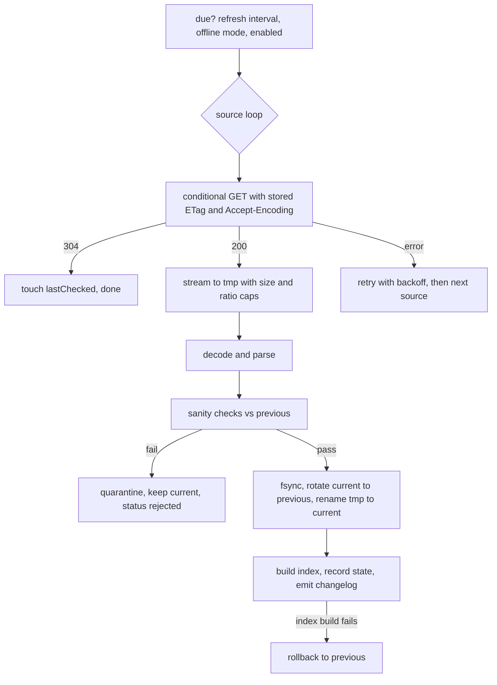

# Rules fetch and merge design

Scope: how RimStudio fetches, validates, stores, merges and migrates the community sorting datasets (community rules, SteamDB, Use This Instead, No Version Warning, RimWorld versions) to meet requirement R6, while honouring R10 (JSON and JSONC for app data, XML only at the RimWorld boundary) and R11 (read-only references, runtime fetching of community data). It covers a generic remote-dataset abstraction, the fetch pipeline, validation, local storage and index, the merged rule graph with an explainable ordering chain, migration from RimSort, the contribution loop, the dataset manager UI and a crate-level proposal with tests. The measured facts it relies on are in `docs/research/community-datasets-analysis.md`.

Status: research note | Last verified: 2026-10-04

Assumptions, stated rather than asked: RimStudio is a Tauri 2 desktop app with a Rust backend; the user's machine may be offline or behind a proxy; the five RimSort datasets stay the compatibility target; RimStudio does not host its own copy of data whose licence is absent (see the analysis, section 9). Library choices below name roles, not versions; versions must be pinned and checked at implementation time (unverified here).

## 1. How RimSort and RimCrow do it today (verified in their sources)

| Topic | RimSort | RimCrow |
|---|---|---|
| Dataset settings | per dataset: source (`Configured URL`, `Configured git repository`, none), file path, repo URL, zip URL; `update_databases_on_startup` default true (`RimSort-main/app/models/settings.py`) | URL and local path per dataset, per-source enable flags (`RimCrow-main/backend/settings.py`) |
| Update trigger | on startup, silently, only when the setting is on and an internet probe succeeds; http sources download zips, git sources pull (`_update_databases_on_startup_if_enabled_silent` in `RimSort-main/app/controllers/main_content_controller.py`); also manual from the settings dialog | manual and maintenance jobs (`backend/managers/mgr_maintenance.py`) |
| Download | one GET of a repository zip with a 30 s timeout, streamed to a temp file, conditional via a sidecar JSON holding ETag and Last-Modified, extracted into a temp directory and swapped in with a `.bak` of the old directory (`RimSort-main/app/utils/http_downloader.py`); no retry, no size or ratio limit, no content validation seen before the swap | download helper rewrites GitHub `blob` URLs to raw (`backend/managers/mgr_download.py`) |
| Change detection | ETag or Last-Modified of the zip | file size plus mtime plus importer schema version decides whether the SteamDB import is rebuilt (`backend/managers/mgr_workshop_db.py`) |
| Validation | typed decode at load time; failure logs "try re-downloading" and the rules are ignored | requires version and `rules` fields for UTI |
| Rule precedence | set union of About, community and user lists; nothing is removed or overridden for order edges (`overall_rules` in `RimSort-main/app/models/metadata/metadata_structure.py`) | configurable source priority, default user then native then community then dynamic, with global enable flags per source and per-mod exclusion lists (`backend/managers/mgr_rules.py`) |
| User rules file | `<data dir>/dbs/userRules.json`, same schema as community rules; editor saves through the typed model (loses unknown fields and `incompatibleWith`, see analysis 3.4) | own user rules path setting |
| Contribution | manual pull request, or optional GitHub integration after a git clone (`RimSort-main/docs/user-guide/databases.md`) | none seen |

RimStudio keeps RimSort's good parts (silent startup refresh, conditional requests, atomic swap with a backup) and replaces its gaps: retries, limits, validation, rollback, provenance, and unknown-field preservation.

## 2. Generic RemoteDataset abstraction

### 2.1 Descriptor

A dataset is described by data, not code: built-in descriptors ship in the binary as JSON (not as downloaded data), and the user can override sources in `settings.jsonc`.

```jsonc
{
  "id": "community-rules",
  "title": "Community rules",
  "kind": "rules",                       // rules | steamdb | replacements | version-warnings | game-versions
  "schemaSupport": { "min": 1, "max": 1 },   // RimStudio parser generation, not an upstream number
  "enabled": true,
  "sources": [                            // tried in priority order
    { "type": "official", "url": "https://raw.githubusercontent.com/RimSort/Community-Rules-Database/main/communityRules.json",
      "encoding": "gzip" },
    { "type": "mirror",   "url": "https://cdn.jsdelivr.net/gh/RimSort/Community-Rules-Database@main/communityRules.json",
      "maxBytes": 20971520 },
    { "type": "git",      "url": "https://github.com/RimSort/Community-Rules-Database", "branch": "main", "path": "communityRules.json" },
    { "type": "local",    "path": null },
    { "type": "none" }
  ],
  "limits": { "maxCompressedBytes": 2097152, "maxDecodedBytes": 33554432, "maxRatio": 50 },
  "sanity": { "minEntries": 100, "minFractionOfPrevious": 0.7 },
  "changeFeed": "https://github.com/RimSort/Community-Rules-Database/commits/main/communityRules.json.atom",
  "refreshHours": 24
}
```

Descriptors for the five datasets (all URLs verified on 2026-10-04, see the analysis section 1):

| id | official source | mirror | format handling | limits (compressed / decoded) | sanity floor |
|---|---|---|---|---|---|
| community-rules | raw communityRules.json | jsDelivr `@main` (395 KB, fits) | JSON, gzip on the wire | 2 MB / 32 MB | at least 100 subjects, at least 70% of previous |
| steamdb | raw steamDB.json | none: jsDelivr answers 403 above 20 MB | JSON, gzip on the wire; store compressed; build slim index | 25 MB / 256 MB (ratio 14:1 observed, cap 50) | at least 5,000 entries, at least 70% of previous |
| use-this-instead | raw replacements.json.gz | jsDelivr (file is 185 KB) | gzip file, strip BOM, JSON | 2 MB / 16 MB | at least 500 rules |
| no-version-warning | raw `<gameVersion>/ModIdsToFix.xml` | jsDelivr | XML through the boundary crate, stored as JSON id list | 256 KB / 2 MB | at least 20 ids |
| game-versions | raw rimworld_versions.json | jsDelivr | JSON | 1 MB / 8 MB | at least 50 records |

The No Version Warning descriptor is parameterised by the detected major.minor game version (for example `1.6`), and falls back to the newest folder that exists if the detected one does not.

### 2.2 State (one JSON file per dataset)

```jsonc
{
  "id": "community-rules",
  "status": "ready",              // never-fetched | ready | stale | updating | rejected | offline | failed | disabled
  "activeSource": "official",
  "etag": { "value": "W/\"b60e...\"", "acceptEncoding": "gzip" },
  "contentSha256": "...",
  "sourceVersion": { "kind": "epoch", "value": 1789239946 },   // epoch | iso | none
  "entryCount": 631,
  "lastChecked": "2026-10-04T12:30:00Z",
  "lastChanged": "2026-10-03T08:00:00Z",
  "nextCheckAfter": "2026-10-05T12:30:00Z",
  "consecutiveFailures": 0,
  "lastError": null,
  "previous": { "contentSha256": "...", "entryCount": 628, "savedAt": "..." }
}
```

Status transitions: `never-fetched` to `updating` to `ready`; `ready` to `stale` when `nextCheckAfter` passes while offline or disabled auto-refresh; any failed refresh keeps `ready` (the current copy stays valid) and records `lastError`, but a rejected download sets `rejected` only as a badge alongside the last good copy. Status never blocks use of the last good copy.

### 2.3 Cache slot

```text
<app data>/datasets/<id>/
  current.<ext>        last good raw artifact (steamdb: current.json.gz)
  previous.<ext>       one rollback copy
  quarantine/<sha>.<ext> + <sha>.reason.json     rejected downloads, capped at 3
  state.json
  index/<indexSchema>-<contentSha>.json          derived lookup index (rebuildable)
  tmp/                 partial downloads
```

Everything is JSON, JSONC or a gzip of JSON, so R10 holds. The No Version Warning XML is converted once into a JSON id list; the original XML is not kept.

## 3. Fetching

### 3.1 Pipeline



1. A refresh runs when the dataset is enabled, offline mode is off, and `nextCheckAfter` has passed (default 24 hours; manual refresh ignores it). Startup refresh runs in the background after the first window paint and never delays startup.
2. The conditional GET sends `If-None-Match` with the stored ETag, replaying the stored `Accept-Encoding`. Measured: raw returns 304 with no body (analysis section 2). The ETag is only comparable within one encoding, because the gzip representation carries a weak tag and the identity one a strong tag with a different value.
3. A 200 response is streamed into `tmp/` while counting bytes against `maxCompressedBytes` and, for gzip, decoding through a limiter against `maxDecodedBytes` and `maxRatio`. Exceeding any cap aborts the download.
4. Parse, sanity-check (section 5), then rotate: fsync the temp file, move `current` to `previous` (replacing the older one), move the temp file to `current`. If the index build or the post-swap check fails, move `previous` back.
5. If the SHA-256 of the new bytes equals the stored one, treat it as unchanged even when the ETag changed.

### 3.2 Timeouts, retries, rate limits

| Setting | Value | Rationale |
|---|---|---|
| Connect timeout | 10 s | fail fast offline |
| Idle (read) timeout | 30 s | RimSort uses 30 s per request |
| Total deadline | 60 s for under 5 MB, 300 s above | SteamDB downloads 3.5 MB in 0.17 s on a good link, so 300 s tolerates 100 KB/s |
| Retries | 3 attempts per source, delays 1 s, 4 s, 16 s with full jitter; honour `Retry-After`; retry on connect errors, timeouts, 408, 429, 5xx; no retry on other 4xx | |
| Failover | after retries, go to the next source in the descriptor | |
| Backoff across launches | after N consecutive failures set `nextCheckAfter` to min(24 h x 2^N, 7 d) | avoids hammering and avoids log spam |
| Rate limits | raw and Atom responses carried no rate-limit headers; GitHub's limits for unauthenticated raw access are not documented in the captures (unverified). Default one check per dataset per 24 h; edge freshness is 300 s so a faster poll cannot see newer data | |
| Resume | ranges are supported (HTTP 206 verified); resume a partial download of a gzip representation only with `If-Range` set to the same weak ETag, otherwise restart | optional, only for the SteamDB |

Atom feeds are optional and serve the changelog, not change detection: a conditional GET on the raw URL already costs one small request. The feed entry id embeds the commit sha (`tag:github.com,2008:Grit::Commit/<sha>`), its title is the commit subject, and a conditional request answered 304. Use the per-file feed (`commits/main/<path>.atom`) to show "what changed upstream" and to detect updates for the git and zip source types, where there is no ETag on the file itself.

### 3.3 Proxy and TLS

Honour the platform proxy settings and `HTTPS_PROXY`/`NO_PROXY` environment variables; allow an explicit proxy in settings. TLS roots: use the platform verifier or the bundled web roots, selectable in settings (a corporate-proxy user needs the system store). Never disable certificate verification; there is no "insecure" switch. The offline probe must be a real request to a dataset URL, not a ping.

### 3.4 Distribution strategy comparison

All sizes are for the SteamDB (the heavy case) unless stated; sources are the measurements in the analysis.

| Strategy | First download | Repeat check, unchanged | Repeat, changed | Notes |
|---|---|---|---|---|
| Raw URL, gzip, ETag (recommended) | 3,512,663 B | one small 304 | 3.5 MB | works for every dataset, no extra tooling; at the observed 3.5-day median gap, roughly 8 to 9 changes a month means about 30 MB a month at worst for an always-on user (estimate) |
| Repository zip (RimSort's choice) | 3,513,035 B plus extraction | conditional on the zip ETag | 3.5 MB plus unzip | one redirect, no advantage over raw gzip, needs zip-safety code, and extracts every file of the repo |
| Git shallow clone or pull | the owner's existing RimSort clone: 5 commits, 7.00 MiB pack | `git fetch` handshake | incremental size not measured (unverified) | needs the git binary or a git library, a working tree, no limits control; useful only for the contribution workflow |
| jsDelivr mirror | rules: 394,716 B, up to 12 h stale for `@main` | CDN ETag | same | 403 for files over 20 MB, so no SteamDB; good second source for small files |
| RimStudio-built compact artifact from CI (slim projection) | 573,745 B (zstd-19) to 759,836 B (gzip-9), 2.5 MB raw | ETag | same | about 5 times smaller than the raw gzip, but this republishes data that has no licence (SteamDB, community rules), so it needs written permission first; keep a `mirror` source slot ready for it |

Recommendation: ship with raw gzip plus ETag as the primary source and jsDelivr as the secondary source for datasets under 20 MB. Build the slim projection locally (section 6). Do not create a hosted compact artifact until the data owners grant a licence; if they do, add it as a `mirror` source with its own `format: "slim-v1"` and keep the raw source as the fallback and as the integrity cross-check.

### 3.5 Zip and archive safety (git zip sources and any user-supplied zip)

Never extract to disk. Open the archive, read only the named member, and enforce: member count at most 10,000, declared and actual uncompressed size under `maxDecodedBytes`, ratio under `maxRatio`, reject absolute paths, `..` components and symlink entries, reject encrypted members. RimSort extracts the whole archive to a directory and swaps it (`RimSort-main/app/utils/http_downloader.py`); RimStudio reads one member into the temp file instead.

### 3.6 Offline behaviour

Offline mode (a manual switch) and a failed connectivity attempt both skip network work silently: the last good copy is used, status becomes `stale` after its due time, and the dataset panel shows "last checked" and "last changed". A first run with no network and no cache starts with no community data: sorting works from About.xml rules only, and the UI shows one non-modal hint offering "load from file" for a local source. Nothing is bundled as a seed for the unlicensed datasets; UTI and NVW (MIT) may ship a dated seed with attribution (optional).

## 4. Scheduling and bandwidth

* Triggers: app start (if due), a timer while the app runs (every 6 hours checks which datasets are due), after the user changes sources, and manually.
* At most 2 concurrent downloads, SteamDB last (it is the largest and least urgent).
* Respect metered connections where the OS exposes them (unverified API availability across the three OSes); default skip of SteamDB on metered links with a "refresh anyway" button.
* Every refresh result produces one line in a refresh log (dataset, outcome, bytes, duration, source) kept as JSON lines, capped at 200 lines.

## 5. Validation and schema evolution

1. Tolerant reading: unknown fields are preserved, odd value types become per-record warnings, never whole-dataset failures (analysis implication 3). A record that cannot be understood is kept as raw JSON and flagged.
2. Hard failures (reject): invalid JSON; wrong root shape (for example `rules` is an array); missing required root keys; entry count below the descriptor floor; entry count below `minFractionOfPrevious` of the previous good copy; a source version older than the stored one (unless the user forces); more than 1% of records unparseable; size under 50% or over 300% of the previous copy.
3. Quarantine: a rejected file is kept in `quarantine/` with a reason file and is never retried until the upstream bytes change (same SHA is skipped); the panel shows "update rejected: entry count dropped from 631 to 12" with a button to inspect or force-accept.
4. Schema evolution: the descriptor's `schemaSupport` range is RimStudio's own parser generation. If upstream adds a field, it lands in `extra` and survives; if upstream changes the root shape, validation rejects it and the dataset stays on the last good copy with a message "newer format, update RimStudio". Unknown rule keys inside `Rule` are surfaced in a debug view so new upstream kinds can be adopted deliberately.
5. Derived-data versions: each index file name carries an `indexSchema` number and the content SHA; a mismatch triggers a rebuild, never a failed load.

## 6. Local storage and the compact lazy index

* Raw artifacts stay verbatim (community rules 395 KB, SteamDB compressed 3.5 MB, UTI 185 KB).
* The SteamDB slim index is built once per content SHA, in the background, and written as minified JSON: package id (lowercase) to a list of workshop ids, and workshop id to `{p, n, a, g, d, u}` (package id, name, authors, game versions, dependency workshop ids, unpublished flag). The measured prototype (analysis 4.3) was 3,665,215 B, 18,639 entries, parsed in 23 to 26 ms with 18 MB peak memory, against 84 to 101 ms and 92 MB for a typed skip-parse of the full file and 235 to 244 ms and 293 MB for a generic value tree. Placeholder ids (`scenario.rsc`, `missing.packageid`, `invalid.item`) are excluded from the package-id map.
* Detail fields that the slim index omits (tags, url, steamName, 50% of bytes) are read on demand from the compressed raw file with a typed skip-parse (about 0.1 s, rare, off the UI thread). If profiling shows this is too slow, shard details into 64 JSON files by workshop id modulo 64 (each about 1/64 of the data); not needed up front.
* The rules index holds two maps built at load: subject to edges (forward) and target to subjects (reverse, for "who refers to this mod"). Size is trivial (1,568 edges).
* Why not a binary cache: JSON alone meets the budget (analysis 4.3), the slim index is already 13 times smaller than the source, and R10 asks for JSON for caches. Revisit only if a low-end measurement fails the 200 ms background budget.

## 7. Merging into one rule graph

### 7.1 Inputs and what RimSort actually does

RimSort's real order, verified in `overall_rules` and `CompiledDependencyData.build` (`RimSort-main/app/models/metadata/metadata_structure.py`): the effective loadBefore, loadAfter and incompatibleWith sets are the union of About, community and user sets; the dependency dictionary is overridden key by key in the order About, community, user; loadTop and loadBottom are OR-ed (About has none); edges whose target is not in the mod set are skipped; incompatibilities become symmetric; inferred dependency edges that contradict an explicit edge are dropped. Cycles are not resolved. Therefore "user over community over About" in the user guide is true only for the dependency dictionary, and a user cannot cancel a community edge.

### 7.2 RimStudio model

Node: lowercase package id plus the display data of the installed mod. Edge: `earlier -> later` with a record of provenance:

```text
Edge { earlier, later, kind: SoftOrder | ForceOrder | DependencyImplied,
       sources: [ { layer, ruleRef, comment, datasetVersion } ] }
Tier flags: top (tier 1), bottom (tier 3), fixed tier 0 set (core, official content, harmony, pre-patcher)
```

Layers and default priority (highest first), configurable like RimCrow's priority list:

1. user (userRules.json and RimStudio overrides)
2. about-force (`forceLoadBefore`, `forceLoadAfter`: the game enforces these)
3. about-soft (`loadBefore`, `loadAfter`, after applying the `*ByVersion` replacement for the running game version)
4. community
5. derived (dependency implied order, opt-in as in RimSort; SteamDB dependencies only for hints about missing mods, never for ordering by default)

Build procedure:

1. Collect edges from all enabled layers for mods in the active set (edges to inactive or absent mods are kept only in the "dormant" list so the UI can say "this rule would apply if X were enabled").
2. Merge identical edges across layers into one edge with several sources (this is how a redundant user rule is detected).
3. Apply user suppressions (section 9.3): an edge listed as suppressed is removed from layers below user and remembered with its reason.
4. Insert edges in priority order; an edge that would create a cycle with already inserted higher-priority edges is not inserted and is recorded as `Dropped { edge, because: path }`. The outcome is always acyclic and deterministic. (This generalises RimSort's one narrow rule that explicit beats inferred.)
5. Topologically sort within tiers, tie-breaking by the user's current order, then alphabetically.

Data check from the owner's library: 3,199 About ordering pairs plus 90 community pairs among 610 active mods produce one existing 2-cycle from About.xml alone; step 4 handles it by dropping the lower-priority edge and reporting both ends.

### 7.3 Explainable "why is X above Y"

Query `explain(x, y)` returns the first applicable answer:

1. A directed path from x to y in the final graph (breadth-first, shortest): the chain of edges, each with its sources, for example `X loadBefore Z (about of X)`, `Z before Y (community, comment "load CE before ammo mods")`.
2. No path but different tiers: "X is in tier 1 because of loadTop (community)".
3. A dropped edge between them: "a rule asked for the opposite order but was dropped because it conflicts with ...".
4. No rule relates them: "positions come from your current order / alphabetical tie-break".

The result type is a list of steps so the UI can render it as a chain with links to open the rule editor. Dataset version and rule comment are stored in each source so the explanation stays accurate after the dataset updates.

## 8. Migration and interoperability with RimSort

### 8.1 Formats to read exactly

* `userRules.json`: same schema as the community file; the owner's file is `{ "timestamp": 0, "rules": {} }` style, 39 bytes. Read through the lossless model of the analysis (section 13), keep unknown keys.
* Community file: `{timestamp, rules}` as in the analysis, including `incompatibleWith`.
* Location (RimSort uses `platformdirs` with app name `RimSort` and no author, `RimSort-main/app/utils/app_info.py`): on this Linux machine `~/.local/share/RimSort` (verified). macOS and Windows locations follow the library defaults and were not verified here: `~/Library/Application Support/RimSort` and `%LOCALAPPDATA%\RimSort` (unverified). A dev-mode override exists through the `RIMSORT_DEV_DIR` environment variable.

### 8.2 What lives where in a RimSort installation (verified on this machine and in source)

| Item | Path under the data directory | Format and notes |
|---|---|---|
| Settings | `settings.json` | JSON, 83 keys on this machine; dataset keys `external_*_metadata_source` hold `Configured URL`, `Configured git repository` or similar (the owner uses git repositories); `update_databases_on_startup`, `sorting_algorithm` |
| User rules | `dbs/userRules.json` | JSON (rules schema) |
| Ignore list | `dbs/ignore.json` | JSON `{ "ignored_mods": [...], "description": ... }` |
| Cloned datasets | `dbs/Community-Rules-Database/`, `dbs/Steam-Workshop-Database/`, `dbs/NoVersionWarning/`, `dbs/UseThisInstead/` | git clones; the SteamDB clone here is shallow with 5 commits and a 7.00 MiB pack |
| Saved lists | `modlists/*.xml` | RimWorld ModsConfigData style XML (`version`, `activeMods` list of `li`); 3 lists on this machine |
| Per-instance data | `instances/<name>/aux_metadata.db` (plus `steam/`, `steamcmd/`) | SQLite; table `auxiliary_metadata` with columns path, type, published_file_id, acf_time_touched, acf_time_updated, external_time_created, external_time_updated, user_notes, color_hex, ignore_warnings, outdated, db_time_touched; tags in `tags_table` and `mod_tags` |

On this machine the default instance's aux database holds 821 rows: 720 with a colour, 0 with notes, 5 with warnings ignored.

### 8.3 Import procedure

1. Detect candidate data directories (per OS, plus a "choose folder" fallback); read-only access; never write into RimSort's directory.
2. Show a checklist with counts: user rules (n rules), saved lists (n), notes and colours (n rows with a note or colour), ignore list (n), dataset source choices.
3. User rules: read losslessly, store as RimStudio user rules (same JSON, kept as the compatibility file `userRules.json` inside RimStudio's data directory), lowercase only the lookup keys.
4. Saved lists: each XML file is a RimWorld-shaped list; parse through the XML boundary crate, store as RimStudio JSON list files (R10), record the list's game version.
5. Notes, colours, tags, ignore flags: rows are keyed by mod folder path. Map path to package id by looking up the mod in RimStudio's own scan (same folder) or by `published_file_id` to workshop id; rows that cannot be mapped are listed as "unmatched" and kept in the import report instead of silently dropped.
6. Dataset sources: map RimSort's source choice to the descriptor (URL becomes `official`, git repository becomes a `git` source). RimSort's cloned data is the user's own copy and may seed the cache once, but a normal refresh makes that unnecessary.
7. The import produces a report (JSON) of what was imported, skipped and why, and is idempotent (re-running updates, does not duplicate).

## 9. Contribution loop

### 9.1 Local override

Users add or edit rules in RimStudio; the rules live in the user layer and show up in the explain chain with their comment. The editor keeps unknown fields and offers all five community kinds including `incompatibleWith`.

### 9.2 Export in community format, ready for a pull request

1. Take the cached upstream `communityRules.json` (the exact bytes of `current`), not a re-serialised copy.
2. Compute the proposed additions and changes from the selected user rules, validated: package ids lowercase and well formed, each edge has a comment, no self edge, no cycle against the merged About and community graph, no duplicate of an existing upstream edge.
3. Patch the text surgically: locate each existing subject entry by byte span, rewrite only those entries, append new subjects at the end of the `rules` object (the upstream key order is neither sorted nor case-sorted, so appending is the least noisy), keep the timestamp unchanged by default (an option bumps it), and keep the formatting the upstream uses (4-space indent, ASCII escapes, trailing newline; measured to equal the standard pretty serialisation except for one stray whitespace line, analysis 3.2).
4. Produce a unified diff against the cached bytes (a git-style patch with `a/` and `b/` paths) and a PR text with title, rationale from the comments and the evidence (About.xml excerpts, dataset version). Show the diff in the UI before any export. Provide "copy patch", "save patch" and "open the repository's new pull request page in the browser"; storing GitHub credentials is out of scope.
5. Round trip check before export: parsing the patched text must give the upstream model plus exactly the proposed edits.

### 9.3 Suppressing an upstream rule

Because the community format has no way to cancel an edge, suppressions live in a RimStudio sidecar (`rule-overrides.jsonc`) with `{ edge, reason, since }`, so the RimSort-compatible user rules file stays clean. A suppression shows in the explain output and can be exported as an issue text for upstream.

### 9.4 Redundancy detection

After every dataset update and every scan, classify each user rule: active; redundant with About.xml (the mod now declares it); redundant with community (upstream added the same edge: suggest removing the local copy); contradicted (a higher layer asks the opposite order); dormant (target not installed). The dataset changelog compares the new copy to `previous` and lists added, removed and changed edges, with the commit subjects from the feed when available. In the owner's library, 34 of the 90 active-pair community constraints are already implied by About.xml: the same classification applied to community rules identifies upstream rules that mods have since absorbed (candidates for an upstream cleanup).

## 10. UI and settings requirements

Dataset manager panel (settings section "Data sources"):

| Element | Behaviour |
|---|---|
| Table | one row per dataset: name, purpose in one line, active source, status chip, entries, source version, last checked, last changed |
| Row actions | Refresh now, View changelog, Change source, Enable switch, Open cache folder, Revert to previous |
| Changelog view | counts of added, removed and changed rules since the previous copy, expandable list, commit subjects |
| Source editor | choose official, mirror, git, local file, none; edit URL; validate button that runs a dry-run fetch and sanity check without replacing the copy |
| Global | offline mode switch, auto-refresh policy (on start, daily, manual), notify-only versus apply, bandwidth options (skip large on metered), proxy and TLS root choice |
| Errors | plain messages with the next action ("rejected: entries dropped from 631 to 12; kept the last good copy; Inspect") |
| Attribution | each dataset shows its source repository and licence status ("no licence file found: fetched on your machine only") |

Settings (JSONC, in `settings.jsonc`):

```jsonc
"datasets": {
  "offline": false,
  "autoRefresh": "onStart",          // onStart | daily | manual
  "applyPolicy": "apply",            // apply | notify
  "skipLargeOnMetered": true,
  "network": { "proxy": null, "tlsRoots": "platform" },
  "perDataset": { "steamdb": { "enabled": true, "sources": [] } },
  "rulePriority": ["user", "about-force", "about-soft", "community", "derived"],
  "communityRules": { "enabled": true, "excludeMods": [] }
}
```

## 11. Crate-level proposal

Names follow the `rimstudio-` prefix; all are library crates in the Cargo workspace; the XML crate is the single XML boundary named in R10.

| Crate | Responsibility | Depends on |
|---|---|---|
| `rimstudio-dataset` | descriptors, state, cache slot layout, status machine, sanity-check trait, refresh log; no network | serde, a JSON crate |
| `rimstudio-dataset-http` | fetcher implementing the pipeline in section 3: conditional GET, retries, limits, zip-safe member read, proxy and TLS | `rimstudio-dataset`, an async HTTP client with rustls (to be chosen) |
| `rimstudio-rules-format` | lossless community and user rules model, byte-faithful writer, surgical patch writer, unified diff | serde, an order-preserving map |
| `rimstudio-steamdb-index` | slim projection, index build and load, detail lookup | `rimstudio-dataset` |
| `rimstudio-rule-graph` | layers, merge, cycle-safe insertion, topological sort, explain, redundancy classification | `rimstudio-rules-format` |
| `rimstudio-rimsort-import` | locate and read a RimSort installation, import report | `rimstudio-rules-format`, `rimstudio-xml`, a SQLite read crate |
| `rimstudio-xml` | all XML reading and writing (About.xml, ModsConfig, NVW lists) | none of the above |

Type and trait sketches:

```rust
pub enum SourceKind { Official, Mirror, Git, Local, None }

pub trait DatasetCodec: Send + Sync {
    type Parsed;
    fn id(&self) -> &'static str;
    fn decode(&self, bytes: &[u8], limits: &Limits) -> Result<Self::Parsed, DecodeError>;   // tolerant
    fn entry_count(&self, p: &Self::Parsed) -> usize;
    fn source_version(&self, p: &Self::Parsed) -> Option<SourceVersion>;
    fn sanity(&self, new: &Self::Parsed, prev: Option<&Self::Parsed>, cfg: &Sanity) -> Vec<Violation>;
    fn build_index(&self, p: &Self::Parsed) -> Result<IndexBytes, IndexError>;
}

pub trait Transport {
    async fn fetch(&self, req: FetchRequest) -> Result<FetchOutcome, FetchError>; // NotModified | Body(stream, meta)
}

pub struct RemoteDataset<C: DatasetCodec> { descriptor: Descriptor, state: State, codec: C }
impl<C: DatasetCodec> RemoteDataset<C> {
    pub async fn refresh(&mut self, t: &dyn Transport, opts: RefreshOpts) -> RefreshReport;
    pub fn current(&self) -> Option<Loaded<C::Parsed>>;
    pub fn rollback(&mut self) -> Result<(), StoreError>;
}

pub enum Layer { User, AboutForce, AboutSoft, Community, Derived }
pub struct EdgeSource { pub layer: Layer, pub rule_ref: String, pub comment: Option<String>, pub dataset_version: Option<String> }
pub struct RuleGraph { /* nodes, edges with Vec<EdgeSource>, dropped, dormant, tiers */ }
impl RuleGraph {
    pub fn build(inputs: &LayerInputs, priority: &[Layer], active: &ActiveSet) -> Self;
    pub fn explain(&self, above: &PackageId, below: &PackageId) -> Explanation; // Vec<Step>
    pub fn sorted(&self, current_order: &[PackageId]) -> Vec<PackageId>;
}
```

## 12. Test plan

Fixtures: the two unlicensed datasets are represented only by synthetic generators that reproduce the measured shape statistics (631 subjects, the 9 key combinations, 91 multi-name lists, 2 mixed-case keys, 2 two-cycles; 57,679 entries with the field-presence ratios, 6 double-key entries, `[null]` game versions). A recorded sample under 50 KB consists of the captured HTTP response headers (a few hundred bytes each) and an MIT-licensed excerpt of UTI and NVW data with the licence notice. No upstream bytes of the unlicensed datasets are committed.

| Area | Test |
|---|---|
| Round trip | property test: any JSON document accepted by the model re-serialises to the same value; unknown keys at every nesting level survive; key order survives; synthetic file formatted like upstream is byte-identical after a no-op load and save |
| Tolerance | each odd shape from the analysis (name as list, comment as list, integer `oldPackageId`, `[null]` versions, both `packageId` and `packageid`) loads with at most a warning |
| Rejection | fixtures for wrong root, collapsed entry count (631 to 12), older version, ratio bomb, oversized body, invalid UTF-8: current copy unchanged, quarantine written |
| Conditional fetch | local test server: 200 then 304; ETag replay with the stored encoding; weak versus strong tags; 429 with `Retry-After`; mid-stream disconnect; resume with `If-Range` |
| Atomic replace | kill the process between each step (property test over crash points): after restart, `current` is always the old or the new complete file, never partial |
| Zip safety | zip-slip names, symlink entries, nested bombs, too many members |
| Index | slim index of the synthetic SteamDB parses within a budget test (soft assert) and matches the full parse for every lookup |
| Merge | random layered rules (property test): result is acyclic, every inserted edge satisfied in the sorted output, dropped edges always have a conflicting higher-priority path; explain path exists for every ordered pair separated by an edge path |
| Explain | golden tests for the four answer kinds |
| Redundancy | rule implied by About.xml classified redundant; same edge appearing upstream after an update flagged |
| Export | patch applies cleanly to the cached bytes with `git apply --check` semantics; patched file parses to upstream plus edits; untouched entries byte-identical |
| Import | synthetic RimSort directory (settings, userRules with unknown keys, ignore.json, modlists XML, a small aux SQLite file) imports idempotently; unmatched rows reported |
| Offline | no network and no cache: app starts, rules layer empty, no error dialog |

Acceptance criteria summary: AC1 a dataset refresh never leaves a partial or collapsed file as current; AC2 a user's unknown fields in `userRules.json` survive a RimStudio save; AC3 startup is never blocked by network work; AC4 explain returns a chain with provenance for every constraint-driven order; AC5 the exported patch changes only the intended entries.

## Implications for RimStudio

1. Implement `RemoteDataset` with five data-defined descriptors (sources in priority order official, mirror, git, local, none) and per-dataset state JSON; test: removing network access mid-refresh leaves `current` intact and sets a `lastError`.
2. Primary transport is raw URL with `Accept-Encoding: gzip` and a stored ETag plus encoding pair; test: 304 path costs no body, an ETag from the gzip representation is never sent with identity.
3. Use jsDelivr only for datasets under 20 MB; SteamDB has no mirror (403 verified), and no RimStudio-hosted copy of the unlicensed datasets may be created without permission.
4. Download to temp, enforce compressed, decoded and ratio caps, validate, then rotate `current` to `previous` and rename; test: crash at every step leaves a complete file.
5. Reject collapsed or older data (fewer than 70% of previous entries, fewer than the absolute floor, wrong root shape) into quarantine and keep the last good copy; surface the reason in the dataset panel.
6. Preserve unknown fields and key order in `userRules.json` and in the community model, keep `incompatibleWith`, and never lose data on save (RimSort's typed model does).
7. Store the SteamDB as a compressed raw artifact plus a locally built slim JSON index (about 25 ms and 18 MB to load in the prototype); full-file parsing happens only on rebuild.
8. Merge About, community and user rules into a layered graph with provenance per edge, configurable priority, cycle-safe insertion that records dropped edges, and user suppressions in a sidecar; `explain(x, y)` returns a step chain.
9. Import from RimSort read-only: user rules, saved lists (XML via the boundary crate), notes and colours from `aux_metadata.db`, ignore list, dataset source choices, with an idempotent report; locate the data directory through the `RimSort` platform directory (Linux verified, macOS and Windows to be verified).
10. Export user rules as a surgical patch against the cached upstream bytes (append new subjects, keep the timestamp by default, keep upstream formatting) with a unified diff and PR text; classify user rules as redundant when About.xml or upstream now contains them.

## Open questions

1. Will the RimSort maintainers permit a RimStudio-hosted compact artifact and add licences to Community-Rules-Database and Steam-Workshop-Database? Until then the compact-artifact option stays disabled.
2. What is the incremental cost of a git fetch for the SteamDB repository (history deltas)? Only the owner's shallow clone size was measured.
3. Does the upstream Community-Rules-Database workflow validate pull requests or rewrite the timestamp? That decides whether exports should bump `timestamp`.
4. Are GitHub raw rate limits for unauthenticated clients low enough to matter for many users behind one address? The captures carried no rate-limit headers and no documentation was consulted.
5. Which metered-connection APIs exist on Windows, macOS and Linux that Tauri can use? Not investigated.
6. Where do macOS and Windows installations of RimSort actually store data (library defaults assumed)? Needs a check on those systems.
7. Should NVW be refreshed per detected game version only, or should all four version folders be cached for users who run several game versions?
8. Is the `.github/workflows` automation in the rules repository something RimStudio can rely on for a machine-readable validation schema?
