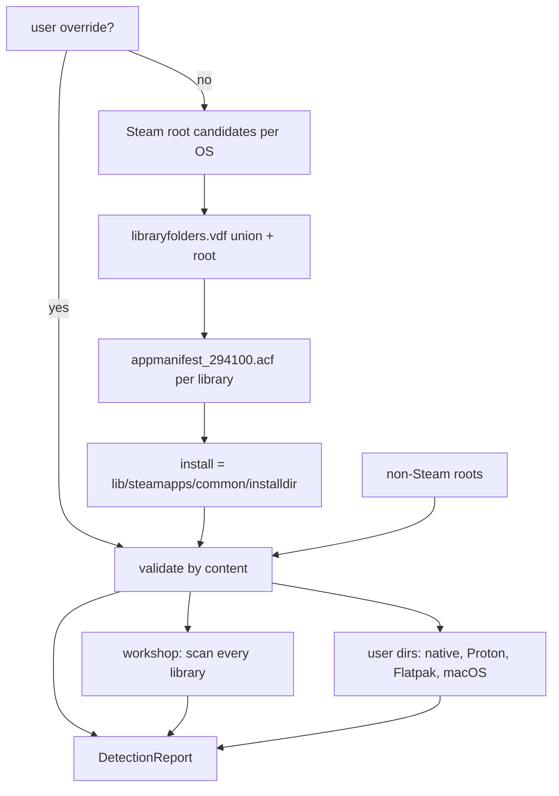

# Steam and RimWorld game detection, and custom mod folders

Scope: how RimStudio finds the Steam install(s), Steam library folders, the RimWorld install (appid 294100), the workshop content folder, the per-user config directory (ModsConfig.xml, Prefs.xml, Player.log), the game's own Mods folder and non-Steam installs on Windows, macOS and Linux; the Steam text formats involved (VDF and ACF); whether to depend on existing crates; a detection report model with a fixtures plan; and the design of user-defined custom mod folders, including how the game can load mods that live outside its own Mods folder. Serves requirements R3, R4, R10 and R11.

Status: research note | Last verified: 2026-10-04

Conventions: evidence pointers are repo-relative paths, absolute paths outside the repo, `decompiled:<path>` for the game's ILSpy output (behaviour described in my own words, never copied) and URLs. "(unverified)" marks a claim I could not check on this Linux machine. Steam account ids and login names are redacted as `<steamid>`.

## 1. Ground truth on this machine

All values below were read from the real files on 2026-10-04.

| Item | Value | Evidence |
|---|---|---|
| Steam root (real) | `/home/pawbeans/.local/share/Steam` | `steamlocate::locate()` experiment (`docs/research/data/steam-and-game-detection/vdfbench/src/main.rs`) |
| `~/.steam/steam` and `~/.steam/root` | both symlinks to the real root; `~/.steam/bin`, `bin32`, `bin64`, `sdk32`, `sdk64` also exist | `ls -la /home/pawbeans/.steam` |
| Libraries | 2: the Steam root (24 appmanifests) and `/run/media/pawbeans/games/SteamLibrary` (7 appmanifests, btrfs mount) | steamlocate experiment; `libraryfolders.vdf` |
| RimWorld library | library `0` (the Steam root). `294100` is listed in that library's `apps` table | `libraryfolders.vdf` |
| Install dir | `<root>/steamapps/common/RimWorld`, `installdir` = `RimWorld`, `buildid` 23969874, `StateFlags` 4 (fully installed) | `appmanifest_294100.acf` |
| Game version | `1.6.4871 rev598` in `Version.txt` at the install root | `/home/pawbeans/.steam/steam/steamapps/common/RimWorld/Version.txt` |
| Mods folder | `<install>/Mods`, 47 mod roots, 0 symlinks, mode 755 | `scan_packageids.py` run, `find -type l` |
| Workshop content | `<root>/steamapps/workshop/content/294100`, 690 item folders; 692 entries in the ACF (2 not on disk) | `analyze_workshop.py` run |
| `config/libraryfolders.vdf` vs `steamapps/libraryfolders.vdf` | byte-identical (1324 bytes each) | `cmp` |
| `compatdata/294100` | exists but is EMPTY (no `pfx`): the game runs natively, no Proton prefix | `ls` |
| Proton default | `CompatToolMapping` has 82 entries, default (key `0`) `proton_experimental`, no override for `294100` | steamlocate `compat_tool_mapping()` experiment |
| User config dir | `/home/pawbeans/.config/unity3d/Ludeon Studios/RimWorld by Ludeon Studios/` containing `Config/`, `Player.log`, `Player-prev.log`, `Saves/`, `Scenarios/`, `prefs`, `steam_autocloud.vdf` | `ls` |
| Active mods | `Config/ModsConfig.xml` begins with `<version>1.6.4633 rev1270</version>`, i.e. the version of the last game run, not the install | `head` |
| `steam_appid.txt` | present at install root, content `294100` | `cat` |
| Junk files | zero-byte `appmanifest_<n>.acf.<n>.tmp` files sit next to real manifests; they failed to parse (3 of 32 files) | steamlocate experiment output |

Two real traps visible already: `compatdata/294100` exists without being a Proton prefix, so "folder exists" is not a Proton signal (check `pfx/drive_c/users/steamuser/AppData/LocalLow/...`); and the game's `ModsConfig.xml` version lags the install version, so it cannot be used as "installed game version".

## 2. How the game itself locates things

Verified in decompiled code (behaviour only):

| Question | Behaviour | Evidence |
|---|---|---|
| Where is the Mods folder? | The parent of Unity's data folder plus `Mods`. The folder is created if missing. On Linux the data folder is `RimWorldLinux_Data`, so Mods is `<install>/Mods` (matches this machine); on macOS the data path is inside the `.app` bundle, so Mods is inside the bundle (see section 8.6); on Windows it is next to `RimWorldWin64_Data` (unverified on Windows) | decompiled:Verse/GenFilePaths.cs (`GetOrCreateModsFolder`, `ModsFolderPath`) |
| Where are official expansions? | Same function with `Data` instead of `Mods`: `<install>/Data/<Core,Royalty,...>` | decompiled:Verse/GenFilePaths.cs (`OfficialModsFolderPath`) |
| Where is the user data folder? | If the command-line argument `savedatafolder` is present, that path (trailing separators trimmed). Otherwise, in the editor `SaveData` beside the project; on macOS the sibling folder named `RimWorld` next to the parent of Unity's persistent data path (created if missing); everywhere else Unity's `persistentDataPath` | decompiled:Verse/GenFilePaths.cs (`SaveDataFolderPath`) |
| Config folder and files | `<SaveData>/Config`, with `ModsConfig.xml`, `Prefs.xml`, `KeyPrefs.xml`, `Knowledge.xml`, `LastPlayedVersion.txt` and a `DevModeDisabled` marker file | decompiled:Verse/GenFilePaths.cs (`ConfigFolderPath`, `ModsConfigFilePath`, `PrefsFilePath`) |
| Which mods exist? | `ModLister.RebuildModList` enumerates immediate subdirectories of `Data`, then of `Mods`, then Steam-subscribed workshop items, in that order | decompiled:Verse/ModLister.cs (`RebuildModList`) |
| How is the workshop folder found? | Not by path. The game asks the Steam client API for each subscribed item's install folder; if Steam reports no folder the item is "downloading", if the folder is missing it is "not installed" | decompiled:Verse.Steam/WorkshopItem.cs (`MakeFrom`), Verse.Steam/WorkshopItems.cs (`RebuildItemsList`) |
| Missing active mods | `DeactivateNotInstalledMods` walks `activeMods` and silently removes ids with no installed match (a `_steam` suffix is tried and stripped first) | decompiled:Verse/ModsConfig.cs (`DeactivateNotInstalledMods`) |
| Duplicate packageId | See section 8.4: same-source duplicates are dropped with an error, a Workshop copy of a local mod gets `_steam` appended to its id | decompiled:Verse/ModLister.cs (`TryAddMod`), Verse/ModMetaData.cs (`SteamModPostfix`) |

Consequence: the Workshop path is a Steam client concept. RimStudio can read the folder layout directly (needed because the Steam client is usually not running while a mod manager is open), but must treat Steam's own `appworkshop_294100.acf` and the `workshop/content/294100/<id>` folders as a cache of what the client reports.

## 3. Detection algorithm per OS

### 3.1 Principles

1. User override first, always (persisted, section 7.3). Detection only proposes.
2. Detection returns ALL candidates with provenance, not the first hit (the owner machine has two libraries and could also have a GOG copy). The UI picks a default by a fixed ranking and lets the user switch.
3. A candidate is accepted by content, not by name: `Data/Core/About/About.xml` and `Version.txt` (the same idea RimSort uses, `RimSort-main/app/services/path_autodetect_service.py` `_looks_like_rimworld_dir`), never by folder name alone.
4. Every filesystem probe has a timeout budget (removable and network drives can hang): see section 8.5.
5. Symlinks are followed for Steam roots (`~/.steam/steam` is a symlink on every Linux install) but candidates are deduplicated by canonical path.

### 3.2 Linux

Ordered Steam root candidates (first existing wins as primary, all existing ones are kept and deduplicated by canonical path):

| # | Candidate | Why | Evidence |
|---|---|---|---|
| 1 | user override | | |
| 2 | `$XDG_DATA_HOME/Steam` (default `~/.local/share/Steam`) | the real root on current Steam; the symlinks point here | this machine; `RimCrow-main/backend/paths/game_locations.py`; steamlocate `src/locate/linux.rs` |
| 3 | `~/.steam/steam` | symlink maintained by the Steam client for compatibility | this machine (`ls -la`) |
| 4 | `~/.steam/root` | second symlink, same target | this machine |
| 5 | `~/.steam/debian-installation` | Debian/Ubuntu packaged Steam | RimSort and RimCrow and steamlocate all list it |
| 6 | `~/.var/app/com.valvesoftware.Steam/.local/share/Steam`, also `.../.steam/steam` and `.../.steam/root` | Flatpak Steam. The Flatpak manifest persists the whole home (`--persist=.`) and grants `/mnt`, `/media`, `/run/media` so libraries on other drives work | `scratchpad/.../web/flat_com.valvesoftware.Steam.yml` (Flathub manifest fetched 2026-10-04); steamlocate |
| 7 | `~/snap/steam/common/.local/share/Steam` (and `$SNAP_USER_DATA` variant) | Snap Steam | steamlocate `src/locate/linux.rs`; RimSort |
| 8 | Steam Deck: same as #2 for user `deck` (`/home/deck/.local/share/Steam`) | the Deck is SteamOS Arch with the standard layout (unverified here); the SD card library is an extra library entry in `libraryfolders.vdf`, typically mounted under `/run/media/...` (unverified path) | Valve convention (unverified) |

A root is valid when `steamapps/` exists or `config/libraryfolders.vdf` exists (RimSort uses exactly this test, `_find_steam_root`; steamlocate requires only `steamapps/`). Keep the symlink-dedup rule: steamlocate dedupes by `read_link()` of the candidate; we use `canonicalize()` which also handles relative links.

Then, per Steam root, enumerate libraries (section 3.5), find the app (3.6), derive workshop (3.7).

User config dir candidates for Linux, in order, all probed, newest `Config/ModsConfig.xml` mtime wins as default:

1. `-savedatafolder` value if RimStudio itself launches the game or the user set a launch override.
2. `$XDG_CONFIG_HOME/unity3d/Ludeon Studios/RimWorld by Ludeon Studios` (Unity honours XDG_CONFIG_HOME: unverified), default `~/.config/unity3d/Ludeon Studios/RimWorld by Ludeon Studios` (verified on this machine).
3. Proton prefix: `<root>/steamapps/compatdata/294100/pfx/drive_c/users/steamuser/AppData/LocalLow/Ludeon Studios/RimWorld by Ludeon Studios` (RimSort chooses this path only if it exists, `path_autodetect_service.py` `get_linux_paths`; the Windows build running under Proton writes there). The check must be on the `pfx/.../LocalLow/...` path, because `compatdata/294100` alone exists here without a prefix.
4. Flatpak: both `~/.var/app/com.valvesoftware.Steam/.config/unity3d/...` and `~/.var/app/com.valvesoftware.Steam/config/unity3d/...` (RimCrow lists the second, `game_locations.py` `get_default_user_data_paths`; the first follows from `--persist=.` making the Flatpak HOME persistent; which one a game actually uses depends on Flatpak's XDG_CONFIG_HOME handling, unverified).

`Player.log` lives in the same user dir on Linux (verified: `Player.log` and `Player-prev.log` next to `Config/`). `Prefs.xml` and `ModsConfig.xml` are in `Config/`.

### 3.3 Windows

Ordered Steam root candidates:

| # | Candidate | Evidence |
|---|---|---|
| 1 | user override | |
| 2 | `HKCU\Software\Valve\Steam`, value `SteamPath` (Valve writes forward slashes, so normalise `/` to `\`) | Valve convention (unverified on a live Windows box). The key exists conceptually on Linux too: Steam keeps a registry emulation file `~/.steam/registry.vdf` with an `HKCU/Software/Valve/Steam` subtree (verified structure; contains no `SteamPath` on this Linux machine) |
| 3 | `HKLM\SOFTWARE\WOW6432Node\Valve\Steam`, value `InstallPath` (64-bit Windows) | steamlocate `src/locate/windows.rs`; RimSort `app/utils/win_find_steam.py`; RimCrow |
| 4 | `HKLM\SOFTWARE\Valve\Steam`, value `InstallPath` (32-bit Windows) | same three |
| 5 | `C:\Program Files (x86)\Steam`, then `C:\Program Files\Steam` | RimSort fallback; RimCrow |

Validity test: `steam.exe` exists (RimSort checks this) or `steamapps\` exists. steamlocate reads only HKLM, so a per-user Steam install that wrote only HKCU would be missed (step 2 covers it). Registry access goes through a small trait so Linux CI can mock it (section 7.4); the real implementation uses `winreg` 0.56.0 (MIT, crates.io checked 2026-10-04).

User config dir: `%USERPROFILE%\AppData\LocalLow\Ludeon Studios\RimWorld by Ludeon Studios` (RimSort `get_windows_paths`, RimCrow). Resolve LocalLow with the known-folder API `FOLDERID_LocalAppDataLow` rather than string-building `AppData\LocalLow` from `USERPROFILE` (profile redirection, OneDrive); the `known-folders` crate exists for this (not evaluated beyond metadata). `Player.log` is in the same folder; `Config\ModsConfig.xml` and `Config\Prefs.xml` beneath it.

Windows quirks to handle: paths in `libraryfolders.vdf` use escaped backslashes (`D:\\SteamLibrary`, section 5.2); drive letters compare case-insensitively; library on a disconnected drive; the install may be on a UNC path; MAX_PATH long-path prefix (`\\?\`) needed for deep workshop paths when canonicalising (std `canonicalize` returns the `\\?\` form; strip it for display with the `dunce` crate or an equivalent, both only seen as crate metadata).

### 3.4 macOS

| # | Steam root candidate | Evidence |
|---|---|---|
| 1 | user override | |
| 2 | `~/Library/Application Support/Steam` (the data root; `Steam.app` itself is in `/Applications` and holds no libraries) | steamlocate `src/locate/macos.rs`; RimSort; RimCrow `get_default_steam_data_root_candidates` |

RimCrow additionally probes `/Applications` and `~/Applications` for the Steam executable (`Steam.app/Contents/MacOS/steam_osx`), which is only needed to launch Steam, not to read libraries (`game_locations.py` `resolve_steam_executable_path`). The game under macOS is an app bundle: `steamapps/common/RimWorld/RimWorldMac.app` (RimSort globs `*.app` inside the install dir because macOS is case-insensitive but comparisons are not, `_find_mac_app_bundle`). Per RimSort, the bundle holds `Data` and `Mods` at the bundle root (validator `_looks_like_rimworld_mac_app`), consistent with the decompiled rule (Mods = parent of data path plus `Mods`, and on macOS the data path is `<bundle>/Contents` so the parent is the bundle; unverified on a Mac).

User config dir: `~/Library/Application Support/RimWorld` with `Config/` inside (RimSort writes `Rimworld`, RimCrow `RimWorld`; the filesystem is case-insensitive by default). The decompiled code builds this as a sibling named `RimWorld` of the parent of Unity's persistent data path (section 2); I could not resolve Unity's persistent path on macOS here, so the exact string is verified only through two independent competitors (unverified by execution). RimStudio probes the candidate and trusts it only when `Config/ModsConfig.xml` exists. `Player.log`: `~/Library/Logs/Ludeon Studios/RimWorld by Ludeon Studios/Player.log` or `~/Library/Logs/Unity/Player.log` (RimCrow `get_default_player_log_paths`; both candidates probed, newest wins).

### 3.5 Library enumeration (all OSes)

1. Read `<root>/config/libraryfolders.vdf` (RimSort's primary) and `<root>/steamapps/libraryfolders.vdf` (steamlocate's only source). On this machine they are identical; keep both because Steam has changed which one is authoritative over time (unverified history) and take the union.
2. Each child of `libraryfolders` is a library with keys `path`, `label`, `contentid`, `totalsize`, `update_clean_bytes_tally`, `time_last_update_verified` and an `apps` table of `appid -> bytes`. Older Steam wrote `"1" "D:\\path"` (value is a plain string); both shapes must parse (RimCrow handles both, `_steam_library_candidates_from_vdf`).
3. Always add the Steam root itself as library 0 even if the VDF is missing or unreadable.
4. The `apps` table can be stale (steamlocate states this in `Library::from_dir`, and instead lists `steamapps/appmanifest_<digits>.acf` files). Do both: the table is a hint, the manifest file is the truth.
5. Deduplicate by canonical path (case-insensitive on Windows and macOS).
6. A library whose path does not exist is reported `offline` (removable drive), not dropped (section 8.5).

### 3.6 Finding RimWorld (appid 294100)

For each library, in VDF order:

1. `<lib>/steamapps/appmanifest_294100.acf` exists and parses, with `appid` 294100 (reject mismatches; RimCrow does).
2. Install path = `<lib>/steamapps/common/<installdir>` (RimCrow tries `installdir` then the literal `RimWorld`).
3. Content check: `Data/Core/About/About.xml` exists; read `Version.txt`; detect the executable by OS (`RimWorldWin64.exe`/`RimWorldWin.exe`, `RimWorldMac.app`, `RimWorldLinux` or `start_RimWorld.sh`; lists from RimCrow `detect_rimworld_executable` and verified for Linux on this machine: `RimWorldLinux`, `start_RimWorld.sh`, `start_RimWorld_openglfix.sh`, `RimWorldLinux_Data`).
4. If the manifest says fully installed (`StateFlags` bit 4) but files are missing, report `needs verify`. If `StateFlags` has the update-required bit (2) or `TargetBuildID` differs from `buildid`, report `update pending` (the game may be mid-update; do not read Version.txt as final).
5. Last resort when no manifest is found anywhere: probe `<lib>/steamapps/common/RimWorld` directly (a manually copied install).

`StateFlags` is a bit set (value 4 = FullyInstalled on this machine; steamlocate's enum order maps to Valve's EAppState bits 1 Uninstalled, 2 UpdateRequired, 4 FullyInstalled, 32 FilesMissing, 128 FilesCorrupt, 256 UpdateRunning ... names from steamlocate `src/app.rs`, numeric values are my reading of the enum order, matching 4 on this machine).

### 3.7 Workshop content folder

1. For the library that holds the game, check `<lib>/steamapps/workshop/content/294100`. Steam stores workshop content in the library where the app is installed (RimSort assumes this by taking the part of the game path before `common`, `get_path_up_to_string`; verified on this machine, where the second library holds workshop data only for its own games 281990 and 394360).
2. Also scan every other library for `workshop/content/294100` and `workshop/appworkshop_294100.acf` and merge (a user who moved the game between libraries can have orphaned content in the old library, unverified).
3. Report each item folder `<id>` (numeric). Items listed in the ACF but absent on disk are `subscribed, not downloaded` (2 on this machine: 2971930101 and 3309790710).
4. Never assume `content/294100` is complete: the game uses the Steam API, not the folder (section 2).

### 3.8 Proton-run Windows builds

Facts: RimWorld ships a native Linux build, so Proton is used only when the user forces a compatibility tool for the app in Steam. On this machine the default tool mapping exists (`proton_experimental`) but there is no override for 294100, and `compatdata/294100` is empty. Proton signals, in order:

1. `config/config.vdf` `CompatToolMapping` has an entry for `294100` (steamlocate `compat_tool_mapping()` parses this file; structure under `InstallConfigStore/Software/Valve/Steam`, key name verified through the experiment output, not the exact path).
2. `compatdata/294100/pfx/drive_c/users/steamuser/AppData/LocalLow/Ludeon Studios/RimWorld by Ludeon Studios/Config` exists (RimSort's test).
3. The install dir contains `RimWorldWin64.exe` (the Windows depot was downloaded; unverified).

When Proton is active, game and Mods folder paths are unchanged (the install is the same Linux filesystem folder) but the user config dir moves into the prefix and `ModsConfig.xml` there is the one the game reads. Report BOTH user dirs and mark which one has the newest `ModsConfig.xml`. A launcher built later must pass the correct Steam launch route (`steam://rungameid/294100`) instead of executing the binary, because Proton needs the Steam runtime (design note, unverified).

### 3.9 Non-Steam installs (GOG, Itch, manual copies)

| Platform | What is known | Verification |
|---|---|---|
| Windows GOG | Galaxy records installed games in the registry under the GOG Galaxy games key; RimSort reads it; default `C:\GOG Games`, offline installer `%USERPROFILE%\GOG Games`, Heroic `%USERPROFILE%\Games` | read in RimSort source only (`path_autodetect_service.py` lines 349-470); unverified on a live system |
| Linux GOG | `~/GOG Games/<title>/game` (offline installer, minigalaxy), `~/Games/...` (Heroic, Lutris); Heroic keeps `~/.config/heroic/gog_store/installed.json` | RimSort source; unverified |
| macOS GOG | `/Applications/RimWorld*.app` and `~/Applications` | RimSort `_macos_game_app_roots`; unverified |
| Manual copy | any folder containing `Data/Core` and `Version.txt` | verifiable by content test |

Policy: probe these roots only for directories whose content passes the section 3.1 test; label them `non-steam`; mark confidence lower than a manifest-confirmed Steam install. Non-Steam installs have no workshop folder and no Steam subscription feed: the Workshop features degrade gracefully (the app can still work from the Mods folder and custom folders). Itch.io and Epic layouts were not researched (unverified). The user config dir is the same as the Steam native one (Unity derives it from company and product name, not from the store).

### 3.10 Comparison of existing implementations

| Aspect | RimSort | RimCrow | steamlocate 2.1.1 | RimStudio target |
|---|---|---|---|---|
| Windows registry | HKLM Wow6432Node then HKLM, checks `steam.exe` | HKLM and HKCU `InstallPath`, hard defaults | HKLM only | HKCU `SteamPath` + HKLM both views + defaults |
| Linux candidates | 5 (debian, `.steam/steam`, share, flatpak, snap) | 6 + `XDG_DATA_HOME` | 10 incl. flatpak and snap `.steam` links, SNAP_USER_DATA, XDG | union of all |
| macOS | Application Support only | adds `/Applications` for launching | Application Support only | same plus launch lookup |
| Library files | `config/` then `steamapps/` fallback | both | `steamapps/` only | both, union |
| Multiple Steam roots | one | one | `locate_all()` returns all | all |
| Proton config dir | yes (existence check) | no | no | yes |
| Workshop folder | derived from game path | derived | none | scan every library |
| Provenance and confidence | log lines | none | none | `DetectionReport` |

## 4. Mermaid overview



## 5. Steam file formats

### 5.1 Grammar (KeyValues1 text)

Informal grammar, confirmed by running three parsers over real and synthetic inputs (`docs/research/data/steam-and-game-detection/compare-out.txt`):

```
file   := (ws | comment)* ( macro | pair )* EOF
macro  := '#base' string | '#include' string
pair   := string cond? value cond?
value  := string | '{' pair* '}'
string := '"' chars '"' | bare            (bare token ends at whitespace, quote, { or })
cond   := '[' ... ']'                      (platform conditional such as [$WIN32])
comment:= '//' to end of line              (no block comments)
```

### 5.2 `libraryfolders.vdf` (real, redacted)

```
"libraryfolders"
{
	"0"
	{
		"path"		"/home/pawbeans/.local/share/Steam"
		"label"		""
		"contentid"		"6589216068661531899"
		"totalsize"		"962165788672"
		"time_last_update_verified"		"1790592567"
		"apps"
		{
			"294100"		"577359346"
		}
	}
	"1"
	{
		"path"		"/run/media/pawbeans/games/SteamLibrary"
		...
```

(Other apps elided.) On Windows the same file escapes backslashes inside values (`"path" "D:\\SteamLibrary"`); the parse test with escape processing yields `D:\SteamLibrary` (`compare-out.txt`, case "windows path escaped"). In a synthetic test, a strict escape-processing parser rejected a value holding a single backslash (`C:\Steam\steamapps\sourcemods`, the style seen in some Steam-written files, unverified for libraryfolders) while a literal-mode parser accepted it (case "single backslash path" in `compare-out.txt`). A tolerant reader must therefore handle a lone backslash before a non-escape character as a literal backslash.

### 5.3 `appmanifest_294100.acf` (real, redacted)

```
"AppState"
{
	"appid"		"294100"
	"Universe"		"1"
	"name"		"RimWorld"
	"StateFlags"		"4"
	"installdir"		"RimWorld"
	"LastUpdated"		"1782930922"
	"LastPlayed"		"1791117591"
	"SizeOnDisk"		"577359346"
	"buildid"		"23969874"
	"LastOwner"		"<steamid>"
	"TargetBuildID"		"0"
	"AutoUpdateBehavior"		"0"
	"InstalledDepots"
	{
		"294103"
		{
			"manifest"		"3402513235443928324"
			"size"		"577359346"
		}
	}
	"UserConfig"	{ "language"	"english" }
}
```

| Field | Use in RimStudio |
|---|---|
| `installdir` | folder name under `steamapps/common` |
| `buildid`, `TargetBuildID` | installed build vs pending target (0 here: nothing pending); store in the report so mod-compat caches can key on game build |
| `StateFlags` | install health (3.6) |
| `LastUpdated` | Unix seconds; "game updated N days ago" hint |
| `LastPlayed` | Unix seconds |
| `LastOwner` | a SteamID64: redact, never persist or log |
| `InstalledDepots.294103.manifest` | depot manifest id, changes on every game update |

`Version.txt` (`1.6.4871 rev598`) is the user-facing version; it is not in the manifest. Parse as `major.minor.build rev<N>`; keep unparsed text in the report.

### 5.4 `workshop/appworkshop_294100.acf`

Top-level keys (real): `appid`, `SizeOnDisk`, `NeedsUpdate` (0), `NeedsDownload` (0), `TimeLastUpdated`, `TimeLastFullCheck`, `TimeLastAppRan`, `LastBuildID`, then two tables:

```
"WorkshopItemsInstalled"
{
	"730936602"
	{
		"size"		"6311551"
		"timeupdated"		"1786739756"
		"manifest"		"680993128509253070"
	}
}
"WorkshopItemDetails"
{
	"730936602"
	{
		"manifest"		"680993128509253070"
		"timeupdated"		"1786739756"
		"timetouched"		"1774632171"
		"subscribedby"		"<accountid>"
		"latest_timeupdated"		"1786739756"
		"latest_manifest"		"680993128509253070"
	}
}
```

Measured on this machine (`analyze_workshop.py`): 692 installed entries, 692 details entries, 690 folders on disk, 0 items where `timeupdated != latest_timeupdated` or `manifest != latest_manifest` (Steam had synced), 25 details entries carry extra `BytesToDownload` and `BytesDownloaded` keys (an in-progress or recently completed download), 23 have `timetouched` 0, and only one distinct `subscribedby` value.

Out-of-date detection rule (the two `latest_*` fields are what the Steam client last learned from the server):

1. `latest_timeupdated > timeupdated`, or `latest_manifest != manifest`: update available.
2. `BytesDownloaded < BytesToDownload` or top-level `NeedsUpdate` = 1 or `NeedsDownload` = 1: downloading or pending.
3. Item in `WorkshopItemsInstalled` but folder missing: not downloaded.
4. Folder present but item absent from the ACF: orphan (not seen here; possible after unsubscribe).
5. Do not trust `size` as a byte count of the folder: in a 5 item sample, 3 items had an ACF size smaller than the summed file sizes on disk (e.g. 18539322 vs 37700242), 2 matched. Use it only as a change hint.

Because no item was stale at measurement time, rule 1 is verified for field presence and equality, not for a real stale example (open question 3).

Workshop layout: `workshop/content/294100/<publishedfileid>/` holds the mod as published (an item can be a mod root with `About/About.xml`, or a mod whose real content is in versioned subfolders such as `1.6`, with a root `LoadFolders.xml`; the sample item `730936602` has `1.1` ... `1.6`, `About`, `Features`, `Languages`, `LoadFolders.xml`, `Patches`, `Textures`). `workshop/downloads` and `workshop/temp` are empty here (Steam uses them while downloading; exact layout unverified). The item id in the folder name is also the Workshop id used for publishing, and mods you published carry it in `About/PublishedFileId.txt` (verified in the owner's folder: `[OH] Warrants Icon/About/PublishedFileId.txt`).

### 5.5 Other Steam files and identity

| File | Contains | RimStudio use |
|---|---|---|
| `steam_appid.txt` (game root) | `294100` | needed only when a Steamworks tool runs outside the Steam launch (the Workshop upload tool); verified present |
| `config/config.vdf` (about 100 KB here) | install config store incl. compat tool mapping | Proton detection only |
| `config/loginusers.vdf` | one entry per account, keyed by SteamID64, with `AccountName`, `PersonaName`, `RememberPassword`, `WantsOfflineMode`, `SkipOfflineModeWarning`, `AutoLogin`, `Timestamp` (structure only; values never read) | identifying the logged-in account is needed ONLY for publishing; do not parse it at detection time |
| `appmanifest.LastOwner`, `appworkshop.subscribedby` | account identifiers (32-bit account id in the workshop file) | same: not needed for browsing |
| `~/.steam/registry.vdf`, `~/.steam/steam.token`, `steam.pid` | registry emulation, token, pid | never read the token; `steam.pid` may tell whether Steam runs (optional) |

Privacy rule: detection never opens `loginusers.vdf`, `steam.token` or `config.vdf` unless Proton detection is enabled, and never stores ids. Publishing in later phases should use the Steam client's own session (Steamworks API or `steamcmd` login prompt), not scraped identity files.

### 5.6 VDF quirks and measured parser behaviour

Three implementations were run on the same inputs: `keyvalues-parser` 0.2.4 in escape mode, the same in literal mode, and a 118-line prototype of mine (`vdfbench/src/mini.rs`). Results from `compare-out.txt` (cwd-independent, release build):

| Case | keyvalues-parser (escaped) | keyvalues-parser (literal) | prototype |
|---|---|---|---|
| Real files (28 files) | parses | parses | identical trees, same=28 diff=0 |
| UTF-8 BOM prefix | error | error | ok (strips it) |
| CRLF | ok | ok | ok |
| Unquoted tokens | ok | ok | ok |
| Duplicate keys | ok, keeps both | ok | ok, keeps both in order |
| `//` comment | ok | ok | ok |
| `/* */` block comment | error | error | error (not valid Valve syntax) |
| `[$WIN32]` conditional after value | mis-parses (conditional becomes a key or value) | same | skips it |
| conditional before `{` | error | error | ok |
| `#base` | ok | ok | ok (recorded, never followed) |
| `#include` | error | error | ok (recorded) |
| Two top-level pairs | error | error | ok |
| Empty or whitespace-only file | error | error | ok (empty doc) |
| Truncated (missing `}`) | error | error | error |
| Trailing NUL byte | ok | ok | ok |
| Escaped quote and tab | ok | wrong (escapes kept raw) | ok |
| Single backslash value | error | ok | ok |

Real-file parse times (release, 50 iterations): `appworkshop_294100.acf` (241 KB) 8.85 ms with keyvalues-parser vs 0.52 ms with the prototype (17x); `config.vdf` (101 KB) 3.19 ms vs 0.27 ms (12x). Both are irrelevant for one-off reads; the gap matters only if the ACF is re-read on file-watch events, in which case 9 ms per event is still acceptable.

Rules for our reader: strip a UTF-8 BOM; skip zero-byte files (the `.acf.<n>.tmp` leftovers); only open files whose names match exactly `appmanifest_<digits>.acf`; keep duplicate keys as an ordered list (a map would lose data); never follow `#base`/`#include`; treat numbers as strings until a typed accessor asks (Steam writes 64-bit ids, which exceed 32-bit and JSON-safe-integer range, so ids go to the frontend as strings); tolerate a truncated file by reporting `unreadable` and retrying once (Steam rewrites ACFs in place).

## 6. Crate decision

Verified on crates.io (API with User-Agent `rimstudio-research`, accessed 2026-10-04) and in the unpacked sources:

| Crate | Version | Licence | MSRV | Notes |
|---|---|---|---|---|
| steamlocate | 2.1.1 (updated 2026-08-13) | MIT | 1.83 | repository github.com/WilliamVenner/steamlocate-rs; depends on keyvalues-serde and winreg on Windows |
| keyvalues-parser | 0.2.4 (updated 2026-05-17) | MIT OR Apache-2.0 | 1.81 | repository codeberg.org/CosmicHarper/vdf-rs; pest 2.7 based; README says pairs are stored sorted by key in the `BTreeMap`-style API (order not preserved) |
| keyvalues-serde | 0.2.4 | MIT OR Apache-2.0 | 1.81 | serde layer used by steamlocate |
| winreg | 0.56.0 | MIT | 1.60 | registry |
| junction | 2.1.0 (updated 2026-09-24) | MIT | 1.85 | Windows junction create/delete/read, relevant to section 8 |

What steamlocate handles: root detection per OS (Windows HKLM only; Linux 10 candidates with symlink dedup; macOS one path), `libraries()`, `find_app()`, typed `App` with state flags, build ids, depots, `compat_tool_mapping()` and non-Steam shortcuts (`shortcuts()`, 66 here). What it does not handle: HKCU `SteamPath`; any user override; the second Steam variants (it returns the first for `locate()`, all for `locate_all()`, without provenance); `config/libraryfolders.vdf`; an `appworkshop` ACF or the workshop folder at all; Proton prefix and game config dir; GOG and other non-Steam installs; macOS `/Applications`; content validation (Version.txt, Data/Core); offline libraries (an unreadable library is an error item); confidence or reasons; testing hooks (it reads `env::home_dir()` and the real registry directly; the crate offers a `__private_tests` helper module for its own tests only). Its error type does not carry "how found".

Options:

| Option | Pros | Cons |
|---|---|---|
| A. steamlocate + keyvalues-parser behind our `GameLocator` | least code now; community-maintained path tables | misses Windows HKCU, workshop ACF, Proton, non-Steam; no provenance; the parser fails on BOM, `#include`, empty file; sorted maps lose duplicate order; two more dependency trees (pest) |
| B. own VDF reader (about 150 lines) + own locator, steamlocate as optional cross-check | full control of provenance, offline/Proton/workshop; 12x to 17x faster parse; zero extra deps; fixtures drive everything; fits R11 (tiny, our code) | we own the path tables and must track Steam layout changes |
| C. own locator, keyvalues-parser for VDF | no hand-written parser | still inherits parser gaps in the table above |

Recommendation: B. Put the VDF reader and ACF typed views (`LibraryFolders`, `AppManifest`, `AppWorkshop`) in one small crate (name proposal `rimstudio-steam`, no I/O), the detection logic in `rimstudio-detect` behind `trait GameLocator`, platform bits (registry, known folders) behind `trait PlatformProbe`. Keep `steamlocate` and `keyvalues-parser` as dev-dependencies for differential tests on fixtures and on the maintainer's real files (an `#[ignore]` test), not in release builds. If the first release is time-boxed, option A behind the same trait is a safe stopgap because the trait boundary makes the swap local; the DetectionReport would then lack provenance for root candidates.

## 7. DetectionReport model and fixtures

### 7.1 Model (JSON, camelCase on the IPC; internal Rust structs are the source of truth)

```jsonc
{
  "schema": 1,
  "generatedAt": "2026-10-04T12:00:00Z",
  "os": "linux",
  "steamRoots": [ { "path": "...", "canonical": "...", "how": "xdg-data-home", "confidence": "high",
                    "checks": { "exists": true, "readable": true, "hasSteamapps": true, "hasLibraryFolders": true } } ],
  "libraries": [ { "path": "...", "how": "libraryfolders.vdf", "online": true, "label": "", "writable": true,
                   "hasApp": true, "stale": false } ],
  "installs": [ {
    "id": "steam:/home/u/.local/share/Steam",       // stable key = kind + canonical library path
    "kind": "steam" | "gog" | "manual" | "override",
    "path": "...", "how": "appmanifest_294100.acf", "confidence": "high" | "medium" | "low",
    "version": { "raw": "1.6.4871 rev598", "major": 1, "minor": 6, "build": 4871, "rev": 598 },
    "buildId": "23969874", "stateFlags": 4, "health": "installed" | "update-pending" | "needs-verify",
    "executable": "...", "modsDir": { "path": "...", "exists": true, "readable": true, "writable": true },
    "dataDirs": ["Core","Royalty","Ideology","Biotech","Anomaly","Odyssey"],
    "proton": false, "workshop": { "contentDir": "...", "itemsOnDisk": 690, "itemsInAcf": 692 }
  } ],
  "userDirs": [ { "path": "...", "kind": "native" | "proton" | "flatpak" | "macos" | "windows" | "override",
                  "modsConfig": { "exists": true, "mtime": "...", "gameVersion": "1.6.4633 rev1270" },
                  "playerLog": "...", "prefs": "..." } ],
  "selected": { "install": "steam:...", "userDir": "..." },
  "warnings": [ { "code": "userdir.version-mismatch", "message": "...", "paths": ["..."] } ]
}
```

Enumerations: `how` is a closed string set (`override`, `registry-hkcu`, `registry-hklm`, `symlink-steam`, `xdg-data-home`, `flatpak`, `snap`, `libraryfolders.vdf`, `appmanifest`, `directory-probe`, `gog-registry`, ...), so the UI can explain "found because ...". `confidence`: high = manifest plus content test; medium = content test only; low = name-based or stale entry. Warning codes are stable identifiers translated by the UI (R10: catalogs are JSON).

Validity checks per path: exists, is directory, readable (try `read_dir`), writable (create and delete a uniquely named marker file, only for `Mods` and the user dir when needed, never in Steam folders), free-space optional, case-sensitivity probe, canonical path, and "is on a removable or network mount".

Selection ranking: override > install whose `userDir` has the newest ModsConfig mtime > Steam high-confidence > other. Multiple installs stay listed; `selected` is a user decision persisted by `id`, not by index.

Warnings to emit: game version older or newer than the `ModsConfig.xml` `<version>` (this machine shows 4633 vs 4871 builds: informational only, the game rewrites it on launch); more than one install; library offline; Mods folder not writable (macOS bundle, Windows Program Files); Proton and native user dirs both present; zero-byte or unreadable ACF; `Version.txt` unparseable; install and workshop on different libraries; install is a symlink; Steam client appears running (`steam.pid`), so ACFs may change underneath.

### 7.2 Trait boundary

```rust
trait GameLocator { fn detect(&self, env: &dyn DetectEnv, opts: &DetectOptions) -> DetectionReport; }
trait DetectEnv {            // everything the locator touches, so tests need no Steam
    fn home(&self) -> Option<PathBuf>;
    fn var(&self, key: &str) -> Option<OsString>;
    fn registry(&self, hive: Hive, key: &str, value: &str) -> Option<String>;   // None off Windows
    fn fs(&self) -> &dyn FsProbe;        // exists, is_dir, read_dir, read_to_string, canonicalize, metadata, with a deadline
}
```

### 7.3 Persistence of user overrides

A JSONC file in the app config dir, separate from caches (so clearing caches never forgets overrides):

```jsonc
// rimstudio/paths.jsonc
{
  "schema": 1,
  "gameInstall": { "path": "/games/RimWorld", "pinned": true },   // pinned: stop auto-switching
  "userDir": null,                                                // null = auto
  "steamRoot": null,
  "extraWorkshopDirs": [],
  "ignoredInstalls": ["gog:/home/u/GOG Games/RimWorld/game"]
}
```

Rules: an override that fails validation is kept but reported (`override.invalid`), and detection falls back for that run; never silently delete a user choice; re-detect on startup and when a watched path changes; store paths as text with a `volumeHint` only for custom folders (section 8).

### 7.4 Fixtures plan (synthetic trees, no Steam needed)

A builder `fixture::tree(Layout) -> TempDir` creates the tree with `tempfile`; text content is generated from templates below. Home and root are injected through `DetectEnv`. Every fixture includes `Data/Core/About/About.xml` (one line), `Version.txt` (`1.6.4871 rev598`) and a platform executable stub (empty file).

| Id | Layout (under a temp HOME unless stated) | Key assertions |
|---|---|---|
| L1 linux-native | real root `HOME/.local/share/Steam/{steamapps/appmanifest_294100.acf, steamapps/common/RimWorld/..., steamapps/workshop/content/294100/111/About/About.xml, steamapps/workshop/appworkshop_294100.acf, config/libraryfolders.vdf, steamapps/libraryfolders.vdf}`; symlinks `HOME/.steam/steam` and `HOME/.steam/root` to the root; `HOME/.config/unity3d/Ludeon Studios/RimWorld by Ludeon Studios/Config/ModsConfig.xml` | one root after symlink dedup; how = first matching candidate; user dir native |
| L2 linux-two-libs | L1 plus `MNT/SteamLibrary/steamapps/{appmanifest_<other>.acf, common, workshop}`; RimWorld installed in library 1 only; VDF lists both | install found via VDF path of library 1; workshop dir is in library 1; library 0 `hasApp` false |
| L3 linux-flatpak | `HOME/.var/app/com.valvesoftware.Steam/.local/share/Steam/...`, user dir under `.var/app/.../.config/unity3d` and the variant without dot | both user dir candidates probed |
| L4 linux-snap | `HOME/snap/steam/common/.local/share/Steam/...` | snap candidate found |
| L5 linux-proton | L1 plus `compatdata/294100/pfx/drive_c/users/steamuser/AppData/LocalLow/Ludeon Studios/RimWorld by Ludeon Studios/Config/ModsConfig.xml` and a `CompatToolMapping` entry `294100` in `config/config.vdf` | both user dirs listed, newer mtime selected, `proton: true` |
| L6 linux-proton-empty | `compatdata/294100/` empty (as on the real machine) | `proton: false`, warning absent |
| W1 windows | injected registry: `HKCU\Software\Valve\Steam\SteamPath = c:/program files (x86)/steam`; `HKLM\...\WOW6432Node\...\InstallPath = C:\Program Files (x86)\Steam`; library 1 `D:\SteamLibrary` written escaped (`D:\\SteamLibrary`) | registry order; escaped path decoded; case-insensitive dedup |
| W2 windows-hklm-only | only the HKLM value | falls through order |
| W3 windows-default | no registry values, `C:\Program Files (x86)\Steam` present | fallback path, confidence medium |
| M1 macos | `HOME/Library/Application Support/Steam/steamapps/common/RimWorld/RimWorldMac.app/{Data,Mods,Version.txt}`; user dir `HOME/Library/Application Support/RimWorld/Config` | app bundle detected; Mods inside bundle |
| N1 gog-windows | registry GOG key pointing at `C:\GOG Games\RimWorld` | kind gog, no workshop |
| N2 gog-linux | `HOME/GOG Games/RimWorld/game/{Data,Mods,Version.txt}` | kind gog |
| N3 mac-app | `/Applications`-injected root with `RimWorld.app` | kind manual |
| P1 pathological | zero-byte `appmanifest_294100.acf.123.tmp`; BOM-prefixed `libraryfolders.vdf`; `apps` table lists 294100 but manifest missing; manifest `installdir` points to a missing folder; dangling `.steam/steam` symlink; library path missing (offline); two installs (Steam + GOG) | each yields the documented warning, never a panic, other candidates still returned |

Exact text templates (identical structure for every layout; only paths change):

```
"libraryfolders"
{
	"0"
	{
		"path"		"{ROOT}"
		"label"		""
		"apps"
		{
			"294100"		"577359346"
		}
	}
	"1"
	{
		"path"		"{LIB1}"
		"label"		""
		"apps"
		{
		}
	}
}
```

```
"AppState"
{
	"appid"		"294100"
	"name"		"RimWorld"
	"StateFlags"		"4"
	"installdir"		"RimWorld"
	"LastUpdated"		"1782930922"
	"buildid"		"23969874"
	"TargetBuildID"		"0"
}
```

```
"AppWorkshop"
{
	"appid"		"294100"
	"NeedsUpdate"		"0"
	"WorkshopItemsInstalled"
	{
		"111"	{ "size" "10" "timeupdated" "100" "manifest" "1" }
		"222"	{ "size" "10" "timeupdated" "100" "manifest" "2" }
	}
	"WorkshopItemDetails"
	{
		"111"	{ "manifest" "1" "timeupdated" "100" "latest_timeupdated" "100" "latest_manifest" "1" }
		"222"	{ "manifest" "2" "timeupdated" "100" "latest_timeupdated" "250" "latest_manifest" "3" }
	}
}
```

The third fixture is the missing real-world case: item 222 is stale (latest newer than installed), 111 is current, and a folder `333` exists on disk without an ACF entry (orphan). Windows variants write `{ROOT}` and `{LIB1}` as `C:\\Program Files (x86)\\Steam` style. Golden outputs are JSON (R10), stored under the test crate, and generated by the tests themselves (`UPDATE_GOLDEN=1`).

## 8. Custom mod folders

### 8.1 Model

Stored in the settings file as JSONC (R10), edited in the Settings UI (R4):

```jsonc
"customModFolders": [
  {
    "id": "cf_7f3a",                    // stable, generated once
    "path": "/run/media/me/project_drive/Projects/RimWorld Mods",
    "label": "My mods",
    "enabled": true,
    "layout": "modsRoot",               // "modsRoot": children are mods | "singleMod": the path IS a mod | "auto"
    "scanDepth": 1,                     // 1 = direct children; 2 allows grouping folders; capped at 4
    "watch": true,                      // file watcher (falls back to rescan on focus)
    "priority": 20,                     // lower wins duplicate-packageId ties; default order of the list
    "readOnly": false,                  // true = never write, never create links inside; hides edit tools
    "link": "auto",                     // "auto" | "links" | "copy" | "none" (how the game gets these mods, 8.6)
    "volumeHint": { "mount": "/run/media/me/project_drive", "label": "project_drive" },
    "lastSeen": "2026-10-04T12:00:00Z"
  }
]
```

Layout decision: a path is a mod when `About/About.xml` exists (case-insensitive about folder; the owner's mods use the standard case). `auto` classifies at scan time. Scan depth stops descending below a mod root (a mod folder can contain version folders like `1.6/`; these are not separate mods). Measured on the owner's folder: with depth 2, 22 mod roots were found in `/run/media/pawbeans/project_drive/pawbeans/Projects/RimWorld Mods` and the template repo is not itself a mod (`scan_packageids.py`).

### 8.2 Sources and precedence

Sources RimStudio knows: official Data, game Mods, Workshop, custom folders. The game itself loads only the first three (section 2). The scan result is a unified list keyed by `(packageId, rootPath)`; the "effective mod" for a packageId is chosen by a deterministic policy (8.4).

### 8.3 Measured duplicate cases

From `scan_packageids.py` over three roots (workshop 690 mod roots, install Mods 47, owner folder 22; 751 distinct packageIds, 0 missing ids): 7 duplicated ids, 3 across roots, 4 within a single root.

| packageId | Locations | Kind |
|---|---|---|
| `mlie.researchtree` | workshop `3030499331` and install `Mods/ResearchTreePlusPlus` | cross-root |
| `vr.missilegirl` | workshop `3712928623` and install `Mods/MissileGirl` | cross-root |
| `yanzihko.ldw` | workshop `2384986421` and owner `[OH] Croco Faction` | cross-root (workshop vs custom folder) |
| `husko.atr` | two copies in the owner folder (`... - Copy`, `... og`) | same folder |
| `husko.rc.lombaxtech` | three copies (`Ratchet & Clank Lombax Tech`, `... DEV`, `[OH] ...`) | same folder |
| `oh.weapons.gewehr41`, `tlwwp.base` | two copies each | same folder |

So duplicates are a normal state for a modder, not a rare error.

### 8.4 Duplicate packageId resolution

What the game does (decompiled:Verse/ModLister.cs `TryAddMod`, Verse/ModMetaData.cs): the packageId lookup is an exact-key dictionary. When a second mod with the same id arrives from a different root: if exactly one of the two is a Workshop item, the Workshop one has `_steam` appended to its id and both are kept (they are different mods to the game); otherwise (both local, or both Workshop) the later one is rejected with an error log. The "later" one is decided by directory enumeration order, which is not sorted: a probe with the Mono runtime on this machine printed folders `1 2 10 delta Charlie bravo Mike alpha zeta` (filesystem order, scratch experiment `symtest/Order.exe`; the game's bundled Unity Mono could differ). Hence which of two same-folder copies wins is not stable across machines.

Policy for RimStudio (deterministic and user-visible):

1. Key = packageId lower-cased for comparison, but display and store the original text (the game dictionary is exact-key; the `ModsConfig.xml` entry must keep the original casing).
2. Group all scan results by key. A group of one is normal.
3. Within a group choose the effective entry by: explicit user pin; then source rank (custom folders by `priority`, then game Mods, then Workshop; configurable); then the newest `supportedVersions` match for the current game version; then newest mtime of `About/About.xml`; then lexicographic path as a final tiebreak.
4. Show every duplicate group in a "Duplicates" panel with the reason for the choice and one-click pin.
5. When the effective entry is a custom-folder or Mods copy and a Workshop copy exists, tell the user the game will treat the Workshop one as `<id>_steam`; do not hide the Workshop one from the game, because the game keeps both (a `ModsConfig.xml` containing the plain id binds to the non-Workshop copy; one containing `<id>_steam` binds to the Workshop copy, per the `ModsConfig.xml` handling at decompiled:Verse/ModsConfig.cs lines near `TryGetPackageIdWithoutExtraSteamPostfix`).
6. When linking (8.6), never link two entries with the same id into the Mods folder unless the user asks (the game would log an error and drop one in unspecified order).

### 8.5 Path normalisation and drive behaviour

1. Store the path as the user typed it (display) plus a canonical form computed on use (`canonicalize`, then strip the Windows `\\?\` prefix for display). Compare with the canonical form; case-fold only on Windows and macOS (detect actual case-sensitivity with a probe file in a writable folder or the volume flag; macOS APFS can be case-sensitive).
2. Symlink loops: do not follow symlinks while scanning below the root unless the target is inside a configured root; track visited `(device, inode)` (Windows file id) and stop on repeats. Experiment on this machine: a self-referencing link appeared as a plain file entry in the .NET/Mono directory listing and a dangling link also appeared as a file, so neither can be mistaken for a mod directory by a `GetDirectories` scan (symtest output). RimStudio's own scanner must not rely on that and must detect loops itself.
3. Reject or warn on overlapping roots: a custom folder that is inside, contains, or equals the game Mods folder, a Workshop content folder or another custom folder (otherwise the same mods are counted twice).
4. Offline drives: the entry keeps `enabled`, shows `offline`, its mods stay in the library as "unavailable" using the cached scan (cache is JSON), nothing is deleted from `ModsConfig.xml` by RimStudio, and activating such a mod is blocked with a clear message. Detect offline by `exists()` with a deadline thread (a stalled NFS or SMB mount can block `stat` forever; on Linux use a worker with timeout), and compare `volumeHint`.
5. Linux `/run/media/<user>/<label>` churn: the mount point depends on the logged-in user and label and can change (`/run/media/pawbeans/games` and `/Games` style duplicates exist here: two mounts differ only by capital letter, from `mount`). Store `volumeHint` (mount, label, and a filesystem UUID read from `/dev/disk/by-uuid` or `findmnt`, unverified) so that when the path disappears the app can propose "same volume found at <new path>". Never rewrite paths automatically; propose and ask once.
6. Normalise separators and trailing slashes, expand `~` and environment variables at input time only, reject relative paths, and warn on paths longer than 240 characters on Windows without long-path support.
7. File watching: inotify limits on Linux (a 690 item workshop is 306k files by the task brief; watch only the directory level or use periodic rescans with directory mtimes), and network drives do not deliver events: the `watch` flag is advisory, with a "rescan" command and focus-triggered rescans.
8. Case-insensitive collisions: two sibling mod folders differing only by case cannot exist on Windows or macOS; on Linux copy-to-Windows exports can collide: report.

### 8.6 How the game can load mods outside its own Mods folder

Fact base: the game builds its list from three sources only and the only path-like command line argument found is `savedatafolder` (decompiled:Verse/ModLister.cs, Verse/GenFilePaths.cs). So a mod outside `<install>/Mods` is invisible unless it appears inside `<install>/Mods` or as a Steam Workshop item. Options:

| Option | Mechanism | Pros | Cons |
|---|---|---|---|
| A. Link farm | for each active external mod create `<install>/Mods/<name>` as a link to the real folder | zero copy, edits in the real folder are live, owner's mods stay on the external drive | needs link privileges on Windows; breaks when the drive is offline; the game itself or Steam may delete/modify through the link; per-OS code |
| B. Copy or sync | copy active external mods into `<install>/Mods` | works everywhere, no link risks | disk use, stale copies, divergence, the game and mods can write into the copy; slow for large mods |
| C. Move mods | move into Mods | simplest | destroys the user's organisation; unacceptable |
| D. Replace the Mods path | symlink the whole `Mods` folder to another location | single link | surrenders the install folder; Steam update may reset; breaks other mods; reject |
| E. Run a patched launch | `-savedatafolder` only moves user data, not mods | none for mods | not a solution |

Evidence that links work for the game's scan: a Mono test program using the same enumeration API (`DirectoryInfo.GetDirectories` then check for `About/About.xml`) over a folder with these entries gave (scratch `symtest/Test.exe`, Mono 4.0.30319, not the game's own runtime): absolute symlink to a mod folder, relative symlink, and a link with spaces, `&` and brackets in its name were all listed as directories with the `ReparsePoint` attribute and their `About/About.xml` was readable through the link; a recursive file enumeration through a linked directory worked; a dangling link, a self loop and a link to a file were listed as files (so they are skipped by the directory scan). This strongly suggests Linux symlinks are accepted by a `GetDirectories`-based scan, but it does NOT prove that the game's own mod loading (asset loading by Unity, XML loading, `ModMetaData` constructor) is happy with them (open question 1). A real in-game test on the target OS is a release gate.

Recommendation: A (link farm) as the default for custom folders with `link: "auto"`, falling back to B (copy) per mod when linking fails, with C never used.

Design of the link farm:

1. Link type: Linux and macOS use directory symlinks (absolute targets). Windows uses junctions (no privilege needed, `junction` crate 2.1.0 is available) when the target is a local volume; symbolic links only if Developer Mode or the privilege is present; junctions cannot target network paths (UNC) and cannot be relative; fall back to copy then.
2. Naming: link name = a safe, unique folder name: the mod folder name sanitised, plus a short stable suffix of the source id (for example `MyMod__rs3a7f`) so that two sources with the same folder name cannot collide and so that links are recognisable. The game does not need folder names to match packageIds (package ids are read from About.xml).
3. Ownership markers: RimStudio records every link it creates in a JSON manifest stored in its own data dir, keyed by game install id: `{ link path, target, targetId, createdAt, kind }`. Additionally, for copies, write a small `.rimstudio.json` file inside the copy (a link needs no marker inside the target, never write into the user's source folder). A folder in Mods is "ours" only if it is in the manifest AND (is a link whose target equals the recorded target, or is a copy with the marker). Never remove or replace anything else; never overwrite an existing non-owned folder: choose another name or report.
4. Cleanup: on app start, on "Apply load order", and on mod deactivation, remove links we own whose mod is inactive or whose source is gone (dangling), using the platform's link removal (`remove_file` on Unix, `remove_dir` on a junction, never `remove_dir_all` on anything that is a link, because that would delete the target's contents on some platforms: on Windows older runtimes follow junctions in recursive deletes, unverified). Cleanup is idempotent and journaled.
5. Safety rules: refuse when the Mods folder is not writable (report, offer copy-less alternatives); refuse targets inside the Mods folder itself; reject targets that are the Mods folder or an ancestor; never link above depth one; do not create links while the game is running (check for the game process or lock; unverified approach) to avoid the game seeing partial state; apply changes atomically per mod and roll back on error; keep a dry-run plan the UI can show ("will create 14 links, remove 2").
6. Pre-launch check (the key safety net): before starting the game, for every mod id in the intended active list compute where the game will find it: (a) official Data, (b) a real folder or owned link in Mods that exists and has a readable `About.xml`, (c) a Steam Workshop folder present in the ACF and on disk. If any id has no resolution, block launch and list them, because the game will silently remove such ids from `ModsConfig.xml` and rewrite the file (decompiled:Verse/ModsConfig.cs `DeactivateNotInstalledMods` runs inside `RebuildModList`), losing the user's load order irreversibly. Always back up `ModsConfig.xml` (timestamped, keep the last N) before launching. Also verify that each link target is reachable right now (offline drive), the `_steam` rule for same-id workshop copies (8.4), and that the Workshop copy is fully downloaded (section 5.4 rule 2).
7. After exit: re-read `ModsConfig.xml` and diff against the intended list, and report ids the game dropped (the evidence for what went wrong).

Failure modes:

| Failure | Cause | Handling |
|---|---|---|
| Windows: "A required privilege is not held" creating symlinks | non-admin, Developer Mode off | use junctions; copy if the target is on a network share |
| Junction across volumes | junction to a different local volume works; junction to a network share does not (UNC unsupported) | detect UNC and fall back to copy |
| Windows: junction target moved or drive letter changed | drive letters reassigned | use the `volumeHint`, show the link as broken, never silently retarget |
| macOS: Mods folder inside the app bundle | Mods resolves inside `RimWorldMac.app` (section 3.4) | OS protections for app bundles may block writes (unverified); detect with the writable probe; a copy elsewhere cannot help because the game scans only its own folder, so show the OS permission instruction (full disk or app management access for RimStudio) |
| macOS: translocation | an app run from a quarantined download path may be relocated read-only | detect read-only, instruct |
| Linux: Mods folder owned by root or on read-only mount | system-wide install | writable probe, explain |
| Linux Steam Flatpak | the game process sees a sandbox: a symlink to `/run/media/...` works only if the Flatpak has that path granted (the Flathub Steam manifest grants `/mnt`, `/media`, `/run/media`, fetched 2026-10-04; a target in `~/Documents` or another path may be invisible to the game) | detect the Flatpak install, check the target prefix against the known grants, else fall back to copy or tell the user to grant access |
| Steam verify or update removing links | Steam's integrity check might delete or repair unknown entries in the install folder (not tested: unverified) | the manifest of owned links makes restoration automatic on the next apply; re-check links at every launch |
| Steam or game following links into the target | recursive scans (antivirus, Steam) traverse into the external drive | no mitigation needed except being aware of the scan cost |
| Duplicate packageIds | Workshop plus custom | policy in 8.4 |
| Drive offline at launch | removable disk | pre-launch check blocks, UI offers to deactivate those mods first (and writes ModsConfig itself) |
| Link removal deleting content | wrong recursive delete | rules in step 4: only unlink, and test with fixtures |
| Mono directory order nondeterminism | unsorted enumeration | RimStudio writes the explicit load order, so game enumeration order matters only for duplicate ids |
| File watcher storms | linked folders appear in two places | watch real targets only, ignore events from the Mods folder links |

Copy fallback (B): copy with a content hash manifest (`.rimstudio.json` inside the copy: source id, source mtime, file count, hash); resync on mismatch; remove on deactivation; never copy `.git`, `Source`, `.vs`, build outputs (configurable ignore list); warn on size above a threshold. The copy is the target of the game's edits only if the user opts in; otherwise it is disposable.

## Implications for RimStudio

1. A `rimstudio-steam` crate parses KeyValues1 text itself (BOM strip, `//` comments, quoted and bare tokens, conditionals skipped, `#base`/`#include` recorded but not followed, duplicate keys preserved in order, lone backslash tolerated) and passes a differential test against keyvalues-parser on every real fixture (28 of 28 identical in the measurement).
2. Detection returns a `DetectionReport` with all candidates, closed `how` values, confidence levels and warnings; no code path returns only "the first hit".
3. The Windows probe order is HKCU `SteamPath`, HKLM WOW6432Node `InstallPath`, HKLM `InstallPath`, then default folders; the Linux order is `XDG_DATA_HOME/Steam`, `~/.steam/steam`, `~/.steam/root`, `~/.steam/debian-installation`, Flatpak, Snap; macOS is `~/Library/Application Support/Steam`.
4. An install is accepted only when `Data/Core/About/About.xml` exists; `Version.txt` is parsed into major, minor, build, rev with the raw text kept; `ModsConfig.xml`'s `<version>` is never used as the installed version.
5. Libraries come from the union of `config/libraryfolders.vdf` and `steamapps/libraryfolders.vdf` plus the Steam root; per-library truth comes from `appmanifest_*.acf` files matched by exact name, ignoring `*.tmp` and zero-byte files; offline libraries are reported, not dropped.
6. Workshop content is scanned in every library, and per-item status (current, update available, downloading, not downloaded, orphan) is computed from `appworkshop_294100.acf` with the rules in 5.4; `size` is never used as a folder size.
7. User config candidates (native, Proton prefix with an existence check on `pfx/.../LocalLow/...`, Flatpak both variants, macOS) are all probed; the one with the newest `ModsConfig.xml` is the default and the user can change it; `-savedatafolder` is supported as an override.
8. The user override file `paths.jsonc` is separate from caches, validated on load, and never silently discarded.
9. Custom mod folders use the JSONC model in 8.1 (path, label, enabled, layout, scanDepth, watch, priority, readOnly, link, volumeHint) and the Settings UI rejects overlapping roots.
10. Duplicate packageIds are resolved by the deterministic policy in 8.4 and surfaced in a Duplicates panel; the owner's own folder (7 duplicated ids on this machine, 3 across roots including one against a Workshop item) is the acceptance fixture.
11. External mods reach the game through a managed link farm (symlinks on Linux and macOS, junctions on Windows, copy as fallback) in `<install>/Mods`, with a JSON ownership manifest, unlink-only cleanup, dry-run plans and a pre-launch check that every active id resolves; ModsConfig.xml is backed up before every launch and diffed after exit.
12. Before any release that ships the link farm, run an in-game test on each OS with a symlinked or junctioned mod in `Mods` (the Mono directory test is encouraging, not conclusive).
13. Registry, filesystem and environment access go through `DetectEnv` so the fixtures L1 to P1 run in CI on Linux without Steam; golden outputs are JSON.

## Open questions

1. Does the game load assets and XML normally from a mod folder that is a symlink (Linux, macOS) or a junction (Windows)? Only the directory listing and `About.xml` read were tested, with system Mono rather than the game's runtime.
2. What is the exact macOS user data path produced by the game (code builds a sibling folder named `RimWorld`; RimSort and RimCrow both use `~/Library/Application Support/RimWorld`) and do the Player.log locations listed by RimCrow both exist?
3. What does a real stale item look like in `appworkshop_294100.acf` (all 692 items were current at measurement time), and which file does Steam update first, `timeupdated` or `latest_timeupdated`?
4. Does `HKCU\Software\Valve\Steam\SteamPath` exist and match `InstallPath` on current Windows Steam, and is a per-user Steam install without HKLM keys realistic?
5. Under Flatpak Steam, which of `.config/unity3d` and `config/unity3d` does RimWorld actually write to?
6. Does Steam's "verify integrity of game files" remove unknown folders or links inside `<install>/Mods`? It was not tested.
7. Does the Windows Proton build download into the same `common/RimWorld` folder, with `RimWorldWin64.exe` present beside the Linux binary?
8. How should the app detect that the game is running to avoid changing links during a session (process name, lock file, or Steam's `AppRunning` state flag 64 in the appmanifest)?
9. Are GOG, Epic and itch layouts beyond what RimSort probes worth supporting in the first release?
10. Does the game's `_steam` suffix logic apply to a custom folder copy of a mod whose Workshop id the user also subscribes to in all cases (it applies when exactly one side is a Workshop item), and does that affect how RimSort-compatible sorting rules, which key on plain packageIds, must be applied?
