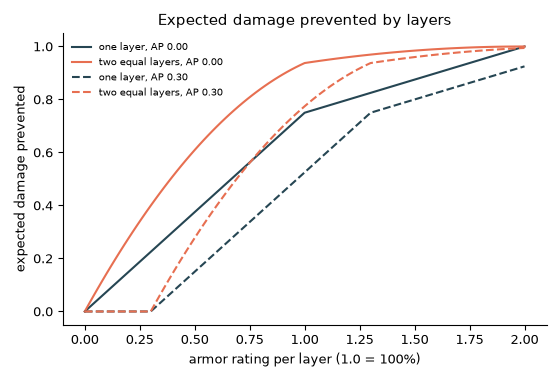
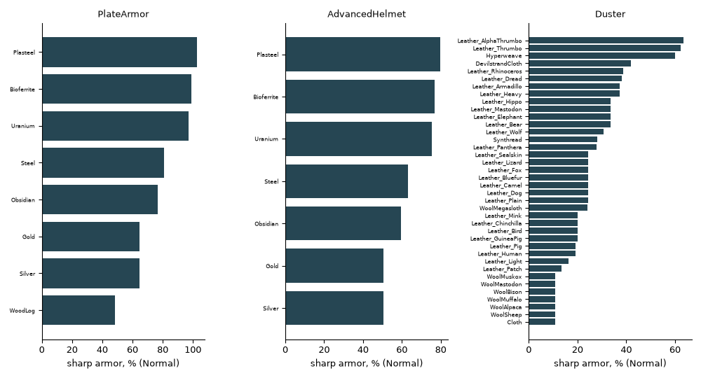
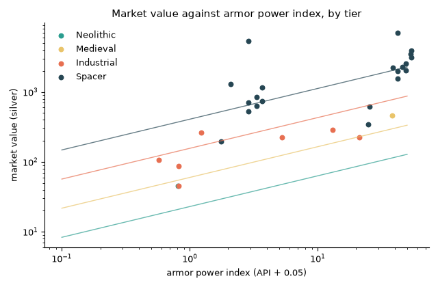
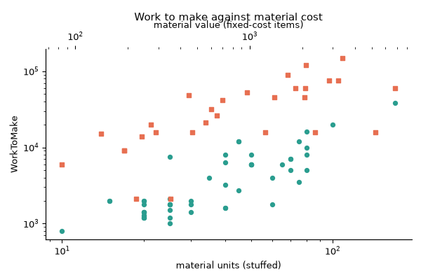
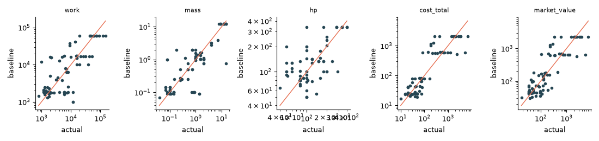

# Vanilla apparel and materials: the mathematical structure of armor and apparel balance

Scope: a data-science investigation of every apparel ThingDef and every stuff (material) in RimWorld 1.6.4871 rev598 (Core plus Royalty, Ideology, Biotech, Anomaly, Odyssey). It resolves the defs with the reference def engine, verifies the armor mechanics in the decompiled game code, fits statistical models of how apparel is balanced, and derives an automatic baseline for new apparel that RimStudio's item designer can use (requirement R7). Everything is computed at runtime from the user's own install; the committed numbers are research data only (R11), stored as JSON and CSV (R10).

Status: research note | Last verified: 2026-10-04

## 1. Method and pipeline

Inputs: the install folder `/home/pawbeans/.steam/steam/steamapps/common/RimWorld` (Version.txt reads `1.6.4871 rev598`), and the def engine in `docs/research/data/def-engine/` (read only, used unmodified; no engine bug was found, so there is nothing to report). The engine loads Core plus the five DLCs in that order (13,212 defs, 29 top-level patch operations, no diagnostics), so every number below is the post-patch, post-inheritance value the game sees.

| Step | Script (all under `docs/research/data/vanilla-apparel/`) | Output |
| --- | --- | --- |
| 1. Resolve defs | `extract.py --game DIR` (or env `RIMWORLD_DIR`) | `vanilla-apparel.json` (112 apparel ThingDefs), `vanilla-stuff.json` (55 ThingDefs with `stuffProps`, the 35 stat definitions the model needs, the 64 human body parts with computed coverage, apparel layers, body part groups, ingredient prices) |
| 2. Model and report | `analyze.py [--figs]` | `apparel-items.csv` (one row per item at its reference material), `apparel-by-stuff.csv` (1,387 item x material rows, Normal quality), `stuff-table.csv`, `models.json`, `backtest-loo.csv`, five PNG figures |
| Library | `apparelmodel.py` | stat pipeline, coverage, market value formula, armor math (about 120 lines, formulas only) |

Run from any cwd: `PYTHONDONTWRITEBYTECODE=1 RIMWORLD_DIR=/path/to/RimWorld python3 extract.py && python3 analyze.py --figs`. The whole run takes about 5 seconds; every file is under 250 KB; the run is deterministic (fixed seeds). Only numeric fields and identifiers are stored, never XML trees or description text.

Assumptions and rules applied:

1. An "apparel" is any resolved ThingDef with an `apparel` element (112, of which 54 are stuffed, meaning made from a chosen material). Items that sit only in the Belt layer form the "utility" kind (packs, belts, lances, plus non-wearable ability carriers such as the orbital targeters); 15 of them have a recipe.
2. A "stuff" is any ThingDef with `stuffProps`. 47 of the 55 are usable for apparel (they have stuff categories and armor powers); the other 8 are stone blocks, components and similar.
3. Reference material of a stuffed item for per-item statistics: Steel if Metallic is allowed, else Cloth if Fabric, else Leather_Plain, else WoodLog, else Bioferrite. All per-material statements use `apparel-by-stuff.csv`.
4. Quality is Normal unless stated. Items with an explicit `MarketValue` in `statBases` (14: psychic and Royal-ultra items, the orbital targeters, Cerebrex node) are excluded from price models.
5. `WorkToMake` missing from an item reads as 1 in the stat pipeline (the StatDef default); a work value of 1 in a table means "not craftable".

Licence note: the datasets are numbers read from the user's install (research data). RimStudio must read them again at runtime and not ship them. Combat Extended and RimSort were not used in this analysis.

## 2. Armor and apparel mechanics verified from code

### 2.1 How an apparel stat is computed

Verified in decompiled:RimWorld/StatWorker.cs (`GetValueUnfinalized`, `FinalizeValue`), decompiled:RimWorld/StatPart_Stuff.cs, decompiled:RimWorld/StatPart_Quality.cs and the StatDefs in `Data/Core/Defs/Stats/Stats_Apparel.xml`:

1. Start from the item's `statBases` value, or the StatDef default (0 for armor and insulation, 100 for MaxHitPoints, 1 for WorkToMake and Mass).
2. If a stuff is chosen: multiply by the stuff's `statFactors` entry for that stat (only when the value is above zero or the stat applies factors to negatives), then add the stuff's `statOffsets` entry. Stuff lists quality-dependent factors and offsets too; only Bioferrite uses them.
3. Run the StatDef's parts sorted by priority, highest first (decompiled:RimWorld/StatDef.cs sorts by negative priority). For armor and insulation the stuff part has priority 100 and the quality part 0, so the stuff part runs first: value += (item's `StuffEffectMultiplier...` stat) x (stuff's `StuffPower_...` stat). Then the quality part scales the whole sum (value x factor, gain limited by `maxGain`).
4. Finalize: scenario factor, rounding to the nearest 5 above `roundToFiveOver` (200 for MaxHitPoints and MarketValue), integer rounding when the stat asks for it, clamp to `[minValue, maxValue]` (armor ratings are clamped to 0..2).

Consequences that matter for design:

* Armor = (base rating + armorMultiplier x stuffPower) x qualityFactor, capped at 200%. No stuff has an `ArmorRating` factor or offset (the stuff table has only Beauty, Flammability, MaxHitPoints, WorkToMake, WorkToBuild and similar factors), so material changes armor only through its power stat.
* Quality scales the stuff contribution as well, so "Legendary" is x1.8 on the whole armor value, not on the base only.
* Armor has no hit-point part: the ArmorRatingBase StatDef holds only the quality part and the Apparel class contains no armor or hit-point logic (grep of decompiled:RimWorld/Apparel.cs finds none). A damaged apparel keeps its full rating until it is destroyed. (The market value does drop with hit points, StatPart_Health.)
* Mass is not changed by material in vanilla (no stuff has a Mass factor); hit points and work are (HP x0.5 to x2.8, work x0.7 to x2.5).

Quality factors, read from the StatDefs (`models.json` key `quality`):

| Quality | Armor | Insulation | Market value (max gain) |
| --- | --- | --- | --- |
| Awful | x0.60 | x0.8 | x0.50 |
| Poor | x0.80 | x0.9 | x0.75 |
| Normal | x1.00 | x1.0 | x1 |
| Good | x1.15 | x1.1 | x1.25 (+500) |
| Excellent | x1.30 | x1.2 | x1.5 (+1000) |
| Masterwork | x1.45 | x1.5 | x2.5 (+2000) |
| Legendary | x1.80 | x1.8 | x5 (+3000) |

Hit points, mass, work and flammability do not depend on quality (their StatDefs have no quality part). Ladder for plate armor in steel (computed): sharp 48.6, 64.8, 81.0, 93.2, 105.3, 117.5, 145.8 percent from Awful to Legendary; market value 230, 345, 460, 575, 690, 1150, 2300.

### 2.2 What happens when a pawn is hit

Verified in decompiled:Verse/ArmorUtility.cs (`GetPostArmorDamage`, `ApplyArmor`), described in my own words:

1. The damage type selects the armor stat once, before any layer: Sharp, Blunt or Heat. If a layer converts sharp damage to blunt, later layers still use the sharp rating.
2. Worn apparel is walked from the end of the list to the start. The list is sorted ascending by the draw order of each item's last layer (OnSkin 0, Middle 100, Shell 200, Belt 300, Overhead 400, EyeCover 500; decompiled:RimWorld/Pawn_ApparelTracker.cs line 664, `Data/Core/Defs/Misc/ApparelLayerDefs/ApparelLayerDefs.xml`). So the outermost layer is checked first.
3. An item takes part only if it covers the hit body part (a body part is covered when it shares a body part group with the item; decompiled:RimWorld/ApparelProperties.cs `CoversBodyPart`).
4. For each participating layer: the layer itself receives one quarter of the incoming damage (randomly rounded); then the effective rating is e = max(rating - armor penetration, 0). One uniform random number u in [0,1) is drawn: if u < e/2 the damage becomes zero (deflected); else if u < e the damage is halved (randomly rounded) and, for sharp damage, becomes blunt; otherwise nothing happens. A rating of 200% therefore deflects everything.
5. If the damage reaches below 0.001 the walk stops. After the apparel, the pawn's own armor stat (natural armor, mechanoid bodies) is applied with the same rule.

Closed form for the expected remaining damage fraction of one layer: 1 - 0.75 e for e up to 1, 0.5 - e/4 for e between 1 and 2, 0 at e = 2. The in-game description of the stat (`Stats_Apparel.xml`) gives a check: 90 percent armor against 10 percent penetration gives e = 0.8, a 40 percent chance to deflect and 40 percent to halve, so the mean factor is 1 - 0.4 - 0.2 = 0.4 (our formula: 1 - 0.75 x 0.8 = 0.4).

Layers combine multiplicatively in expectation, because each layer's outcome is an independent multiplier in {0, 0.5, 1} on the incoming amount. Computed values (`models.json` key `layer_stacking`):

| Layer ratings | Remaining fraction, AP 0 | Remaining fraction, AP 0.30 |
| --- | --- | --- |
| 0.5 | 0.625 | 0.850 |
| 0.5 + 0.5 | 0.391 | 0.723 |
| 1.0 | 0.250 | 0.475 |
| 1.0 + 1.0 | 0.0625 | 0.226 |
| 0.9 + 0.36 | 0.237 | 0.525 |
| 1.2 | 0.200 | 0.325 |

Penetration hurts disproportionally against moderate armor: the 0.5 layer loses 22.5 points of mitigation to a 0.3 AP, a layer of 1.0 loses 22.5 as well (e falls from 1.0 to 0.7, 0.75 per unit of e), while a 1.2 layer loses only 12.5 (it has e = 0.9 left, still on the cheaper slope above 1). Two thin layers are worth much less than one thick layer: two layers of 0.5 (0.391) are weaker than one layer of 1.0 (0.25) at AP 0 and much weaker against AP 0.3 (0.723 against 0.475).

### 2.3 Coverage: how often a layer is checked

The human body has 64 parts and their `coverageAbs` values sum to exactly 1.0 (computed by `extract.py` with the rule in decompiled:Verse/BodyDef.cs: a part's absolute coverage is its share of the parent's area minus its children's shares, scaled by the parent's absolute coverage). `ApparelProperties.HumanBodyCoverage` is the sum of `coverageAbs` over the parts the item covers. The hit part is drawn with weight `coverageAbs` times a per-part-def hit chance factor (decompiled:Verse/HediffSet.cs `GetRandomNotMissingPart`), so, apart from the height and hit-chance factors, coverage equals the probability that a random hit is checked against that layer.

| Body part group | Coverage (all parts incl. organs inside) |
| --- | --- |
| Torso | 0.4266 |
| Legs | 0.2520 |
| Arms | 0.1589 |
| FullHead | 0.0600 |
| UpperHead | 0.0366 |
| Shoulders | 0.0336 |
| Eyes | 0.0192 |
| Neck | 0.0150 |
| Mouth | 0.0090 |

Item coverage (`apparel-items.csv`): plate armor, power armor and most full suits 0.886 (Torso, Neck, Shoulders, Arms, Legs), jackets 0.634, flak vest 0.442, pants and flak pants 0.252, full helmets 0.060, upper-head hats 0.037, collars 0.015. Two items can be worn together only if their layers and interfering body part groups do not clash (decompiled:RimWorld/ApparelUtility.cs `CanWearTogether`).

### 2.4 Worked examples: six items, three materials each

Computed with `apparelmodel.Model.stat` (the pipeline above). Sharp, blunt and heat are armor ratings in percent; the last column is the price from the market-value formula (section 5.1). Stuff units are the material count in the recipe.

| Item (coverage) | Material, quality | Sharp | Blunt | Heat | Cold ins. | HP | Work | Value | Units |
| --- | --- | --- | --- | --- | --- | --- | --- | --- | --- |
| Plate armor (0.886) | Steel, Normal | 81.0 | 40.5 | 54.0 | 3.0 | 290 | 38,000 | 460 | 170 |
| | Plasteel, Normal | 102.6 | 49.5 | 58.5 | 3.0 | 810 | 83,600 | 1,830 | 170 |
| | WoodLog, Normal | 48.6 | 48.6 | 36.0 | 8.0 | 189 | 26,600 | 300 | 170 |
| | Steel, Legendary | 145.8 | 72.9 | 97.2 | 5.4 | 290 | 38,000 | 2,300 | 170 |
| Advanced helmet (0.037) | Steel, Normal | 63.0 | 31.5 | 42.0 | 0.45 | 120 | 8,000 | 260 | 40 |
| | Plasteel, Normal | 79.8 | 38.5 | 45.5 | 0.45 | 335 | 17,600 | 575 | 40 |
| | Uranium, Normal | 75.6 | 37.8 | 45.5 | 0.45 | 300 | 15,200 | 450 | 40 |
| Simple helmet (0.037) | Steel, Normal | 45.0 | 22.5 | 30.0 | 0.45 | 100 | 3,200 | 87.5 | 40 |
| | Silver, Normal | 36.0 | 18.0 | 18.0 | 0.45 | 70 | 3,200 | 410 | 400 |
| | Gold, Normal | 36.0 | 18.0 | 18.0 | 0.45 | 60 | 2,880 | 4,010 | 400 |
| Duster (0.886) | Cloth, Normal | 10.8 | 0 | 5.4 | 10.8 | 200 | 10,000 | 156 | 80 |
| | Synthread, Normal | 28.2 | 7.8 | 27.0 | 13.2 | 260 | 10,000 | 355 | 80 |
| | Leather_Thrumbo, Normal | 62.4 | 10.8 | 45.0 | 20.4 | 400 | 10,000 | 1,155 | 80 |
| Parka (0.634) | Cloth, Normal | 7.2 | 0 | 3.6 | 36.0 | 180 | 8,000 | 149 | 80 |
| | WoolMegasloth, Normal | 16.0 | 0 | 22.0 | 68.0 | 180 | 8,000 | 245 | 80 |
| | Leather_Heavy, Normal | 24.8 | 4.8 | 30.0 | 60.0 | 270 | 8,000 | 295 | 80 |
| Jacket (0.634) | Cloth, Normal | 10.8 | 0 | 5.4 | 14.4 | 160 | 7,000 | 130 | 70 |
| | Hyperweave, Normal | 60.0 | 16.2 | 86.4 | 20.8 | 385 | 7,000 | 655 | 70 |
| | Leather_Plain, Normal | 24.3 | 7.2 | 45.0 | 12.8 | 210 | 7,000 | 172 | 70 |

Hand check of the first row: plate armor has a `StuffEffectMultiplierArmor` of 0.9 and steel has sharp power 0.9, so sharp = 0.9 x 0.9 = 0.81; blunt 0.9 x 0.45 = 0.405; heat 0.9 x 0.6 = 0.54; cold insulation 1.0 x 3 = 3; the price is 170 x 1.9 (steel) + 38,000 x 0.0036 = 323 + 136.8 = 459.8, shown as 460. For the duster the multiplier is 0.3 and cloth has sharp power 0.36, so 10.8 percent. These values are computed from the formulas, not read back from a running game (unverified against the in-game info card; this machine has no way to run the game headless).

### 2.5 A pawn-level example with layered apparel

Outfit: cloth basic shirt (OnSkin), cloth pants (OnSkin), flak vest (Middle), jacket in heavy leather (Shell), advanced helmet in steel (Overhead). Sharp ratings: shirt 0.072, pants 0.072, flak vest 1.00 (fixed rating), jacket 0.372, helmet 0.63.

* Torso hit, AP 0.15, checked outermost first: jacket e = 0.222 gives a mean factor 0.834; flak vest e = 0.85 gives 0.363; shirt e = 0 (0.072 is below the penetration) gives 1. Product 0.302. A Monte Carlo of the game's rule with 200,000 hits gives 0.3021, equal to the closed form 0.3021 (`models.json` key `pawn_example`).
* Head hit, AP 0.15: helmet alone, e = 0.48, factor 0.640.
* Weighted over all 64 parts by coverage (so a random hit anywhere): the expected fraction of damage that gets through is 0.548 at AP 0, 0.647 at AP 0.15 and 0.737 at AP 0.30. The outfit looks heavy on paper, but the flak vest covers only torso and neck (coverage 0.442); the arms are protected only by the jacket (0.372) and the legs only by cloth pants (0.072).

## 3. The stuff (material) table

47 usable stuffs (`stuff-table.csv`, `vanilla-stuff.json`): 27 leathery, 11 fabric, 5 metallic, 1 woody, plus Obsidian and Jade (stony and metallic categories) and Bioferrite (metallic plus its own category). Powers are the stuff's stat values; multiply by the item's armor multiplier (0.1 to 0.9, section 6) to get the contribution.

| Stuff | Sharp | Blunt | Heat | Cold ins. | Price per unit | Commonality | HP factor | Work factor |
| --- | --- | --- | --- | --- | --- | --- | --- | --- |
| Steel | 0.90 | 0.45 | 0.60 | 3 | 1.9 | 1.0 | 1.0 | 1.0 |
| Plasteel | 1.14 | 0.55 | 0.65 | 3 | 9 | 0.05 | 2.8 | 2.2 |
| Uranium | 1.08 | 0.54 | 0.65 | 3 | 6 | 0.05 | 2.5 | 1.9 |
| Silver (small volume) | 0.72 | 0.36 | 0.36 | 3 | 1 | 0.05 | 0.7 | 1.0 |
| Gold (small volume) | 0.72 | 0.36 | 0.36 | 3 | 10 | 0.02 | 0.6 | 0.9 |
| Obsidian | 0.85 | 0.40 | 0.70 | 3 | 5 | 0.01 | 0.5 | 1.5 |
| Bioferrite | 1.10 | 0.50 | 0.50 | 2.5 | 0.75 | 0 (not generated) | 2.0 | 2.5 |
| WoodLog | 0.54 | 0.54 | 0.40 | 8 | 1.2 | 1.0 | 0.65 | 0.7 |
| Cloth | 0.36 | 0 | 0.18 | 18 | 1.5 | 1.4 | 1.0 | 1.0 |
| Synthread | 0.94 | 0.26 | 0.90 | 22 | 4 | 0.15 | 1.3 | 1.0 |
| Devilstrand cloth | 1.40 | 0.36 | 3.00 | 20 | 5.5 | 0.2 | 1.3 | 1.0 |
| Hyperweave | 2.00 | 0.54 | 2.88 | 26 | 9 | 0.1 | 2.4 | 1.0 |
| Megasloth wool | 0.80 | 0 | 1.10 | 34 | 2.7 | 0.12 | 1.0 | 1.0 |
| Plain leather | 0.81 | 0.24 | 1.50 | 16 | 2.1 | 0.2 | 1.3 | 1.0 |
| Heavy leather | 1.24 | 0.24 | 1.50 | 30 | 3.3 | 0.025 | 1.5 | 1.0 |
| Thrumbo leather | 2.08 | 0.36 | 1.50 | 34 | 14 | 0.0025 | 2.0 | 1.0 |

Structure in the table:

* Blunt power is half the sharp power for metals (0.45 against 0.9, 0.55 against 1.14), 0.24 for almost every leather, and near zero for wools.
* Cloth, wool and leather have very high heat and cold insulation powers (cold 9 to 38) compared with metals (2.5 to 3, wood 8): clothing is the insulation tier, metal the armor tier.
* Silver and gold are "small volume": the item needs 10 units per unit of its `costStuffCount`, so a 40-count helmet needs 400 silver; their per-unit price is low but the item price is not (simple helmet: 87.5 in steel, 410 in silver, 4,010 in gold).
* Sharp power per silver of unit price: steel 0.47 and wood 0.45 are the efficient base materials, then plain leather 0.39, cloth 0.24, hyperweave 0.22, uranium 0.18, thrumbo leather 0.15 and plasteel 0.13; silver and gold are worse still (0.072 and 0.0072 per silver once the 10 units per volume are counted). Bioferrite (1.47) is the exception but has commonality 0 and is not generated. Higher tiers buy absolute strength, not efficiency.

### Material multiplier table and final armor for three reference items

Final sharp armor (Normal) for the three reference items, `models.json` key `reference_items` (full lists in `apparel-by-stuff.csv`). Plate armor has multiplier 0.9, the advanced helmet 0.7, the duster 0.3.

| Material | Plate armor sharp / HP / value | Advanced helmet sharp / HP / value | Duster sharp / HP / value |
| --- | --- | --- | --- |
| WoodLog | 48.6 / 189 / 300 | not allowed | not allowed |
| Cloth | not allowed | not allowed | 10.8 / 200 / 156 |
| Leather_Plain | not allowed | not allowed | 24.3 / 260 / 205 |
| Synthread | not allowed | not allowed | 28.2 / 260 / 355 |
| Steel | 81.0 / 290 / 460 | 63.0 / 120 / 260 | not allowed |
| Uranium | 97.2 / 725 / 1,280 | 75.6 / 300 / 450 | not allowed |
| Plasteel | 102.6 / 810 / 1,830 | 79.8 / 335 / 575 | not allowed |
| Hyperweave | not allowed | not allowed | 60.0 / 480 / 755 |
| Leather_Thrumbo | not allowed | not allowed | 62.4 / 400 / 1,155 |

Reading the table: swapping steel for plasteel on plate armor adds 27 percent armor (81.0 to 102.6), multiplies hit points by 2.8 and the price by 4.0. Quality is a bigger lever than material: Legendary steel plate (145.8) beats Normal plasteel (102.6) by 42 percent, at 2,300 against 1,830.

## 4. Apparel catalogue and distributions

Kinds used in this note (rule in `analyze.py kind_of`): helmet (Overhead or EyeCover layer), full body (covers Torso, Arms and Legs), torso outer (Shell layer), torso vest (Middle layer), legwear, base clothing (shirts, tribal wear), utility (Belt layer). Distributions at the reference material, items without an explicit market value kept (work 1 means no recipe):

| Kind | n | Coverage median | Sharp % median (min to max) | Mass median | Work median (max) | Value median (min to max) |
| --- | --- | --- | --- | --- | --- | --- |
| helmet | 47 | 0.037 | 9 (0 to 120) | 0.7 | 2,100 (52,500) | 96.6 (17.9 to 5,335) |
| full body | 20 | 0.886 | 84 (7 to 120) | 9.0 | 45,000 (150,000) | 1,080 (52 to 7,015) |
| torso outer | 7 | 0.634 | 7 (4 to 55) | 1.5 | 7,000 (14,000) | 130 (83 to 290) |
| torso vest | 6 | 0.427 | 7 (0 to 100) | 0.75 | 5,000 (12,000) | 111 (0 to 500) |
| legwear | 3 | 0.252 | 7 (7 to 55) | 0.5 | 1,600 (9,000) | 66 (35 to 225) |
| base clothing | 7 | 0.634 | 7 (7 to 7) | 0.25 | 1,600 (6,000) | 77 (35 to 400) |
| utility (belts, packs) | 15 | 0 | 0 | 3.0 | 10,000 (21,000) | 395 (80 to 1,365) |

Insulation and mass, insights from the item table:

* Stuffed garments have cold insulation multipliers of 0.02 to 2.0 (parka 2.0, jacket 0.8, duster 0.6, tuque 0.5); fixed spacer suits carry flat values (power armor 68, cataphract 70, vacsuit 90 degrees C of cold insulation, helmets 1.5 to 6).
* Movement is traded for armor through `equippedStatOffsets`: move speed -0.8 on plate armor, -0.12 on flak, -0.25 on marine armor, -0.5 on cataphract, -1.25 on vacsuits. Only 14 items carry a move speed offset.
* Of 112 apparel there are only 46 distinct `WorkToMake` values: designers pick round numbers (1,200, 1,600, 3,200, 9,000, 60,000 ...). The data is template-driven, not formula-driven (this explains the backtest result in section 7).

Cost per coverage for stuffed items (`costStuffCount` divided by coverage; median, p10 to p90; work per material unit, median):

| Kind | n | Units per unit of coverage | Work per unit | Mass per coverage |
| --- | --- | --- | --- | --- |
| helmet | 30 | 683 (333 to 1,396) | 82 | 3.74 |
| base clothing | 6 | 79 (44 to 95) | 53 | 0.51 |
| torso outer | 6 | 118 (87 to 170) | 100 | 2.92 |
| legwear | 2 | 119 (87 to 151) | 52 | 1.49 |
| full body | 7 | 90 (52 to 144) | 125 | 1.06 |
| torso vest | 3 | 105 (68 to 105) | 267 | 1.76 |

Helmets are the expensive per area: covering a head costs about 7 times more material per unit of coverage than a garment. Fixed-cost spacer armor follows tight family rules (all verified from `apparel-items.csv` and the cost lists):

* Every one of the 5 spacer helmets that has a matching suit costs exactly 0.35 of the suit's `WorkToMake` (21,000 against 60,000; 15,750 against 45,000; 26,250 against 75,000; 42,000 against 120,000; 31,500 against 90,000). Mass is 0.11 to 0.13 of the suit, hit points 0.43 to 0.45, plasteel count 0.33 to 0.42, price 0.24 to 0.36.
* "Prestige" variants double the work of the base suit (recon 45,000 to 90,000) and add gold; their armor ratings are identical.
* Ratings inside a family are ratios: in the spacer combat suits blunt is 0.40 to 0.43 of sharp (the vacsuit 0.48), heat about 0.5 of sharp (marine 1.06 / 0.45 / 0.54, recon 0.92 / 0.40 / 0.46, cataphract 1.20 / 0.50 / 0.60). Exceptions have a purpose: the phoenix variant raises heat to 0.75, the vacsuit family has heat 0.66 above its sharp 0.52.

## 5. Models: market value, work, armor power index

### 5.1 How market value is formed (verified)

decompiled:RimWorld/StatWorker_MarketValue.cs: if the item has no `MarketValue` in `statBases`, its base value is calculated:

value = sum over `costList` (count x ingredient price) + (for stuffed items) `costStuffCount` / volume x stuff price + (when work above 2) `WorkToMake` x stuff work factor x 0.0036. Volume is 1, or 0.1 for small-volume stuffs (silver, gold). Then the MarketValue StatDef parts run: quality factor with the max-gain caps of section 2.1, hit-point curve when the item's `healthAffectsPrice` is on (price factor 1.0 at 90 percent hit points and above, 0.5 at 60 percent, 0.1 at 50 percent), and rounding to the nearest 5 above 200.

Worked checks of the formula against the resolved items: power armor = 4 x 200 (spacer component) + 100 x 9 (plasteel) + 20 x 6 (uranium) + 60,000 x 0.0036 = 800 + 900 + 120 + 216 = 2,036, which rounds to 2,035 as the model shows; plate armor in steel 460 (above). Labour is a small part: across 96 items without an explicit price, labour is a median 13.8 percent of the price (range 0.8 to 59 percent); materials and components dominate. The ingredient prices are in `vanilla-stuff.json` key `thingValues` (component 32, spacer component 200, plasteel 9, uranium 6, gold 10, chemfuel 2.3, signal chip 500, powerfocus chip 1,000, nanostructuring chip 1,500, shard 400).

So market value is not a free design variable; it is an output of cost and work. What the designers control is cost and `WorkToMake`, and those are what a model must explain.

### 5.2 Armor power index and the market value fits

Definition (`analyze.py`, `protection` and `item_row`): the protection index of an item is P = 0.6 x S + 0.25 x B + 0.15 x H, where S is the mean damage prevented by the sharp rating averaged over armor penetration 0, 0.15 and 0.30, and B and H are the damage prevented by the blunt and heat rating (each from the closed form of section 2.2). The armor power index is API = 100 x coverage x P: the damage prevented per random hit, in percent. API is therefore coverage aware (a helmet with the same ratings as a suit gets about one fifteenth of the API) and saturates with rating the way the game does. The weights are an assumption; changing them barely matters (R-squared of model B for the armored set: sharp only 0.718, default 0.709, equal weights 0.697, sharp plus blunt 0.718).

Fits of ln(market value) on ln(API + 0.05) and the tier ordinal (Neolithic 0, Medieval 1, Industrial 2, Spacer 3), reference material, items with a recipe and without an explicit price. "Armored" = sharp at least 30 percent or blunt at least 20 percent (n = 30); "all" adds clothing (n = 82). Results from `models.json` key `mv_models`:

| Model | Armored R2 | All R2 | Coefficients (armored; all) |
| --- | --- | --- | --- |
| A: ln API | 0.489 | 0.516 | slope 0.60; 0.49 |
| B: ln API + tier | 0.709 | 0.770 | slope 0.44, tier 0.96; slope 0.27, tier 0.82 |
| C: ln P + ln coverage + tier | 0.763 | 0.762 | P 1.33, coverage 0.34, tier 0.63; 0.22, 0.27, 0.87 |
| D: ln sharp rating + tier | 0.681 | 0.714 | 1.82, 0.72; 0.41, 0.87 |
| E: ln P + ln coverage, no tier | 0.698 | 0.517 | |
| F: tier only | 0.486 | 0.660 | tier 1.32; 1.11 |
| G: ln WorkToMake | 0.721 | 0.817 | slope 1.09; 0.98 |

Reading it:

* Tier alone explains 49 percent (armored) of the variance of log price and each tier step multiplies the price by about 2.3 to 2.6 (exp 0.82 to 0.96). Adding the armor power index lifts R-squared to 0.71 to 0.77: armor power does explain price, with an elasticity of 0.27 to 0.44 within a tier (ten percent more protected damage per hit is about 3 to 4 percent more silver).
* The best single predictor of all is `WorkToMake` (R-squared 0.82 for all items, price nearly proportional to work: slope 0.98, price about 0.03 x work), which is no surprise since the formula contains work and since work and component counts are set together.
* Typical residual: root mean square error in log units of 0.71 to 0.73 (a factor of about 2.05), so a fitted price is within about a factor of two of the real one for roughly two thirds of items.
* Outliers (ratio of actual to fitted price, model B armored): mechlord helmet x8.2 and mechlord suit x3.3 (price driven by nanostructuring chips at 1,500 each and powerfocus chips, not by armor), mech commander helmet x2.3 (signal chip 500); cheap against armor: children's vacsuit x0.21, kid helmet x0.32, vacsuit x0.37, vacsuit helmet x0.37 and flak vest x0.38 (strong ratings from steel and cloth, low price tier). Rule for RimStudio: flag any new item more than a factor of 2 from the fitted price unless it contains chips or special components.

### 5.3 Work and cost models

| Group | Model | n | R2 |
| --- | --- | --- | --- |
| Stuffed | ln work = 3.57 + 1.26 ln(stuff units) | 53 | 0.68 |
| Fixed cost | ln work = 5.93 + 0.63 ln(material value) | 29 | 0.475 |

Work per material unit for stuffed items: median 80 (p10 47, p90 200); a helmet uses about 82, a full-body item 125, a torso vest 267. Work per unit of ingredient value for fixed-cost items: median 40 (p10 8.4, p90 72). Labour time grows faster than linearly with material count among stuffed items (exponent 1.26): big items are disproportionately slow to make.

## 6. Archetypes, outliers and balance bands

Rule-based archetypes (kind by tier), medians from `models.json` keys `dist_by_kind_tier` and `bands`:

| Archetype | n | Coverage | Sharp % | Work | Mass | HP | Value |
| --- | --- | --- | --- | --- | --- | --- | --- |
| Spacer full suit (fixed) | 12 | 0.886 | 96 (p10 56, p90 120) | 60,000 | 12 | 340 | 2,268 |
| Spacer helmet (fixed) | 13 | 0.06 | 92 | 15,750 | 1.0 | 120 | 715 |
| Industrial flak set (fixed) | 3 | 0.25 to 0.63 | 100 vest, 55 jacket and pants | 9,000 to 14,000 | 4 to 7 | 200 | 225 to 290 |
| Plate armor (stuffed, medieval; counted again in the full-body garment row) | 1 | 0.886 | 81 in steel | 38,000 | 15 | 290 | 460 |
| Industrial helmets (simple, advanced, kid helmet; gas mask) | 4 | 0.037 to 0.06 | 18 to 63 | 2,000 to 8,000 | 0.4 to 2 | 60 to 120 | 45 to 260 |
| Outer garment (stuffed) | 6 | 0.634 | 7 (cloth) | 6,700 | 1.5 | 150 | 128 |
| Full-body garment (stuffed, incl. plate armor) | 7 | 0.886 | 7 to 81 (p90 39) | 10,000 | 1.0 | 100 | 156 |
| Base clothing and vests (stuffed) | 9 | 0.43 to 0.63 | 7 | 1,700 to 12,000 | 0.3 to 0.75 | 100 | 71 to 111 |
| Hats and masks (stuffed) | 29 | 0.037 | 7 (up to 35) | 2,000 | 0.1 | 80 | 45 |
| Utility belts and packs | 15 | 0 | 0 | 10,000 | 3 | 100 | 395 |

A k-means check (6 clusters on standardized log API, coverage, log work, tier, move speed, log price; fixed seed; `models.json` key `archetypes`) finds the same shape: cheap headwear and plain clothing (31 items, price median 44), garments (19, 119), tech helmets and headsets (8, 245), plate armor with vacsuits (3, 460), spacer helmets with flak vest and pants (11, 715), spacer suits (10, 2,418). It mixes the flak vest with the helmets because standardized features ignore why items cost what they cost; treat the rule-based table as the archetype definition.

Market value by tier (items with a computed price, non-utility): Neolithic median 48 (n = 14), Medieval 67 (35), Industrial 124 (10), Spacer 1,290 (25, range 194 to 7,015). The jump from Industrial to Spacer is a factor of about 10, much more than the 2.3 to 2.6 the regression shows per ordinal step, because Spacer items are almost all fixed-cost with plasteel and components. Armor ratings per tier among fixed-cost items: industrial 55 to 100 percent, spacer 52 to 120 percent (vacsuit 52 at the low end, cataphract 120 at the top).

Balance bands (stuffed items; `models.json` key `bands`): sharp armor multipliers in use are 0.1 to 0.3 for clothing, 0.1 to 0.7 for helmets (Slicecap 0.1, visage mask 0.3, simple helmet 0.5, advanced helmet 0.7), 0.9 for plate armor. Fixed bands: spacer suit sharp 56 to 120 percent (median 96.5), helmet equal to its suit.

## 7. Design guidance and automatic baseline

### 7.1 The knobs and their sensitivities

| Knob | Vanilla range | Effect | Sensitivity |
| --- | --- | --- | --- |
| Armor multiplier (stuffed) | 0.1 to 0.9 | armor = multiplier x stuff power x quality, cap 200% | linear: +0.1 of multiplier in steel is +9 points sharp |
| Fixed rating (fixed-cost) | 0.52 to 1.2 sharp (flak 0.55 to 1.0) | direct | at e below 1 each +0.10 of rating prevents 7.5 more percentage points of damage per layer |
| Blunt and heat | blunt 0.40 to 0.43 x sharp, heat about 0.5 x sharp | follow the family | exceptions are deliberate (fire, vacuum) |
| Coverage (body part groups) | 0.009 to 0.946 | probability the layer is checked | linear in hit share |
| Stuff units or component list | 10 to 170 units; 1 to 6 spacer components | price and work | work per unit about 80 |
| WorkToMake | 800 to 150,000 | 0.0036 silver per work point in the price, plus time | price about 0.03 x work |
| Quality | x0.6 to x1.8 armor | x0.5 to x5 price | Legendary is worth more than a tier of material |
| Material | see section 3 | armor, HP, work, price | steel to plasteel: +27% armor, x2.8 HP, x4 price |
| Move speed offset | 0 to -1.25 | the cost of armor | fixed-cost armor carries it, stuffed garments do not |

Because combined layers multiply, balance the whole outfit, not the piece: a flak vest (1.0) under a thrumbo leather duster (0.624) leaves 0.25 x 0.532 = 0.133 of the damage at AP 0 and 0.363 x 0.645 = 0.234 at AP 0.15, while the weak outer layers of the pawn example in section 2.5 add little. A new item should be judged by its effect on the combined torso factor at the AP values of the weapons it is meant to resist.

### 7.2 Baseline algorithm for a new item

Inputs: mode (stuffed or fixed cost), kind, tier, body part groups, relative strength s in [0, 1] (the user's slider or the output of the optional calibration quiz of R7), optional "make it like vanilla item X".

1. Coverage c = sum of `coverageAbs` over the chosen groups, computed from the install's human BodyDef (section 2.3).
2. Armor. Stuffed: armor multiplier m = interpolation between the kind's p10 and p90 multiplier; the designer then sees the resulting armor in steel, cloth and leather. Fixed: sharp rating between the tier's p10 and p90 (industrial 0.55 to 1.0; spacer 0.56 to 1.2), blunt = 0.42 x sharp, heat = 0.5 x sharp unless the role says otherwise.
3. Cost. Stuffed: units = (kind units per coverage) x c (table in section 4); work = (kind work per unit) x units. Fixed: material value from the archetype, work about 40 x that value (p10 8, p90 72). For helmets that accompany a suit use the family rule: work 0.35, mass 0.125, hit points 0.44 of the suit.
4. Mass and hit points: kind medians scaled by coverage to the power 0.25 (the exponent chosen by the backtest below).
5. Market value is never a baseline input: compute it with the game's formula from cost and work (section 5.1), then compare it with the fitted model B price and warn above a factor of 2.
6. Always show the three nearest vanilla items (by kind, tier, coverage, protection index) as anchors; the designer starts from a real item.

### 7.3 Leave-one-out backtest of the baseline

Baseline tested: anchor (median of the same stuffed or fixed group, kind and tier; falling back to kind, then group) times coverage^k, for work, mass, hit points and material cost; market value derived with the game's formula. k is chosen by a grid on the twin-excluded run (k = 0.25). Compared with the plain group median and with an OLS fit on log coverage, tier and stuffed flag. Two runs: plain leave-one-out, and twin-excluded leave-one-out which also drops identical siblings (same work, mass, hit points and cost) from the training set, to mimic a new item. n = 82 items; error is the absolute percentage error between predicted and real values.

| Target | Baseline median / p80 (twin excluded) | Group median (naive) median / p80 | OLS median / p80 | Baseline median, plain LOO |
| --- | --- | --- | --- | --- |
| WorkToMake | 37.2 / 79.9 | 42.9 / 83.5 | 56.5 / 109.7 | 35.7 |
| Mass | 30.2 / 84.7 | 33.3 / 88.6 | 45.5 / 91.4 | 26.8 |
| Hit points | 17.6 / 64.5 | 15.1 / 64.1 | 18.8 / 42.1 | 16.4 |
| Material cost | 35.4 / 79.6 | 34.5 / 87.2 | 36.7 / 81.7 | 31.1 |
| Market value (derived) | 41.1 / 78.6 | 40.0 / 89.0 | 41.3 / 72.4 | 34.3 |

Honest conclusion: for the cost-related quantities (work, mass, hit points, material count, price) a smooth baseline is only as good as "copy the median of the same kind and tier": about 35 to 40 percent median error and about 80 percent at the 80th percentile, because vanilla values are chosen from templates (46 distinct work values) rather than computed. The coverage scaling helps a little for work and mass and not for hit points. What is exact, and what the baseline should therefore treat as rules rather than estimates, is (a) the armor arithmetic (multiplier x power x quality, caps), (b) the price formula, (c) the coverage numbers, and (d) the helmet-from-suit family ratios. The designer should present the cost-side baseline as a range (median plus or minus 40 percent) around a chosen anchor item.

## Implications for RimStudio

1. The designer's stat evaluator must follow the order base, stuff factors, stuff offsets, parts by priority descending (stuff part, then quality part), rounding, clamp to the StatDef limits. Test vectors from this note: plate armor in steel at Normal gives sharp 0.81, blunt 0.405, heat 0.54, cold insulation 3.0, HP 290 and value 460; Legendary gives sharp 1.458 and value 2,300; plasteel gives HP 810.
2. Read every number from the user's install at runtime through the def engine port: statBases, stuff powers, quality factors, StatDef parts, body parts and ingredient prices. Nothing from `vanilla-apparel.json` ships (R11).
3. Implement the armor mitigation functions of section 2.2 (one layer: 1 - 0.75e up to e = 1, 0.5 - e/4 above, zero at 2; layers multiply). Test: torso outfit [0.072, 1.0, 0.372] at AP 0.15 gives 0.302 and matches a Monte Carlo of the game's rule within 0.005 on 200,000 draws.
4. Compute coverage from the installed human BodyDef (sum of `coverageAbs` of covered parts). Test vectors: parts sum to 1.0; Torso group 0.4266; full suit groups 0.8861; full helmet 0.060.
5. Never ask the user for a market value; compute it with the game's formula and show the breakdown (ingredients, labour 0.0036 per work point, rounding to the nearest 5 above 200). Test: power armor 2,035; plate armor in steel 460. Offer an explicit-value override only with a warning (14 vanilla items do this and they are special items).
6. Treat silver and gold as small-volume stuffs: required units are `costStuffCount` / 0.1 (a 40-count helmet needs 400 silver), and show prices per item, not per unit.
7. The item designer needs a material preview matrix (item x allowed stuffs, with armor, HP, work, price, cold insulation) and a quality ladder. Both are plain evaluations of the same pipeline; 47 stuffs times roughly 30 apparel gives about 1,400 rows, trivial to compute at interactive speed.
8. The baseline generator must be anchor based (nearest vanilla items by kind, tier, coverage, protection index) with explicit uncertainty bands: median error about 35 to 40 percent, p80 about 80 percent for work, mass, material cost and price; about 18 percent median for hit points. Do not present a regression as precise.
9. Provide family helpers: "matching helmet from a suit" (work x0.35, mass x0.125, HP x0.44, plasteel about 0.4 of the suit's, equal ratings), "prestige variant" (work x2, add gold, equal ratings), and a ratio helper (blunt about 0.42 of sharp, heat about 0.5 of sharp for fixed-cost armor).
10. Warn when a new item sits more than a factor of 2 from the fitted price for its armor power index and tier (model B), when a rating exceeds the 2.0 cap after quality, when a stack of thin layers is expected to outperform one thick layer, and when move speed offset is zero for fixed-cost armor above 0.9 sharp. The optional R7 calibration quiz may adjust the index weights (default 0.6 sharp, 0.25 blunt, 0.15 heat) and the price slope; store the result as JSON.
11. The analysis scripts are reproducible by anyone with an install: keep them as a regression harness (`extract.py` then `analyze.py`) and re-run after each game update to detect changes in StatDefs, quality factors or the market value formula.

## Open questions

1. Hit part selection: weights are `coverageAbs` times a per-part hit chance factor, but the depth and height arguments from the damage info (which parts are eligible for bullets or blades) were not traced. Coverage as hit probability is therefore exact only without those factors. A follow-up should read decompiled:Verse/BodyPartDef.cs `GetHitChanceFactorFor` and the callers of `GetRandomNotMissingPart`.
2. The formulas were not validated against the running game (no headless way on this machine). A cross-check against the in-game info card for 5 items is worth adding to the first RimStudio test run.
3. Weapon armor penetration values were assumed (0, 0.15, 0.30) for the index; the real distribution comes from the vanilla weapons, to be analyzed with the weapons note.
4. Combat Extended replaces the armor model with its own (not read here, R11). How CE patches rescale these vanilla values is the subject of the CE patch notes, not this one.
5. Apparel generated for pawns picks quality and stuff by commonality (`stuffProps.commonality`, thing set makers); that distribution and its effect on typical armor in the field was not analyzed.
6. Apparel wear (`wearPerDay`) and deterioration (hit points over time) were not modelled; the StatPart_Health price curve was used only at full health.
7. The model sets are small (30 armored, 82 modelled) and dominated by the Spacer tier; mod data (hundreds of apparel in the owner's workshop corpus) would give a bigger fit but needs the same def engine run over modded defs, and would mix design styles.
8. A group of 14 items has an explicit price; whether their prices follow a hidden rule (all special or psychic items) was not investigated.
