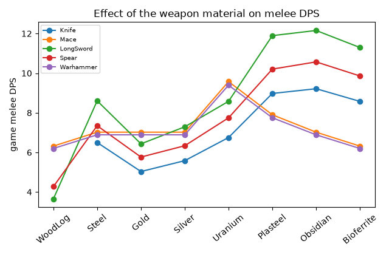
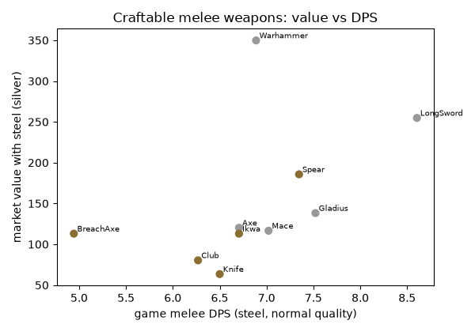

# Vanilla melee weapons: mathematical structure and a baseline for new weapons

Scope: data-science study of every melee weapon in RimWorld 1.6.4871 rev598 (Core, Royalty, Ideology, Biotech, Anomaly, Odyssey): resolved tools, the melee DPS and armor penetration formulas verified in the decompiled game code, statistics, fitted models, a power index and baseline guidance for a new melee weapon (requirement R7). The ranged counterpart is `docs/research/vanilla-ranged-weapons-analysis.md`; the pipeline, data layout and licensing note are shared with it.

Status: research note | Last verified: 2026-10-04

## Summary

- Vanilla has only 17 melee weapon defs: 10 craftable weapons whose damage and price depend on the material (knife, club, mace, gladius, ikwa, spear, axe, breach axe, longsword, warhammer) and 7 fixed ultratech weapons (monosword, plasma sword, zeushammer, psyfocus staff and the three bladelink variants) with flat market values of 2000 or 3000. No weapon of this category comes from Ideology, Biotech, Anomaly or Odyssey. This is too few points for strong statistics; findings are structural, not statistical.
- The game exposes two different "melee DPS" numbers. The stat panel weights each attack by damage squared times chanceFactor, and enumerates one attack per (tool, capacity) pair. Real fights choose attacks differently: attacks within 5 percent of the best score share 75 percent of the swings, middling ones share 25 percent, weak ones (below a quarter of the best) are never used. The in-fight model reproduces the community wiki's DPS values exactly (mace 7.01, longsword 7.96, spear 7.88); the stat panel does not (longsword 8.60, spear 7.35).
- Craftable melee weapons sit in a very narrow in-fight DPS band at normal quality in steel (6.3 to 7.96, median 6.92); balance inside that band is a trade between swing damage and cooldown (ln damage = 1.8 + 1.21 ln cooldown, R2 0.95), and the material, not the def, moves a weapon out of the band (wood x0.43 to 0.9 of steel, plasteel and obsidian up to x1.4). Ultratech weapons are a separate tier at a median of 10.7.
- Market value of craftable melee weapons is not driven by DPS (R2 0.24 for ln MV on ln stat DPS); it is the material count (30 to 150, a "size class", related to mass at R2 0.72) times the material price plus 0.0036 x WorkToMake. The power index P_M (in-fight DPS x (1 + AP)) is therefore best used to place a weapon inside the band, not to price it.
- A quiz calibration can predict average swing damage and DPS at 8 to 15 percent leave-one-out error from tier, class and percentile (n = 10, noisy), but not price, mass or material count.

## Method and data pipeline

Same pipeline as the ranged note (`docs/research/data/vanilla-weapons/`: `extract.py`, `analyze.py`, `wlib.py`; outputs `vanilla-melee.json`, `melee_table.csv`, `melee_stuff_table.csv`, `stats_melee.csv`, `fits.json`, `backtest.json`, `worked_examples.json`, `fig_melee_*.png`), driven by the def engine of `docs/research/data/def-engine/`. Selection rule: category Item, equipmentType Primary and thing category `WeaponsMelee` or `WeaponsMeleeBladelink`. Items that carry tools but are not weapons (animal horns and tusks, beer, logs) are listed under `non_weapon_tool_items` in the JSON and excluded. Ranged weapons also have bash tools; they are kept in `vanilla-ranged.json`, not analyzed here.

For each weapon the dataset records identity, source, tech, tags and classes, `statBases` with a count (7 for every melee weapon), every tool (label, capacities, power, cooldownTime, explicit armorPenetration, chanceFactor, extra melee damages, linked body-part group), the cost list and stuff count with stuff categories, WorkToMake, recipe skill and research prerequisite, trade fields, equipped stat offsets (the psyfocus staff only), comps, graphic and the computed market value with its parts. The materials table `stuffs.json` records for every stuff its categories, market value, volume per unit, sharp and blunt damage multipliers and stat factors; `maneuvers.json` maps each tool capacity to its damage kind. The melee tables below use steel for stuffed weapons (the game's usual default) and fixed values otherwise; `melee_stuff_table.csv` has a row per weapon and material (85 rows).

## Combat formulas verified from game code

Sources: decompiled:Verse/Tool.cs (`AdjustedBaseMeleeDamageAmount`, `AdjustedCooldown`), decompiled:Verse/VerbProperties.cs (`AdjustedMeleeDamageAmount`, `AdjustedArmorPenetration`, `AdjustedMeleeSelectionWeight`), decompiled:Verse/VerbUtility.cs (`GetAllVerbProperties`, `GetSelectionCategory`, `FinalSelectionWeight`), decompiled:RimWorld/StatWorker_MeleeAverageDPS.cs, decompiled:RimWorld/StatWorker_MeleeAverageArmorPenetration.cs, decompiled:RimWorld/Verb_MeleeAttackDamage.cs, decompiled:RimWorld/Verb_MeleeAttack.cs, decompiled:RimWorld/StatPart_Quality.cs, decompiled:Verse/ExtraDamage.cs.

1. One attack per (tool, capacity). A tool with two capacities (for example handle with Blunt and Poke) appears twice, once for each maneuver whose required capacity it has. Maneuvers are `Smash` (Blunt), `Slash` (Cut), `Stab`, `Poke`, `Demolish` and creature maneuvers; each gives the verb its damage kind (`maneuvers.json`). Commonality is 1 for all of them in vanilla.
2. Damage of one attack = tool power x weapon stat `MeleeWeapon_DamageMultiplier` (quality) x the stuff's damage multiplier for the attack's armor category (`SharpDamageMultiplier` for Cut, Stab and creature scratches; `BluntDamageMultiplier` for Blunt, Poke and Demolish). When a hit lands the damage is drawn uniformly between 0.8 and 1.2 times this value (mean unchanged); the attacker's melee damage factor multiplies it. Below 1 damage the hit becomes 1 blunt damage.
3. Cooldown of an attack = tool cooldownTime x `MeleeWeapon_CooldownMultiplier` of the weapon (the stuff's statFactor, for example 0.8 for plasteel, 1.1 for uranium, 1.3 for stone blocks and jade) x the attacker's melee cooldown factor. There is no quality term in the cooldown multiplier; there is no warmup (melee warmup is 0).
4. Armor penetration of an attack: an explicit tool value is multiplied by the weapon's `MeleeWeapon_DamageMultiplier`; when the tool sets none, AP = the adjusted damage x 0.015 (so it already carries quality and material). Extra melee damages (flame on the plasma sword, EMP on the zeushammer) have their own AP, defaulting to 0.015 x their amount.
5. Stat DPS (the number in the item stats panel): sum of weight x damage divided by sum of weight x cooldown, i.e. average damage over average cooldown, with weight = damage squared x commonality x chanceFactor (and 0.3 for a pawn's native attacks, which weapons do not have). Without an item instance (a def), the equipment multipliers are applied only when a stuff is given; that is a quirk of the def path, so with no material the quality and stuff parts are skipped.
6. In-fight choice: each attack gets a score damage x (1 + AP) x touch accuracy / (cycle time) x (chanceFactor + 0.1 per additional hediff of the damage kind); Best if the score is at least 95 percent of the maximum, Worst if below 25 percent, otherwise Mid. Best attacks share 0.75 of the swings equally, Mid attacks share 0.25, Worst attacks get 0. `wlib.melee_selection_dps` implements this; the additional-hediff term was not modeled (assumed zero for cuts, stabs and blunt hits).
7. Average armor penetration (stat panel) uses the same weights as stat DPS.
8. Hit and dodge: a melee attack hits with the attacker's `MeleeHitChance` (plus lighting offsets), always when surprising or against immobile targets, then the target rolls `MeleeDodgeChance`. Neither depends on the weapon, so they do not enter weapon balance.
9. Cut damage can cleave (the wiki states a 40 percent chance and a 140 percent damage factor, not verified in code here); blunt damage can stun; stabs lose overkill damage. These effects make equal DPS unequal in practice but are outside the power index.
10. Market value: same formula as for ranged weapons (ingredient value + stuff count x stuff market value / volume + 0.0036 x WorkToMake with the stuff's WorkToMake factor), with 2 silver per stuff unit assumed when no stuff is known. Stuffed prices were computed from code only (the five wiki prices checked in the ranged note were all unstuffed); fixed-value ultratech weapons set `MarketValue` directly.

## Worked examples

Eight weapons computed by `analyze.py` and listed in `worked_examples.json`.

**Knife** (steel, normal quality)

| tool | capacity | damage | cooldown | AP | stat weight (dmg^2 x chance) |
| --- | --- | --- | --- | --- | --- |
| handle | Blunt | 9 | 2 | 0.135 | 81 |
| blade | Cut | 12 | 1.5 | 0.18 | 144 |
| point | Stab | 13 | 2 | 0.195 | 169 |

Stat DPS 6.5 (average damage 11.81 over average cooldown 1.82); in-fight DPS 7.23 (damage 11.75, cooldown 1.62, AP 0.176); plasteel in-fight DPS 9.77; legendary steel in-fight DPS 11.93.

**Club** (steel, normal quality)

| tool | capacity | damage | cooldown | AP | stat weight (dmg^2 x chance) |
| --- | --- | --- | --- | --- | --- |
| handle | Poke | 9 | 2 | 0.135 | 81 |
| head | Blunt | 14 | 2 | 0.21 | 196 |

Stat DPS 6.27 (average damage 12.54 over average cooldown 2); in-fight DPS 6.38 (damage 12.75, cooldown 2, AP 0.191); plasteel in-fight DPS 7.17; legendary steel in-fight DPS 10.52.

**Mace** (steel, normal quality)

| tool | capacity | damage | cooldown | AP | stat weight (dmg^2 x chance) |
| --- | --- | --- | --- | --- | --- |
| handle | Poke | 9 | 2 | 0.135 | 81 |
| head | Blunt | 15.7 | 2 | 0.235 | 246 |

Stat DPS 7.02 (average damage 14.04 over average cooldown 2); in-fight DPS 7.01 (damage 14.02, cooldown 2, AP 0.21); plasteel in-fight DPS 7.89; legendary steel in-fight DPS 11.57.

**LongSword** (steel, normal quality)

| tool | capacity | damage | cooldown | AP | stat weight (dmg^2 x chance) |
| --- | --- | --- | --- | --- | --- |
| handle | Blunt | 9 | 2 | 0.135 | 81 |
| point | Stab | 23 | 2.6 | 0.345 | 529 |
| edge | Cut | 23 | 2.6 | 0.345 | 529 |

Stat DPS 8.6 (average damage 22 over average cooldown 2.56); in-fight DPS 7.96 (damage 19.5, cooldown 2.45, AP 0.292); plasteel in-fight DPS 10.71; legendary steel in-fight DPS 13.13.

**Spear** (steel, normal quality)

| tool | capacity | damage | cooldown | AP | stat weight (dmg^2 x chance) |
| --- | --- | --- | --- | --- | --- |
| shaft | Blunt | 13 | 2.6 | 0.195 | 169 |
| shaft | Poke | 13 | 2.6 | 0.195 | 169 |
| point | Stab | 23 | 2.6 | 0.5 | 529 |

Stat DPS 7.35 (average damage 19.1 over average cooldown 2.6); in-fight DPS 7.88 (damage 20.5, cooldown 2.6, AP 0.424); plasteel in-fight DPS 10.53; legendary steel in-fight DPS 13.01.

**Warhammer** (steel, normal quality)

| tool | capacity | damage | cooldown | AP | stat weight (dmg^2 x chance) |
| --- | --- | --- | --- | --- | --- |
| handle | Poke | 11 | 2.6 | 0.165 | 121 |
| head | Blunt | 20 | 2.6 | 0.3 | 400 |

Stat DPS 6.89 (average damage 17.91 over average cooldown 2.6); in-fight DPS 6.83 (damage 17.75, cooldown 2.6, AP 0.266); plasteel in-fight DPS 7.68; legendary steel in-fight DPS 11.26.

**MonoSword** (steel, normal quality)

| tool | capacity | damage | cooldown | AP | stat weight (dmg^2 x chance) |
| --- | --- | --- | --- | --- | --- |
| handle | Blunt | 12 | 1.6 | 0.18 | 144 |
| point | Stab | 25 | 2 | 0.9 | 625 |
| edge | Cut | 25 | 2 | 0.9 | 625 |

Stat DPS 12.08 (average damage 23.66 over average cooldown 1.96); in-fight DPS 11.45 (damage 21.75, cooldown 1.9, AP 0.72); legendary steel in-fight DPS 18.89.

**PlasmaSword** (steel, normal quality)

| tool | capacity | damage | cooldown | AP | stat weight (dmg^2 x chance) |
| --- | --- | --- | --- | --- | --- |
| handle | Blunt | 12 | 2 | 0.18 | 144 |
| point | Stab | 21 | 2.6 | 0.315 | 441 |
| edge | Cut | 21 | 2.6 | 0.315 | 441 |

Stat DPS 7.85 (average damage 19.74 over average cooldown 2.52); in-fight DPS 7.65 (damage 18.75, cooldown 2.45, AP 0.281); legendary steel in-fight DPS 12.63.

What the examples show:

- Knife: three attacks (handle 9 at 2.0 s, blade 12 at 1.5 s, point 13 at 2.0 s); the stat weights make the short blade the largest share, the in-fight model gives the best two (blade, point) almost all swings, so in-fight DPS is higher than stat DPS (7.23 against 6.5).
- Longsword: handle 9 at 2.0 s, blade attacks 23 at 2.6 s. In-fight: the two blade attacks are Best (each 37.5 percent), the handle is Mid (25 percent): damage 0.75 x 23 + 0.25 x 9 = 19.5 over cooldown 0.75 x 2.6 + 0.25 x 2.0 = 2.45, DPS 7.96. Stat DPS weights by damage squared and gives 8.60.
- Spear: the shaft appears twice (Blunt and Poke), which is why the stat DPS (7.35) is lower than the in-fight DPS (7.88); the point has explicit AP 0.5 (default would be 0.345).
- Mace and warhammer have only a head and a poke handle: stat and in-fight DPS agree (7.02 and 7.01 for the mace).
- Monosword: explicit AP 0.9 on both blade attacks makes it ignore almost all armor; plasma sword adds 10 flame damage per blade hit, which no DPS number includes.
- Legendary quality multiplies damage by 1.65 and explicit AP by 1.65 too, but cooldown is untouched, so legendary steel longsword reaches 13.13 DPS (x1.65); the mono sword's explicit AP is multiplied as well.
- Plasteel (sharp x1.1, blunt x0.9, cooldown x0.8) lifts the longsword to 10.71 and leaves the mace nearly unchanged (7.89).

Cross-check against the wiki (community, accessed 2026-10-04, https://rimworldwiki.com/index.php?title=Longsword&action=raw, Mace, Spear): the wiki quotes longsword 7.96, spear 7.88 and mace 7.01 base DPS, which equal the in-fight values computed here to two decimals. The in-game stat panel would show different numbers for the longsword and the spear (stat DPS); this disagreement between the stat panel and real fights is the main thing a designer should know. Wiki values for stuffed prices were not found.

Effect of the material (stuff) on melee, expressed as stat DPS relative to steel over the 10 craftable weapons:

| stuff | median DPS ratio vs steel (stat DPS) | min to max over weapons |
| --- | --- | --- |
| WoodLog | 0.56 | 0.42 to 0.9 |
| Silver | 0.86 | 0.85 to 1 |
| Gold | 0.78 | 0.75 to 1 |
| BlocksGranite | 0.77 | 0.77 to 0.77 |
| Steel | 1 | 1 to 1 |
| Uranium | 1.05 | 1 to 1.36 |
| Jade | 1.15 | 1.15 to 1.15 |
| Plasteel | 1.38 | 1.12 to 1.39 |
| Bioferrite | 1.32 | 0.9 to 1.34 |
| Obsidian | 1.42 | 1 to 1.44 |

Sample rows for two weapons (in-fight DPS, AP and computed market value per material):

| weapon | stuff | avg dmg | avg cd | DPS fight | AP | MV |
| --- | --- | --- | --- | --- | --- | --- |
| LongSword | WoodLog | 8.4 | 2.15 | 3.9 | 0.13 | 165 |
| LongSword | Gold | 15.2 | 2.45 | 6.2 | 0.23 | 1,058 |
| LongSword | Silver | 16.9 | 2.45 | 6.9 | 0.25 | 165 |
| LongSword | Steel | 19.5 | 2.45 | 7.96 | 0.29 | 255 |
| LongSword | Uranium | 22.4 | 2.69 | 8.29 | 0.34 | 723 |
| LongSword | Bioferrite | 24.4 | 2.45 | 9.98 | 0.37 | 237 |
| LongSword | Plasteel | 21 | 1.96 | 10.71 | 0.32 | 1,043 |
| LongSword | Obsidian | 26.4 | 2.45 | 10.78 | 0.4 | 597 |
| Mace | Bioferrite | 12.6 | 2 | 6.31 | 0.19 | 92 |
| Mace | WoodLog | 12.6 | 2 | 6.31 | 0.19 | 75 |
| Mace | Steel | 14 | 2 | 7.01 | 0.21 | 117 |
| Mace | Gold | 14 | 2 | 7.01 | 0.21 | 519 |
| Mace | Obsidian | 14 | 2 | 7.01 | 0.21 | 282 |
| Mace | Silver | 14 | 2 | 7.01 | 0.21 | 72 |
| Mace | Plasteel | 12.6 | 1.6 | 7.89 | 0.19 | 498 |
| Mace | Uranium | 21 | 2.2 | 9.56 | 0.32 | 341 |

## Statistics per tech level and class

All 17 weapons at steel (stuffed) or their fixed values; cells show min / median / max (IQR). Neolithic and Medieval are all craftable weapons; Ultra means the seven fixed ultratech weapons.

| tech | n | avg damage | stat DPS | fight DPS | avg AP | cooldown | mass | market value |
| --- | --- | --- | --- | --- | --- | --- | --- | --- |
| Neolithic | 5 | 8.6 / 12.5 / 19.1 (1.6) | 4.94 / 6.5 / 7.35 (0.44) | 6.3 / 6.75 / 7.88 (0.86) | 0.13 / 0.19 / 0.38 (0.02) | 1.74 / 2 / 2.6 (0.18) | 0.5 / 1.1 / 2 (0.9) | 63 / 113 / 186 (33) |
| Medieval | 5 | 13.4 / 15 / 22 (3.9) | 6.71 / 7.02 / 8.6 (0.63) | 6.75 / 7.01 / 7.96 (0.3) | 0.2 / 0.23 / 0.33 (0.06) | 2 / 2 / 2.6 (0.56) | 0.85 / 1.5 / 5 (0.75) | 117 / 138 / 350 (135) |
| Ultra | 7 | 12 / 23.7 / 28 (6.1) | 4.62 / 11.11 / 16.03 (3.84) | 4.62 / 10.66 / 14.53 (3.57) | 0.18 / 0.42 / 0.84 (0.31) | 1.6 / 2.09 / 2.81 (0.6) | 1.2 / 2 / 2 (0) | 2,000 / 2,000 / 3,000 (1,000) |

Resolved summary of every melee weapon (steel for stuffed ones; `*` marks an explicit MarketValue; P_M = in-fight DPS x (1 + in-fight AP)):

| weapon | src | tech | group | tools | stuff | mass | work | MV (steel) | avg dmg | avg cd | DPS stat | DPS fight | avg AP | P_M |
| --- | --- | --- | --- | --- | --- | --- | --- | --- | --- | --- | --- | --- | --- | --- |
| BreachAxe | Core | Neol | standard | 2 | 50 | 1.1 | 5,000 | 113 | 7.9 | 1.25 | 4.94 | 6.3 | 0.12 | 7.04 |
| Club | Core | Neol | standard | 2 | 40 | 2 | 1,200 | 80 | 12.8 | 2 | 6.27 | 6.38 | 0.19 | 7.59 |
| Ikwa | Core | Neol | standard | 3 | 50 | 1.1 | 5,000 | 113 | 13.5 | 2 | 6.71 | 6.75 | 0.2 | 8.12 |
| Knife | Core | Neol | standard | 3 | 30 | 0.5 | 1,800 | 63 | 11.8 | 1.62 | 6.5 | 7.23 | 0.18 | 8.51 |
| Spear | Core | Neol | standard | 2 | 75 | 2 | 12,000 | 186 | 20.5 | 2.6 | 7.35 | 7.88 | 0.42 | 11.23 |
| Axe | Roya | Medi | standard | 2 | 50 | 1.5 | 7,000 | 120 | 13.5 | 2 | 6.71 | 6.75 | 0.2 | 8.12 |
| Warhammer | Roya | Medi | standard | 2 | 150 | 5 | 18,000 | 350 | 17.8 | 2.6 | 6.89 | 6.83 | 0.27 | 8.64 |
| Mace | Core | Medi | standard | 2 | 50 | 1.25 | 6,000 | 117 | 14 | 2 | 7.02 | 7.01 | 0.21 | 8.49 |
| Gladius | Core | Medi | standard | 3 | 50 | 0.85 | 12,000 | 138 | 14.2 | 2 | 7.52 | 7.12 | 0.21 | 8.65 |
| LongSword | Core | Medi | standard | 3 | 100 | 2 | 18,000 | 255 | 19.5 | 2.45 | 8.6 | 7.96 | 0.29 | 10.29 |
| PsyfocusStaff | Roya | Ultr | standard | 1 | fixed | 1.2 |  | 2,000* | 12 | 2.6 | 4.62 | 4.62 | 0.18 | 5.45 |
| PlasmaSword | Roya | Ultr | standard | 3 | fixed | 2 |  | 2,000* | 18.8 | 2.45 | 7.84 | 7.65 | 0.28 | 9.81 |
| Zeushammer | Roya | Ultr | standard | 2 | fixed | 2 |  | 2,000* | 27 | 2.75 | 9.95 | 9.82 | 0.41 | 13.79 |
| PlasmaSwordBladelink | Roya | Ultr | bladelink | 3 | fixed | 2 |  | 3,000* | 20.2 | 1.9 | 11.11 | 10.66 | 0.3 | 13.9 |
| MonoSword | Roya | Ultr | standard | 3 | fixed | 2 |  | 2,000* | 21.8 | 1.9 | 12.08 | 11.45 | 0.72 | 19.69 |
| ZeusHammerBladelink | Roya | Ultr | bladelink | 2 | fixed | 2 |  | 3,000* | 27 | 2.05 | 13.4 | 13.17 | 0.41 | 18.5 |
| MonoSwordBladelink | Roya | Ultr | bladelink | 3 | fixed | 2 |  | 3,000* | 23.2 | 1.6 | 16.03 | 14.53 | 0.72 | 24.99 |

Class patterns: blunt weapons (club, mace, warhammer, breach axe, zeushammer, staff) have a head and a poke handle; sharp weapons (knife, gladius, ikwa, spear, axe, longsword, swords) have two or three attacks with cut and stab at identical power. The handle is a near constant: power 9 with cooldown 2.0 on knife, gladius, ikwa, longsword, club, mace, axe and breach axe (the exceptions are warhammer 11 at 2.6, spear shaft 13 at 2.6 and the ultratech handles 12 and 15). Craftable weapon masses are 0.5 (knife) to 5.0 (warhammer).

Ultratech weapons are not craftable (no recipe), cost nothing in the def, and have flat market values 2000 (base) and 3000 (bladelink). Bladelink variants differ from their base weapon only in tools and price:

| pair | fight DPS | DPS gain | market value | price gain |
| --- | --- | --- | --- | --- |
| MonoSword | 11.45 to 14.53 | +27% | 2,000 to 3,000 | +50% |
| PlasmaSword | 7.65 to 10.66 | +39% | 2,000 to 3,000 | +50% |
| Zeushammer | 9.82 to 13.17 | +34% | 2,000 to 3,000 | +50% |

## Fitted models

With n = 10 craftable weapons (and 17 for rank statistics) the fits below are descriptive, not predictive; leave-one-out numbers are in the backtest.

Power index candidates (ln MV on ln candidate for the 10 craftable weapons in steel; Spearman over all 17 including the fixed prices):

| candidate | R2 ln MV (10 craftable, steel) | Spearman with MV (all 17) |
| --- | --- | --- |
| stat DPS (damage squared weights) | 0.24 | 0.75 |
| in-fight DPS (75/25 selection) | 0.17 | 0.68 |
| P_M = in-fight DPS x (1 + AP) | 0.28 | 0.72 |
| chanceFactor-only weights | 0.15 | 0.68 |
| best single tool damage / cooldown | 0.23 | 0.69 |
| average damage per swing (stat weights) | 0.54 | 0.79 |
| stat DPS x (1 + AP) | 0.33 | 0.76 |

- Price is not a function of DPS: the best in-fight or stat DPS candidate explains only 17 to 28 percent of ln MV. The average swing damage does better (R2 0.54) because heavier weapons also cost more material. Residual structure for ln MV on ln stat DPS: Warhammer 0.92, Knife -0.68, Club -0.38, BreachAxe 0.37, LongSword 0.22 (the knife is cheap for its DPS, the warhammer expensive: price follows material count).
- Damage and cooldown trade off almost deterministically at the weapon level: ln(swing damage) = 1.8 + 1.21 x ln(cooldown), R2 0.948, n = 10; linear form damage = -3.16 + 8.62 x cooldown, R2 0.926. Slope above 1 means DPS rises slowly with cooldown (DPS proportional to cooldown to the power 0.21): slow, heavy weapons are slightly stronger on paper, and the explicit AP and extra damage of the heavy tiers come on top.
- Material count versus mass: ln(stuff count) = 3.83 + 0.64 ln(mass), R2 0.72; swing damage on material count R2 0.42. The material count is a hand-picked size class (30, 40, 50, 75, 100, 150), not a derived quantity.
- WorkToMake (1,200 to 18,000) is only loosely tied to DPS (ln work on ln stat DPS R2 0.3); it follows tier and complexity (the club, a Neolithic weapon, is 1,200; longsword and warhammer 18,000).
- Across all 85 weapon-material rows, ln MV = -1.17 + 1.22 ln(stat DPS) + 1.02 ln(stuff count), R2 0.41; the fit leaves out the material's own price, which is the missing driver: a plasteel longsword is worth about four times a steel one (1,043 against 255 silver by the formula) for about 1.35 times the DPS.

## Power index

Definition: P_M = in-fight DPS x (1 + average in-fight AP), where in-fight DPS and AP come from the 75/25 selection model (`wlib.melee_selection_dps`) applied to the weapon's tools for a given material and quality. It uses the game's own selection score (damage x (1 + AP) / cycle), it reproduces the wiki's DPS exactly, and unlike the stat-panel DPS it does not depend on how many capacities a tool has. Its correlation with price is modest by construction (price is not a DPS function): Spearman 0.72 over all 17 weapons, R2 0.28 with ln MV for craftable steel weapons. For the ultratech tier it separates clearly: P_M ranges from 5.4 (staff) to 25 (monosword bladelink), against 7 to 11.2 for craftable steel weapons.

Percentile bands (normal quality, steel): craftable P_M 8.12 (Q1), 8.5 (median), 8.65 (Q3). Observed P_M by group: Neolithic 7 to 11.2, Medieval 8.1 to 10.3, ultratech base 5.4 to 19.7, bladelink 13.9 to 25; use these as the suggested bands. The material multiplies the band by x0.43 (wood, worst attack) to x1.4.

## Archetypes, outliers and balance bands

Archetypes (from the tool structure, not from clustering, because n is small): (1) quick blade (knife): short cooldown 1.5 to 2.0, damage 12 to 13; (2) balanced blade (gladius, axe, ikwa, club): cooldown 2.0, damage 13 to 16; (3) heavy blade (longsword, spear): cooldown 2.6, damage 23, the highest swing damage and highest steel DPS (7.96 and 7.88); (4) heavy blunt (mace, warhammer): damage 15.7 and 20 at 2.0 and 2.6 s, no stab, low AP (blunt armor is much lower than sharp armor on most gear); (5) breach axe: a Demolish head (7.5 at 1.0 s) for buildings, the lowest stat DPS of the craftable weapons (4.94); (6) ultratech sharp (monosword, plasma sword): high AP (monosword 0.9 explicit), shorter cooldowns; (7) ultratech blunt (zeushammer): damage 31, EMP side damage 9; (8) staff: one attack, psychic offsets on equipping.

Outliers: the breach axe (4.94 stat DPS against 6.3 in fights) and the spear (the shaft appears twice) are where the stat panel and real fights differ most; the Plasma sword base (7.65) is far below the monosword (11.45) at the same price (2000) because the 10 flame damage per hit is not part of any DPS number, so it is a trap if only DPS is compared; the Psyfocus staff is the weakest melee weapon (4.62) at 2000 silver because its value is the psychic offsets (PsychicSensitivityOffset 0.5, entropy recovery 0.083), not combat.

## Design guidance for a new melee weapon

Knobs, ordered by importance: (1) tool power and cooldown of the main attacks (they set DPS and fix each other: damage rises about 1.21 percent per percent of cooldown); (2) which attacks exist (a handle at power 9 cooldown 2.0 adds a Mid attack that lowers in-fight DPS compared with a blade-only weapon (see the sensitivity table: removing the longsword handle changes P_M by the amount shown)); (3) explicit AP (default is 1.5 percent of damage; high explicit values such as the monosword's 0.9 are the ultratech signature); (4) stuff count and mass (size class); (5) WorkToMake; (6) chanceFactor (rarely used in vanilla: all tools have 1.0); (7) extra melee damage (flame, EMP) as a tier-up that the DPS number hides.

Sensitivities on the longsword shape (P_M change for a small edit):

| change to the longsword | P_M change |
| --- | --- |
| both blade tools power +1 | +4.8% |
| both blade tools cooldown -0.1 s | +3.2% |
| handle power +3 | +4.8% |
| handle removed | +15.7% |
| stab tool gets explicit AP 0.5 (default 0.345) | +17.4% |
| blade chanceFactor 2 on one tool | +15.7% |
| quality Good (damage x1.1) | +12.5% |
| quality Legendary (damage x1.65) | +89.3% |

Normal ranges (steel, normal quality, craftable): in-fight swing damage 7.9 to 20.5, in-fight cooldown 1.25 to 2.6, in-fight DPS 6.3 to 7.96, AP 0.12 to 0.42, mass 0.5 to 5, stuff count 30 to 150, WorkToMake 1,200 to 18,000, market value 63 to 350 (steel). Ultratech: in-fight DPS 4.62 to 14.53, AP 0.18 to 0.72, market value 2000 or 3000.

Baseline procedure from (tier, class, strength percentile s):

1. Pick the tier band for in-fight DPS (above) and interpolate at percentile s; materials then scale it (steel is the reference).
2. Choose the main attack cooldown c from the tier range (Neolithic 1.5 to 2.0, Medieval 2.0 to 2.6, ultratech 1.6 to 2.8); solve swing damage from the damage-cooldown line, ln d = 1.8 + 1.21 ln c, then rescale to hit the target DPS.
3. Add the standard handle (power 9, cooldown 2.0, Blunt or Poke) unless the class is blunt (then poke handle) or ultratech (handle 12 at 1.6).
4. AP: leave it implicit (0.015 x damage) unless the tier is ultratech.
5. Material count: choose from the size class (mass), default the median of the tier; WorkToMake from the tier median (5,000 Neolithic, 12,000 Medieval); price follows from the formula.
6. For a fixed-price ultratech weapon, set the price bucket (2000 base, 3000 bladelink) and give bladelink variants cooldowns 0.4 to 0.8 s shorter and, on sharp blades, 8 to 10 percent more damage (none on the zeushammer head).

Caveats: n = 10 craftable weapons; inherited values (hit points, flammability, deterioration, beauty, sell price factor and so on, 7 statBases total) are the same for all weapons and should come from the parent; the stat panel DPS and in-fight DPS differ by up to 27 percent for the same weapon in this data, so show both; material-dependent price and the per-material work factor were derived from code and not checked against the game; Combat Extended changes melee through its own stats and is out of scope.

## Backtest: tier, class and relative strength

Method: leave-one-out over the 10 craftable weapons with steel (class: sharp or blunt; relative strength: percentile of P_M within the class peers, or among all training weapons when fewer than three peers remain). Predictors: global median, class median, and a ridge-shrunk log-linear model of tier, percentile and class. MAPE is the mean absolute percentage error.

| target | global median MAPE | class median MAPE | model MAPE | model median APE |
| --- | --- | --- | --- | --- |
| avg_damage | 21% | 25% | 15% | 18% |
| avg_cooldown | 9% | 9% | 12% | 11% |
| dps | 11% | 14% | 8% | 8% |
| mass | 57% | 68% | 72% | 55% |
| mv | 33% | 38% | 48% | 40% |
| work | 112% | 143% | 86% | 60% |
| stuff_count | 24% | 24% | 45% | 36% |

Reading: with strength percentile known the model predicts swing damage (15 percent) and DPS (8 percent) a little better than the medians but does worse than the global median for cooldown, price, mass and material count, which are designer-chosen size classes. With 10 points the difference between 9 and 12 percent is noise. The first conclusion for the quiz calibration: for melee it can set the strength band and the swing damage, nothing else; size class, material count and price need explicit inputs or tier medians.

## Caveats and licensing

Ludeon's game data is proprietary. RimStudio reads reference values from the user's own install at runtime; the committed datasets (`vanilla-melee.json`, tables) are research data only, and the decompiled game code was used only to verify behaviour and is described in words, never copied. Combat Extended (CC BY-NC-SA 4.0) was not used. Wiki values (community written, accessed 2026-10-04) were used as a cross-check only.

Known limits: the in-fight model ignores the additional-hediff term, attacker skill and melee damage factor, cleave, stun and overkill; stat panel DPS in the real game is computed for a concrete item and a wielder, and applies the equipment multipliers only through the item path; creature maneuvers and hediff tools are not covered; the ultratech tier has no craftable members so no cost model exists for it.

## Implications for RimStudio

1. The item designer shows both melee numbers: the stat-panel DPS (weights damage squared x chanceFactor, one attack per tool and capacity) and the in-fight DPS (75/25 selection), and labels the difference; tests must reproduce longsword 8.60 and 7.96, mace 7.02 and 7.01, spear 7.35 and 7.88 for normal steel.
2. Attack enumeration is by (tool, capacity); the editor must warn that adding a second capacity to a tool duplicates the attack in the stat DPS.
3. Damage preview = power x quality multiplier x stuff multiplier (sharp for cut, stab; blunt for blunt, poke, demolish); cooldown preview = cooldownTime x stuff cooldown factor; AP preview = explicit x damage multiplier or 0.015 x damage. All of them are recomputed per material and quality using stat values read from the user's StatDefs and stuff defs.
4. P_M = in-fight DPS x (1 + AP) is the melee "weapon strength" scalar; bands (craftable steel and ultratech) are computed at runtime from the user's own install, not hard-coded.
5. Price for craftable weapons is shown from the formula (stuff count x material price / volume + 0.0036 x work), not predicted from DPS; the designer should expose stuff count and WorkToMake as explicit size-class inputs with tier medians as defaults.
6. For ultratech and other fixed-price weapons the designer offers price buckets (2000, 3000 in vanilla) and warns that extra melee damage (flame, EMP) is invisible to DPS.
7. The standard handle (power 9, cooldown 2.0 Blunt or Poke) is a template option; the designer warns when a handle attack pulls in-fight DPS down more than 5 percent.
8. The damage-cooldown line (ln d = 1.8 + 1.21 ln c, R2 0.95) is the melee "formula mode" baseline; a quiz calibration scales it to the target strength percentile and reports the leave-one-out error computed on the user's weapons (8 to 15 percent for DPS and damage in this first measurement).
9. Quality is a preview toggle: damage and explicit AP x1.65 at Legendary, cooldown unchanged, market value x5 with caps; stuff multipliers are applied before quality.
10. Inherited values (7 statBases, sell price factor, hit points, beauty) are copied from the chosen parent base.

## Open questions

1. Are the stuffed market values (stuff cost divided by volume, with the stuff's WorkToMake factor) exactly what the game shows? Verified by code reading only; no wiki price was found for a stuffed melee weapon.
2. What is the additional-hediff bonus in the in-fight score for cut, stab and blunt damage in 1.6 (the term was not modeled)? If it is non-zero for some kinds the Best/Mid split changes.
3. How strongly do melee damage factor genes and juggernaut-style buffs change the optimum between swing damage and cooldown? Not modeled.
4. Should cleave (cut) and overkill (blunt vs stab) be folded into P_M? The wiki quantifies them, but this study did not verify them in code.
5. With only 10 craftable weapons, should the baseline learn from the user's installed modded melee weapons, and how are Combat Extended melee weapons (different stats) detected and excluded?
6. Does the engine need to model `StatPart_WeaponTraitsMarketValueOffset` for bladelink weapons (their market values are flat in the defs, but traits add value at runtime)?
