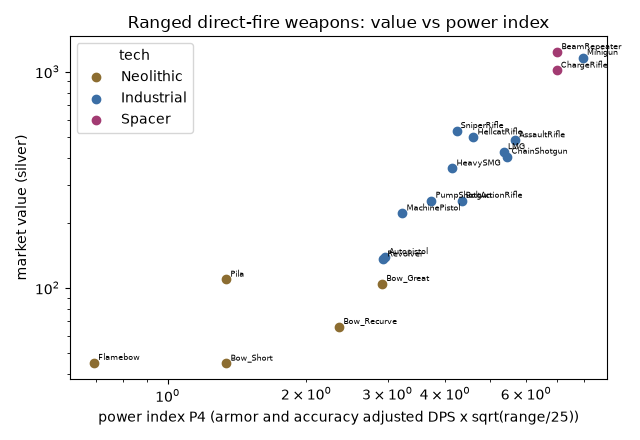
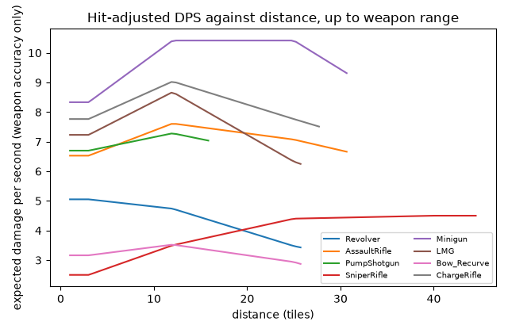
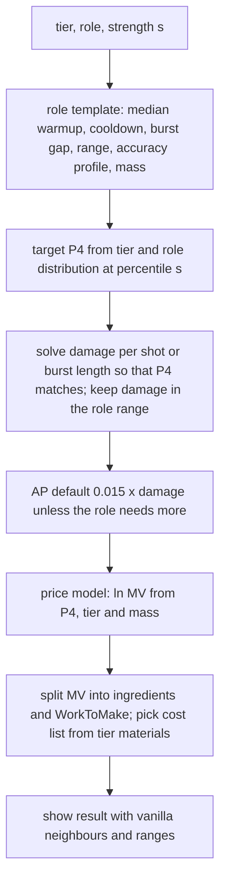

# Vanilla ranged weapons: mathematical structure and a baseline for new weapons

Scope: data-science study of every ranged weapon in RimWorld 1.6.4871 rev598 (Core, Royalty, Ideology, Biotech, Anomaly, Odyssey): resolved data, the combat formulas verified in the decompiled game code and in the game's own XML, statistics per tech level and class, fitted models, a single power index, and how RimStudio can compute a baseline for a new weapon (requirement R7). The melee counterpart is `docs/research/vanilla-melee-weapons-analysis.md`.

Status: research note | Last verified: 2026-10-04

## Summary

- The game has 71 ranged weapon defs in this install; only 30 are ordinary craftable or trade-generated "standard" weapons, and only 19 of those are direct-fire weapons with a statistical shape that can be fitted (bows, pistols, SMG, rifles, snipers, shotguns, heavy guns). The rest are explosives and flame weapons (11), mechanoid and creature weapons (15, flat market values), turret guns (13) and Odyssey "unique" copies (13, same stats as the base gun plus runtime traits).
- Every number a weapon shows follows from four small formulas: damage per shot, a piecewise-linear accuracy curve through four stats, a full cycle time of warmup plus cooldown plus burst gaps, and an armor step that multiplies expected damage by 1 - 0.75 x max(armor - AP, 0). Armor penetration defaults to 1.5 percent of the damage when nothing sets it.
- Market value is not a balance dial: for every weapon that does not set it, it equals the summed base market value of the ingredients plus 0.0036 x WorkToMake (identity verified on all 27 craftable standard ranged weapons and cross-checked against five wiki values). Balance is expressed through cost and work, and those follow power only loosely.
- A single scalar power index P4 (hit-adjusted, armor-adjusted DPS scaled by the square root of range) correlates with market value at Spearman 0.94 and explains 87 percent of ln(MV) together with tech tier, but the leave-one-out error is still about 60 percent, because mass (a weapon "size class") carries as much price information as power does.
- A quiz-style calibration is promising for DPS and market value (leave-one-out mean error 32 and 34 percent against 43 and 57 percent for a class median) but cannot predict damage per shot better than a global median, because damage values are discrete design choices.

## Method and data pipeline

Everything is reproducible from the user's own install with three scripts in `docs/research/data/vanilla-weapons/`:

| Step | Script | Output |
| --- | --- | --- |
| 1. Resolve defs | `extract.py --game <RimWorld folder>` (uses the def engine prototype in `docs/research/data/def-engine/`) | `vanilla-ranged.json`, `vanilla-melee.json`, `stuffs.json`, `quality_factors.json`, `damage_defs.json`, `maneuvers.json` |
| 2. Derive, fit, back-test | `analyze.py` | `ranged_table.csv`, `ranged_direct_fit_set.csv`, `stats_ranged.csv`, `fits.json`, `backtest.json`, `worked_examples.json`, `fig_ranged_*.png` |
| 3. Shared formulas | `wlib.py` | imported by both |

Both scripts run from any working directory (`RIMWORLD_DIR` and `DEF_ENGINE_DIR` are accepted instead of arguments), are deterministic, and set no bytecode files. The def engine loaded Core plus the five DLC folders in 1.3 s (13,212 defs, 29 patch operations, no diagnostics), so inheritance (`ParentName` chains, `Abstract` bases), patches and `MayRequire` are resolved exactly as the engine's documented semantics (`docs/research/def-engine-semantics.md`). No engine bug was found while doing this work.

Selection rule: a ThingDef is a ranged weapon when its category is Item, `equipmentType` is Primary, and it is in the thing categories `WeaponsRanged`, `Grenades` or `WeaponsUnique`, or is a turret gun or mortar. For each one `extract.py` records identity, source, tech level, weapon tags and classes, categories, trade tags, all `statBases` with a count, the first verb with every field, the resolved projectile and its damage def, the beam damage def when there is one, gun-bash tools, cost list and stuff count, recipe (skill, research prerequisite with base cost and tech level), trade fields, equipped stat offsets, comp classes, graphic path and the computed market value with its parts.

Inventory by group and source (counts of defs):

| group | Anomaly | Biotech | Core | Odyssey | total |
| --- | --- | --- | --- | --- | --- |
| mech_or_creature | 1 | 8 | 5 | 1 | 15 |
| standard | 2 | 3 | 24 | 1 | 30 |
| turret | 1 | 1 | 10 | 1 | 13 |
| unique | 0 | 0 | 0 | 13 | 13 |

No ranged weapon def originates in Ideology (the table has no Ideology column); Royalty adds none either, and the Pila javelin, bows and grenades are Core. Groups: `standard` = ordinary weapons (craftable, bought or generated), `unique` = Odyssey copies named `*_Unique`, `mech_or_creature` = mechanoid, drone and creature weapons, `turret` = turret and artillery guns. Mechanoid and creature weapons set a flat MarketValue (500: 1 weapons, 1000: 4 weapons, 1400: 7 weapons), so they say nothing about balance by price. Role labels (bow, pistol, smg, rifle, sniper, shotgun, heavy, launcher, grenade, rocket, flame) are assigned by a visible table in `analyze.py` because vanilla weapon classes are too coarse (almost all guns are just Ranged plus RangedLight or RangedHeavy).

Fit set for the statistics below: 19 standard direct-fire weapons (Neolithic 5, Industrial 12, Spacer 2); there are no Medieval or Ultratech direct-fire weapons in vanilla. This is a small sample; all fitted numbers carry that caveat and the leave-one-out figures are the honest ones.

## Combat formulas verified from game code

Each rule was read in the decompiled game code and then used in the scripts; code is not reproduced. Sources: decompiled:Verse/VerbProperties.cs (methods `AdjustedCooldown`, `AdjustedFullCycleTime`, `GetHitChanceFactor`), decompiled:Verse/ProjectileProperties.cs (`GetDamageAmount`, `GetArmorPenetration`), decompiled:Verse/ShotReport.cs, decompiled:Verse/ArmorUtility.cs (`ApplyArmor`), decompiled:Verse/Verb_Shoot.cs, decompiled:Verse/Verb_ShootBeam.cs, decompiled:RimWorld/StatWorker_MarketValue.cs, decompiled:RimWorld/StatWorker.cs.

1. Damage per shot. The projectile def gives `damageAmountBase`; when absent the damage def's default damage is used (explosives use 50 for Bomb, 10 for Flame). The weapon stat `RangedWeapon_DamageMultiplier` (quality only, see below) multiplies it and the result is rounded to a whole number. Beam weapons read the beam damage def's default damage instead.
2. Armor penetration of a shot. If the projectile sets `damageAmountBase` or an explicit `armorPenetrationBase`, the base is `armorPenetrationBase` (negative when unset); otherwise the damage def default applies. A negative value then becomes damage x 0.015. Consequence: a projectile that sets only its damage never inherits a non-default AP from its damage def. The weapon stat `RangedWeapon_ArmorPenetrationMultiplier` multiplies the result. Example: the revolver bullet has damage 12, no AP, so AP = 0.18 (the wiki infobox lists 18 percent).
3. Armor step (one layer, applied per worn apparel layer and then to the pawn's own armor): effective armor e = max(rating - AP, 0). A random roll below e/2 removes the hit, a roll between e/2 and e halves the damage (rounded randomly, and sharp damage becomes blunt), otherwise the hit is unchanged. Expected surviving damage fraction is therefore 1 - 0.75 e. The game defines a maximum armor rating of 2.
4. Weapon hit factor. The equipment factor is the hit chance of the weapon itself: AccuracyTouch up to 3 tiles, linear to AccuracyShort at 12, to AccuracyMedium at 25, to AccuracyLong at 40, constant beyond; clamped to [0.01, 1]. The shooter factor (pawn skill raised to the distance, plus per-band shooter factors), weather, gas, darkness and target size multiply this, with a floor of 0.0201. This study uses the weapon factor alone, which is what a weapon designer controls.
5. Full cycle. Cycle time = warmupTime + RangedWeapon_Cooldown (the weapon stat, multiplied by the shooter's ranged cooldown factor) + (burstShotCount - 1) x ticksBetweenBurstShots / 60. Warmup is paid once per burst, the cooldown after the burst. `burstShotCount` defaults to 1, `ticksBetweenBurstShots` to 15.
6. Nominal DPS = damage x burst / cycle; hit-adjusted DPS multiplies by the weapon hit factor at the range of interest; armor-adjusted DPS multiplies by the armor step.
7. Explosive projectiles and launchers have no accuracy stats (a miss-radius field is used instead), so hit chance is replaced by area effects; their single-target damage equals the explosion damage.
8. Quality (CompQuality) changes weapon stats through StatPart_Quality factors read from the StatDefs (`quality_factors.json`): ranged damage multiplier 0.9 (Awful), 1.0 (Poor to Excellent), 1.25 (Masterwork), 1.5 (Legendary); ranged armor penetration multiplier the same; every accuracy stat 0.8, 0.9, 1, 1.1, 1.2, 1.35, 1.5 from Awful to Legendary; market value 0.5, 0.75, 1, 1.25, 1.5, 2.5, 5 with caps on the gain.
9. Market value. If `MarketValue` is not in `statBases`, it is the sum over the cost list of count x ingredient base market value, plus (for stuffed items) stuff count x stuff market value, plus WorkToMake x 0.0036 when WorkToMake exceeds 2 (def with no cost list but a recipe uses the recipe instead). `SellPriceFactor` only changes trade prices. Display rounds to the nearest 5 above 200 silver. Empirical verification: Revolver 135.4 (wiki 135), Assault rifle 482 (wiki 480), Sniper rifle 532 (wiki 530), Bolt-action rifle 253.2 (wiki 255), Short bow 44.64 (wiki 45), Minigun 1160 (wiki 1160); the wiki shows the rounded value, so all six agree; wiki pages fetched 2026-10-04 from https://rimworldwiki.com/index.php?title=Revolver&action=raw and the same for the other pages.

## Worked examples

Eight weapons, all values computed by `analyze.py` from the resolved defs (normal quality, weapon accuracy only):

| weapon | dmg x burst | AP | warmup + cooldown + gaps | cycle s | nominal DPS | hit 3/12/25/40 | DPS 3/12/25/40 |
| --- | --- | --- | --- | --- | --- | --- | --- |
| Revolver | 12 x 1 | 0.18 | 0.3 + 1.6 + 0 x 0/60 | 1.9 | 6.32 | 0.8/0.75/0.55/0.4 | 5.05/4.74/3.47/2.53 |
| AssaultRifle | 11 x 3 | 0.165 | 1 + 1.7 + 2 x 10/60 | 3.03 | 10.88 | 0.6/0.7/0.65/0.55 | 6.53/7.62/7.07/5.98 |
| PumpShotgun | 18 x 1 | 0.14 | 0.9 + 1.25 + 0 x 0/60 | 2.15 | 8.37 | 0.8/0.87/0.77/0.64 | 6.7/7.28/6.45/5.36 |
| SniperRifle | 25 x 1 | 0.375 | 3.5 + 1.5 + 0 x 0/60 | 5 | 5 | 0.5/0.7/0.88/0.9 | 2.5/3.5/4.4/4.5 |
| Minigun | 10 x 25 | 0.15 | 2.5 + 1.5 + 24 x 5/60 | 6 | 41.67 | 0.2/0.25/0.25/0.18 | 8.33/10.42/10.42/7.5 |
| Bow_Recurve | 14 x 1 | 0.21 | 1.45 + 1.65 + 0 x 0/60 | 3.1 | 4.52 | 0.7/0.78/0.65/0.35 | 3.16/3.52/2.94/1.58 |
| ChargeRifle | 16 x 3 | 0.35 | 1 + 2 + 2 x 12/60 | 3.4 | 14.12 | 0.55/0.64/0.55/0.45 | 7.76/9.04/7.76/6.35 |
| GrenadeFrag | 50 x 1 | 0.1 | 1.5 + 2.66 + 0 x 0/60 | 4.16 | 12.02 | n/a (miss radius) | n/a |

Armor interaction and quality scaling (expected fraction of damage surviving one armor layer; armor ratings are the sharp ratings in the game files: flak jacket 0.55, marine armor 0.92, flak vest 1.00):

| weapon | AP | none | flak jacket 0.55 | marine 0.92 | flak vest 1.00 | legendary dmg | legendary AP |
| --- | --- | --- | --- | --- | --- | --- | --- |
| Revolver | 0.18 | 1 | 0.722 | 0.445 | 0.385 | 18 | 0.27 |
| AssaultRifle | 0.165 | 1 | 0.711 | 0.434 | 0.374 | 17 | 0.247 |
| PumpShotgun | 0.14 | 1 | 0.693 | 0.415 | 0.355 | 27 | 0.21 |
| SniperRifle | 0.375 | 1 | 0.869 | 0.591 | 0.531 | 38 | 0.562 |
| Minigun | 0.15 | 1 | 0.7 | 0.422 | 0.363 | 15 | 0.225 |
| Bow_Recurve | 0.21 | 1 | 0.745 | 0.467 | 0.407 | 21 | 0.315 |
| ChargeRifle | 0.35 | 1 | 0.85 | 0.573 | 0.512 | 24 | 0.525 |
| GrenadeFrag | 0.1 | 1 | 0.662 | 0.385 | 0.325 | 75 | 0.15 |

Reading the examples:

- Assault rifle: 3 shots of 11 damage, AP 0.165 (= 11 x 0.015). Cycle = 1.0 + 1.7 + 2 x 10/60 = 3.033 s, so nominal DPS = 33 / 3.033 = 10.88. At 12 tiles the hit factor is 0.70 (touch 0.60 to short 0.70 is a linear climb between 3 and 12), at 25 tiles 0.65, and 0.55 at 40 where range ends at 30.9 anyway. A flak vest (1.00) leaves 0.374 of the damage, so the rifle's 7.6 DPS at 12 tiles becomes 2.85.
- Revolver: 1 shot, warmup 0.3 + cooldown 1.6 = 1.9 s. Low nominal DPS (6.32) at a price of only 135 silver (see outliers).
- Pump shotgun: hit chance climbs from 0.80 at touch to 0.87 at 12 tiles and 0.64 at 40, but range stops at 15.9 tiles, so the long band is irrelevant; its AP of 0.14 is explicit (18 x 0.015 would be 0.27).
- Sniper rifle: warmup 3.5 s dominates a 5.0 s cycle, hit chance is 0.50 at touch and 0.88 at 25 tiles, AP 0.375: the highest AP of any standard gun except the beam repeater.
- Minigun: 25 shots at 5 ticks apart give a 6.0 s cycle and 41.7 nominal DPS, but accuracy is only 0.18 to 0.25, so hit-adjusted DPS at 12 tiles is 10.4.
- Legendary revolver: damage 12 x 1.5 = 18, AP 0.18 x 1.5 = 0.27, accuracy stats multiplied by 1.5 and clamped to 1 (touch 1.0, short 1.0, medium 0.825, long 0.6).
- Frag grenade: damage 50 (Bomb default), AP 0.1, radius 1.9, warmup 1.5 + cooldown 2.66, no accuracy stats.

Wiki cross-check of the weapon values used above: the revolver infobox lists damage 12, AP 18, accuracy 80/75/55/40, warmup 18 ticks (0.3 s), cooldown 96 ticks (1.6 s), identical to the resolved data; the assault rifle infobox lists burst 3 and burst ticks 10, damage 11 and accuracy 60/70/65/55, identical. No disagreement with the computed values was found.

## Statistics per tech level and class

Cells show min / median / max (IQR). Standard direct-fire weapons only (19). Only three tech levels occur.

By tech level, shot structure:

| tech | n | damage | nominal DPS | cooldown s | range |
| --- | --- | --- | --- | --- | --- |
| Neolithic | 5 | 6 / 14 / 25 (6) | 2 / 3.8 / 4.9 (0.8) | 1.5 / 1.65 / 2.5 (0) | 18.9 / 22.9 / 29.9 (3) |
| Industrial | 12 | 6 / 12 / 25 (8) | 5 / 10.2 / 41.7 (6.4) | 0.9 / 1.5 / 1.7 (0.29) | 12.9 / 25.9 / 44.9 (8.8) |
| Spacer | 2 | 5 / 10 / 16 (6) | 12.7 / 13.4 / 14.1 (0.7) | 2 / 2.5 / 3 (0.5) | 21.9 / 24.9 / 27.9 (3) |

By tech level, size and price:

| tech | n | mass | WorkToMake | market value | P4 |
| --- | --- | --- | --- | --- | --- |
| Neolithic | 5 | 0.8 / 1.3 / 4 (2.2) | 2,400 / 6,000 / 9,000 (3,150) | 45 / 66 / 109 (59) | 0.69 / 1.34 / 2.92 (1.02) |
| Industrial | 12 | 1.2 / 3.5 / 10 (0.95) | 4,000 / 27,500 / 60,000 (28,250) | 135 / 381 / 1,160 (241) | 2.94 / 4.29 / 7.96 (1.78) |
| Spacer | 2 | 4.6 / 7.3 / 10 (2.7) | 45,000 / 52,500 / 60,000 (7,500) | 1,012 / 1,122 / 1,233 (110) | 6.99 / 7 / 7.01 (0.01) |

By role, shot structure:

| role | n | damage | nominal DPS | cooldown s | range |
| --- | --- | --- | --- | --- | --- |
| bow | 5 | 6 / 14 / 25 (6) | 2 / 3.8 / 4.9 (0.8) | 1.5 / 1.65 / 2.5 (0) | 18.9 / 22.9 / 29.9 (3) |
| pistol | 3 | 6 / 10 / 12 (3) | 6.3 / 7.7 / 11 (2.4) | 0.9 / 1 / 1.6 (0.35) | 19.9 / 25.9 / 25.9 (3) |
| smg | 1 | 12 / 12 / 12 (0) | 12.3 / 12.3 / 12.3 (0) | 1.65 / 1.65 / 1.65 (0) | 22.9 / 22.9 / 22.9 (0) |
| rifle | 3 | 10 / 11 / 16 (3) | 9.6 / 10.9 / 14.1 (2.3) | 1.7 / 1.7 / 2 (0.15) | 26.9 / 27.9 / 30.9 (2) |
| sniper | 2 | 18 / 22 / 25 (4) | 5 / 5.3 / 5.6 (0.3) | 1.5 / 1.5 / 1.5 (0) | 36.9 / 40.9 / 44.9 (4) |
| shotgun | 2 | 18 / 18 / 18 (0) | 8.4 / 13.6 / 18.7 (5.2) | 1.25 / 1.3 / 1.35 (0.05) | 12.9 / 14.4 / 15.9 (1.5) |
| heavy | 3 | 5 / 10 / 12 (4) | 12.7 / 18.1 / 41.7 (14.5) | 1.5 / 1.6 / 3 (0.75) | 21.9 / 25.9 / 30.9 (4.5) |

By role, size and price:

| role | n | mass | WorkToMake | market value | P4 |
| --- | --- | --- | --- | --- | --- |
| bow | 5 | 0.8 / 1.3 / 4 (2.2) | 2,400 / 6,000 / 9,000 (3,150) | 45 / 66 / 109 (59) | 0.69 / 1.34 / 2.92 (1.02) |
| pistol | 3 | 1.2 / 1.4 / 2.5 (0.65) | 4,000 / 5,000 / 11,000 (3,500) | 135 / 139 / 221 (43) | 2.94 / 2.96 / 3.23 (0.15) |
| smg | 1 | 3.5 / 3.5 / 3.5 (0) | 24,000 / 24,000 / 24,000 (0) | 357 / 357 / 357 (0) | 4.15 / 4.15 / 4.15 (0) |
| rifle | 3 | 3.5 / 3.5 / 4.6 (0.55) | 40,000 / 40,000 / 45,000 (2,500) | 482 / 497 / 1,012 (265) | 4.61 / 5.67 / 6.99 (1.19) |
| sniper | 2 | 3.5 / 3.75 / 4 (0.25) | 12,000 / 28,500 / 45,000 (16,500) | 253 / 393 / 532 (139) | 4.24 / 4.29 / 4.34 (0.05) |
| shotgun | 2 | 3.4 / 3.95 / 4.5 (0.55) | 12,000 / 21,500 / 31,000 (9,500) | 253 / 329 / 405 (76) | 3.74 / 4.6 / 5.46 (0.86) |
| heavy | 3 | 8.5 / 10 / 10 (0.75) | 34,000 / 60,000 / 60,000 (13,000) | 425 / 1,160 / 1,233 (404) | 5.36 / 7.01 / 7.96 (1.3) |

Median accuracy profile and burst shape by role (accuracy stats at touch, short, medium, long):

| role | acc_touch | acc_short | acc_medium | acc_long | burst | warmup |
| --- | --- | --- | --- | --- | --- | --- |
| bow | 0.75 | 0.71 | 0.5 | 0.32 | 1.0 | 1.45 |
| pistol | 0.8 | 0.7 | 0.4 | 0.3 | 1.0 | 0.3 |
| smg | 0.85 | 0.65 | 0.35 | 0.2 | 3.0 | 0.9 |
| rifle | 0.6 | 0.7 | 0.65 | 0.55 | 3.0 | 1.0 |
| sniper | 0.57 | 0.75 | 0.89 | 0.85 | 1.0 | 2.6 |
| shotgun | 0.68 | 0.76 | 0.66 | 0.55 | 2.0 | 1.05 |
| heavy | 0.4 | 0.48 | 0.35 | 0.26 | 25.0 | 2.5 |

Observations:

- Tier raises nominal DPS (median 3.8 Neolithic, 10.2 Industrial, 13.4 Spacer) mainly through burst fire and AP, not through damage per shot, which stays between 6 and 25 for everything standard.
- Accuracy profiles are role signatures: pistols and SMGs peak at touch (0.80 and 0.85) and fall to 0.30 and 0.20 at long range; rifles are flat (0.55 to 0.70); snipers rise with distance (0.50 to 0.90); heavy guns are poor everywhere (0.20 to 0.48).
- Mass is almost entirely a function of role (eta squared 0.935 over all standard ranged weapons including explosives): pistols 1.2 to 2.5, rifles and shotguns 3.4 to 4.6, heavy guns 8.5 to 10 (fit set), launchers 3.4, grenades 1.0.
| role | n | min | median | max |
| --- | --- | --- | --- | --- |
| bow | 5 | 0.8 | 1.3 | 4 |
| flame | 1 | 3.4 | 3.4 | 3.4 |
| grenade | 4 | 1 | 1 | 1 |
| heavy | 3 | 8.5 | 10 | 10 |
| launcher | 4 | 3.4 | 3.4 | 3.4 |
| pistol | 3 | 1.2 | 1.4 | 2.5 |
| rifle | 3 | 3.5 | 3.5 | 4.6 |
| rocket | 2 | 7 | 7.5 | 8 |
| shotgun | 2 | 3.4 | 3.95 | 4.5 |
| smg | 1 | 3.5 | 3.5 | 3.5 |
| sniper | 2 | 3.5 | 3.75 | 4 |

Explosives, launchers and flame weapons (not part of the DPS fit; their "power" is area and effect, not single-target DPS):

| weapon | role | tech | damage | AP | radius | warm | cd | burst | range | mass | work | MV | MV explicit |
| --- | --- | --- | --- | --- | --- | --- | --- | --- | --- | --- | --- | --- | --- |
| Incinerator | flame | Indu | 10 | 0 | 0 | 0.5 | 3 | 20 | 15.9 | 3.4 | 48,000 | 530 | no |
| GrenadeEMP | grenade | Indu | 50 | 0 | 3.5 | 1.5 | 2.66 | 1 | 12.9 | 1 | 24,000 | 316 | no |
| GrenadeFrag | grenade | Indu | 50 | 0.1 | 1.9 | 1.5 | 2.66 | 1 | 12.9 | 1 | 12,000 | 265 | no |
| GrenadeMolotov | grenade | Indu | 10 | 0 | 1.1 | 1.5 | 2.66 | 1 | 12.9 | 1 | 6,000 | 243 | no |
| GrenadeTox | grenade | Indu | 0 | 0 | 1.9 | 1.5 | 2.66 | 1 | 12.9 | 1 | 24,000 | 316 | no |
| EmpLauncher | launcher | Indu | 50 | 0 | 1.1 | 3.5 | 3.5 | 1 | 23.9 | 3.4 | 30,000 | 506 | no |
| IncendiaryLauncher | launcher | Indu | 10 | 0 | 1.1 | 3.5 | 3.5 | 1 | 23.9 | 3.4 | 20,000 | 342 | no |
| SmokeLauncher | launcher | Indu | 0 | 0 | 2.4 | 3.5 | 4.5 | 1 | 23.9 | 3.4 | 30,000 | 378 | no |
| ToxbombLauncher | launcher | Indu | 0 | 0 | 1.9 | 3.5 | 4.5 | 1 | 23.9 | 3.4 | 30,000 | 378 | no |
| DoomsdayRocket | rocket | Spac | 50 | 0.1 | 7.8 | 4.5 | 4.5 | 1 | 35.9 | 8 |  | 1,000 | yes |
| TripleRocket | rocket | Spac | 50 | 0.1 | 3.9 | 4.5 | 4.5 | 3 | 35.9 | 7 |  | 1,000 | yes |

Observations on explosives: all four launchers share one frame (mass 3.4, range 23.9, warmup 3.5, steel 75 plus industrial components 4 to 8, generate commonality 0.3), differing only in the projectile effect and in WorkToMake (20,000 to 30,000), so their price spread (342 to 506 silver) is driven by components and work, not by power. Grenades all share warmup 1.5, cooldown 2.66, range 12.9, mass 1.0. Rockets and mechanoid weapons use fixed market values (1000, 500, 1000 and 1400 buckets), not the formula.

## Fitted models

Data: the 19 direct-fire weapons, target ln(market value). Natural logarithms throughout; R2 is in-sample, LOO is the leave-one-out RMSE in ln units (0.3 means a typical error of about 35 percent).

Power index candidates, built in steps from the formulas above (all use the weapon hit factor and the armor step with AP from the data):

| candidate | R2 ln MV ~ ln P | R2 with tier | adj R2 with tier | LOO RMSE (ln units) | Spearman with MV |
| --- | --- | --- | --- | --- | --- |
| P1 nominal DPS | 0.665 | 0.821 | 0.798 | 0.5 | 0.784 |
| P2 DPS x mean hit chance at 12 and 25 tiles | 0.748 | 0.822 | 0.8 | 0.502 | 0.83 |
| P3 = P2 x mean armor multiplier (none, flak jacket, flak vest) | 0.795 | 0.839 | 0.819 | 0.486 | 0.865 |
| P4 = P3 x sqrt(range / 25) | 0.836 | 0.866 | 0.849 | 0.47 | 0.94 |
| P5 = P3 x range / 25 | 0.799 | 0.856 | 0.838 | 0.465 | 0.912 |

P4 was chosen because it has the highest Spearman correlation with value (0.94) and the highest in-sample R2, while each step has a game-mechanical justification: P2 replaces the unreachable 100 percent hit rate by the weapon hit chance at the two mid bands where fights happen; P3 adds the armor step because armor penetration is the main reason players choose better guns (mean over unarmored, flak jacket and flak vest, which are common in raids); P4 adds range because range is a real advantage that the market value rewards (range elasticity of about 0.5 gave the best fit among 0.5 and 1.0). The differences between P3, P4 and P5 are small relative to the sample noise; treat P4 as a defensible definition, not a discovered constant.

Models of ln MV on power, tier and mass (same 19 points):

| model (target ln MV) | R2 | adj R2 | LOO RMSE |
| --- | --- | --- | --- |
| tier_only | 0.732 | 0.717 | 0.565 |
| mass_only | 0.751 | 0.736 | 0.541 |
| mass_tier | 0.934 | 0.926 | 0.299 |
| P4_only | 0.836 | 0.826 | 0.491 |
| P4_tier | 0.866 | 0.849 | 0.47 |
| P4_mass | 0.892 | 0.879 | 0.407 |
| P4_mass_tier | 0.942 | 0.931 | 0.306 |

Chosen price model: ln(MV) = 3.71 + 1.063 x ln(P4) + 0.313 x tier, with tier 0 = Neolithic, 2 = Industrial, 3 = Spacer. R2 = 0.866, adjusted R2 = 0.849, RMSE 0.365, LOO RMSE 0.47. So value is nearly proportional to power at fixed tier (exponent 1.06), and each tier step multiplies price by about 1.37. Example: P4 = 5 at Industrial predicts about 423 silver. Adding mass lifts R2 to 0.942 and cuts the LOO error to 0.306: mass encodes the material budget that designers allot to a frame (steel and component counts), and it explains price as well as power does.

Largest residuals (actual price versus the chosen model):

| weapon | ln residual | ratio actual / predicted |
| --- | --- | --- |
| Pila | 0.67 | 1.96 |
| Revolver | -0.57 | 0.56 |
| Autopistol | -0.56 | 0.57 |
| Minigun | 0.51 | 1.67 |
| Flamebow | 0.49 | 1.63 |
| Bow_Recurve | -0.43 | 0.65 |
| SniperRifle | 0.41 | 1.5 |
| BeamRepeater | 0.4 | 1.49 |

Outlier reasons: the Pila (javelin) and Flamebow are priced above the model because they are Neolithic items with unusual shot structures (Pila: damage 25, cycle 6.5 s, wood 70; Flamebow: an explicit market value of 45 and incendiary damage 6 not captured by DPS); the Revolver and Autopistol are priced far below their DPS because their cost list is only 30 steel and 2 components, a deliberate early-game bargain; the Minigun, Sniper rifle and Beam repeater are above the model because the cost list is large (Minigun 160 steel plus 20 components, Sniper rifle 8 components, Beam repeater plasteel plus spacer components) and work is 45,000 to 60,000, independent of what the weapon achieves in DPS.

Where price comes from (all 27 craftable standard weapons whose market value is computed, not set): the identity holds exactly (maximum difference between the formula and the effective value: 0). Work contributes a median of 23 percent of the value (range 9 to 33 percent). Fits on these weapons: ln MV on ln ingredient value has slope 1 with R2 0.988 (price is ingredient value plus a smaller work term); ln MV on ln WorkToMake has slope 0.82 and R2 0.861; ln ingredient value on ln WorkToMake has slope 0.77 and R2 0.78. Work and material cost are therefore co-designed (about one third of the variance of either is independent of the other), and a power model that predicts one should predict both from the same inputs.

Cost and work as functions of power and tier (direct fire, n = 18): ln WorkToMake = 7.25 + 2.03 ln P4 + -0.16 tier (R2 0.78, LOO RMSE 0.59); ln ingredient value = 3.19 + 1.24 ln P4 + 0.32 tier (R2 0.87, LOO RMSE 0.44). Work grows roughly with the square of power, ingredient value roughly linearly.

Correlation of each design quantity with market value (ln against ln, direct-fire weapons):

| quantity | corr(ln x, ln MV) |
| --- | --- |
| mass | 0.87 |
| dps_nominal | 0.82 |
| burst | 0.76 |
| ap | 0.53 |
| warmup | 0.23 |
| acc_mid | -0.23 |
| cooldown | 0.21 |
| range | 0.17 |
| damage | -0.04 |

Mass has the strongest single correlation with price (0.87), then nominal DPS (0.82) and burst length (0.76); damage per shot alone is uncorrelated (-0.04) and accuracy is slightly anti-correlated, because the strongest-looking shot weapons (snipers, bows) are cheap-per-shot and the accurate pistols are cheap.

## Power index

Definition (computed for any weapon from its own stats, no price information):

```
cycle   = warmup + cooldown + (burst - 1) * ticksBetween / 60
nominal = damage * burst / cycle
hit_mid = mean(hit(12 tiles), hit(25 tiles))            # weapon accuracy curve, section above
armor   = mean(1, 1 - 0.75*max(0.55 - AP, 0), 1 - 0.75*max(1.00 - AP, 0))
P4      = nominal * hit_mid * armor * sqrt(range / 25)
```

Justification and evidence: P4 reproduces the rank order of market value at Spearman 0.94; it stays in the units of expected damage per second, so a designer can read it ("this is a 4.2 weapon"); and its parts map one to one onto knobs the game exposes (damage, burst, cooldown, warmup, accuracy, AP, range). It does not capture area damage, incendiary effects, stopping power, special projectiles (Flamebow), mass or noise, which is why launchers and mechanoid weapons are outside the fit.

Percentiles and bands of P4 over the 19 fit weapons: Q1 = 2.93, median = 4.15, Q3 = 5.41, minimum = 0.69 (Flamebow), maximum = 7.96 (Minigun). Suggested balance bands (inclusive of vanilla): primitive below 2.0, light 2.0 to 3.5, standard 3.5 to 5.5, strong 5.5 to 7.5, top above 7.5.





## Archetypes, outliers and balance bands

Clustering (k-means with k = 4 on standardized ln damage, ln cycle, range, mid accuracy, ln burst and AP; 20 random restarts, deterministic seeds) separates only three real shapes, which is itself the finding:

| Cluster | Members | Shape |
| --- | --- | --- |
| 0 | Bow_Great, Bow_Recurve, Bow_Short, Flamebow, AssaultRifle, Autopistol, ChainShotgun, ChargeRifle, HeavySMG, HellcatRifle, MachinePistol, PumpShotgun, Revolver, Pila | the "ordinary" family: single shots or bursts of 3 with 6 to 18 damage and cycles 1.3 to 3.5 s (the Pila is the stretch case: damage 25, cycle 6.5 s) |
| 1 | BoltActionRifle, SniperRifle | precision: damage 18 to 25, long warmup, accuracy rising with distance |
| 2 | LMG, Minigun | suppression: long bursts (6 and 25), poor accuracy, mass 8.5 to 10 |
| 3 | BeamRepeater | extreme burst (30 shots of 5 damage with AP 0.5) |

Interpretation for archetypes: pistol/SMG (touch-heavy accuracy, light mass), rifle (flat accuracy), shotgun (high damage, short range, high touch accuracy), sniper (late-peaking accuracy, long warmup), heavy suppression (burst length), bow (Neolithic accuracy profile 0.75 to 0.25 and a 3 s cycle), explosive (area instead of accuracy). New weapons that sit between archetypes are legitimate but have no vanilla price anchor.

Outliers with reasons: see the residual table above. Structural outliers outside the fit: the Odyssey unique weapons repeat their base stats exactly and add random traits at runtime (market value offset by StatPart_WeaponTraitsMarketValueOffset, not modeled); mechanoid weapons use flat market values and sometimes absurd accuracy (Hellsphere cannon 1.0 everywhere, Charge blaster heavy 0.18 to 0.26 with 24 shots, Slugthrower 0.20 to 0.95); turret foam gun has damage 9999 as a joke value.

## Design guidance for a new ranged weapon

Knobs and what each one does (sensitivities are numerical derivatives on the assault rifle shape, P4 change for a small edit):

| change to assault rifle | P4 change |
| --- | --- |
| damage +1 (AP follows at 0.015 per point) | +10.3% |
| damage +1, AP held fixed | +9.1% |
| one more shot per burst | +26.4% |
| cooldown -0.1 s | +3.4% |
| warmup -0.1 s | +3.4% |
| range +1 tile | +1.6% |
| all accuracy stats +0.05 | +7.4% |
| AP +0.05 (explicit) | +3.6% |
| quality: all accuracy x1.1 (Good) | +10.0% |

Practical reading: damage and burst length are linear levers; cycle time (warmup or cooldown) scales P4 inversely, so a 0.1 s change on a 3 s cycle is worth about 3 percent; range is a weak lever (square root); AP matters less than it looks inside P4 because it is averaged with the unarmored case, but it decides outcomes against heavy armor (flak vest leaves only 37 percent of an AR hit).

Normal ranges by role (min to max in vanilla standard weapons; stay inside to look vanilla):

| Role | Damage | Burst | Cooldown s | Warmup s | Range | Mass | Accuracy shape |
| --- | --- | --- | --- | --- | --- | --- | --- |
| bow | 6 to 25 | 1 to 1 | 1.5 to 2.5 | 1.35 to 4 | 18.9 to 29.9 | 0.8 to 4 | 0.75 / 0.71 / 0.5 / 0.32 (median) |
| heavy | 5 to 12 | 6 to 30 | 1.5 to 3 | 1.8 to 4 | 21.9 to 30.9 | 8.5 to 10 | 0.4 / 0.48 / 0.35 / 0.26 (median) |
| pistol | 6 to 12 | 1 to 3 | 0.9 to 1.6 | 0.3 to 0.5 | 19.9 to 25.9 | 1.2 to 2.5 | 0.8 / 0.7 / 0.4 / 0.3 (median) |
| rifle | 10 to 16 | 3 to 3 | 1.7 to 2 | 1 to 1.1 | 26.9 to 30.9 | 3.5 to 4.6 | 0.6 / 0.7 / 0.65 / 0.55 (median) |
| shotgun | 18 to 18 | 1 to 3 | 1.25 to 1.35 | 0.9 to 1.2 | 12.9 to 15.9 | 3.4 to 4.5 | 0.69 / 0.76 / 0.66 / 0.55 (median) |
| smg | 12 to 12 | 3 to 3 | 1.65 to 1.65 | 0.9 to 0.9 | 22.9 to 22.9 | 3.5 to 3.5 | 0.85 / 0.65 / 0.35 / 0.2 (median) |
| sniper | 18 to 25 | 1 to 1 | 1.5 to 1.5 | 1.7 to 3.5 | 36.9 to 44.9 | 3.5 to 4 | 0.57 / 0.75 / 0.89 / 0.85 (median) |

Computing an automatic baseline from a handful of inputs (tier, role, relative strength s between 0 and 1, optional user overrides):



1. Pick a role template (medians above). Accuracy stats come as a profile (four numbers) copied from the role, scaled by a user "precision" slider.
2. Convert strength to P4: within the role and tier, interpolate the observed P4 values at percentile s; with fewer than three peers fall back to the tier distribution (Q1 2.9, median 4.1, Q3 5.4). "Simple formula mode" can be this step alone.
3. Solve the shot: from P4 and the template solve damage (integer) for single-shot roles, or burst length for burst roles; clamp to the role's vanilla range and report when the clamp binds.
4. Price: use ln MV = 3.71 + 1.06 ln P4 + 0.31 tier as the default, or the mass-augmented model (coefficients in `fits.json`, key `ranged_model_compare_logmv`), and show the neighbours; remember that real design lowers the price of cheap early weapons (revolver) and raises it for heavy frames.
5. Cost list: ingredient value = MV minus 0.0036 x WorkToMake; WorkToMake from the work model above (or 23 percent of the price as work); steel and components for Industrial (30 to 160 steel with 2 to 20 components), wood for Neolithic (30 to 70), plasteel plus spacer components for Spacer.
6. Mass from the role median; tier research from the vanilla prerequisite of a similar weapon (research base costs 400 to 4000 in this data).

Caveats: the sample is 19 weapons; Medieval and Ultratech direct-fire weapons do not exist in vanilla, so tier coefficients there are extrapolations; inherited values (hit points, flammability, deterioration, beauty, sell price factor 0.2) are identical for every weapon and come from `BaseWeapon`/`BaseGun` parents, so a generated def should inherit them rather than set them; statBases counts range from 8 to 12 per standard ranged weapon; none of the weapons analyzed is touched by a vanilla patch operation (12 ThingDefs in total are patched, none of them a weapon). Combat Extended replaces this whole structure at runtime (its own stats and ammo), so a CE baseline needs its own reference data read from the user's CE install.

## Backtest: tier, class and relative strength

Method: leave-one-out over the 19 direct-fire weapons. For each held-out weapon the predictor sees only its tier, its role and its relative strength (its percentile rank by P4 within its role, computed against the training peers, or against all training weapons when fewer than three peers remain). Three predictors are compared: the global median of the training weapons; the median of the training weapons of the same role; and a ridge-shrunk log-linear model ln y = a + b tier + c percentile + role offset. Error is the mean absolute percentage error (MAPE) over held-out weapons; the last column is the median.

| target | global median MAPE | class median MAPE | model MAPE | model median APE |
| --- | --- | --- | --- | --- |
| damage | 36% | 38% | 43% | 28% |
| dps_nominal | 73% | 43% | 32% | 22% |
| cooldown | 19% | 18% | 17% | 8% |
| range | 22% | 16% | 15% | 11% |
| mass | 79% | 44% | 37% | 22% |
| mv | 142% | 57% | 34% | 29% |
| work | 195% | 71% | 63% | 46% |
| ap | 32% | 46% | 32% | 27% |

Reading: the model clearly wins for nominal DPS (32 percent versus 73 for the global median), market value (34 versus 142), mass and WorkToMake (still poor at 63). It is about equal to a role median for cooldown and range, and it does not beat the global median for damage per shot or AP (the latter are quantized by design: AP is 0.015 x damage except for a handful of explicit values). So the quiz should calibrate DPS, price and work, while damage, cooldown and range are better taken from role templates and user input. With 19 points these errors are noisy; the number is a first measurement, not a guarantee.

## Caveats and licensing

Ludeon's game data is proprietary. RimStudio must read reference values from the user's own install at runtime (the def engine plus an extraction like `extract.py`); the committed datasets here (`vanilla-ranged.json`, `vanilla-melee.json` and the tables) are research data only, not for redistribution, and the game's decompiled code was used only to verify behaviour and is paraphrased, never copied. Combat Extended (CC BY-NC-SA 4.0) was not used; its weapons follow different stat names and must be read at runtime. Wiki values (community written, accessed 2026-10-04) were used only as a cross-check.

Known limits of this study: shooter skill, weather, darkness, cover and target size are excluded (they multiply every weapon alike); stopping power, noise radius, projectile speed and arc are recorded in the dataset but not in P4; the armor step uses three reference ratings read from the apparel files, which are the unmodified ratings of the gear (stuff and quality change them); the incinerator and beam weapons use the beam damage def default for AP, a case whose exact effective AP was not verified in code and is flagged `beam` in the tables; the engine's type table covers vanilla only, so modded weapons need their own def types.

## Implications for RimStudio

1. The item designer computes damage, AP, cycle, nominal DPS and hit-adjusted DPS with the exact formulas above and shows them live; a test must reproduce the revolver (12 damage, AP 0.18, cycle 1.9 s, 6.32 nominal DPS), the assault rifle (cycle 3.033 s, 10.88 nominal DPS, AP 0.165) and the minigun (cycle 6.0 s, 41.67 nominal DPS) from their XML.
2. Default AP is damage x 0.015 whenever the projectile sets `damageAmountBase` without `armorPenetrationBase`; the designer must show the implied AP and warn that the damage def default is not used in that case.
3. Armor interaction is displayed as expected surviving damage 1 - 0.75 max(armor - AP, 0) per layer, with the three reference ratings (0.55, 0.92, 1.00) read from the user's apparel defs at runtime, never hard-coded.
4. Market value is displayed as a formula result: sum(count x ingredient value) + 0.0036 x WorkToMake (+ stuff term), with the explicit-MarketValue case flagged; the parts must match the game's displayed value within the 5-silver rounding above 200.
5. The power index P4 is shown as "weapon strength" with the three-line definition above; it is computed from the user's own def only, and compared against neighbours read from the user's install.
6. The quiz calibration targets nominal DPS, market value and work (error 30 to 60 percent in this first backtest); damage, cooldown and range come from role templates with user override; the UI must say that the baseline is a suggestion with an error band, and show the leave-one-out error recomputed on the user's own install.
7. Role templates (accuracy profile, warmup, cooldown, burst gap, range, mass) are generated at runtime from the user's installed weapons by the role table; a role needs at least three weapons, otherwise fall back to the tier medians.
8. A "simple formula mode" is: P4 target = interpolated percentile of the tier or role distribution; price from the log-linear model; cost list from the price and WorkToMake models. All coefficients are stored in a JSON dataset regenerated from the install, not compiled in.
9. Explosive, mechanoid, turret and unique weapons are excluded from the DPS model and handled with their own simple rules (fixed frames, flat market value buckets); the designer must not claim a strength percentile for them.
10. Quality is a display toggle only: damage x 1.5, AP x 1.5 and accuracy x 1.5 at Legendary (ranged), clamped to 1 for accuracy; market value x 5 with the listed caps.
11. Inherited values (hit points, flammability, sell price factor, deterioration, beauty) are copied from the chosen parent base, not asked from the user; the stat-bases count differs by weapon family, so the generated def lists only the stats the family lists.

## Open questions

1. How much does the user's shooting-skill curve (`ShootingAccuracyPawn` per skill level and per-band shooter factors) change the ranking of weapons? It multiplies all weapons alike but changes the best distance; not measured here.
2. What is the exact AP applied by the beam verbs when the beam damage def default is negative (Incinerator, Beam graser)? The damage info constructor was not read.
3. Does `AimingDelayFactor` scale warmup in the real cycle time? The cycle used here follows `AdjustedFullCycleTime`, which ignores it; a pawn-level factor may apply elsewhere.
4. How should Odyssey unique-weapon traits be modeled (the `StatPart_WeaponTraitsMarketValueOffset` value and trait stat offsets)? Not read.
5. Is a mass-augmented price model acceptable to modders, or should the designer expose "frame size" as an explicit input (it explains as much price variance as power)?
6. With only 19 fit points, should the baseline also learn from the user's installed modded weapons (when they use vanilla-style stats), and how would the designer detect Combat Extended weapons that must be excluded?
