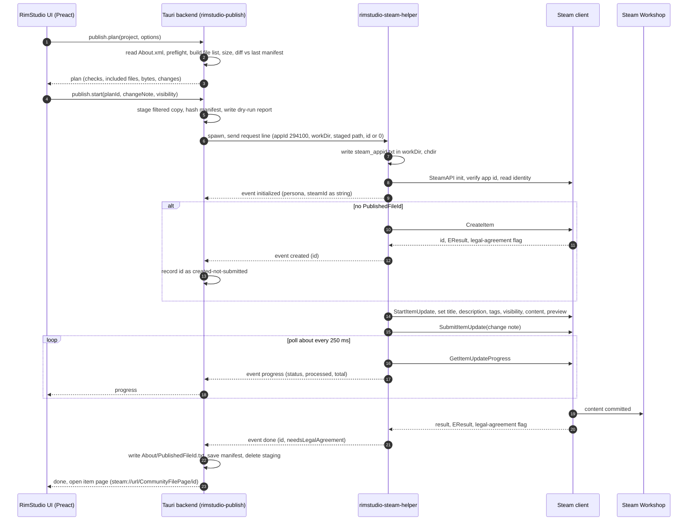
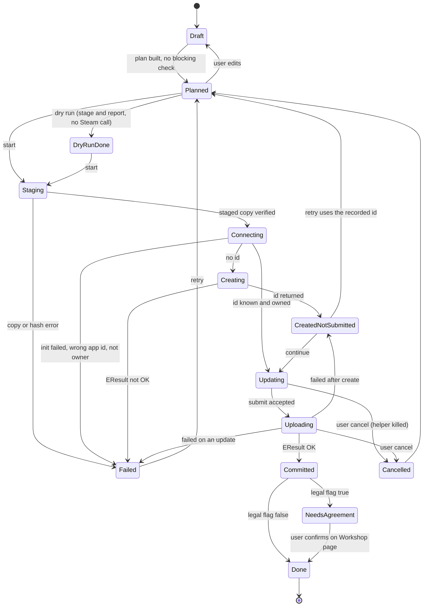

# Workshop publishing research: how RimWorld and Parallax publish, and what RimStudio should do

Scope: how the Steam Workshop upload and update flow works for RimWorld mods, as implemented by the game's own uploader (decompiled build 1.6.4871 rev598) and by the owner's earlier Parallax mod manager (Go, Steamworks flat C API through a helper sidecar), plus Valve's ISteamUGC documentation. It then compares Rust options (steamworks crate, Rust sidecar, direct C API, SteamCMD), covers the Steamworks redistribution licence, and recommends an architecture, error model, UX flow and safety design for RimStudio's publish and update tool.

Status: research note | Last verified: 2026-10-04

Evidence conventions: `decompiled:<path>` is ILSpy output of Assembly-CSharp.dll (Ludeon code, never copied; behaviour described in my own words). `parallax:<path>` is relative to `/run/media/pawbeans/project_drive/pawbeans/Projects/Go/parallax-mod-manager/`. `valve:<name>` is a Steamworks documentation page fetched on 2026-10-04 and kept in the scratchpad. `corpus` numbers come from the scripts in `docs/research/data/workshop-publishing/`.

## 1. The game's own uploader, step by step

The game uploader is small. Everything lives in `decompiled:Verse.Steam/Workshop.cs` (type `Workshop`), `decompiled:Verse/ModMetaData.cs` (the `WorkshopUploadable` implementation), `decompiled:Verse.Steam/WorkshopItemHook.cs`, and the UI in `decompiled:RimWorld/Page_ModsConfig.cs` and `decompiled:RimWorld/Dialog_ConfirmModUpload.cs`.

### 1.1 Prerequisites and eligibility

| Gate | Behaviour | Evidence |
|---|---|---|
| Dev mode | The "Upload to Steam Workshop" / "Update on Steam Workshop" entry appears in the mod list "More actions" menu only when dev mode is on. | decompiled:RimWorld/Page_ModsConfig.cs (float menu build) |
| Steam initialised | Entry also requires `SteamManager.Initialized`. The game calls the Steamworks.NET restart check with an invalid app id, then `SteamAPI.Init()`. A failed init logs a warning listing: Steam not running, launched outside Steam without steam_appid.txt, or privilege mismatch with the Steam client. | decompiled:Verse.Steam/SteamManager.cs |
| Not official content | `ModMetaData.CanToUploadToWorkshop` rejects official (Ludeon) content. | decompiled:Verse/ModMetaData.cs |
| Source is the Mods folder | A mod from the install Data folder or from a Workshop subscription cannot be uploaded; only `ContentSource.ModsFolder`. This is why the owner's external-drive mod folders must be handled by RimStudio itself: the game would never offer an upload for them. | same |
| Author check | If the mod has a published id, the hook asks Steam for the item details and compares the item owner with the signed-in SteamID. Until the answer arrives the owner is unknown, and unknown counts as "may have another author", which blocks the upload. A mismatch also blocks. | decompiled:Verse.Steam/WorkshopItemHook.cs (`MayHaveAuthorNotCurrentUser`) |
| Metadata sanity | Before the confirm dialog: a badly formatted supportedVersions entry shows a message demanding a well formed target version; a badly formatted packageId shows a message; LoadFolders.xml issues (`loadFolders.GetIssueList`) are listed in a dialog. Each blocks the upload. | decompiled:RimWorld/Page_ModsConfig.cs |
| Steam account | Valve and the RimWorld wiki both note that limited user accounts cannot submit Workshop content. | valve:limited, https://rimworldwiki.com/wiki/Modding_Tutorials/Distribution (accessed 2026-10-04) |
| App ownership | The app id comes from `SteamUtils.GetAppID()` of the running game process (294100). The game never sets it itself; Steam provides it because the process was launched by Steam, or because steam_appid.txt sits in the working directory. The install holds a steam_appid.txt whose content is exactly `294100` (no newline). | decompiled:Verse.Steam/Workshop.cs; file `/home/pawbeans/.steam/steam/steamapps/common/RimWorld/steam_appid.txt` |

### 1.2 Confirmation dialogs

Two confirmations precede the upload. The first (`Dialog_ConfirmModUpload`) shows the Workshop terms of service link text and has a checkbox "Tag as translation" bound to the mod's `translationMod` flag. The second asks "are you the content author" with a Yes/No pair and an interaction delay of 6 seconds before the buttons work. The English strings are in `Data/Core/Languages/English/Keyed/Menus_Main.xml` (`ConfirmSteamWorkshopUpload`, `TagAsTranslation`, `WorkshopSubmissionFailed`).

### 1.3 Create versus update

`Workshop.Upload` refuses to start if a previous operation is still in a non-idle stage (message "upload already in progress"). Then:

1. If the mod has a valid PublishedFileId: stage becomes SubmittingItem, `StartItemUpdate(appId, id)` is called, item data is applied, and `SubmitItemUpdate` is called with an auto-generated change note containing the local date and time.
2. Otherwise: stage becomes CreatingItem and `CreateItem(appId, community file type)` is called. The file type value is 0, which is both `k_EWorkshopFileTypeFirst` and `k_EWorkshopFileTypeCommunity` in the bundled header. On a successful create result the id is stored through the hook, which writes the file, then `StartItemUpdate`, item data, `SubmitItemUpdate` with the change note "Initial upload".
3. A modal "operation in progress" window polls `GetItemUpdateProgress` every frame and shows the status label plus a percentage when bytes processed over bytes total is above zero.

Key behaviours that a RimStudio implementation must know about:

- **About/PublishedFileId.txt**. Read at mod load with an unsigned integer parse (decompiled:Verse/ModMetaData.cs, `PublishedFileIdPath` is `<root>/About/PublishedFileId.txt`); a parse failure silently leaves "unpublished". Written by `SetPublishedFileId` as the decimal id with no newline (corpus note in `docs/research/rimworld-mod-format-and-corpus.md` section 1: 706 mods have the file, 4 with a trailing newline).
- **The id file is written right after CreateItem succeeds, before the submit result is known.** If the submit then fails, the mod stays marked as published and the next attempt is an update of an item that never received content. Parallax hit a variant of the same thing (section 4).
- **Description is applied only when creating.** The update path calls the title setter but not the description setter, so editing About.xml description after the first upload never reaches the Workshop page through the game's tool. Title is applied on both paths.
- **Visibility is never set.** The game relies on Steam's default for a new item, and Valve states that items stay hidden until the contributor accepts the Workshop legal agreement (valve:features_workshop_implementation, "Workshop Legal Agreement"). On update, visibility stays whatever the author set on the web page.
- **Legal agreement flag is never read.** The result structs carry `m_bUserNeedsToAcceptWorkshopLegalAgreement` (confirmed in the bundled header and in the steamworks crate's ugc.rs). The game ignores it and, after success, simply opens the item's Workshop page, which is exactly the flow Valve recommends so the author can accept the agreement there. Evidence: no reference to the flag anywhere in the decompiled tree; `OpenWorkshopPage` is called from the submit-success handler.
- **No dependencies, no metadata, no extra previews.** The decompiled tree has no call to the dependency, item metadata or additional preview methods. About.xml `modDependencies` are not mapped to Steam's "required items".
- **Language**: no update-language call, so title and description are stored as English per Valve's default.

### 1.4 What is uploaded and excluded

The content folder passed to `SetItemContent` is the full mod root directory (`GetWorkshopUploadDirectory` returns `RootDir`). There is no ignore list. Everything under the root ships: `.git`, `Source`, PSD/AI files, solution files, archives. The wiki points at a community mod (Publisher Plus) that adds exclusion because the vanilla tool cannot. Valve's docs for the content folder say files should not be merged or zipped, so Steam can deduplicate and delta upload (valve:api_ISteamUGC, SetItemContent).

For scenarios (not mods), `PrepareForWorkshopUpload` writes a temporary folder under the game's temp path containing one `.rsc` file, which is a useful precedent: the game itself stages content in a temp folder when the upload set differs from the source.

### 1.5 Preview image

| Rule | Detail | Evidence |
|---|---|---|
| Fixed path | `About/Preview.png`, exact name (case matters on Linux), returned by `ModMetaData.PreviewImagePath`. | decompiled:Verse/ModMetaData.cs |
| Missing file | A warning "Missing preview file" is logged and the preview call is skipped. The upload proceeds without a preview change. | decompiled:Verse.Steam/Workshop.cs (`SetWorkshopItemDataFrom`) |
| Size | The wiki states Steam rejects a preview over 1 MB and recommends 640x360. The Valve page for SetItemPreview says only that the format must be renderable by web and app (JPG, PNG, GIF suggested) and that the app needs Steam Cloud quota set or the call fails. The 1 MB number for the primary preview is a wiki claim, not a Valve statement (the 1 MB figure on Valve's page is for additional previews). | https://rimworldwiki.com/wiki/Modding_Tutorials/Distribution (accessed 2026-10-04); valve:api_ISteamUGC |
| Format | Not validated. The game does not check that the PNG is really a PNG. | corpus |

Corpus evidence from the owner's mods (19 mod folders with About, scanned by `docs/research/data/workshop-publishing/scan_mods.py`): three previews are above 1 MB (two at about 2.86 MB, one at 1.00 MB), one mod's Preview.png is really JPEG data, one mod has a lower-case `preview.png`, and sizes are mostly 1920x1080 against the recommended 640x360.

### 1.6 Title, description, tags

- Title: `ModMetaData.Name` (About.xml `name`, falling back to folder name). Valve's limit is `k_cchPublishedDocumentTitleMax` = 128 + 1 characters (isteamremotestorage.h in the bundled SDK headers).
- Description: About.xml `description` verbatim, no conversion. Steam renders BBCode, so About.xml text with XML-escaped markup or Markdown shows as raw text. Limit `k_cchPublishedDocumentDescriptionMax` = 8000. The game does not truncate or check. The wiki and the corpus note both flag that `descriptionsByVersion` exists but the uploader uses only the plain description.
- Change note: limit 8000 (`k_cchPublishedDocumentChangeDescriptionMax`). Game always auto-generates it.
- Tags (exact list the code can emit):

| Tag | When |
|---|---|
| `Mod` | normal mod (translation flag off) |
| `Translation` | translation flag checked in the confirm dialog (replaces `Mod`) |
| `Scenario` | scenario uploads only (decompiled:RimWorld/Scenario.cs, `GetWorkshopTags`) |
| `<major>.<minor>` for each entry of supportedVersions | e.g. `1.5`, `1.6`; built from the parsed System.Version of every supported version, including ones newer or older than the running game |

The version tag list is built fresh for each upload from a new list, so tags do not accumulate. The set of tags Steam shows is controlled by the game's Workshop tag configuration in Steamworks (valve:workshop_tags); Valve limits each tag to 255 characters, printable, no comma, and the list string to `k_cchTagListMax` = 1024 + 1.

## 2. Valve's UGC flow (what the API requires)

Sources: valve:api_ISteamUGC, valve:features_workshop_implementation, valve:api_ISteamUtils (all accessed 2026-10-04).

| Step | Call | Notes |
|---|---|---|
| 1 | `CreateItem(appId, fileType)` returns a call result `CreateItemResult_t` | Carries EResult, new PublishedFileId and the legal agreement flag. |
| 2 | `StartItemUpdate(appId, fileId)` returns an update handle | Same for create and update. |
| 3 | Setters: `SetItemTitle`, `SetItemDescription`, `SetItemUpdateLanguage`, `SetItemVisibility`, `SetItemTags`, `SetItemContent`, `SetItemPreview`, `SetItemMetadata`, key-value tags | All must precede submit. Each returns a bool that only signals a bad handle or bad argument; real errors come at submit. |
| 4 | `SubmitItemUpdate(handle, changeNote)` returns a call result `SubmitItemUpdateResult_t` | Result has EResult, file id and legal agreement flag. |
| 5 | `GetItemUpdateProgress(handle, &processed, &total)` polled | Status enum: Invalid(0) means finished or bad handle, PreparingConfig(1), PreparingContent(2), UploadingContent(3), UploadingPreviewFile(4), CommittingChanges(5). |
| 6 | Dependencies: `AddDependency(parent, child)` and `RemoveDependency` | Call results; this is how "required items" are expressed. Not used by the game. |
| 7 | Visibility enum | Public 0, FriendsOnly 1, Private 2, Unlisted 3 (isteamremotestorage.h). |

Legal agreement: Valve says new items are hidden until the author accepts the agreement, tells apps to show the terms link next to the submit button, and to open `steam://url/CommunityFilePage/<id>` after submit via the overlay. A separate application may publish into another app's Workshop only if the base app lists the tool's app id under "App Publish Permissions" in Steamworks (valve:features_workshop_implementation FAQ); RimStudio has no app id of its own, so it must run in RimWorld's app context.

SteamCMD route: `steamcmd +login <name> <password> +workshop_build_item <file.vdf> +quit`, with a VDF holding appid, publishedfileid, contentfolder, previewfile, visibility, title, description and changenote; the id is written back into the VDF on success. Valve explicitly says this is for testing only because it needs the user's credentials. Logs go to Steam's `workshopbuilds/depot_build_<appid>.log` and `logs/Workshop_log.txt`.

## 3. Parallax: what the owner already built

Parallax is a Go and Wails manager for Paradox games. Its publishing feature is documented in `parallax:docs/workshop-upload.md` and implemented in three places.

### 3.1 Components

| Component | Path | Role |
|---|---|---|
| Helper sidecar | `parallax:companions/parallax-steam-helper/` (main.go, protocol.go, publish.go, steamworks/) | Separate Go module and process. Reads one JSON request from stdin, writes newline-delimited JSON events to stdout, exits 0 after a `done` event or 1 after `error`. |
| Flat API bindings | `parallax:companions/parallax-steam-helper/steamworks/steamworks.go`, `versions.go`, `platform_unix.go`, `platform_windows.go` | Hand-written purego bindings (no cgo) to the target game's own libsteam_api. |
| Orchestrator | `parallax:internal/workshop/helper.go`, `workshop.go` | `Publisher` interface plus `HelperPublisher`: resolves the helper binary next to the app exe, stages content, runs the process, streams events as progress. |
| Update tracking | `parallax:internal/modupdates/`, `docs/mod-update-tracking.md` | Not publishing, but the snapshot, fingerprint and diff design is reusable for the "what changed since last upload" manifest. |
| Web API | `parallax:internal/steamapi/`, `docs/steam-web-api.md` | Item details, EResult table (`eresult.go`), item page existence check. |
| Secrets | `parallax:internal/secretbox/`, `internal/credentials/` | AES-256-GCM with a key derived (HKDF-SHA256) from the machine id; used for the optional Steam Web API key and a LoversLab login, never for Steam credentials. |

### 3.2 Parallax flow (publish.go)

1. The app resolves the game's app id, its own libsteam_api path inside the game's install (a Linux build can only use a Linux install's library; a Proton-only install is reported as unsupported rather than attempted), and a per-AppID work directory under the app's own config dir.
2. If the user excluded files, the app copies the content folder into `staged-content` under the work directory (skipping excluded relative paths, whole subtrees when a folder is excluded) and points the helper at the copy; the copy is removed by a deferred cleanup whether or not the publish succeeded (`stageExcluding` in helper.go).
3. The helper writes `steam_appid.txt` into its work directory, changes into it (SteamAPI_Init reads the file from the current directory), loads the library by absolute path, calls `SteamAPI_Init`, and verifies `GetAppID` equals the requested id.
4. Create if item id is 0 (file type community, wait up to 2 minutes), else reuse the id. `StartItemUpdate`, then title and description only if non-empty, visibility always (empty request value maps to private, deliberately not Valve's default), content folder, preview if given, then `SubmitItemUpdate` with the change note, polling progress and emitting `uploading` events with processed and total byte counts.
5. Any result other than OK produces an error message that includes the numeric EResult and tells the user the item already exists and should be checked on its Workshop page.
6. Events: `opening`, `initialized`, `creating`, `created`, `updating`, `uploading`, `done`, `error`. An identity mode (persona name, SteamID64 as a string, 184x184 PNG avatar) shares the same process.
7. The helper never resolves `SteamAPI_RestartAppIfNecessary` (it would launch the real game); its required-symbol list is fixed and every symbol is probed before registration because purego panics on a missing one (`requiredSymbols` in steamworks.go).
8. Interface accessor versions (`SteamAPI_SteamUGC_vNNN`, Utils, Friends, User) are probed newest first against the loaded library (`versions.go`).

The UI layer (frontend EditorPublish tab) derives title, description and tags from the mod's own metadata, derives create versus update from whether a remote id exists, and asks only for change note and visibility. Account permission is checked client-side by comparing the item's `creator` (from the Web API) with the signed-in SteamID, failing open when either is unknown.

### 3.3 Verified live facts from Parallax

- `SteamAPI_Init` with a steam_appid.txt in the cwd works against a game's own library and puts the process in that game's app context (`GetAppID` returned the expected id).
- `CreateItem` succeeded and returned a real id.
- `SubmitItemUpdate` against Stellaris returned EResult 9 (FileNotFound) twice, with and without content. Steam's own `workshop_log.txt` showed "Getting Workshop info for item ... failed : File Not Found" at the start of the upload for both attempts, 18 minutes apart. The cause is unresolved: Parallax records it as an open question (Stellaris' bundled library is an old SDK build exporting `SteamUGC_v016`; whether a newer library avoids it was never tested). See `parallax:docs/workshop-upload.md`, "Follow-up".
- I verified on this machine that RimWorld's bundled library at `RimWorldLinux_Data/Plugins/libsteam_api.so` (416,413 bytes, dated 2024-06-04) exports `SteamAPI_Init`, `SteamAPI_RestartAppIfNecessary`, `SteamAPI_SteamUGC_v016` and `SteamAPI_SteamUtils_v010`, and does not export `SteamAPI_InitFlat`. It is therefore the same generation as Stellaris' library, so the unresolved EResult 9 risk applies to loading RimWorld's own library too. The game itself uses this library through Steamworks.NET and uploads fine, but it creates the item through the game process launched by Steam, not through a dlopen from a foreign process with steam_appid.txt.

## 4. Pitfalls and gotchas recorded by Parallax and found here

| # | Pitfall | Where recorded | Mitigation for RimStudio |
|---|---|---|---|
| 1 | Never call `SteamAPI_RestartAppIfNecessary`: it launches the real game. | parallax:companions/parallax-steam-helper/main.go header; `steamworks.go requiredSymbols` | Do not bind it at all. |
| 2 | steam_appid.txt is read from the process working directory, not a path argument. | parallax:main.go `prepareWorkDir` | Sidecar sets cwd to a private work dir it owns. Never write into the game install. |
| 3 | `SteamAPI_Init` fails if Steam is not running, not logged in, or the process runs with different privileges (for example as administrator). | decompiled:Verse.Steam/SteamManager.cs warning text; parallax publish.go error | Preflight check with a specific, actionable message per cause. |
| 4 | Interface accessor versions differ per bundled library (v016 on this machine, v021 in the current SDK headers). | parallax:steamworks/versions.go | Probe symbols at runtime or pin to one library. |
| 5 | purego `RegisterLibFunc` panics on a missing symbol, `Dlopen` does not exist on Windows. | parallax:steamworks/platform_*.go | Rust: `libloading` returns errors; use it or the safe `steamworks` crate. |
| 6 | cgo broke Parallax's cross-compile (plain GOOS=windows build), so purego was chosen. | parallax:docs/workshop-upload.md | Not an issue in Rust, but note CI must build the sidecar natively per OS. |
| 7 | `SubmitItemUpdate` EResult 9 even with content. | parallax:docs/workshop-upload.md | Treat as a known failure mode; include the Steam log path in error details; test early against RimWorld. |
| 8 | A failed submit leaves an existing, empty item. | parallax publish.go error text | Persist the new id before submit but mark state `created-not-submitted` in the app's own record; resume with update instead of creating a second item. |
| 9 | `file_size` and `publishedfileid` are JSON strings in the web API; SteamID64 exceeds JS 2^53. | parallax:docs/steam-web-api.md | Carry ids as strings across IPC and in TypeScript. |
| 10 | The free `GetPublishedFileDetails` returns result 9 for unlisted items whose page is up; "deleted" needs a page check. | parallax:docs/mod-update-tracking.md, steam-web-api.md | Do not treat 9 as "gone" when deciding create versus update. |
| 11 | Steam web calls batch at 100 ids, return rate-limit codes (25, 84). | parallax:docs/steam-web-api.md | Chunk and back off. |
| 12 | Steamworks has no per-file exclusion: `SetItemContent` takes a folder. | parallax:docs/workshop-upload.md "Excluding files" | Stage a filtered copy; exclusion is orchestration. |
| 13 | A helper that exits without a final `done` or `error` event is a bug, not a normal result. | parallax:internal/workshop/helper.go `errNoFinalEvent` | Same invariant in the RimStudio protocol. |
| 14 | stdout line length: a large base64 event (avatar) needed a bigger scanner buffer, otherwise the event was silently dropped. | parallax:internal/workshop/helper.go (comment near Identity) | Keep events small; send images as files. |
| 15 | The game's own tool writes PublishedFileId.txt before the submit finishes. | decompiled:Verse/ModMetaData.cs, Workshop.cs | See row 8. |
| 16 | The game's own tool does not update the description on later uploads. | decompiled:Verse.Steam/Workshop.cs | Offer an explicit "update description" toggle, default on. |
| 17 | Two folders can carry the same PublishedFileId.txt. In the owner's mods, two folders ("Gewehr 41" and "Third Reich Armory") hold the same id. | corpus (owner scan) | Preflight warning: duplicate id across project folders. |

## 5. Rust options (all facts verified 2026-10-04 from crates.io metadata and the downloaded crate sources)

### 5.1 The `steamworks` crate

| Fact | Value |
|---|---|
| Latest version | 0.13.1, published 2026-05-05; `steamworks-sys` 0.13.0 published 2026-04-14 (crates.io metadata) |
| Licence of the crates | MIT or Apache-2.0 |
| Repository | https://github.com/Noxime/steamworks-rs |
| SDK in the sys crate | Vendored under `lib/steam` with headers and `redistributable_bin` for win64, linux64, linux32, linuxarm64, osx and androidarm64; the headers define ISteamUGC accessor version 021. The exact SDK release number is not stated in the crate files I read (unverified). |
| Linking | `build.rs` copies the platform library to OUT_DIR and links it as a dynamic library (`steam_api64` on Windows x64, `steam_api` elsewhere). The binary therefore needs the library at launch time. How the library is found at runtime after packaging (rpath, adjacent file) was not tested (unverified). |
| Init | `Client::init()` uses the flat init with an error message buffer (needs `SteamAPI_InitFlat`); `init_app(id)` for a fixed id; `restart_app_if_necessary` exists as a separate function and is simply not called. steam_appid.txt in the cwd is the documented dev route. |
| UGC coverage (src/ugc.rs) | create_item, start_item_update, item update builder with title, description, language, preview_path, content_path, metadata, visibility, tags (with admin tags flag), key-value tags, content descriptors, `submit(change_note, cb)` returning a watch handle with `progress()`; queries (all, user, items, single item), subscribe, delete_item, install info. Result structs expose the legal agreement flag. I found no `add_dependency` wrapper in ugc.rs (grep); dependencies would need the raw bindings (feature `raw-bindings`). |
| Callbacks | Manual dispatch; the caller pumps callbacks. |

Compatibility consequence: the crate's `init` needs `SteamAPI_InitFlat` and a v021 UGC accessor, which RimWorld's own library does not export (section 3.3). So with the crate you ship Valve's current redistributable and load that, not the game's file. That avoids the old-library risk (a current library talks to the current Steam client) but needs the licence in 5.5, and Parallax's "Stellaris EResult 9" problem is not reproduced or ruled out for a newer library. A first spike should settle this against the owner's real Steam account.

### 5.2 A sidecar built from Rust

Same crate, wrapped in a small binary crate (`rimstudio-steam-helper`, name proposed) that speaks the stdio protocol of section 7. Tauri 2 supports this directly: sidecars are listed in `bundle.externalBin` of tauri.conf.json and need a file named with the target triple suffix (for example `my-sidecar-x86_64-unknown-linux-gnu`) in the source tree (https://v2.tauri.app/develop/sidecar/ , scratch copy `tauri_sidecar.txt`, accessed 2026-10-04). Benefits: the main app never links libsteam_api, so it starts on machines without it and without Steam; a Steamworks crash or hang cannot take the UI down; the process has its own cwd for steam_appid.txt; a kill on cancel is trivial.

### 5.3 Direct C API through libloading

Matches Parallax and can target the game's own library, but means hand-maintaining struct layouts for call results (Parallax already needed raw `GetAPICallResult` buffers) and version probing. `libloading` 0.9.0 (published 2025-11-05) returns errors on missing symbols. Choose this only if the spike shows the bundled-library route fails and the game-library route works.

### 5.4 SteamCMD `workshop_build_item`

No SDK library needed, and the VDF format maps one to one onto the UGC setters. Drawbacks: needs credentials typed into SteamCMD (with Steam Guard prompts) and a SteamCMD install; Valve calls it testing-only; no live progress API; tags, dependencies and visibility handling are limited to what the VDF keys expose (the doc lists no tags key). Keep it as an optional, advanced fallback that RimStudio never feeds credentials to: RimStudio would generate the VDF and a command line for the user to run in their own terminal (`+login` with their name only, SteamCMD prompts for the rest). I did not retrieve the SteamCMD wiki page (blocked by a bot check); Valve's workshop implementation page above is the source.

### 5.5 Redistribution licence

- The Steamworks SDK Access Agreement grants a licensee the right to use the SDK in source form and to reproduce and distribute the files in the `redistributable_bin` folder together with the licensee's software, in object code form (valve:sdk_agreement, section 1.1). A licensee is a Steamworks partner who accepted the agreement; the page itself tells non-partner accounts that their account is not associated with an active partner. So the grant is for the account holder who agreed, and the redistributable folder is what `steamworks-sys` vendors.
- Practical reading (not legal advice): RimStudio can ship libsteam_api only if its publisher has accepted the agreement in Steamworks. The crates being MIT or Apache-2.0 does not change this for the vendored binaries.
- What RimSort and RimCrow do:

| Project | Behaviour | Evidence |
|---|---|---|
| RimSort | Commits Steamworks libraries into its `libs/` folder: libsteam_api.so (381,976 bytes), libsteam_api.dylib, steam_api64.dll (317,080 bytes), the .lib files, plus compiled SteamworksPy wrappers; SteamworksPy is a submodule. The shipped steam_api64.dll has the same byte size as the one inside `steamworks-sys` 0.13.0, which suggests a similar SDK generation (inference from size only). It uses them for subscribe, unsubscribe and download, not publishing. | RimSort-main/libs/, RimSort-main/.gitmodules, app/utils/steam/steamworks/wrapper.py |
| RimCrow | Does not ship the SDK: its README says the redistributables come from a Steamworks Partner download and a setup script (`scripts/setup_steamworks_runtime.py`) extracts the needed files from a user-supplied SDK zip into `tools/steamworks/`. | RimCrow-main/README.md ("Steamworks 运行库" section), RimCrow-main/scripts/setup_steamworks_runtime.py |

Hygiene for RimStudio (rule R11): do not copy RimSort's binaries or code. If the licence cannot be satisfied, fall back to loading the user's own RimWorld library (needs the direct C API route) or the SteamCMD fallback.

## 6. Recommendation

### 6.1 Architecture

1. Publishing runs in a separate Rust sidecar executable, `rimstudio-steam-helper`, spawned by the Tauri backend per operation (not a long-lived daemon), speaking newline-delimited JSON over stdin and stdout. Reasons: isolation of a native library and its failure modes, cwd control, kill on cancel, and keeping the main process free of a link-time dependency.
2. The sidecar crate depends on `steamworks` 0.13.x behind a small trait (`SteamBackend`) so a second backend (libloading against the game's library) can be added if the spike requires it, and so tests use a fake backend (the same seam Parallax used).
3. Everything that does not need Steam happens in the main process or in library crates: preflight, staging, manifest, diffing, About.xml reading, change note generation. The sidecar only does init, identity, create, update, progress, and optional queries.
4. A pure-Rust crate `rimstudio-publish` (name proposed) owns the state machine, protocol types (serde), staging and manifest; `rimstudio-steam-helper` is a thin binary around the protocol.
5. XML reading (About.xml, LoadFolders.xml) goes through the single XML boundary crate required by R10. Publish records, manifests and ignore profiles are JSON or JSONC. The only XML written is, optionally, nothing: the one RimWorld file the tool writes is `About/PublishedFileId.txt`, which is plain text.

### 6.2 Sequence



### 6.3 Publish state machine



### 6.4 Error model

Errors are a closed enum, each with a code, a plain-language message, a remedy and raw detail for the log.

| Code | Trigger | Remedy shown |
|---|---|---|
| `steam_not_running` | init failed | Start Steam and log in; do not run RimStudio elevated if Steam is not. |
| `wrong_app_context` | reported app id differs from 294100 | Report as a bug; show the work dir. |
| `library_missing` | bundled library absent or fails to load | Reinstall, or choose the SteamCMD fallback. |
| `not_owner` | item owner differs from signed-in SteamID | Explain that only the author can update; offer "publish as new item". |
| `limited_account` | cannot be detected up front; Steam returns an access error | Link the Steam support article about limited accounts. |
| `access_denied`, `insufficient_rights` (EResult 15, 24) | submit | Same as not_owner, plus ban hint. |
| `file_not_found` (EResult 9) | submit | Show the known Parallax finding; suggest checking the item page and Steam's Workshop log path. |
| `rate_limited`, `busy`, `timeout`, `no_connection` (84, 10, 16, 3) | create or submit | Retry with backoff; item may already exist, so reuse the recorded id. |
| `limit_exceeded` (25) | submit | Content or tag limits; show sizes. |
| `item_deleted` (86) | update | The item was removed; offer to create a new one and clear the stored id after confirmation. |
| `preflight_blocking` | checks in 7.2 | List each failed check with its fix. |

The EResult names and texts already exist in `parallax:internal/steamapi/eresult.go` (16 named constants and a fuller table); RimStudio should regenerate the table from the bundled header rather than copy Parallax's Go file.

### 6.5 UX flow

1. Open a mod project (from the workspace or any mod in a custom mod folder) and choose Publish. The tool reads `About/PublishedFileId.txt` to pick Create or Update.
2. The Plan screen shows: checks (blocking, warning, info), a file tree with checkboxes defaulting to the ignore profile, total size and file count, the diff against the last upload (added, changed, removed with sizes), title, description with BBCode preview and character counter, tags (Mod or Translation plus version tags derived from supportedVersions, shown as chips), preview image with dimensions and size, visibility (default Private for a new item, "keep current" for updates), dependencies (derived from About.xml `modDependencies` where a Workshop URL or id exists), and a change note field with a template.
3. "Dry run" builds the staging folder and the report without contacting Steam.
4. "Publish" shows the terms link beside the button and one confirmation naming the account and target item.
5. Progress shows stage labels mapped from the status enum, bytes, and a cancel button.
6. On success: open the item page, show the legal-agreement hint if the flag was set, and save the manifest.

No Steam login prompt exists in RimStudio. The only identity is whatever the running Steam client has.

## 7. Safety and quality design

### 7.1 Staging copy and ignore rules

Never upload the project folder directly. Build a staging folder under the app cache (`<cache>/publish/<packageId>/stage`), by hard link where the filesystem allows and copy otherwise, containing exactly the included files; point `SetItemContent` at it; delete it after the run (also on failure). This is the same design as Parallax's staging and the same idea as the game's scenario temp folder.

Evidence for why this matters, from the owner's own mods (`docs/research/data/workshop-publishing/scan_mods.py`, 19 folders with an About folder): total 516,462,074 bytes, of which 431,216,324 bytes (83.5 percent) are build, source, VCS or layered-art content; 17 of 19 mods contain at least one such file; the largest single item is an About/Preview.psd of 251,080,698 bytes. The vanilla uploader would ship all of it.

Across the 690 installed Workshop mods (`docs/research/data/workshop-publishing/junk_census.py`, output `workshop_census.json`): 71 mods contain a VCS directory (20,960 files, 650 MB), 65 a source directory (366 MB), 82 contain PDB files (72 MB), 9 layered art (39 MB), 70 project files. So the authors of published mods ship these today. A tool that excludes them by default would shrink downloads for subscribers, but must never delete anything from the project.

Ignore file: a project file named `.rimstudioignore` at the mod root, gitignore syntax, parsed by the `ignore` crate (0.4.33, 2026-08-04, MIT or Unlicense) which also reads real `.gitignore` if the user opts in. Defaults (always applied unless the user overrides in the UI, shown as removable chips):

| Group | Patterns |
|---|---|
| VCS | `.git/`, `.svn/`, `.hg/`, `.gitignore`, `.gitattributes`, `.gitmodules` |
| IDE and build | `.vs/`, `.idea/`, `.vscode/`, `bin/`, `obj/`, `*.sln`, `*.csproj`, `*.user`, `*.suo`, `*.pdb` |
| Source folders | `Source/`, `Sources/`, `src/` at the mod root only (the mod root's Assemblies folder is not touched) |
| Raw art | `Raw Assets/`, `*.psd`, `*.xcf`, `*.ai`, `*.kra`, `*.blend`, `*.clip`, `*.sai` |
| Junk | `*.bak`, `*.tmp`, `*.orig`, `*~`, `*.swp`, `Thumbs.db`, `.DS_Store`, `desktop.ini`, `*.log` |
| Archives | `*.zip`, `*.rar`, `*.7z` (warn, since some mods legitimately ship archives) |
| Docs | `README.md`, `LICENSE.md` (kept by default: they are harmless; shown as a suggestion) |

Hard requirements that never ignore: `About/About.xml`, `About/Preview.png` (the preview is uploaded through the preview call but the game and the mod list also read it from the folder), `About/PublishedFileId.txt` is included in the upload as the game does today, `LoadFolders.xml` and every folder it references, `Defs`, `Patches`, `Textures`, `Assemblies`, `Languages`, `Sounds`, `Common`, and versioned folders named in the About and LoadFolders data. If an ignore pattern would remove a path that LoadFolders.xml or a def reference needs, preflight raises a blocking error.

Safety rules: matching is on relative paths with forward slashes, case-insensitive on Windows and macOS, and the exact-case comparison on Linux. Symbolic links are never followed (a link out of the project is a blocking error). Files unreadable by permission fail the plan, not the upload.

Exact preview: the Plan screen lists every file that will upload, grouped by top folder, with per-folder sizes and the total, plus a second list "excluded by rule X" with sizes. The dry run writes the same list to `<cache>/publish/<packageId>/plan.json`, and the staging step re-verifies the staged tree against it by path and size before the first Steam call, so what you see is what ships.

### 7.2 Preflight validation

| Check | Level | Basis |
|---|---|---|
| About.xml exists and parses; name, author or authors, description present | blocking for name, warning for others | decompiled:Verse/ModMetaData.cs defaults |
| packageId matches the game's format rule | blocking | the game blocks upload on bad format (Page_ModsConfig); exact rule in `docs/research/rimworld-mod-format-and-corpus.md` section 1.3 |
| supportedVersions present, non-empty, each entry parses, contains the current game major.minor (1.6) | blocking for malformed or empty, warning for missing 1.6 | decompiled:Verse/ModMetaData.cs (`TryParseSupportedVersions`) |
| LoadFolders.xml issues empty | blocking | game blocks via `GetIssueList` |
| Preview.png exists with exact case | warning (game continues without it) | decompiled:Verse.Steam/Workshop.cs |
| Preview decodes as the format its extension says | blocking | corpus found a JPEG named .png |
| Preview size at most 1 MB | warning, with a one-click downscale offer (PNG to 640x360 or 1280x720) | wiki claim, not Valve; keep as a warning |
| Preview dimensions | info; suggest 640x360 | wiki |
| Title length at most 128 | blocking | isteamremotestorage.h |
| Description length at most 8000 after conversion | blocking | same header |
| Description contains no raw Markdown headings or HTML that Steam would show literally | info | Steam renders BBCode |
| Change note at most 8000 | blocking | same header |
| Each tag at most 255 characters, no comma; total tag string within 1025 | blocking | valve:api_ISteamUGC, header |
| Textures referenced by defs exist (the def explorer's reference index, case-checked) | warning | R5 |
| Duplicate PublishedFileId.txt value across the user's project folders | warning | corpus |
| Staged size and file count versus a configurable soft limit (for example 500 MB, 5,000 files) | warning | corpus: 62 of 690 installed mods exceed 100 MB; 5 exceed 1 GiB |
| Signed-in Steam account equals the item's owner (from the sidecar's identity and a details query) | blocking when both known | decompiled:Verse.Steam/WorkshopItemHook.cs |
| App ownership and Steam running | blocking | section 1.1 |
| Dependencies: each `modDependencies` entry has a Workshop id or URL | warning | game logs a warning for missing download URLs (decompiled:Verse/ModMetaData.cs) |

### 7.3 Manifest, diff and versioning

After each successful upload RimStudio writes `<project>/.rimstudio/publish-manifest.json` (JSON, contained in the ignore defaults so it never ships) with: schema version, item id (string), app id, upload time, change note, About version text, a list of `{path, size, blake3}` for every uploaded file, and the tag and title hashes. The next plan diffs the new file list against it by hash (blake3 1.8.7, 2026-08-20) and shows added, changed, removed counts; an identical content hash with unchanged title, description, tags and preview disables the Publish button ("nothing to publish"). The change note template can prefill from the diff (for example a bullet list of changed top-level folders), editable by the user. Versioning: read an optional `<modVersion>` or the project's own version field and offer a "bump version" action that edits About.xml only through the XML boundary crate; changing a version is never done silently.

### 7.4 Privacy and credentials

- RimStudio never asks for, stores or transmits a Steam username, password or Steam Guard code. The sidecar uses whatever session the running Steam client holds.
- SteamIDs and persona names are held in memory for the session. They are not written to logs; logs redact them as `<steamid>`. The manifest stores only the item id.
- The optional Steam Web API key (used for item details if offered) follows Parallax's secretbox idea (machine-bound AES-GCM) or the OS keychain; it is never needed for publishing.
- The SteamCMD fallback generates a VDF only; credentials are typed by the user into SteamCMD.

### 7.5 Dry run and failure recovery

- Dry run does steps 1 to 3 of the state machine, writes `plan.json`, leaves the staged folder in place for inspection (with an "open folder" button), and makes zero Steam calls.
- Cancel kills the sidecar; the staging folder is deleted; if an item was created the record stays `created-not-submitted` with its id.
- Retry after failure reuses the recorded id (update path), never creates a second item unless the user confirms.
- If the app crashes mid-upload, the next start finds the run record (JSON in the cache) and offers resume or discard; Steam itself also keeps no partial state for an unsubmitted update, so resume means submit again.
- A history list shows past publishes (time, id, bytes, EResult, note) from the manifest folder.

## 8. Sidecar protocol sketch

Transport: one request line on stdin (JSON object), then zero or more event lines on stdout, one JSON object per line, flushed per line, UTF-8, each at most 16 KiB. Stderr is free text for logs. Exit code 0 only after a `done` event; 1 after `error`; any exit without a terminal event is reported as `helper_protocol_error`. The helper exits on stdin closing after the request has been read only if the parent sets `cancel`; otherwise the parent kills it.

Request (version 1):

```json
{
  "v": 1,
  "op": "publish",
  "appId": 294100,
  "workDir": "<cache>/steam/294100",
  "libraryPath": null,
  "itemId": "0",
  "content": "<cache>/publish/Author.Mod/stage",
  "preview": "<cache>/publish/Author.Mod/stage/About/Preview.png",
  "title": "My Mod",
  "description": "[b]My Mod[/b] ...",
  "setDescription": true,
  "tags": ["Mod", "1.5", "1.6"],
  "visibility": "private",
  "changeNote": "Fixes ..."
}
```

`op` is one of `identity`, `publish`, `query`, `probe`. `itemId` is a decimal string. `visibility` is `public`, `friendsOnly`, `private`, `unlisted` or `keep` (omit the visibility call). `libraryPath` is null when the bundled library is used.

Events:

| `event` | Fields | Notes |
|---|---|---|
| `opening` | none | process started, cwd set |
| `initialized` | `appId`, `personaName` | persona name redacted in logs |
| `identity` | `steamId` (string) | used for owner check |
| `creating` | none | |
| `created` | `itemId`, `needsLegalAgreement` | |
| `updating` | `itemId` | handle started, setters applied |
| `progress` | `status` (`preparingConfig`, `preparingContent`, `uploadingContent`, `uploadingPreview`, `committing`), `processed`, `total` | bytes as numbers (fit in 2^53 for realistic sizes); status maps the Valve enum |
| `done` | `itemId`, `needsLegalAgreement`, `eresult` (1) | terminal |
| `error` | `code`, `eresult` (nullable), `message`, `itemId` (nullable), `retryable` | terminal; `code` from the error model |

Lifecycle: the parent creates the work dir, spawns the helper with a minimal environment (the `SteamAppId` environment variable is also set to the same id as a second signal; this is an assumption to confirm in the spike, since Valve's documented dev route is the file), reads events until a terminal one, applies a watchdog (no event for 120 seconds while `uploadingContent` is not advancing means kill and report `timeout`), and on cancel sends no message but kills the process. The helper never reads further stdin after the request, so a closed pipe is harmless.

Per-OS specifics:

| OS | Library | App id file | Notes |
|---|---|---|---|
| Linux | `libsteam_api.so` beside the helper (bundled route) or `<RimWorld>/RimWorldLinux_Data/Plugins/libsteam_api.so` (game route; path verified here) | steam_appid.txt in the helper's cwd | Steam client socket is found through the user's home; Flatpak or sandboxed Steam may need extra access (unverified). |
| Windows | `steam_api64.dll` beside the helper, or in the game's `RimWorldWin64_Data/Plugins` (path pattern unverified here, no Windows install on this machine) | same | Run unelevated if Steam is unelevated. |
| macOS | `libsteam_api.dylib` beside the helper | same | Notarisation and quarantine of a bundled dylib are untested (unverified). |

## Implications for RimStudio

1. Publishing runs in a separate sidecar process (`rimstudio-steam-helper`) over newline-delimited JSON on stdin and stdout; the main app and Tauri backend must start and work with no libsteam_api present. Test: start the app with the library removed and open every screen except Publish.
2. The sidecar never binds or calls `SteamAPI_RestartAppIfNecessary`, never writes into the RimWorld install, and always runs with its own work directory containing steam_appid.txt `294100`. Test: file-system assertion on the install tree before and after a mocked run.
3. Every run emits exactly one terminal event (`done` or `error`); a missing terminal event is a distinct error. Test: fake helper that exits early.
4. Create versus update is decided by `About/PublishedFileId.txt` (digits parsed with whitespace tolerance), the id is carried as a string end to end, and the file is rewritten with digits only. Before submit finishes the id is recorded as `created-not-submitted` in RimStudio's own JSON record, and a retry updates that item instead of creating another.
5. Publishing is allowed for any mod folder RimStudio knows (including user custom folders on external drives), not only for the game's Mods folder, because the game's own gate would refuse them.
6. Content is always uploaded from a staging folder produced by the ignore rules (`.rimstudioignore`, gitignore syntax, defaults in 7.1); the Plan screen lists every included file with sizes and the total, and the staged tree is verified against `plan.json` before the first Steam call. Test with the owner's mods: the plan for the `The Lone Wolf Weapon Package` project must exclude `.git` and `Raw Assets` and report the reduced size.
7. Preflight checks listed in 7.2 are implemented as a pure Rust library with one test per check; blocking checks mirror the game's three gates (version format, packageId format, LoadFolders issues), and the preview check detects a mislabelled image format.
8. Title, description and tags are set on every update (description toggle default on), with version tags generated as `major.minor` for each supportedVersions entry plus `Mod` or `Translation`; visibility defaults to Private for new items and `keep` for updates; the change note is user-written with a diff-based template, never an auto timestamp only.
9. The tool checks the item owner against the signed-in SteamID before updating and treats the legal agreement flag from create and submit results as a first-class state (`NeedsAgreement`), opening the item page afterwards.
10. No Steam credentials are ever asked for or stored; logs redact SteamIDs; the SteamCMD route, if offered, only generates a VDF and instructions.
11. Spike before committing to the crate: on this machine, with the real account, create and submit a Private item in app 294100 with the `steamworks` crate and Valve's current redistributable, and separately with RimWorld's own library through libloading; record whether EResult 9 occurs. Decide the shipping library by this result and by the licence question.
12. Publish history and the upload manifest (path, size, blake3 per file) are JSON; XML is touched only to read About.xml and LoadFolders.xml through the boundary crate.

## Open questions

1. Does `SubmitItemUpdate` return EResult 9 against RimWorld (app 294100) when the process is a foreign helper with steam_appid.txt, with the current SDK library versus the game's v016 library? Parallax saw it against Stellaris and never resolved the cause.
2. Can the project legally bundle `libsteam_api` (does the owner have a Steamworks partner account that accepted the SDK agreement), or should RimStudio use the user's own RimWorld library and require the direct C API route? The licence text was read, not reviewed by a lawyer.
3. What exact Steamworks SDK release is vendored in `steamworks-sys` 0.13.0 (the files read gave the UGC interface version 021 but no release number), and how does the packaged binary find the library at runtime on each OS?
4. Is the 1 MB preview limit real for the primary preview in 2026? Only the wiki states it; Valve's page gives 1 MB for additional previews. The owner has three previews above 1 MB, and a live test with an oversized preview is needed.
5. Does Steam apply tags that are not in the game's configured tag list (version tags like `1.6`), and are they displayed? The game sends them, and the Steamworks tag configuration page controls visibility, but the current configuration for app 294100 was not inspected.
6. Is a mod's `modDependencies` to Workshop id mapping worth sending to `AddDependency`? The game never does, and the `steamworks` crate has no wrapper for it, so it needs raw bindings.
7. How should the tool behave for a mod published under another author account (contributors, forks, template mods that ship with an inherited PublishedFileId.txt)? The wiki lists this as a common failure; the proposed behaviour is blocking plus "publish as new item", not yet designed in detail.
8. Windows and macOS library locations inside RimWorld installs and the Flatpak or Proton Steam cases were not verified on this Linux machine.
9. Whether to also offer a Workshop description editor with BBCode and a bidirectional import from the live page, versus reading About.xml only.
