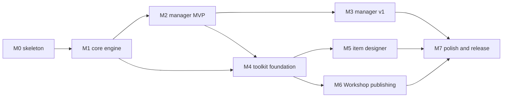

# RimStudio roadmap

This roadmap orders the work from the empty repository to a first release and lists what follows. It defines eight milestones (M0 to M7), plus the early 0.1.0 designer slice that cuts across them (section 2.1), each with scope, testable exit criteria, the specs it implements, the spikes that must finish first, dependencies and risks, followed by the consolidated owner decisions and a risk register. Decisions are cited as D-nnn from the [decision register](architecture/decision-register.md) and as ADR numbers from the [ADR index](adr/README.md); requirements are R1 to R12.

Status: draft | Last updated: 2026-10-04

## 1. Ordering principles

1. The manager ships first (owner priority, R5), the item designer second (R7), the Workshop publisher later (R9); the one exception is release 0.1.0, a designer slice built backend first (section 2.1, [ADR 0036](adr/0036-release-scope-and-backend-first.md)). Everything the later milestones need (XML boundary, def engine, scanner, jobs, IPC) is built in M0 and M1 once and reused.
2. Every milestone ends with something a person can run, and with exit criteria that a script or a named manual test can decide. "Looks done" is not an exit criterion.
3. Spikes are time boxed (about two days each) and their result is recorded in the repository before the dependent decision is frozen. A spike that fails switches to the fallback written in its ADR rather than extending the milestone.
4. Size estimates are judgement, expressed in focused person-weeks for one developer; they are for ordering and are not commitments.
5. The CLI grows with each milestone because it runs the same handlers as the GUI ([ADR 0003](adr/0003-one-command-registry-and-app-root.md)); a milestone whose engine has no CLI command has not met its exit criteria.

### 1.1 Mapping to the milestone names in the register

The first drafts of the architecture documents used a shorter milestone list (M0 to M6). This roadmap splits the manager into an MVP and a v1 and keeps hardening as its own milestone, so the old numbering differs from M2 onward. The architecture documents and the decision register now use this roadmap's numbering; the table records the old names for readers of older notes.

| Register | Roadmap | Content |
|---|---|---|
| M0 skeleton | M0 | Rename, workspace, CI, xtask |
| M1 library | M1 | Core engine, detection, scanner, CLI scan |
| M2 manager | M2 and M3 | Manager MVP, then manager v1 |
| M3 toolkit core | M4 | Project workspace, Def Explorer, patch tester, validator |
| M4 designer | M5 | Item designer and CE |
| M5 publisher | M6 | Workshop publishing |
| M6 release hardening | M7 | Packaging, updater, signing, Steam Deck |

### 1.2 Dependency overview

M4 needs M2 only for the shell, list and IPC plumbing; it does not need M3. If a second contributor appears, M3 and M4 can run in parallel. M6 depends on M4 for the project model and preflight but not on M5, so the publisher can move ahead of the designer if the owner chooses (owner decision 13).

## 2. Milestone summary

| Milestone | Theme | Size (person-weeks) | Spikes first | Owner decisions needed before |
|---|---|---|---|---|
| M0 | Skeleton, rename, enforcement | 2 | S-01, S-02, S-09, S-12 | none (placeholders allowed) |
| M1 | Core engine and CLI scan | 6 | none new | none |
| M2 | Manager MVP | 8 | S-03, S-05, S-10 | link deployment default, app identifier |
| M3 | Manager v1 | 6 | none new | bisect placement |
| M4 | Toolkit foundation | 8 | S-07, S-08 | XML editor and texture strategy (scope only) |
| M5 | Item designer | 8 | S-06 | none |
| M6 | Workshop publishing | 5 | S-04 | none (S-04 result decides whether the user's Steam installation works, D-086) |
| M7 | Polish and release | 5 | S-13 (if not done earlier) | identifier final, macOS notarisation path |

Total about 48 person-weeks; the manager release (end of M3) is reachable at about 22 weeks.

### 2.1 0.1.0 release (designer slice)

The owner's first release is the designer, not the manager ([ADR 0036](adr/0036-release-scope-and-backend-first.md), D-084). The Rust backend is built first and the CLI is the interim front end until the UI exists. The slice sits in the milestone order as follows: it is built on M0 (workspace, xtask, core skeleton), the parts of M1 it needs (`rimstudio-xml`, `rimstudio-io` with the JSON document store, `rimstudio-platform` ports, `rimstudio-steam` detection, `rimstudio-app` registry and `rimstudio-cli`), the toolkit and workspace slice of M4 (`rimstudio-workspace` reference sets, def index and resolve for the vanilla install, the `toolkit::designer` orchestration) and the weapons part of M5 (`rimstudio-design`, `design::ce`). A minimal `rimstudio-manager` crate (settings and sources: custom folders, detection) is part of the slice because the designer needs the reference set and custom mod folders. M2, M3, the apparel part of M5, M6 and M7 are unchanged and follow.

Scope.

1. A weapons editor for ranged and melee weapons with the specified math ([item balance math](features/item-balance-math.md)), simple and quiz modes, the fit meter and the write plan; it always writes vanilla definitions ([ADR 0037](adr/0037-vanilla-default-optional-ce-patch.md)).
2. An automatic Combat Extended patch generator the user opts into per item: patches for new weapons, the Convert flow for an existing mod's weapons, update mode for earlier output, and the CEP lint. Patch files go into a gated CE folder with `LoadFolders.xml`; nothing is ever generated automatically.
3. The in house JSON document store in `rimstudio-io` for designer drafts and calibration caches ([ADR 0035](adr/0035-in-house-json-database.md)).
4. `rimstudio-manager` limited to settings, sources (including custom folders) and detection.
5. The CLI commands that drive all of the above, with JSON output and exit codes.

Exit criteria (testable).

1. From the CLI, a fictional ranged weapon and a fictional melee weapon produce a write plan and vanilla files that pass the validator; the output is byte-identical across runs and thread counts.
2. With the CE toggle off, no CE file appears in any write plan, even when a CE install is configured; with it on, the patch files land in the gated folder, `LoadFolders.xml` is updated by byte-span edit, and the CEP lint reports zero errors.
3. The Convert flow and update mode on a fixture mod produce a reviewable diff of patch files only and leave the vanilla definitions untouched.
4. Drafts survive a restart through the document store; a corrupt document is quarantined and the rest still lists.
5. `rimstudio-cli` runs against a fixture install and library; `#[ignore]` tests run against `RIMSTUDIO_GAME_DIR` (and `RIMSTUDIO_CE_DIR`) and only read.
6. `cargo xtask check-licences` and the repository scan find no RimWorld or Combat Extended value table (R11); tests use fictional `RS_` names and numbers.
7. Per crate: `cargo fmt`, `cargo clippy --all-targets -- -D warnings` and `cargo test` are clean. Progress is tracked on the [status page](status/0.1.0-backend.md).

State (2026-10-05). Built and tested: `rimstudio-core`, `rimstudio-xml`, `rimstudio-io` (including the document store and the S-02 result), `rimstudio-platform`, `rimstudio-testing`, `rimstudio-xpath`, `rimstudio-defs`, `rimstudio-design` (weapons math, baseline, quiz, harness, fit, reader, CE reader, generator, conversion and lint; apparel math is not built), `rimstudio-steam`, `rimstudio-library` (scanner, manifest cache and duplicates; thumbnails, list codecs and deploy are stubs), `rimstudio-workspace`, `rimstudio-manager` (settings, detect, sources and scan), `rimstudio-toolkit` (designer, project and defs tools) and `rimstudio-ipc-types`, with `xtask` checks (`check-layers`, `check-source`, `check-docs`, `check-all`; the `check-cfg`, `check-deps`, `check-licences`, `check-tools` and `check-size` commands of M0 are folded into these or not yet written). Pending: `rimstudio-app` and `rimstudio-cli` (the composition root, command registry and CLI) and the integration of the whole; the [status page](status/0.1.0-backend.md) tracks the rows. Measured on the owner's machine: Core plus 5 DLC resolve cold in about 250 ms (13,212 defs, 0 unknown types) and with Combat Extended in about 780 ms; the library scan of 763 mods takes 1.17 s. Known open items: serde_json `float_roundtrip` is not enabled (owner decision), CE type table for lint rules CEP010 and CEP015, Windows and macOS code paths are tested only through fakes.

Deferred (not in 0.1.0): the apparel editor, the full manager (lists, sorting, profiles, validation), community datasets, the Workshop publisher, the desktop UI, packaging and the updater, (the folder rename with the `reference/` move was dropped, D-099).

## 3. M0 Skeleton (step 0)

Scope.

1. Replace the cargo-init root package with a virtual workspace (done). The folder rename and the `reference/` move of [ADR 0001](adr/0001-workspace-rename-and-naming.md) were dropped: the folder keeps its name and the GitHub repository is `rim-studio` (D-099).
2. Create all 24 members as empty crates with the layer tag in `[package.metadata.rimstudio]`, the shared `[workspace.dependencies]` and `[workspace.lints]`, `rust-toolchain.toml` (channel 1.96), `rust-version` 1.95 and the `cargo xtask` alias.
3. xtask with `check-layers` (which also covers the dependency and cfg rules of `check-deps` and `check-cfg`), `check-source` (cfg quarantine, file writes, XML strings, print macros, vanilla and CE names), `check-docs`, `check-all`, and later `check-licences`, `check-tools`, `check-size`, `bindings`, `schemas`, `new-crate` and `new-tool`; `deny.toml` with XML wrapper lists and a licence policy; clippy policy; `xtask/layers.jsonc`.
4. `rimstudio-core` skeleton: ids, node tree, `Diagnostic`, port traits, settings types (no logic beyond constructors and serde).
5. `apps/desktop` with Vite, Preact, TypeScript, Tailwind and pnpm workspace (`apps/*`, `packages/*`), the three packages, oxlint rules per folder, dependency-cruiser, knip, Vitest, the dev `/gallery` route and an empty shell frame; the Tauri shell opens the window and calls one registry command (`app_ping`) end to end.
6. CI skeleton: three-OS matrix running format, clippy, nextest, deny, xtask checks, pnpm lint, Vitest; a Preact 11 leg (non-blocking) per [ADR 0026](adr/0026-preact-10-now-11-gated.md).
7. The docs index, glossary and the invariants list (I-01 to I-19) in `docs/`, and the contributing note on reference-project rules ([ADR 0034](adr/0034-licence-hygiene.md)).

Spikes before or inside M0 (each a day or two).

| Spike | Question | Fallback if it fails |
|---|---|---|
| S-01 | Does `tauri-specta =2.0.0-rc.25` work with registry-generated command wrappers, channels and `ipc::Response`? | ts-rs 12.0.1 with an xtask-generated invoke map ([ADR 0022](adr/0022-typed-bindings-and-dto-conventions.md)) |
| S-02 | Does `jsonc-parser` 0.34.0 `cst` support insert in order, remove and replace array element without losing comments? | serde rewrite with a comment-loss warning ([ADR 0013](adr/0013-jsonc-cst-atomic-writes-and-schemas.md)). Result (2026-10-05): passed, the CST supports every needed edit and the fallback is not used; findings in [data and persistence](architecture/data-and-persistence.md) section 9 |
| S-09 | Do cargo-deny wrapper lists work with workspace wrappers and transitive XML users (`plist` in the Tauri tree)? | Explicit skip entries with a reason, reviewed in CI |
| S-12 | Does oxlint 1.86.0 support per-folder `no-restricted-imports` overrides and `import/no-cycle`? | dependency-cruiser carries the rule alone |

Exit criteria (testable).

1. `cargo xtask check-layers` passes on the 24 members and fails on a planted forbidden edge in a unit test.
2. `cargo xtask check-cfg` fails when `cfg(target_os)` is added outside the permitted files (fixture test).
3. `cargo deny check` is green and a planted `roxmltree` dependency in a scratch crate is rejected.
4. `pnpm lint` fails on a planted feature-to-feature import and on a direct `@tauri-apps/api` import outside `shared/platform`.
5. `cargo xtask bindings` produces `packages/ipc-types/src/bindings.ts`; CI fails if the committed file differs.
6. The three-OS CI matrix is green and `pnpm tauri dev` shows the shell frame and a ping round trip on the developer machine.
7. `cargo xtask check-docs` passes: one H1, status line, no em or en dashes, no emojis, relative links resolve; `check-licences` passes on the committed tree.

Specs implemented: [overview](architecture/overview.md), [workspace layout](architecture/workspace-layout.md), [crate catalog](architecture/crate-catalog.md), [tooling and conventions](architecture/tooling-and-conventions.md), [testing strategy](architecture/testing-strategy.md). ADRs 0001 to 0005, 0013, 0022, 0026, 0027, 0030.

Dependencies: none. Risks: the tauri-specta release candidate (see risk R-02); the oxlint override semantics; scope creep into features, which the exit criteria deliberately exclude.

## 4. M1 Core engine

Scope. The pieces every later feature uses, proven through the CLI, not the GUI.

1. `rimstudio-xml`: Game and Tolerant parse modes, node tree rendering, byte-span editing, codecs for About, LoadFolders, ModsConfig and save metadata, streaming def indexer. Parser checklist from the [mod format note](research/rimworld-mod-format-and-corpus.md) becomes tests.
2. `rimstudio-io`: data roots and portable marker, JSON and JSONC store with CST edits, atomic writes and backups, forward-only migrations, rayon walking, stat keys, `RootGuard`, `GameWriteFence`, `RealFs`.
3. `rimstudio-platform`: Linux, Windows and macOS implementations of the ports needed now (registry probe, env, fs, process, install source).
4. `rimstudio-xpath` and `rimstudio-defs`: the prototype vectors (38) and traces (13) run unchanged; corpus coverage gates 97 and 99.8 percent; vanilla plus DLC resolves with 0.006 percent or fewer unresolved elements ([toolkit scope](research/modding-toolkit-scope.md) section 7). The full resolve is exposed through `rimstudio-workspace` only as far as needed for the corpus test; UI use waits for M4.
5. `rimstudio-steam`: own VDF and ACF reader, `GameLocator`, `DetectionReport`, workshop item status ([ADR 0019](adr/0019-own-vdf-reader-and-detection-report.md)). Matches steamlocate on the 28 real file corpus (dev oracle).
6. `rimstudio-library`: two-level scanner, stat-key JSON manifest cache, `ModIndex`, duplicates ([ADR 0010](adr/0010-scanner-watching-and-allocator.md), [ADR 0011](adr/0011-json-caches-and-cache-keys.md)).
7. `rimstudio-app` registry with the first real commands (`detect_run`, `library_scan`) and the `JobRunner`; `rimstudio-cli` with `detect`, `scan` and generic `call`, JSON output and exit codes.
8. `rimstudio-testing` fixture builders for install trees, libraries and mod folders.

Exit criteria (testable).

1. `rimstudio-cli detect --json` on the developer machine returns a `DetectionReport` whose game path, version (from `Version.txt`) and workshop folder match the real install; unit tests cover Linux native, Flatpak, Windows registry and macOS layouts with fake ports.
2. `rimstudio-cli scan` over a library of about 700 mods reports list data ready under the acceptance target in `xtask/budgets.jsonc` (100 ms on an SSD, measured 3.7 ms of scan work; the regression gate is 2 times the stored baseline per runner class) and a cached list visible under 100 ms with the verified list under 150 ms on a warm start; `cargo xtask bench-budgets` enforces it.
3. Golden output of scan and def resolve is byte-identical at 1 and 8 threads.
4. The 38 vectors and 13 traces pass; XPath tier B and C coverage gates hold on the corpus job (`#[ignore]`, run on the developer machine).
5. Byte-preservation tests pass for About, LoadFolders and ModsConfig edits (comments and attribute order intact).
6. A planted write outside the fence is rejected by `GameWriteFence` in a `RecordingFs` test.
7. Deleting the cache root and rescanning gives the same `ModIndex` (cache is derived, I-17).

Specs implemented: [data and persistence](architecture/data-and-persistence.md), [performance strategy](architecture/performance-strategy.md), [cross-platform](architecture/cross-platform.md), [error handling and logging](architecture/error-handling-and-logging.md); research: [scan performance spike](research/scan-performance-spike.md), [steam and game detection](research/steam-and-game-detection.md), [def engine semantics](research/def-engine-semantics.md). ADRs 0006 to 0011, 0014, 0019, 0021, 0024.

Dependencies: M0. Risks: XPath ownership burden (R-05); Windows detection paths are verified only on a Windows machine, so a manual matrix pass is part of the milestone; a time-boxed fallback to `steamlocate` behind the trait is allowed for detection only.

## 5. M2 Mod manager MVP

Scope. A person can detect the game, see their mods, sort, resolve problems, save and launch. Feature ids refer to the [RimSort feature inventory](research/rimsort-feature-and-ux-inventory.md); the MVP rows (26 of 47 MVP or v1 rows are MVP) form the target, including the two-pane lists (F-100), per-list search (F-101), keyboard moves (F-108), multi-select drag (F-110), icons and tooltips (F-120 to F-127), context actions (F-130, F-132), missing dependencies (F-140), dependency and incompatibility checks (F-302), duplicate packageId warning (F-303), rule sources (F-304), version mismatch (F-305), startup dataset refresh (F-215), save, run, open and save list, clipboard export (F-005, F-006, F-020, F-022, F-026) and settings (F-031).

1. Onboarding wizard on `DetectionReport` with "found because" explanations and overrides ([ADR 0019](adr/0019-own-vdf-reader-and-detection-report.md)).
2. `rimstudio-rules`, `rimstudio-sort`, `rimstudio-validate` (list part), `rimstudio-datasets` (`RemoteDataset` for the five datasets, slim SteamDB index) ([ADR 0016](adr/0016-remote-datasets-runtime-only.md), [ADR 0017](adr/0017-lossless-layered-rules.md), [ADR 0018](adr/0018-sort-and-validate-pure-crates.md)).
3. `rimstudio-manager` with `LibrarySession`, undo stack, sort preview as an order diff, launch, settings, and sources including custom folders (R4).
4. `rimstudio-library::deploy`: link farm planner, ownership manifest, `ModsConfig.xml` write behind the fence, pre-launch resolve check ([ADR 0020](adr/0020-managed-link-farm.md), [ADR 0021](adr/0021-game-folder-write-fence.md)).
5. Frontend: manager feature (two panes, windowed lists, drag and drop with keyboard parity, details panel), settings feature (paths, custom mod folders, datasets panel, appearance), onboarding feature, shared `ipc`, `lists`, `dnd`, `keys`, `i18n`, theme tokens and dark and light themes.
6. rsimg scheme and thumbnail cache ([ADR 0025](adr/0025-webview-security-and-image-serving.md)).

Spikes that must finish first.

| Spike | Question | Gate |
|---|---|---|
| S-03 | In-game test per OS: do symlinked or junctioned mods in `Mods` load, what does a Steam verify do to them, which Flatpak grants are needed? | The link farm may not ship in a release until it passes on all three OS; copy mode ships as fallback |
| S-05 | Drag between two virtualised lists with five selected rows holds 16 ms frames | Selects `@dnd-kit/dom` or the own pointer engine |
| S-10 | WebView2 and WKWebView numbers: start time, memory, IPC throughput, isolation cost, allocator comparison | Confirms budgets and the allocator default ([ADR 0010](adr/0010-scanner-watching-and-allocator.md), [ADR 0025](adr/0025-webview-security-and-image-serving.md)) |

Exit criteria (testable).

1. Playwright with `mockIPC`: open the app against a synthetic 700-mod library, search, drag five selected rows between lists and by keyboard, sort with preview, accept, save; the resulting `ModsConfig.xml` equals a golden with `version` equal to the fixture `Version.txt`.
2. Manual matrix run on Windows, macOS and Linux with a real install: detect, load 600 or more mods, sort, save, launch the game, and the game shows the same active list. Active ids unknown to the game produce the blocking warning before launch.
3. A custom folder on an external drive added in settings yields its mods in the list; after a launch with link farm mode the mods load in game on each OS (the S-03 result is the checklist); unlinking removes only owned entries (manifest test).
4. Scroll of a 5000 row list stays at 16 ms frames in the S-10 lab; list DOM under 3000 nodes (test counts nodes).
5. A fresh dataset fetch, a conditional re-fetch (304) and a quarantined bad download are covered by integration tests with a fake transport; the app starts offline with the last good copy.
6. Sort output for the same list equals the output of the CLI `sort` at 1 and 8 threads.
7. Cold start shows the shell before data; the measured numbers per OS are recorded in `docs/` and stay within the budget file.

Specs implemented: [mod manager spec](features/mod-manager.md), [load order and validation](features/load-order-and-validation.md), [community datasets](features/community-datasets.md), [IPC and state](architecture/ipc-and-state.md), [frontend architecture](architecture/frontend-architecture.md), [security and privacy](architecture/security-and-privacy.md). ADRs 0012, 0015 (decision only), 0016 to 0018, 0020, 0021, 0023, 0025, 0028, 0029, 0031.

Dependencies: M1. Risks: link farm behaviour differs per OS or per Steam verify (R-01); drag and drop performance (R-06); WebView differences on macOS and Windows (R-07); first offline run shows no replacements until one fetch (documented).

## 6. M3 Manager v1

Scope. Parity features that users rely on after the MVP.

1. Profiles and mod list history with restore; groups and colour tags; per-mod notes.
2. Rule editor: add, suppress and explain rules; export as a surgical patch against cached upstream bytes ([ADR 0017](adr/0017-lossless-layered-rules.md)).
3. Duplicate resolution UI (keep one, hide others) and metadata editing (user rules never edit the mod folder, which the manager never modifies).
4. Import from RimSort: user rules, mod lists and notes and colours through the read-only `aux-db` feature, accepted by the owner (D-083; [ADR 0015](adr/0015-rimsort-aux-database-import.md), [ADR 0035](adr/0035-in-house-json-database.md)).
5. Player.log viewer with classification into diagnostics (`rimstudio-validate` log module), with paging for large logs.
6. Bisect: split an active list to find a problem mod, with launch and verdict steps (placement: manager, see owner decision 8).
7. Remaining v1 rows of the feature inventory: Steam helper-free workshop actions (open page, copy URL), update checks that use only dataset information, keyboard shortcut registry and settings search.
8. Game-style sort alongside canonical sort; opt-in dependency-implied order; a mod list diff view.

Exit criteria (testable).

1. Import test: a RimSort user rules file and a mod list file from the owner's setup (fixture generated, no real data in the repo) import with unknown keys preserved and exported again byte-compatible for untouched entries.
2. Rule edit round trip: add and suppress a rule, export a patch, apply it to the cached upstream bytes and get exactly the intended diff.
3. Bisect on a synthetic 40-mod list with one planted conflict finds it in at most 6 launches (simulated launcher).
4. Profile save, switch and restore returns an identical active order (property test with proptest).
5. Log classification golden: a set of synthetic Player.log fixtures yields the expected diagnostic codes.
6. Feature inventory check: every MVP and v1 row is either implemented, covered by a named equivalent or recorded as skipped with a reason in the spec.

Specs implemented: [mod manager spec](features/mod-manager.md), [load order and validation](features/load-order-and-validation.md), [community datasets](features/community-datasets.md). ADRs 0015, 0017, 0018. Dependencies: M2. Risks: the foreign SQLite read (R-08); scope growth from long tail of RimSort rows, controlled by the priority column.

## 7. M4 Toolkit foundation

Scope. The first half of the modding toolkit ([toolkit scope](research/modding-toolkit-scope.md) phases P1a and P1b).

1. `rimstudio-workspace`: reference sets, def index build and cache, `WorkspaceSession` with `DefDatabases` snapshots built as jobs, project store, scaffolder ([ADR 0009](adr/0009-def-type-table-and-two-tier-def-data.md)).
2. `rimstudio-toolkit` with `tool-project` and `tool-defs`: new mod scaffolder, About editor and linters (version, packageId, dependency fields), LoadFolders manager, dev launcher with flags.
3. Def Explorer with paged queries, resolved XML view, patch operation list and provenance; patch tester (apply a patch to a def and show the diff, mark custom operations as not simulated); conflict view (overrides across mods); reference validator and missing texture check (read only).
4. `rimstudio-validate` author lints and the diagnostic code registry for author checks.
5. Frontend: workspace and project features, lazy CodeMirror wrapper, rich text helpers (BBCode, Unity rich text, markdown).

Spikes that must finish first.

| Spike | Question | Fallback |
|---|---|---|
| S-07 | Can a Rust metadata reader build the def type table from the user's assemblies? | Treat every `*Def` as a def with a visible warning ([ADR 0009](adr/0009-def-type-table-and-two-tier-def-data.md)). Result (2026-10-05): the type table is built at run time from the game's managed assemblies plus the DLLs of the reference mods (`rimstudio-workspace`), Core plus 5 DLC resolve with 0 unknown types; classes of the Combat Extended assembly beyond the few the reader adds (`with_ce_types`) remain open |
| S-08 | What are memory and time for a full resolve of a 600 mod list? | Limit snapshots to the active project plus vanilla and DLC |

Exit criteria (testable).

1. Vanilla plus DLC resolve equals the reference golden (13,212 defs from 13,808 top-level nodes in 1,558 files); 0.006 percent or fewer unresolved elements.
2. Def Explorer opens `Gun_AssaultRifle` with its five patch operations listed and the resolved XML ([def engine note](research/def-engine-semantics.md) section 9.3), in a Playwright test against fixtures with fictional numbers and an `#[ignore]` test against a real install.
3. Full resolve of a 600-mod list stays within the S-08 recorded memory ceiling; the budget is written into `xtask/budgets.jsonc`.
4. Patch tester output for the 38 vectors equals the vector expectations through the UI path.
5. About linter produces the expected diagnostics on a fixture set built from the parser checklist; scaffolder output passes the linter and loads in the game (manual).
6. No tree is sent in bulk to the webview (a test asserts the largest IPC message in the explorer flow is under the 8 KiB or paged limit).

Specs implemented: [modding toolkit scope](research/modding-toolkit-scope.md), [def engine semantics](research/def-engine-semantics.md), [XPath coverage](research/xpath-patch-coverage.md), [overview](architecture/overview.md). ADRs 0004, 0007 to 0009, 0027. Dependencies: M1 and M2 (shell and plumbing). Risks: memory of element origins (R-04); Mono versus libxml2 XPath disagreement (R-05); def type table fidelity.

## 8. M5 Item designer

Scope. Weapons first, then apparel (R7).

1. `rimstudio-design`: stats, armor, DPS and price math; fit measure (distance of a design from the reference distribution, per class); baseline model; quiz calibration with leave-one-out harness; simple mode (no quiz) and calibrated mode, chosen by the user.
2. Reference tables derived at run time from the user's vanilla install; CE tables derived from the user's Combat Extended install and cached by CE version hash ([ADR 0033](adr/0033-item-math-and-ce-generator.md)). The designer always writes vanilla definitions; the CE patch is an opt in toggle per item ([ADR 0037](adr/0037-vanilla-default-optional-ce-patch.md)). With CE absent the toggle is disabled and explains why.
3. `design::ce`: reader of CE's patch idioms, class statistics, formulas, patch generator producing JSON node trees rendered by `rimstudio-xml`, update mode for existing conversions, CEP lint (CEP001 to CEP022).
4. `toolkit::designer`: orchestration, write plans and a preview of every file before writing; CE patch output only on request, into its own files in a `LoadFolders.xml` folder gated by `IfModActive`.
5. Frontend designer feature: item form, fit meter, calibration quiz, reference comparison, Chart.js and Cytoscape lazy wrappers where used.
6. Order: ranged weapons ([vanilla ranged analysis](research/vanilla-ranged-weapons-analysis.md)), melee ([melee analysis](research/vanilla-melee-weapons-analysis.md)), apparel ([apparel analysis](research/vanilla-apparel-analysis.md)); each ends with its own exit test.

Spike first: S-06 (Chart.js with 5000 plus 5000 points and Cytoscape with 1000 nodes). Fallback: canvas drawn plots for the fit view and a list view in place of a graph.

Exit criteria (testable).

1. A generated vanilla style ranged weapon passes the validator and loads in the game (manual), and its fit meter reports a value inside the reference band for its class (test uses fictional numbers).
2. Leave-one-out harness on the user's own install: median absolute error per stat is recorded and the quiz mode does not worsen it against simple mode (`#[ignore]` test; result stored as a golden of aggregates only, never of game values).
3. CE patch for a generated weapon matches CE idioms checked by the CEP lint with zero errors; converting the owner's existing mod (Gewehr 41) in update mode yields a reviewable diff that preserves comments (byte-preservation test on a fixture).
4. No CE or vanilla value appears in the repository: `xtask check-licences` and a repository scan for known tables pass (R11).
5. Designer works end to end with CE absent (vanilla only) and with CE present, where the CE patch is produced only when the item's toggle is on.
6. Apparel and melee each pass the same tests with their own fixtures.

Specs implemented: [CE autopatcher formulas](research/ce-autopatcher-formulas.md), [CE patch conventions](research/ce-patch-conventions.md), [CE model](research/combat-extended-model.md), the three vanilla analyses. ADRs 0007, 0033. Dependencies: M4. Risks: formulas rely on CE internals that change between versions (R-09); licence of derived tables (R-10); a low-quality baseline makes fit meters misleading, mitigated by showing uncertainty.

## 9. M6 Workshop publishing

Scope. Publish and update through a helper process, based on the owner's Parallax project (R9).

1. `rimstudio-publish`: staging copy and plan, ignore rules from the project JSONC `uploadIgnore`, publish state machine and history, helper transport (newline JSON v1).
2. `rimstudio-steam-helper`: `SteamBackend` trait, steamworks 0.13.1 backend loading the library from the user's Steam installation (nothing of Valve's is shipped), one terminal event, watchdog ([ADR 0032](adr/0032-publish-sidecar-and-steam-library.md)).
3. Preflight (publish checks in `rimstudio-validate`): About completeness, preview image rules, forbidden folders, description in BBCode with preview.
4. Frontend workshop feature: staging plan, preflight results, publish and update with progress, history.
5. CLI `publish plan` and `publish run` (the latter only with the helper present).

Spike first: S-04, create and submit a private item for app 294100 through the user's installed Steam client and RimWorld's own steam library, recording EResult 9. The fallback is to ask the user for the library path (D-086).

Exit criteria (testable).

1. Protocol conformance tests with a fake transport: every sequence ends with exactly one terminal event; a hung helper is killed by the 120 s watchdog (shortened in test); lines over 16 KiB are rejected.
2. The staging plan for the owner's Gewehr 41 excludes `.git`, `Source`, `Raw Assets`, `.rimstudio`, `*.pdb` and `.vs` and nothing else (golden).
3. A private test item is created and updated through the helper on the developer machine (manual, per S-04 notes), and the result is recorded in `docs/`.
4. The app starts, scans and sorts with the helper and the Steam library absent; the workshop feature shows a clear "unavailable" explanation.
5. No secret or Steam id appears in logs (redaction test).

Specs implemented: [workshop publishing research](research/workshop-publishing-research.md), [toolkit scope](research/modding-toolkit-scope.md) section 3.3. ADRs 0012, 0024, 0032. Dependencies: M4. Risks: EResult 9 (R-03); Steam client absent in some user setups.

## 10. M7 Polish and release

Scope. Everything between a feature complete app and a trusted download.

1. Packaging per [ADR 0031](adr/0031-ci-packaging-updates-and-identifier.md): NSIS and portable zip, dmg per architecture, AppImage, deb and rpm; `xtask package` copies the helper per target triple; install source detection and updater visibility; stable and beta manifests.
2. Windows builds stay unsigned and the SmartScreen warning is documented as expected (D-087); macOS notarisation (path still open); updater key backup verified.
3. Steam Deck desktop mode pass with the AppImage; Flatpak manifest in the repo (store publication only after the sandbox model is proven).
4. Accessibility pass (keyboard parity, focus order, contrast in both themes), performance budget review against S-10 numbers, memory pass, diagnostics page, crash-free first run.
5. The blueprint-inspired design prompt (R8) is consumed here as the visual polish source; tokens in `styles/tokens.css` are the interface.
6. Documentation: user guide (including the SmartScreen note), contribution guide; the licence is custom and is added after the owner supplies it (D-088).
7. Preact 11 promotion if the gate (S-13) has passed.

Exit criteria (testable): the 12-item day-one release checklist from the [packaging research](research/cross-platform-packaging-research.md) section 9.4 is completed and recorded. In short: versions agree across `Cargo.toml`, `package.json` and `tauri.conf.json`; the gate job is green; artifacts follow `rimstudio-<version>-<os>-<arch>` with `SHA256SUMS` and provenance; the Windows installer is unsigned, installs on a clean VM and the SmartScreen note is in the release notes; the macOS app is notarised and stapled and opened on a clean account; AppImage tested on the oldest supported distribution and on the Steam Deck; `latest.json` signatures are valid and the updater works from the previous release on each OS; the updater key backup is verified; smoke suites pass on three OS with cold start numbers recorded; detection passes the manual matrix (native Steam, Flatpak Steam, second library, custom folder on an external drive, Windows long path, macOS permission denial); release notes list the support floor and portable mode; the draft release is reviewed and a rollback plan is written.

Specs implemented: [cross-platform packaging research](research/cross-platform-packaging-research.md), [cross-platform architecture](architecture/cross-platform.md), [security and privacy](architecture/security-and-privacy.md). ADRs 0025, 0026, 0031, 0034. Dependencies: M3, M5 and M6 (or the publisher deferred and shipped as 1.1). Risks: macOS notarisation account lead time (R-11); WebKitGTK version spread on Linux (R-07).

## 11. Later

These items are recorded so that M0 to M7 stay focused. Each has an entry point in the architecture, so none needs a redesign.

| Item | Why later | Entry point |
|---|---|---|
| CE generator for existing third-party mods in bulk (beyond the 0.1.0 Convert flow for one mod) | Needs M5 formulas proven | `toolkit::designer` update mode |
| Texture toolkit (preview, size checks, conversions) | Large effort, external dependencies | New tool module and `rsimg` |
| Translation helper | Low value per effort | New tool module |
| XML editor with schema help, or a language server | Editors already exist; see owner decision 6 | CodeMirror wrapper, type table |
| Save inspector, dependency graph, def diff, update checker | P2 and P3 toolkit rows | `tool-*` features |
| Mod bisect refinements and crash triage | After real use | `rimstudio-manager`, `validate` log module |
| Compact hosted dataset mirror | Needs maintainer permission | `rimstudio-datasets` descriptors |
| Flatpak and AUR publication | After first stable release | `packaging/` |
| Plugin system | No evidence of need ([ADR 0004](adr/0004-no-feature-edges-and-toolkit-registry.md)) | Tool registry |
| Tauri 3 | Alpha only today | Shell crate only ([ADR 0001](adr/0001-workspace-rename-and-naming.md)) |
| Item types beyond weapons and apparel | After M5 lessons | `rimstudio-design` classes |

## 12. Owner decisions

Each item has a recommendation so that work is not blocked; a decision can reverse it. "Needed by" is the latest milestone boundary. Numbers are stable because other documents cite them. Resolved on 2026-10-04 and removed: the licence of RimStudio (D-088, custom and later), library shipping for the Steam helper (D-086, the user's installed Steam), the Windows signing path (D-087, unsigned) and SQLite for the RimSort notes import (D-083, accepted as read only). Item 4 now covers macOS notarisation only.

| No | Decision | Recommendation | Needed by | ADR |
|---|---|---|---|---|
| 3 | Link deployment default | Link farm (junction on Windows, symlink elsewhere) as default where S-03 passes for that OS, with copy as an automatic fallback and a visible preview of every change; copy mode available as a setting | M2 | [0020](adr/0020-managed-link-farm.md) |
| 4 | macOS notarisation path | Decide the developer account and notarisation route; the Windows signing question is closed (unsigned, D-087). Start the account process during M3 because of lead times | M7 | [0031](adr/0031-ci-packaging-updates-and-identifier.md) |
| 5 | App identifier | Choose a reverse-DNS id you control before the first build that real users keep data in (end of M2 at the latest); until then `app.rimstudio.desktop` is a placeholder and development data may be deleted | M2 | [0031](adr/0031-ci-packaging-updates-and-identifier.md) |
| 6 | XML editor versus language server | Neither in the first releases. Provide a CodeMirror text view with diagnostics from the def engine and the linters; revisit after M4 usage. XML editors exist and the value is medium | after M4 | [0004](adr/0004-no-feature-edges-and-toolkit-registry.md) |
| 8 | Bisect placement | Manager (M3), as a mod list tool, not in the toolkit; the toolkit may link to it | M3 | [0018](adr/0018-sort-and-validate-pure-crates.md) |
| 9 | Texture strategy | Validation and read-only preview in M4 and M5 (missing paths, sizes, preview through `rsimg`); no converters or editors before the later list | M4 | [0025](adr/0025-webview-security-and-image-serving.md) |
| 10 | Dataset mirror permission request | Write to the RimSort maintainers now, asking for licences on the rules and SteamDB repositories and for permission to host a compact slim index; nothing depends on the answer, so send it during M0 | M2 | [0016](adr/0016-remote-datasets-runtime-only.md) |
| 11 | Keychain use for secrets | Allow the OS credential store with the permission restricted fallback file | M6 | [0012](adr/0012-data-roots-settings-and-secrets.md) |
| 12 | Preact 11 promotion date | Keep 2026-11-01 as the review date; promote only if the gate holds | M7 | [0026](adr/0026-preact-10-now-11-gated.md) |
| 13 | Publisher earlier in the roadmap | Keep M6 after the designer: the owner priority order is manager, items, publisher. The architecture lets M6 start after M4 if urgency changes | M4 | [0032](adr/0032-publish-sidecar-and-steam-library.md) |

## 13. Risk register

Likelihood and impact use low, medium and high. The owner of each mitigation is the milestone it belongs to.

| Id | Risk | L | I | Mitigation | Milestone |
|---|---|---|---|---|---|
| R-01 | Link farm fails in game or after a Steam verify on some OS or in Flatpak | M | H | Spike S-03 first; copy fallback; pre-launch resolve check; feature not shipped until it passes | M2 |
| R-02 | tauri-specta release candidate breaks on a Tauri bump | M | M | Exact pins; ts-rs fallback with xtask invoke map; DTOs are plain serde | M0 |
| R-03 | EResult 9 blocks publishing through the user's Steam installation | M | H | Spike S-04; app fully usable without the helper; fallback of asking the user for the library path | M6 |
| R-04 | Full def resolve memory or time too large at 600 mods | M | M | Spike S-08; two-tier data; limit snapshots to project plus vanilla | M4 |
| R-05 | XPath subset misses a real patch or disagrees with the game (Mono versus libxml2) | L | M | Coverage gates, full 1.0 fallback, precomputed oracle hashes, "not simulated" marking | M1, M4 |
| R-06 | Drag and drop between virtualised lists janks or collides with Tauri's drop handler | M | M | Spike S-05; own pointer engine; keyboard and menu equivalents | M2 |
| R-07 | WebView2, WKWebView or old WebKitGTK behave differently (CSS, memory, IPC speed) | M | M | Spike S-10; feature probe page; no backdrop filters; three-OS CI and manual matrix | M2, M7 |
| R-08 | The read-only `rusqlite` import breaks on a new RimSort database layout | L | L | Feature `aux-db` is optional; drop notes and colours import only; rest of the import unaffected | M3 |
| R-09 | CE changes its internals so formulas drift | M | M | Values derived at run time keyed by CE version hash; CEP lint; update mode | M5 |
| R-10 | Licence contamination from reference projects or datasets | L | H | Read-only references in own words; `check-licences`; runtime fetch only; no tables in the repo | all |
| R-11 | macOS notarisation lead time delays the macOS release | M | M | Start in M3; Windows ships unsigned with a documented SmartScreen note (D-087) | M7 |
| R-12 | Scope growth from the long tail of manager features | H | M | Priority column of the feature inventory; exit criteria; "later" table | M2, M3 |
| R-13 | Single maintainer bottleneck | H | M | Decisions recorded as ADRs; enforcement by tooling rather than review; small crates with fixtures | all |
| R-14 | Preact 11 or a pinned library regresses after promotion | L | L | Exact pins; CI leg on 11 before promotion; one-line revert | M7 |
| R-15 | Cache or settings corruption after a crash | L | M | Atomic writes, verified backups, caches deletable, forward-only migrations ([ADR 0013](adr/0013-jsonc-cst-atomic-writes-and-schemas.md)) | M1 |

## 14. Review rhythm

1. At the end of each milestone, update this document: mark exit criteria met, record spike results with links, adjust sizes by the measured velocity.
2. Open owner decisions are re-listed at each milestone boundary; a decision that blocks the next milestone is raised at the start of the previous one.
3. Any change to the layer matrix, an invariant or a decision status goes through a new or superseding ADR, never a silent edit.
